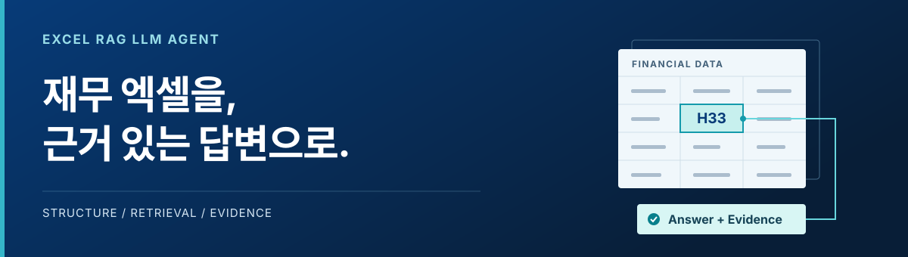
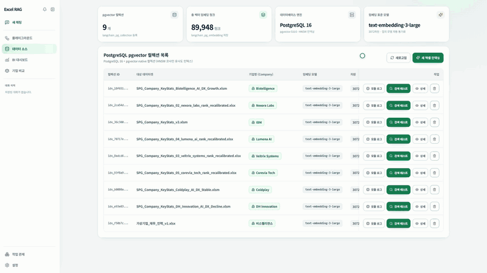
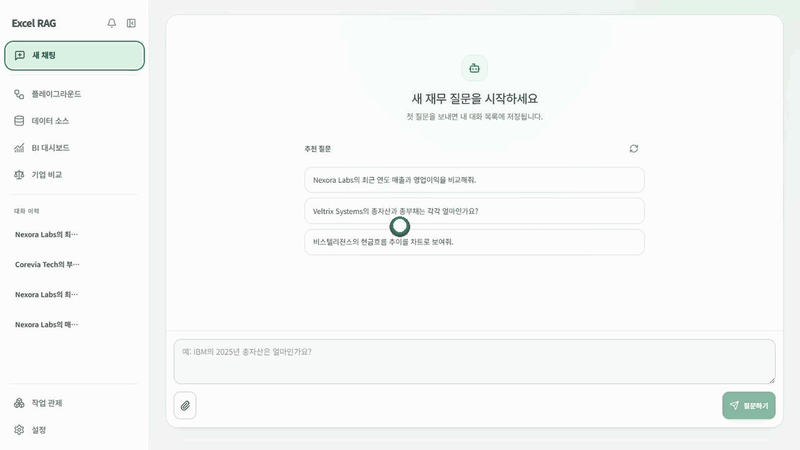
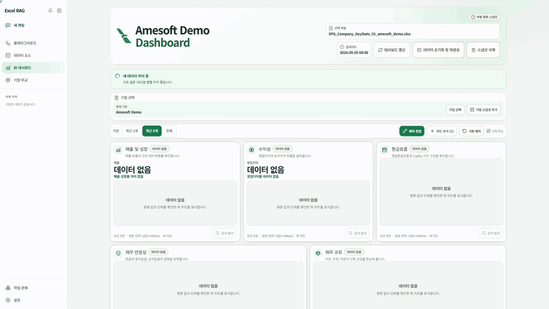
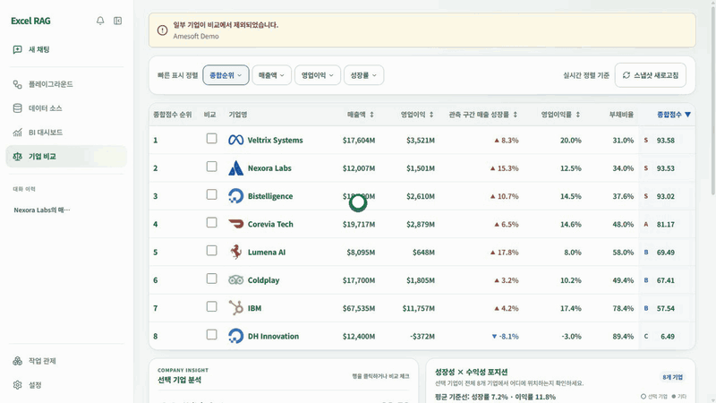
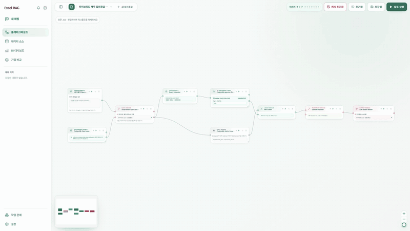
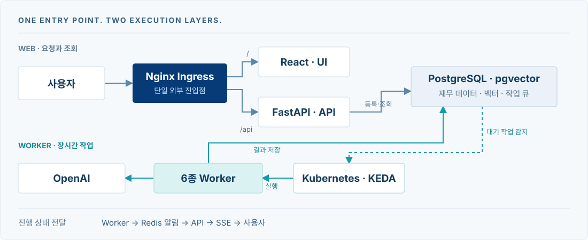

<p align="center">
  복잡한 재무 엑셀을 분석하고, 자연어 질문에 <strong>수치·차트·원본 셀 근거</strong>로 답하는 AI 플랫폼입니다.<br/>
  <sub>Team ColdPlay · KOSA × BISTelligence · 4인 팀 프로젝트 · 2026.09.07 완료</sub>
</p>

<p align="center">
  <a href="https://github.com/bist-mini-final/bist-mini-final/actions/workflows/ci.yml"></a>
  
  
</p>

<p align="center">
  <a href="#통합-시연-영상">전체 영상</a> &nbsp; / &nbsp;
  <a href="#주요-기능과-시연">기능</a> &nbsp; / &nbsp;
  <a href="#시스템-아키텍처">구조</a> &nbsp; / &nbsp;
  <a href="#팀원-소개">팀 소개</a> &nbsp; / &nbsp;
  <a href="#시작하기">시작하기</a> &nbsp; / &nbsp;
  <a href="docs/README.md">문서</a>
</p>

## 엑셀에서 답변까지

재무 분석에서 중요한 것은 숫자 하나가 아니라 **어느 기업의, 어떤 기간의 값이며, 어디에서 가져왔는지**입니다.

S&P Capital IQ Pro 형식의 재무제표를 구조적으로 적재하고, 검색한 셀을 근거로 답변과 시각화를 제공합니다. 분석 결과뿐 아니라 RAG의 실행 과정과 비용도 함께 확인할 수 있습니다.

| 구조 보존 | 근거 검색 | 업무 연결 |
| :--- | :--- | :--- |
| VLM으로 표·헤더·데이터 인식 | 질문 분해·하이브리드 검색·셀 검증 | 챗봇·대시보드·기업 비교 |

## 통합 시연 영상

**등록한 엑셀 한 파일이 검색과 기업 비교로 이어지는 과정**을 사용자 역할에 맞춰 보여줍니다.

https://github.com/user-attachments/assets/6acd636c-8bf7-487a-8281-b722cd55a29d

<p align="center">
  <a href="https://github.com/bist-mini-final/bist-mini-final/raw/refs/heads/main/docs/assets/demo/coldplay-demo-ko.mp4">원본 MP4 다운로드</a> &nbsp; · &nbsp;
  <a href="docs/assets/demo/coldplay-demo-ko.srt">한글 자막 SRT</a> &nbsp; · &nbsp;
  <a href="docs/assets/demo/README.md">챕터·시연 안내</a><br/>
  <sub>05:30 · 1920 × 1080 · 30fps · 한글 자막 포함 · 음성 없음</sub>
</p>

**데이터 적재 → Luna 구조 돋보기 → RAG 실행·비용 추적 → 챗봇·첨부 분석 → BI·히트맵 → 기업 비교**

> 실제 프론트 코드와 저장된 실행 결과를 활용한 **오프라인 재현 영상**입니다. 첨부 비교는 원천 지표로 구성한 예시이며, 실시간 처리 성능을 측정한 영상은 아닙니다. API 키나 인터넷 없이 재생할 수 있습니다.

<br/>

## 주요 기능과 시연

아래 GIF는 각 기능의 사용 흐름을 바로 볼 수 있는 미리보기입니다. [고해상도 원본과 전체 자료](docs/assets/README.md)는 별도로 보관합니다.

### 01 &nbsp; 데이터 소스

엑셀을 업로드하면 표·헤더를 분석하고, 원본 셀의 의미를 보존한 검색 데이터로 적재합니다.



<sub>업로드 → 시트 미리보기 → VLM 구조 분석 → 셀 직렬화 → 벡터 적재</sub>

<br/>

### 02 &nbsp; 재무 챗봇

자연어 질문에 표와 셀 근거로 답하고, 지원되는 질문에는 연결된 재무 스냅샷의 차트를 함께 제공합니다. 첨부파일과 등록 데이터를 구분해 비교 분석할 수 있습니다.



<sub>질문 → 근거 기반 답변 → 재무 차트 → 원본 셀 확인</sub>

<br/>

### 03 &nbsp; BI 대시보드

매출 성장·수익성·현금흐름·재무 안정성·재무 규모의 **다섯 카드와 재무 체력 히트맵**으로 기업을 살펴보고, 지표의 원본 근거를 확인합니다.



<sub>기업 선택 → 재무 지표 탐색 → 추세·히트맵 분석 → 근거 확인</sub>

<br/>

### 04 &nbsp; 기업 비교

같은 기준의 재무 지표와 순위로 기업을 비교하고, 차이를 만든 실제 관측값을 확인합니다.



<sub>기업 탐색 → 비교 대상 선택 → 재무 지표·순위 비교</sub>

<br/>

### 05 &nbsp; RAG 플레이그라운드

모듈을 연결해 워크플로를 실행하고, 노드별 입력·출력·처리 상태와 토큰·비용을 추적합니다.



<sub>워크플로 구성 → 전체 실행 → 모듈 입출력 확인 → 사용량·비용 추적</sub>

<br/>

## 시스템 아키텍처

**웹 요청과 장시간 작업을 분리했습니다.** API는 요청·상태 조회를 담당하고, PostgreSQL 큐에 쌓인 작업은 Kubernetes·KEDA가 실행하는 워커가 처리합니다.



브라우저의 `/`와 `/api` 요청은 같은 Ingress로 들어옵니다. 처리 상태는 PostgreSQL에 저장하고, Redis의 상태 변경 알림을 이용해 API가 SSE로 진행 상황을 전달합니다.

[시스템 설계](docs/blueprints/01_system_blueprints/BP-101_system_architecture_blueprint.md) &nbsp; / &nbsp; [배포 구조](docs/blueprints/01_system_blueprints/BP-104_deployment_and_infra_topology.md)

### 세 가지 설계 선택

**표 구조를 먼저 보존**<br/>
VLM으로 표와 헤더의 관계를 인식한 뒤, 기업·시트·행·열·값을 일정한 포맷으로 직렬화했습니다. [셀 표현 설계 →](docs/blueprints/02_data_engine_blueprints/BP-201_spreadsheet_coordinate_parser.md)

**의미와 키워드를 함께 검색**<br/>
Dense 검색과 PostgreSQL FTS의 순위를 RRF로 합치고, 행 문맥을 확장해 답변 근거를 보완했습니다. [하이브리드 검색 →](docs/blueprints/03_pipeline_module_blueprints/BP-303_hybrid_retrieval_and_fusion.md)

**기능과 실행을 각각 표준화**<br/>
17개 기능 모듈을 공통 입출력 계약으로 연결하고, 6종 워커에 동일한 실행·상태 관리 규칙을 적용했습니다. [모듈과 DAG →](docs/blueprints/03_pipeline_module_blueprints/BP-301_dag_execution_engine.md)

### 사용 기술

| 영역 | 주요 기술 |
| :--- | :--- |
| 화면·시각화 | React · TypeScript · Vite · Tailwind CSS · XYFlow · Recharts · Nivo |
| API·AI | Python · FastAPI · Pydantic · OpenAI · OpenPyXL · Pillow · NetworkX |
| 데이터·상태 | PostgreSQL · pgvector · PostgreSQL FTS · Redis |
| 배포·확장 | Docker · Kubernetes · k3d · Helm · KEDA · Nginx |
| 협업·검증 | GitHub Actions · CodeRabbit · pytest · Ruff · Pyright · Vitest · ESLint |

<br/>

## 팀원 소개

**Team ColdPlay** — 데이터를 준비하고, 필요한 근거를 찾으며, 전체 과정이 안정적으로 실행되도록 책임을 나눴습니다.

<table>
  <tr>
    <td align="center" width="25%"><a href="https://github.com/pileuszu"><br/><strong>김지환</strong><br/><sub>@pileuszu</sub></a></td>
    <td align="center" width="25%"><a href="https://github.com/baming320"><br/><strong>전명준</strong><br/><sub>@baming320</sub></a></td>
    <td align="center" width="25%"><a href="https://github.com/Qui-0"><br/><strong>권혁준</strong><br/><sub>@Qui-0</sub></a></td>
    <td align="center" width="25%"><a href="https://github.com/garden-kim-git"><br/><strong>김정원</strong><br/><sub>@garden-kim-git</sub></a></td>
  </tr>
  <tr>
    <td align="center"><strong>팀장 · 오케스트레이션</strong></td>
    <td align="center"><strong>데이터 설계</strong></td>
    <td align="center"><strong>재무 RAG · BI</strong></td>
    <td align="center"><strong>검색 최적화</strong></td>
  </tr>
  <tr>
    <td align="center">VLM·모듈·DAG<br/>워커·Kubernetes·KEDA<br/>플레이그라운드</td>
    <td align="center">재무 데이터 분석<br/>가상 데이터·평가셋<br/>기업 비교</td>
    <td align="center">재무 RAG 실험<br/>표 구조·셀 표현 설계<br/>BI 대시보드·히트맵</td>
    <td align="center">질문 분해·검색 결합<br/>순위 통합·문맥 확장<br/>재무 챗봇</td>
  </tr>
</table>

<sub>프로필 이미지를 누르면 각 팀원의 GitHub로 이동합니다.</sub>

## 개발 과정과 검증

**핵심 RAG → 통합 분석 → 서비스화**의 3단계 MVP로 개발했습니다. PR과 GitHub Actions 자동 검사, CodeRabbit 리뷰로 변경을 검토했습니다.

최종 보고 정확도는 **81.45%**입니다. 과거 자동채점 원본과 최종 보고 수치의 차이, 평가 조건과 지원 한계는 [프로젝트 완료 요약](docs/PROJECT_SUMMARY.md#평가-결과를-읽는-방법)에 구분했습니다.

[개발 결과·한계](docs/PROJECT_SUMMARY.md) &nbsp; / &nbsp; [협업·컨벤션](docs/guides/COLLABORATION.md) &nbsp; / &nbsp; [CI 검사](https://github.com/bist-mini-final/bist-mini-final/actions/workflows/ci.yml)

<br/>

## 시작하기

```bash
git clone https://github.com/bist-mini-final/bist-mini-final.git
cd bist-mini-final
```

Python·uv, Node.js·npm, PostgreSQL·pgvector가 필요합니다. 모델 기능에는 OpenAI API 키가, 비동기 작업에는 워커가 필요합니다.

**[로컬 개발 환경 설정 →](docs/guides/SETUP.md#2-빠른-시작-백엔드--프론트엔드)**<br/>
환경 변수와 DB를 준비한 뒤 백엔드·프론트엔드를 실행합니다.

**[Kubernetes·KEDA 실행 →](docs/guides/SETUP.md#51-전체-로컬-배치-환경-k3d--keda)**<br/>
데이터 적재·BI·평가 작업을 처리할 워커까지 구성합니다.

<br/>

## 프로젝트 문서

상세 설명은 **[docs 통합 목차](docs/README.md)**에서 목적에 따라 찾아볼 수 있습니다.

- **[개발·운영 가이드](docs/guides/README.md)** — 설치·배포, 협업 규칙, DB 마이그레이션
- **[설계 문서](docs/blueprints/README.md)** — 시스템·데이터·API 등 20개 청사진
- **[구현 기준선](docs/CURRENT_IMPLEMENTATION_BASELINE.md)** — 현재 모듈·API·DB 계약과 검증 기록
- **[평가 기록](docs/evaluation/README.md)** — 실측 보고와 실행 원본
- **[시연 자료](docs/assets/README.md)** — 자막 포함 MP4, 기능별 GIF, README 이미지
