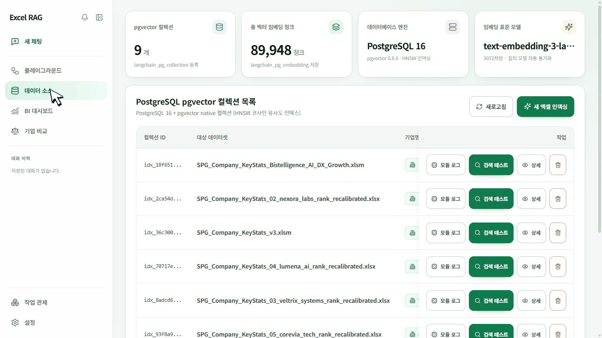
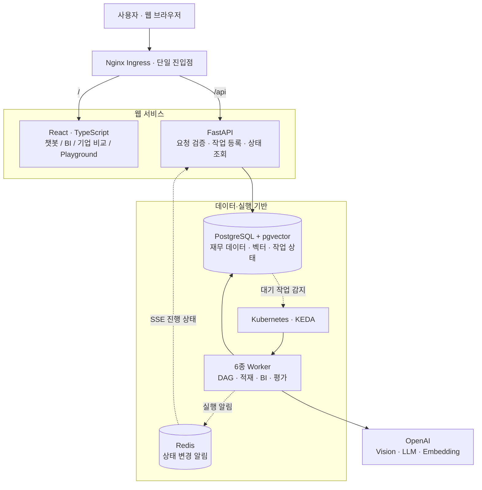
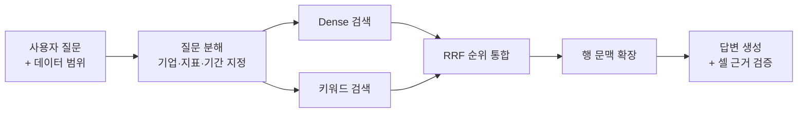

# Excel RAG LLM Agent


<p align="center">
  <strong>재무 엑셀, 자연어로 묻고 셀 근거로 답하다.</strong><br/>
  Team ColdPlay · 4인 팀 프로젝트 · 2026.09.07 완료
</p>

<p align="center">
  <a href="#주요-기능과-시연">서비스 시연</a> ·
  <a href="#팀원-소개">팀원 소개</a> ·
  <a href="#시스템-아키텍처">아키텍처</a> ·
  <a href="docs/SETUP.md">실행 가이드</a> ·
  <a href="docs/README.md">프로젝트 문서</a>
</p>

## 프로젝트 소개

**Excel RAG LLM Agent**는 복잡한 재무 엑셀을 구조적으로 분석하고, 자연어 질문에 재무 수치와 원본 셀 근거를 함께 제공하는 AI 에이전트 플랫폼입니다.

S&P Capital IQ Pro 형식의 재무제표를 바탕으로 **데이터 적재 → 검색 → 답변 → 시각화 → 기업 비교**를 하나의 서비스로 연결했습니다. 분석 결과를 보는 사용자 화면과 RAG의 입력·출력·비용을 추적하는 개발자 도구를 함께 구현했습니다.

| 최종 보고 정확도 | 재사용 기능 모듈 | 비동기 워커 | 개발 단계 |
| :---: | :---: | :---: | :---: |
| **81.45%** | **17개** | **6종** | **3단계 MVP** |

> 정확도는 최종 발표·보고 기준입니다. 평가 조건과 과거 자동채점 원본의 차이는 [평가 결과 안내](docs/PROJECT_SUMMARY.md#평가-결과를-읽는-방법)에 구분했습니다.

### 개발 배경

재무 데이터를 분석할 때는 수치를 찾는 것만으로 충분하지 않습니다. **어느 기업의 어떤 기간·지표인지, 어디에서 가져온 값인지**까지 함께 확인할 수 있어야 합니다.

| 우리가 마주한 문제 | 해결 방향 |
| --- | --- |
| 파일마다 다른 표 배치와 다단 헤더로 수치의 의미가 유실됨 | VLM으로 표·헤더·데이터 영역을 구분하고 구조를 보존해 적재 |
| 자연어 질문에 맞는 기업·지표·기간과 정확한 원본 셀을 찾기 어려움 | 질문 분해·범위 지정과 하이브리드 검색으로 근거 셀 탐색 |
| 여러 시트·기업의 값을 다시 정리하고 비교해야 함 | 챗봇·자동 차트·BI 대시보드·기업 비교로 분석 결과 제공 |

## 팀원 소개

팀원별로 데이터·RAG·검색 최적화·오케스트레이션의 책임을 나누고, 공통 입출력 계약과 셀 근거를 기준으로 각 구현을 연결했습니다.

| 팀원 | 역할 | 주요 담당 |
| --- | --- | --- |
| **김지환** | 팀장 · Orchestration | 모듈·DAG 실행 통합, 워커·상태 관리, Kubernetes·KEDA, 플레이그라운드 |
| **전명준** | Data Foundation | 재무 데이터 분석·정규화, 가상 데이터·평가셋 제작, 기업 비교 |
| **권혁준** | RAG Pipeline | 표 구조 인식, FRTR 셀 직렬화·검색 문서 설계, 재무 RAG |
| **김정원** | Optimization | 서브쿼리, 검색 범위·순위 통합·문맥 확장, 재무 챗봇 |

## 주요 기능과 시연



*저장소의 실제 프론트엔드 시연 GIF입니다. 아래 링크에서 기능별 전체 흐름을 확인할 수 있습니다.*

### 01. 데이터 소스 · 엑셀을 검색 가능한 데이터로

엑셀을 업로드하면 시트의 표 구조를 분석하고, 행·열 헤더를 포함한 셀 텍스트와 벡터를 생성합니다. 적재 상태와 구조 분석 결과를 화면에서 확인할 수 있습니다.

**업로드 → 시트 미리보기 → VLM 구조 분석 → 셀 직렬화 → 벡터 적재**

[데이터 적재 GIF 보기](docs/assets/excel-rag-data-ingestion.gif)

### 02. 재무 챗봇 · 답변에서 원본 셀까지

질문에 필요한 데이터를 검색해 답변하고, 사용한 셀 근거를 함께 제공합니다. 지원되는 재무 표 답변은 차트로 자동 시각화하여 수치와 추세를 함께 읽을 수 있습니다.

**자연어 질문 → 재무 답변·표 → 자동 차트 → 원본 셀 확인**

[챗봇 GIF 보기](docs/assets/excel-rag-chatbot-user-flow.gif)

### 03. BI 대시보드 · 기업의 재무 상태를 한눈에

기업별 재무 지표를 카드와 차트로 정리하고, 추세와 히트맵을 통해 데이터를 살펴봅니다. 지표에 연결된 근거를 확인하며 숫자의 출처를 검증할 수 있습니다.

[BI 대시보드 GIF 보기](docs/assets/excel-rag-bi-dashboard-flow.gif)

### 04. 기업 비교 · 같은 기준으로 기업을 비교

검증된 BI 스냅샷을 바탕으로 기업의 재무 지표와 순위를 비교합니다. 기업을 선택해 차이를 확인하고, 비교에 사용된 실제 관측값을 따라갈 수 있습니다.

[기업 비교 GIF 보기](docs/assets/excel-rag-company-comparison-flow.gif)

### 05. 플레이그라운드 · 실행 과정을 투명하게

기능 모듈을 연결해 워크플로를 구성하고 전체 파이프라인을 실행합니다. 모듈별 처리 상태, 입력·출력, 토큰과 호출 비용을 추적하며 RAG가 답변을 만드는 과정을 확인합니다.

[플레이그라운드 GIF 보기](docs/assets/excel-rag-playground-workflow.gif)

## 시스템 아키텍처

웹 요청과 장시간 작업을 분리했습니다. FastAPI는 요청·조회·진행 상태 전달을 담당하고, 실제 파이프라인은 PostgreSQL 큐를 통해 워커가 처리합니다.



브라우저는 동일한 진입점의 `/api`로 요청하며, Ingress가 백엔드에 전달합니다. 별도의 백엔드 포트 공개를 전제로 하지 않습니다.

[상세 시스템 설계](docs/blueprints/01_system_blueprints/BP-101_system_architecture_blueprint.md) · [배포 구성](docs/blueprints/01_system_blueprints/BP-104_deployment_and_infra_topology.md)

### 핵심 RAG 흐름



## 기술 스택

| 영역 | 사용 기술 | 적용 목적 |
| --- | --- | --- |
| **Frontend** | React 18, TypeScript, Vite, Tailwind CSS | 재무 분석 웹 UI와 공통 디자인 |
| **Visualization** | XYFlow, Recharts, Nivo | DAG 편집, 재무 차트, 히트맵 |
| **Backend** | Python, FastAPI, Pydantic, SSE | API, 입출력 검증, 실시간 실행 상태 |
| **AI · Data** | OpenAI, OpenPyXL, Pillow, NetworkX | 구조 분석·검색·답변, 시트 처리, DAG |
| **Database** | PostgreSQL 16, pgvector, PostgreSQL FTS, Redis | 재무 데이터·벡터·큐 저장, 실행 알림 |
| **Infrastructure** | Docker, Kubernetes, k3d, Helm, KEDA, Nginx | 컨테이너 배포와 작업량 기반 워커 확장 |
| **Quality · Collaboration** | GitHub Actions, CodeRabbit, pytest, Ruff, Pyright, Vitest, ESLint | 자동 검사, 코드 리뷰, 타입·회귀 검증 |

## 기술적 고민과 해결

### 표의 구조를 잃지 않고 검색하려면?

셀 값만 나열하면 행·열 헤더와 데이터의 관계가 사라집니다. VLM으로 구조를 먼저 인식한 뒤 **기업·시트·행 헤더·열 헤더·값을 일정한 포맷으로 직렬화**했습니다. 질문도 같은 재무 의미를 담도록 구성해 검색 표현을 맞췄습니다.

[표 구조 분석](docs/blueprints/02_data_engine_blueprints/BP-202_luna_vlm_vision_detector.md) · [셀 표현 설계](docs/blueprints/02_data_engine_blueprints/BP-201_spreadsheet_coordinate_parser.md)

### 의미가 비슷한 셀과 정확한 용어가 맞는 셀을 어떻게 함께 찾을까?

자연어 의미 검색과 키워드 일치 검색을 병렬로 수행하고, 점수의 단위를 직접 비교하지 않는 **RRF 순위 통합**을 적용했습니다. 이후 같은 행과 설정된 인접 행의 실제 값 셀을 확장해 답변에 필요한 문맥을 보완했습니다.

현재 코드의 키워드 검색은 PostgreSQL FTS(`ts_rank_cd`)입니다. BM25 실험과 최종 구현의 구분은 [검색 설계 문서](docs/blueprints/03_pipeline_module_blueprints/BP-303_hybrid_retrieval_and_fusion.md)에 기록했습니다.

### 여러 팀원이 만든 기능을 어떻게 하나의 서비스로 연결할까?

17개 기능 모듈에 공통 입력·설정·출력 계약을 적용하고, 이를 DAG로 조합했습니다. 비동기 작업은 워커 실행 규격과 PostgreSQL 상태 관리로 통일하고, KEDA가 작업량에 따라 필요한 워커를 실행하도록 구성했습니다.

[모듈 표준화](docs/blueprints/03_pipeline_module_blueprints/BP-302_module_pinout_catalog.md) · [DAG 실행](docs/blueprints/03_pipeline_module_blueprints/BP-301_dag_execution_engine.md) · [동시 실행·복구](docs/blueprints/01_system_blueprints/BP-103_concurrency_and_locking_model.md)

## 개발 과정

프로젝트를 세 단계로 나누고, 각 단계에서 검증할 범위를 정한 뒤 다음 단계로 확장했습니다.

| 단계 | 집중한 질문 | 주요 구현 |
| --- | --- | --- |
| **MVP 1 · 핵심 RAG** | 엑셀 구조를 보존하고 필요한 셀을 찾을 수 있는가? | 구조 분석, 셀 직렬화, 검색·근거 기반 답변 |
| **MVP 2 · 통합 분석** | 데이터·분석·실행을 하나로 연결할 수 있는가? | 데이터 적재, 재무 BI, DAG·비동기 실행 |
| **MVP 3 · 서비스화** | 사용자가 결과를 이해하고 실행을 추적할 수 있는가? | 챗봇·자동 차트, 기업 비교, 플레이그라운드·관제 |

### 결과와 배운 점

- **최종 보고 정확도 81.45%**: 답변 수치와 근거를 함께 평가하며 결과를 정리했습니다.
- **데이터의 구조가 검색 품질의 출발점**: 모델 호출 이전에 기업·기간·헤더·단위를 보존하는 과정이 중요했습니다.
- **공통 계약이 협업의 연결점**: 각 기능을 독립적으로 개발하더라도 입출력·오류·실행 상태를 맞춰야 제품으로 통합할 수 있었습니다.
- **RAG 품질과 실행 안정성은 함께 다뤄야 하는 문제**: 검색 결과뿐 아니라 장시간 적재, 진행 상태, 비용과 복구 경로까지 설계했습니다.

프로젝트의 지원 범위와 운영 한계는 [완료 요약](docs/PROJECT_SUMMARY.md)에 정리했습니다. 수식 재계산 엔진, 모든 엑셀 양식 지원이나 상용 운영 검증 완료를 주장하지 않습니다.

## 협업 방식과 품질 관리

**역할 분담 → 공통 계약 합의 → 기능 구현 → PR·자동 검사 → 통합 검증**의 흐름으로 개발했습니다.

- **GitHub**: `dev`를 개발 통합 브랜치로 사용하고, 완료 소스는 `main`에 정리했습니다.
- **GitHub Actions**: 백엔드 테스트·Ruff·Pyright·DB 마이그레이션·Kubernetes 렌더 검증과 프론트엔드 타입 검사·Vitest·빌드를 구성했습니다.
- **CodeRabbit**: 한국어 자동 리뷰와 PR 대화를 활용했습니다.
- **컨벤션**: PR 제목 자동 정리와 공통 모듈·도메인 책임 규칙을 적용했습니다.
- **문서화**: 역할별 설계와 API·데이터·UI·검증 계약을 20개 청사진으로 정리했습니다.

[협업·컨벤션 상세](docs/COLLABORATION.md) · [CI workflow](.github/workflows/ci.yml) · [CodeRabbit 설정](.coderabbit.yaml)

## 실행 방법

최종 소스는 `main` 브랜치입니다.

```bash
git clone https://github.com/bist-mini-final/bist-mini-final.git
cd bist-mini-final
```

실행 환경은 Python·uv, Node.js·npm, PostgreSQL·pgvector가 필요합니다. 모델 기능에는 OpenAI API 키가, 큐에 등록된 작업 처리에는 워커가 필요합니다.

| 실행 목적 | 안내 |
| --- | --- |
| 로컬 백엔드·프론트엔드 개발 | [개발 서버 시작](docs/SETUP.md#2-빠른-시작-백엔드--프론트엔드) |
| 전체 기능·비동기 워커 시연 | [k3d·KEDA 실행](docs/SETUP.md#51-전체-로컬-배치-환경-k3d--keda) |
| 환경 변수·외부 DB·배포·문제 해결 | [설치·실행·배포 가이드](docs/SETUP.md) |

## 프로젝트 문서

| 문서 | 내용 |
| --- | --- |
| [전체 문서 목차](docs/README.md) | 프로젝트 문서와 20개 상세 설계 문서 탐색 |
| [완료 요약](docs/PROJECT_SUMMARY.md) | MVP 결과, 평가 기준, 지원 범위와 한계 |
| [협업·품질 관리](docs/COLLABORATION.md) | 개발 흐름, 자동 PR 검사, 테스트와 컨벤션 |
| [현재 구현 기준선](docs/CURRENT_IMPLEMENTATION_BASELINE.md) | 모듈·API·DB·아키텍처와 검증 기록 |
| [서버 실측 평가](server-evaluation-result/README.md) | 실행 조건과 원본을 보존한 평가 기록 |

---

<p align="center"><strong>Team ColdPlay</strong><br/>김지환 · 전명준 · 권혁준 · 김정원</p>
