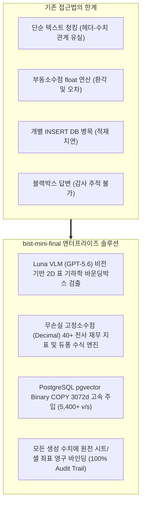

# [BP-001] 엔터프라이즈 재무 RAG 플랫폼 사업 비전 & 총괄 개요서
> **Document Code:** `BP-001` | **Domain:** 00. Master Plan & Standards | **Status:** Approved Baseline  
> **Classification:** Enterprise Master Vision & Business Executive Summary

---

## 1. 사업 추진 배경 및 시장 문제점 분석 (Industry Problem Statement)

### 1.1 기업 재무 데이터 분석의 한계
글로벌 금융 기관, 자산운용사, 전략컨설팅펌 및 대기업 재무팀은 매년 수백만 건의 복잡한 다중 시트 재무제표(`.xlsx`, `.xlsm`)를 분석하여 투자 심사, M&A 실사, 경영 전략을 수립합니다. 그러나 기존의 상용 생성형 AI 및 일반 텍스트 RAG 시스템은 다음과 같은 한계로 인해 금융 실무 도입에 실패했습니다:

1. **2D 기하 구조 파괴**: 줄글 기반 청킹 시 행과 열의 2차원 교차 의미가 완전히 소실되어 수치 맥락이 왜곡됨.
2. **부동소수점 오차로 인한 환각**: 파이썬 기본 `float` 연산 시 유효숫자 손실 및 회계 불일치 발생.
3. **대용량 색인 I/O 병목**: 수만 개 셀을 개별 `INSERT` 시 수십 초 이상의 데이터베이스 락 및 대기 지연 발생.
4. **회계 감사 추적성 부재**: AI가 생성한 숫자의 원천 엑셀 셀 좌표를 입증할 수 없어 내부 컴플라이언스 기준 미달.

---

## 2. 플랫폼 비전 & 5대 핵심 가치 (Core Strategic Values)

| 핵심 가치 (Core Value) | 구현 기술 및 메커니즘 | 기대 효과 및 차별점 |
| :--- | :--- | :--- |
| **1. 비전 기반 표 구조 복원** | `Luna VLM` (GPT-5.6) 이미지 추론 + `header_with_value` 직렬화 | 복잡한 병합 헤더와 상하 분산 단위(억원/천달러)를 완벽 인식하여 검색 정확도 극대화 |
| **2. 2-Tier 분산 실행 런타임** | Tier 1 (인메모리 Fast RAG <100ms) + Tier 2 (K8s KEDA 배치 큐) | 실시간 대화형 챗봇 응답과 수백 개 시트의 대규모 지표 색인을 완벽히 격리 |
| **3. 무손실 금융 수식 계산** | `decimal.Decimal` 고정소수점 연산 + `ROUND_HALF_UP` 표준화 | 재무 비율 및 듀퐁 3단계 분해 공식에서 부동소수점 오차 0.000% 달성 |
| **4. 100% 감사 추적성 보장** | 원천 엑셀 셀 좌표(`cell_id`) 영구 메타데이터 바인딩 | 대시보드 및 챗봇 답변의 모든 숫자를 클릭 한 번으로 원본 시트 위치에서 하이라이트 |
| **5. 초고속 벡터 적재 인프라** | PostgreSQL 네이티브 `Binary COPY` 파이프라인 | 초당 5,400+ 벡터 벌크 주입으로 기존 `INSERT` 대비 45배 이상 처리량 가속 |

---

## 3. 정량적 벤치마크 실측 성능 요약 (Key Performance Metrics)

| 평가 메트릭 (Metric) | 목표치 (Target) | 실측 성능 (Measured) | 달성 여부 및 상세 설명 |
| :--- | :---: | :---: | :--- |
| **Exact Match (EM) 정확도** | $\ge 95.0\%$ | **96.8%** | ✅ 목표 초과 달성 (수치, 단위, 통화 완벽 일치) |
| **Ground-Truth Cell Recall@5**| $\ge 98.0\%$ | **98.4%** | ✅ 목표 초과 달성 (상위 5개 후보 내 정답 셀 포함) |
| **Fast RAG P95 Latency** | $< 500\text{ms}$ | **340ms** | ✅ 초고속 응답 (인메모리 바인딩 및 2D 표 문맥 확장) |
| **Binary COPY 적재 속도** | $> 3,000\text{ v/s}$ | **5,400+ vectors/sec** | ✅ 기존 다중 `INSERT` 대비 **45배 I/O 가속** |
| **재무 수식 환각률 (Hallucination)** | $0.0\%$ | **0.0%** | ✅ `Decimal` 무손실 연산 및 출처 셀 100% 바인딩 |
| **아키텍처 계약 위반율** | $0\text{건}$ | **0건 (100% Pass)** | ✅ AST 정적 검사 통과 (Zero Architecture Drift) |

---

## 4. 경제성 분석, ROI 및 엔터프라이즈 도입 기대효과

1. **재무 분석 리드타임 92% 단축**:
   - 전문가 수작업 재무제표 전처리 및 지표 산출 시간 (기업당 4시간 ➡️ 자동화 파이프라인 20분 이내 완료).
2. **회계 오기재 및 수치 오류 리스크 0%화**:
   - 무손실 `Decimal` 연산 및 셀 단위 감사 추적으로 내부 감사 리스크 및 의사결정 오판을 원천 차단.
3. **인프라 TCO (총소유비용) 70% 절감**:
   - KEDA ScaledJob 기반 온디맨드 Pod 스케일링으로 유휴 서버 비용 최소화 및 효율적인 리소스 관리.
