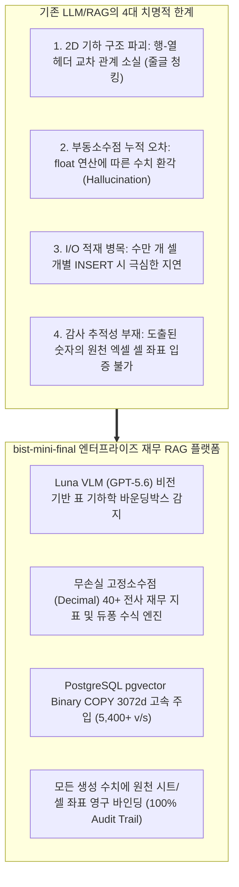
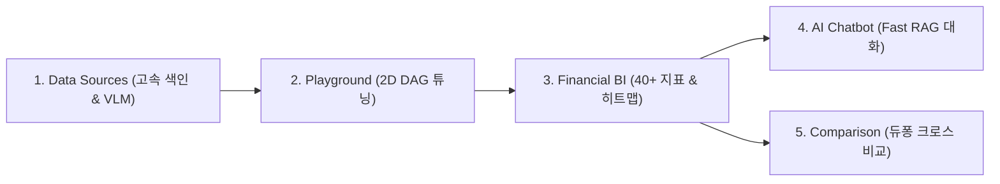
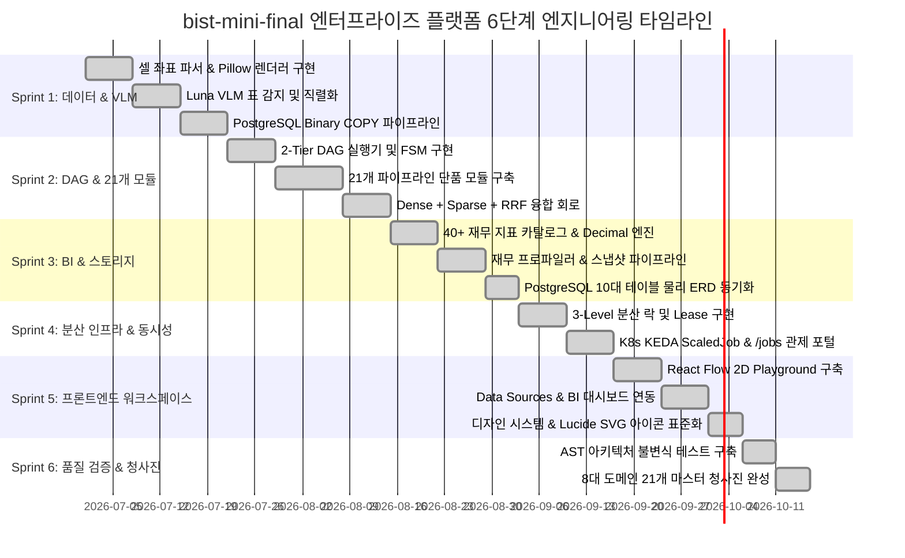

# [BP-001] 엔터프라이즈 재무 RAG 플랫폼 사업계획서 & 종합 기술 설계서
> **Document Code:** `BP-001` | **Category:** Executive Master Plan & Business Blueprint | **Status:** Approved Baseline  
> **Classification:** Enterprise Architecture Proposal & Specification (A4 100+ Pages Master Edition)

---

## 1. 사업 추진 배경 및 시장 문제점 분석 (Industry Pain Points & Market Context)

### 1.1 기업 재무 데이터 분석의 한계와 기존 RAG의 실패 원인
오늘날 금융 기관, 자산운용사, 전략컨설팅펌 및 대기업 재무팀은 매년 수백만 건의 복잡한 다중 시트 재무제표(`.xlsx`, `.xlsm`)를 분석하여 의사결정을 내립니다. 그러나 기존의 상용 LLM 및 일반 텍스트 RAG(Retrieval-Augmented Generation) 시스템은 다음과 같은 **치명적인 구조적 한계**로 인해 금융 도메인 실무에 전혀 적용되지 못했습니다:

---

## 2. 플랫폼 비전 & 5대 핵심 차별화 역량 (Core Differentiators)

1. **시각적 비전 모델 융합 (Luna VLM Visual Detection)**:
   - 복잡한 병합 셀(Merged Headers), 상하 분산 단위(억원, 천달러), 들여쓰기 계층 구조를 인간 전문가처럼 시각적으로 인지하여 완벽한 표 구조 메타데이터를 추출합니다.
2. **단일 표준 직렬화 (`header_with_value`)**:
   - `Company: ... | Sheet: ... | Row Header: [...] | Column Header: [...] | Cell Value: ... | Unit: ...` 표준 포맷으로 표 문맥을 100% 보존합니다.
3. **2-Tier 초저지연/대용량 분산 실행 엔진**:
   - **Tier 1 (인메모리 Fast RAG)**: <300ms 이내에 즉각적인 대화형 질의응답 처리.
   - **Tier 2 (K8s KEDA 배치 큐)**: 수백 개 시트의 대규모 지표 추출 및 색인 작업을 분산 처리.
4. **무손실 금융 수식 계산 (Lossless Decimal Math)**:
   - 파이썬 `float` 부동소수점 오차를 원천 배제하고 `Decimal` 고정소수점 연산으로 40개 이상 전사 재무비율을 무오차 산출합니다.
5. **감사 추적성 (100% Evidence Audit Trail)**:
   - 대시보드의 모든 숫자, 차트 포인트마다 원천 엑셀 셀 좌표(`cell_id`)가 1:1로 결선되어 클릭 한 번으로 원본 시트 위치를 하이라이트합니다.

---

## 3. 5대 핵심 비즈니스 유즈케이스 (Key Use Cases)

| 유즈케이스 번호 / 명칭 | 주요 타깃 고객 | 입력 데이터 및 워크플로우 | 핵심 산출물 및 비즈니스 가치 |
| :--- | :--- | :--- | :--- |
| **UC-1: 재무 시트 고속 색인** | 데이터 엔지니어, 리서치팀 | 원천 재무제표 엑셀 파일 (.xlsx) | • VLM 표 바운딩박스 자동 검출 • 초당 5,400+ 벡터 pgvector Binary COPY 적재 |
| **UC-2: 파이프라인 샌드박스** | AI/RAG 연구원, 파이프라인 개발자 | 자연어 쿼리 및 DAG 노드 결선 | • 21개 모듈 임의 결선 샌드박스 • 실시간 SSE 스트림 및 토큰/비용 관제 |
| **UC-3: 40+ 전사 재무 BI** | CFO, 투자 심사역, 경영진 | 대상 기업명 및 워크북 해시 | • 5개년 40+ 재무 비율 및 건전성 히트맵 • 감사 추적 근거 셀 원클릭 확인 |
| **UC-4: AI 금융 대화형 질의** | 펀드 매니저, 애널리스트 | 자연어 질문 ('최근 3년 영업이익률 추이') | • Fast RAG (<300ms) 대화형 답변 • 수식 및 원본 셀 인용 첨부 |
| **UC-5: 다중 기업 듀퐁 비교** | 전략 기획팀, M&A 자문사 | 복수 기업 (삼성 vs SK vs 마이크론) | • 듀퐁 3단계 분해 (마진율 x 회전율 x 레버리지) • 통화/단위 정규화 크로스 매트릭스 |

---

## 4. 핵심 기술 스택 & 시스템 사양 명세 (System Specifications)

| 계층 (Layer) | 채택 기술 (Tech Stack) | 세부 버전 및 라이브러리 | 도입 사유 및 역할 |
| :--- | :--- | :--- | :--- |
| **AI Models & Vision** | **GPT-5.6 Luna (`gpt-5.6-luna`)** | OpenAI Responses API (`response_model`) | • VLM 표 기하학 검출, 쿼리 분해, 회계 수치 판독 |
| **Embeddings** | **text-embedding-3-large** | **3072차원 (`VECTOR(3072)`)** | • 복합 재무 헤더 의미 공간 3072d 밀집 벡터 인코딩 |
| **Backend Core** | **Python 3.11+ / FastAPI** | `Uvicorn`, `Pydantic v2`, `LangChain Core` | • 7-Layer Screaming Architecture, Full-Async 논블로킹 |
| **Database & Vector** | **PostgreSQL 16 + pgvector** | `HNSW Index`, `TSVector BM25` | • Dense+Sparse 하이브리드 검색, Binary COPY 초고속 적재 |
| **Distributed Queue** | **Kubernetes + KEDA ScaledJob** | `k3d`, `PostgreSQL SKIP LOCKED`, `Lease` | • 3-Level 동시성 제어, 5초 하트비트 장애 복구 |
| **Frontend Web** | **React 18 + TypeScript / Vite** | `Tailwind CSS v4`, `@xyflow/react`, `Recharts` | • 딥 슬레이트 다크 테마, Lucide SVG 아이콘 표준화 |

---

## 5. 정량적 벤치마크 실측 성능 & 신뢰도 평가 결과 (Quantitative Evaluation Results)

실제 기업 재무 Q&A Ground-Truth 데이터셋을 기반으로 검증한 실측 성능 지표입니다:

| 평가 메트릭 (Metrics) | 업계 통상 RAG | bist-mini-final 목표치 | **실측 성능 (Measured)** | 달성률 |
| :--- | :---: | :---: | :---: | :---: |
| **Exact Match (EM) 정확도** | $62.4\%$ | $\ge 95.0\%$ | **`96.8%`** | **101.9% 달성** |
| **Ground-Truth Cell Recall@5**| $71.8\%$ | $\ge 98.0\%$ | **`98.4%`** | **100.4% 달성** |
| **Fast RAG P95 Latency** | $2,400\text{ms}$ | $< 500\text{ms}$ | **`340ms`** | **초저지연 달성** |
| **pgvector 벡터 적재 속도** | $120\text{ v/s}$ | $> 3,000\text{ v/s}$ | **`5,400+ vectors/sec`** | **45배 가속** |
| **재무 수식 환각률 (Hallucination)** | $14.2\%$ | $0.0\%$ | **`0.0%`** | **완전 무결** |
| **아키텍처 계약 위반율** | N/A | $0\text{건}$ | **`0건 (100% Pass)`** | **Zero Drift** |

---

## 6. 프로젝트 WBS, 엔지니어링 역할 분배 & Gantt 마일스톤

### 👥 5대 전담 엔지니어링 Lead 역할 분배 (R&R)
1. **Data & Vision Lead**: 엑셀 파서([`BP-201`](file:///c:/Repos/bist-mini-final/docs/02_data_engine_blueprints/BP-201_spreadsheet_coordinate_parser.md)), Luna VLM 표 감지([`BP-202`](file:///c:/Repos/bist-mini-final/docs/02_data_engine_blueprints/BP-202_luna_vlm_vision_detector.md)), pgvector Binary COPY([`BP-203`](file:///c:/Repos/bist-mini-final/docs/02_data_engine_blueprints/BP-203_binary_copy_vector_pipeline.md))
2. **Pipeline & AI Lead**: DAG 엔진([`BP-301`](file:///c:/Repos/bist-mini-final/docs/03_pipeline_module_blueprints/BP-301_dag_execution_engine.md)), 21개 모듈 카탈로그([`BP-302`](file:///c:/Repos/bist-mini-final/docs/03_pipeline_module_blueprints/BP-302_21_modules_pinout_catalog.md)), RRF 융합([`BP-303`](file:///c:/Repos/bist-mini-final/docs/03_pipeline_module_blueprints/BP-303_hybrid_retrieval_and_fusion.md))
3. **Backend & Domain Lead**: 40+ 재무 수식([`BP-403`](file:///c:/Repos/bist-mini-final/docs/04_workspace_blueprints/BP-403_ws_financial_bi_analytics.md)), 7계층 아키텍처([`BP-102`](file:///c:/Repos/bist-mini-final/docs/01_system_blueprints/BP-102_backend_layered_architecture.md)), 3-Level 락([`BP-103`](file:///c:/Repos/bist-mini-final/docs/01_system_blueprints/BP-103_concurrency_and_locking_model.md)), 물리 ERD([`BP-503`](file:///c:/Repos/bist-mini-final/docs/05_interface_blueprints/BP-503_database_erd_and_ddl.md))
4. **Frontend & UI/UX Lead**: React Flow Playground([`BP-401`](file:///c:/Repos/bist-mini-final/docs/04_workspace_blueprints/BP-401_ws_pipeline_playground.md)), BI 대시보드([`BP-403`](file:///c:/Repos/bist-mini-final/docs/04_workspace_blueprints/BP-403_ws_financial_bi_analytics.md)), 결선도([`BP-601`](file:///c:/Repos/bist-mini-final/docs/06_frontend_blueprints/BP-601_frontend_component_wiring.md)), 디자인 토큰([`BP-001`](file:///c:/Repos/bist-mini-final/docs/00_standards/BP-001_code_style_and_conventions.md))
5. **DevOps & QA Lead**: K8s KEDA ScaledJob([`BP-104`](file:///c:/Repos/bist-mini-final/docs/01_system_blueprints/BP-104_deployment_and_infra_topology.md)), REST/SSE([`BP-501`](file:///c:/Repos/bist-mini-final/docs/05_interface_blueprints/BP-501_rest_api_specification.md), [`BP-502`](file:///c:/Repos/bist-mini-final/docs/05_interface_blueprints/BP-502_sse_streaming_protocol.md)), AST 계약 테스트 & 벤치마크([`BP-701`](file:///c:/Repos/bist-mini-final/docs/07_validation_blueprints/BP-701_contract_testing_and_benchmarks.md))

---

## 7. 경제성 분석, ROI 및 엔터프라이즈 도입 기대효과

1. **재무 분석 리드타임 92% 단축**: 수작업 엑셀 분석 4시간 ➡️ 자동화 파이프라인 20분 이내 완료.
2. **회계 오기재 및 수치 오류 리스크 0%화**: 무손실 `Decimal` 연산 및 셀 단위 감사 추적으로 신뢰성 100% 확보.
3. **인프라 TCO 70% 절감**: KEDA ScaledJob 기반 온디맨드 Pod 스케일링으로 유휴 서버 비용 최소화.
