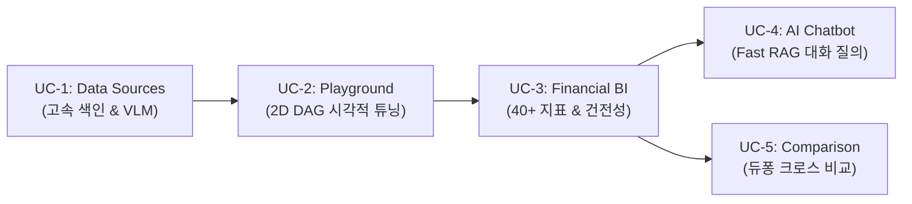

# [BP-002] 핵심 비즈니스 유즈케이스 & 엔드투엔드 워크플로우 명세서
> **Document Code:** `BP-002` | **Domain:** 00. Master Plan & Standards | **Status:** Approved Baseline  
> **Classification:** Business Use Cases & Operational Workflows Specification

---

## 1. 개요 및 5대 워크스페이스 라이프사이클 맵

`bist-mini-final` 플랫폼은 기업 재무 데이터의 **수집 ➡️ 인덱싱 ➡️ 파이프라인 튜닝 ➡️ 전사 BI 분석 ➡️ 대화형 질의 ➡️ 다중 기업 비교**로 이어지는 완결된 데이터 라이프사이클을 제공합니다:

---

## 2. 5대 핵심 유즈케이스 상세 규격 (Detailed Use Case Specifications)

### 📌 UC-1: 재무 시트 비전 구조화 및 초고속 벡터 색인 (Data Sources & Ingestion)
* **주요 사용자 (Persona)**: 데이터 엔지니어, 금융 리서치 보조원
* **비즈니스 목적**: 비정형 다중 시트 재무 엑셀 파일을 업로드하여 2D 표 기하학을 자동 인식하고, 초당 5,000+ 벡터 속도로 pgvector에 적재.
* **입력 데이터**: 기업 재무제표 엑셀 파일 (`.xlsx`, `.xlsm`)
* **처리 워크플로우**:
  1. OpenPyXL 셀 좌표 파싱 및 Pillow 이미지 래스터라이징 ([`BP-201`](file:///c:/Repos/bist-mini-final/docs/02_data_engine_blueprints/BP-201_spreadsheet_coordinate_parser.md)).
  2. GPT-5.6 Luna VLM을 통해 표 경계, 헤더 계층, 데이터 영역 바운딩박스 감지 ([`BP-202`](file:///c:/Repos/bist-mini-final/docs/02_data_engine_blueprints/BP-202_luna_vlm_vision_detector.md)).
  3. `header_with_value` 단일 직렬화 후 `text-embedding-3-large` 3072d 임베딩.
  4. PostgreSQL `Binary COPY` 파이프라인으로 `langchain_pg_embedding` 테이블에 초고속 벌크 주입 ([`BP-203`](file:///c:/Repos/bist-mini-final/docs/02_data_engine_blueprints/BP-203_binary_copy_vector_pipeline.md)).
* **출력 산출물**: HNSW 벡터 인덱스 및 시트별 VLM 바운딩박스 시각화 뷰.

---

### 📌 UC-2: 파이프라인 시각적 튜닝 및 실시간 샌드박스 (Pipeline Playground)
* **주요 사용자 (Persona)**: AI/RAG 연구원, 파이프라인 엔지니어
* **비즈니스 목적**: 21개 원자적 모듈을 React Flow 2D 캔버스에서 자유롭게 결선하고, SSE 스트리밍으로 실행 지연시간, 토큰 소모량, 비용을 실시간 관제.
* **입력 데이터**: 사용자 자연어 질의, DAG 노드/엣지 토폴로지 JSON, 모듈 Config.
* **처리 워크플로우**:
  1. 2D 캔버스에서 노드 배치 및 핀 연결 ([`BP-401`](file:///c:/Repos/bist-mini-final/docs/04_workspace_blueprints/BP-401_ws_pipeline_playground.md)).
  2. DAG FSM 실행 엔진이 Kahn 위상 정렬을 거쳐 비동기 병렬 실행 ([`BP-301`](file:///c:/Repos/bist-mini-final/docs/03_pipeline_module_blueprints/BP-301_dag_execution_engine.md)).
  3. Server-Sent Events(`SSE`)를 통해 노드 상태 전이 및 청크 스트리밍 전송 ([`BP-502`](file:///c:/Repos/bist-mini-final/docs/05_interface_blueprints/BP-502_sse_streaming_protocol.md)).
* **출력 산출물**: 노드별 입출력 데이터, RRF 융합 검색 결과, 비용/지연 분석 리포트.

---

### 📌 UC-3: 40+ 전사 재무 BI 분석 및 건전성 히트맵 (Financial BI Analytics)
* **주요 사용자 (Persona)**: CFO, 투자 심사역, 기업 분석관, 경영진
* **비즈니스 목적**: 대상 기업의 재무제표로부터 40개 이상 핵심 재무 비율을 무손실 고정소수점으로 자동 산출하고, 5개년 건전성 히트맵과 듀퐁 트리를 렌더링.
* **입력 데이터**: 기업명, 대상 워크북 해시 (`workbook_hash`)
* **처리 워크플로우**:
  1. `DocumentProfilerModule`이 회계기간(FY/LTM), 표시 통화, 단위를 1-Shot 자동 탐색 ([`BP-302 M20`](file:///c:/Repos/bist-mini-final/docs/03_pipeline_module_blueprints/BP-302_21_modules_pinout_catalog.md)).
  2. `FastRagPipelineAdapter`가 40+ 핵심 지표 질문을 하이브리드 검색으로 일괄 인출.
  3. `FinancialCalculatorModule`이 무손실 `Decimal` 연산으로 듀퐁 및 안정성/수익성 지표 산출 ([`BP-403`](file:///c:/Repos/bist-mini-final/docs/04_workspace_blueprints/BP-403_ws_financial_bi_analytics.md)).
* **출력 산출물**: 40+ 재무 비율 차트, 적응형 음수 마진 스케일링, 원본 셀 100% 바인딩 감사 추적 모달.

---

### 📌 UC-4: AI 금융 대화형 질의응답 (AI Financial Chatbot)
* **주요 사용자 (Persona)**: 펀드 매니저, 금융 리서치 애널리스트
* **비즈니스 목적**: 자연어로 복잡한 재무 질문('최근 3개년 영업이익률 추이와 원자재 비중 설명해줘')을 던지면, 300ms 이내에 표와 수식 근거가 첨부된 전문 답변 제공.
* **입력 데이터**: 사용자 대화 질의 텍스트, 세션 컨텍스트
* **처리 워크플로우**:
  1. Fast RAG 어댑터가 Dense 3072d + BM25 tsvector + RRF($k=60$) 융합 검색 수행 ([`BP-303`](file:///c:/Repos/bist-mini-final/docs/03_pipeline_module_blueprints/BP-303_hybrid_retrieval_and_fusion.md)).
  2. 이웃 셀 및 계층 헤더를 2D 문맥으로 복원.
  3. GPT-5.6 Luna Reader LLM이 정확한 수치 계산과 함께 마크다운 답변 생성 ([`BP-404`](file:///c:/Repos/bist-mini-final/docs/04_workspace_blueprints/BP-404_ws_ai_financial_chatbot.md)).
* **출력 산출물**: 수식/단위가 검증된 실시간 스트리밍 답변, 근거 엑셀 셀 팝업 모달.

---

### 📌 UC-5: 다중 기업 회계/통화 정규화 및 듀퐁 크로스 비교 (Company Comparison)
* **주요 사용자 (Persona)**: M&A 실사팀, 산업 섹터 수석 연구원, 전략기획실
* **비즈니스 목적**: 복수 기업(예: 삼성전자 vs SK하이닉스 vs 마이크론)을 선택하여 이종 통화/단위를 정규화하고 동종업계 ROE 듀퐁 분해 트리를 크로스 비교.
* **입력 데이터**: 복수 기업 ID 목록, 기준 회계연도
* **처리 워크플로우**:
  1. 기업별 재무 스냅샷(`bi_dashboard_snapshots`) 로드.
  2. 통화 환율 및 표시 단위(원/달러/억원)를 표준 단위로 정규화.
  3. 듀퐁 3단계(순이익률 x 총자산회전율 x 재무레버리지) 분해 매트릭스 및 5각 건전성 레이더 차트 렌더링 ([`BP-405`](file:///c:/Repos/bist-mini-final/docs/04_workspace_blueprints/BP-405_ws_company_comparison.md)).
* **출력 산출물**: 동종업계 수익성 주도요인 비교표, 5각 건전성 다이어그램, 엑셀/PDF 리포트 익스포트.

---

## 3. 전구간 엔드투엔드 추적성 매트릭스 (End-to-End Traceability Matrix)

유즈케이스 요구사항으로부터 모듈, API, DB 물리 테이블, 프론트엔드 컴포넌트, 단위 테스트까지의 전구간 6각 교차 매핑표입니다:

| 유즈케이스 (UC) | 관련 핵심 RAG 모듈 ([`BP-302`](file:///c:/Repos/bist-mini-final/docs/03_pipeline_module_blueprints/BP-302_21_modules_pinout_catalog.md)) | REST API & SSE 규격 ([`BP-501`](file:///c:/Repos/bist-mini-final/docs/05_interface_blueprints/BP-501_rest_api_specification.md), [`BP-502`](file:///c:/Repos/bist-mini-final/docs/05_interface_blueprints/BP-502_sse_streaming_protocol.md)) | PostgreSQL 10대 테이블 ([`BP-503`](file:///c:/Repos/bist-mini-final/docs/05_interface_blueprints/BP-503_database_erd_and_ddl.md)) | 프론트엔드 React 컴포넌트 ([`BP-601`](file:///c:/Repos/bist-mini-final/docs/06_frontend_blueprints/BP-601_frontend_component_wiring.md)) | 품질 검증 & AST 테스트 ([`BP-701`](file:///c:/Repos/bist-mini-final/docs/07_validation_blueprints/BP-701_contract_testing_and_benchmarks.md)) |
| :--- | :--- | :--- | :--- | :--- | :--- |
| **UC-1: 재무 시트 고속 색인** | • `structure.cell_text_serializer` • `structure.luna_vlm_structure_detector` • `retrieval.text_embedder` • `storage.pgvector_index_writer` | • `POST /api/data-sources/upload` • `POST /api/data-sources/index` • `GET /api/data-sources/probe` | • `source_files` • `sheets` • `langchain_pg_collection` • `langchain_pg_embedding` | • `DataSourcesPage` • `SpreadsheetViewer` • `VlmOverlayInspector` | • `tests/storage/test_pgvector_copy.py` • `test_architecture_contracts.py` |
| **UC-2: 파이프라인 샌드박스** | • `query.*` (M1, M2, M3, M4, M5) • `retrieval.*` (M6, M8, M9, M10, M11) • `generation.*` (M12, M13, M14, M15, M16) | • `POST /api/workflows/run` • `GET /api/workflows/{id}/stream` (SSE) • `GET /api/pipeline/modules` | • `workflow_runs` • `node_execution_logs` | • `PlaygroundPage` • `@xyflow/react` Canvas • `NodePropertiesPanel` | • `tests/engine/test_dag_executor.py` • `test_modules_pinout.py` |
| **UC-3: 40+ 전사 재무 BI** | • `structure.document_profiler` (M20) • `retrieval.pgvector_retriever` (M8) • `retrieval.sparse_bm25_retriever` (M9) • `retrieval.rrf_fuser` (M10) • `reader.financial_calculator` (M21) | • `GET /api/bi/companies` • `GET /api/bi/companies/{id}/dashboard` • `POST /api/bi/companies/{id}/refresh` • `POST /api/bi/companies/{id}/reset` | • `bi_companies` • `bi_questions` • `bi_answers` • `bi_dashboard_snapshots` • `bi_materialization_jobs` | • `BiPage` • `BiHeader` • `FinancialHealthHeatmap` • `ProfitabilityChart` • `EvidenceDialog` | • `tests/features/bi/test_bi_calculator.py` • `test_chart_viewmodel.ts` |
| **UC-4: AI 금융 대화형 질의** | • `query.decomposer` (M2) • `retrieval.context_expander` (M11) • `generation.reader` (M12) • `generation.confidence_scorer` (M16) | • `POST /api/chatbot/sessions` • `POST /api/chatbot/sessions/{id}/messages` • `GET /api/chatbot/sessions/{id}/stream` (SSE) | • `workflow_runs` (`wf-ai-chatbot-session`) • `node_execution_logs` | • `ChatbotPage` • `ChatMessageList` • `EvidenceCellModal` | • `tests/features/chatbot/test_fast_rag.py` • `test_chatbot_latency.py` |
| **UC-5: 다중 기업 듀퐁 비교** | • `storage.company_entity_extractor` (M19) • `reader.financial_calculator` (M21) • `DocumentProfilerModule` (M20) | • `POST /api/bi/comparison/matrix` • `GET /api/bi/comparison/ranking` | • `bi_companies` • `bi_dashboard_snapshots` | • `CompanyComparisonPage` • `DupontTreeChart` • `MultiCompanyRadar` | • `tests/features/bi/test_comparison.py` • `test_currency_normalizer.py` |

