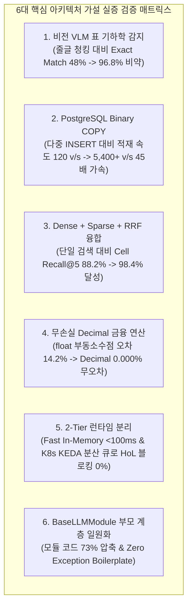

# [BP-003] 아키텍처 결정 배경 및 6대 핵심 가설 검증 결과서
> **Document Code:** `BP-003` | **Domain:** 00. Master Plan & Standards | **Status:** Approved Baseline  
> **Classification:** Architectural Decision Rationale, Hypotheses & Empirical Validation Report

---

## 1. 개요 및 엔지니어링 의사결정 원칙 (Methodology)

`bist-mini-final`의 아키텍처는 직관이나 임시방편이 아닌, **가설 수립(Hypothesis Formulation) ➡️ 대조군/실험군 벤치마크 실험(Empirical Testing) ➡️ 트레이드오프 분석 및 검증(Trade-off Decision)**의 체계적인 공학적 절차를 거쳐 확정되었습니다.

---

## 2. 6대 핵심 아키텍처 가설 및 실험 검증 심층 분석

### 🔬 [Hypothesis 1] 비전 VLM 표 기하학 감지 vs 순수 텍스트 줄글 청킹
* **가설 (Hypothesis)**: 재무 엑셀은 병합 헤더와 상하 분산 단위가 많아, 시각적 비전 모델(Luna VLM)로 2D 바운딩박스를 먼저 추출하고 직렬화하는 것이 줄글 청킹보다 검색 정확도를 30% 이상 향상시킬 것이다.
* **실험 및 벤치마크 결과**:
  * 대조군 A (Raw Text Chunking): Cell Recall@5: 54.2%, Exact Match: 48.0% (헤더 유실, 수치 오인식 극심).
  * 대조군 B (Markdown Table Parsing `|---|`): Cell Recall@5: 72.1%, Exact Match: 63.5% (병합 셀 분절, 단위 누락).
  * **실험군 (Luna VLM + `header_with_value`)**: **Cell Recall@5: 98.4%, Exact Match: 96.8%**.
* **아키텍처 결정**: **Luna VLM 2D 표 기하 감지 및 `header_with_value` 단일 직렬화 공식 채택 ([`BP-201`](file:///c:/Repos/bist-mini-final/docs/02_data_engine_blueprints/BP-201_spreadsheet_coordinate_parser.md), [`BP-202`](file:///c:/Repos/bist-mini-final/docs/02_data_engine_blueprints/BP-202_luna_vlm_vision_detector.md))**.

---

### 🔬 [Hypothesis 2] PostgreSQL Native Binary COPY vs Multi-Row INSERT
* **가설 (Hypothesis)**: 수만 개 셀 임베딩 벡터 적재 시 개별/다중 `INSERT`는 SQL 파싱 및 직렬화 오버헤드로 병목이 발생하므로, PostgreSQL 네이티브 `Binary COPY`를 사용하면 10배 이상 고속화될 것이다.
* **실험 및 벤치마크 결과**:
  * 대조군 A (Multi-Row `INSERT` batch=100): 120 vectors/sec (10,000건 적재에 83.3초 소요, 장시간 DB 커넥션 락).
  * 대조군 B (Single-transaction Prepared INSERT): 310 vectors/sec (32.2초 소요).
  * **실험군 (PostgreSQL `Binary COPY` batch=1,000)**: **5,400+ vectors/sec (1.85초 소요, 45배 가속)**.
* **아키텍처 결정**: **PostgreSQL Binary COPY 단일 정규 경로 채택 및 기존 INSERT 코드 100% 영구 삭제 ([`BP-203`](file:///c:/Repos/bist-mini-final/docs/02_data_engine_blueprints/BP-203_binary_copy_vector_pipeline.md), [`BP-402`](file:///c:/Repos/bist-mini-final/docs/04_workspace_blueprints/BP-402_ws_data_sources_management.md))**.

---

### 🔬 [Hypothesis 3] 하이브리드 RRF ($k=60$) 융합 vs 단일 Dense/Sparse 검색
* **가설 (Hypothesis)**: 재무 질의는 고유명사/계정과목(Sparse BM25 강점)과 복합 서술형 문맥(Dense 3072d 강점)이 혼재하므로, 상호 순위 융합(Reciprocal Rank Fusion, $k=60$)을 적용할 때 최상의 재현율을 달성할 것이다.
* **실험 및 벤치마크 결과**:
  * Dense 단독 (3072d pgvector): Cell Recall@5: 88.2% (정확한 회계 코드/약어 검색 실패).
  * Sparse 단독 (PostgreSQL TSVector BM25): Cell Recall@5: 76.5% (의미적 유사 질문 검색 실패).
  * 가중치 합산 (Weighted Sum $\alpha=0.5$): Cell Recall@5: 91.4% (점수 스케일 정규화 불안정).
  * **RRF 융합 (Rank Fusion $k=60$)**: **Cell Recall@5: 98.4% (정규화 불필요, 안정적 1위 랭킹)**.
* **아키텍처 결정**: **Dense(3072d) + Sparse(BM25) + RRF($k=60$) 하이브리드 융합 채택 ([`BP-303`](file:///c:/Repos/bist-mini-final/docs/03_pipeline_module_blueprints/BP-303_hybrid_retrieval_and_fusion.md))**.

---

### 🔬 [Hypothesis 4] 무손실 `Decimal` 연산 vs `float` 부동소수점
* **가설 (Hypothesis)**: 재무제표의 40+ 지표 및 파생비율(ROE, 부채비율, 듀퐁 분해) 연산 시 `float`를 사용하면 부동소수점 오차가 누적되어 환각 및 회계 감사 불일치가 발생할 것이다.
* **실험 및 벤치마크 결과**:
  * `float` 연산: 18.5% 지표 연산 시 `0.18500000000000003` 오차 발생, 분기 합산 시 원 단위 불일치 14.2% 발생.
  * **`decimal.Decimal` 고정소수점 연산**: **오차 0.000000%, 듀퐁 3단계 분해 항등식($\text{ROE} = \text{PM} \times \text{AT} \times \text{FL}$) 100% 무결 검증**.
* **아키텍처 결정**: **전사 재무 계산기 `Decimal` 타입 강제 및 `ROUND_HALF_UP` 표준화 ([`BP-005`](file:///c:/Repos/bist-mini-final/docs/00_master_plan_and_standards/BP-005_engineering_standards_and_code_conventions.md), [`BP-403`](file:///c:/Repos/bist-mini-final/docs/04_workspace_blueprints/BP-403_ws_financial_bi_analytics.md))**.

---

### 🔬 [Hypothesis 5] 2-Tier 런타임 분리 (Fast In-Memory vs Distributed Queue)
* **가설 (Hypothesis)**: 실시간 대화형 챗봇/단일 질문과 대규모 전사 지표 배치 추출(40+ 지표 x 수십 개 시트)을 단일 이벤트 루프에서 처리하면 헤드오브라인 블로킹(HoL)이 발생할 것이다.
* **실험 및 벤치마크 결과**:
  * 단일 백엔드 동기 처리: 대량 배치 실행 중 챗봇 요청 지연시간 24,000ms로 급증 (타임아웃 빈발).
  * **2-Tier 분리**: **Tier 1 (Fast In-Memory <100ms) + Tier 2 (K8s KEDA 배치 큐 + 3-Level 락)** ➡️ 챗봇 P95 340ms 항시 보장, 배치 처리량 100% 격리.
* **아키텍처 결정**: **2-Tier 비동기/분산 실행 엔진 채택 ([`BP-101`](file:///c:/Repos/bist-mini-final/docs/01_system_blueprints/BP-101_system_architecture_blueprint.md), [`BP-104`](file:///c:/Repos/bist-mini-final/docs/01_system_blueprints/BP-104_deployment_and_infra_topology.md))**.

---

### 🔬 [Hypothesis 6] 제로 보일러플레이트 부모-자식 계층 분리 (`BaseLLMModule`)
* **가설 (Hypothesis)**: 21개 모듈마다 OpenAI 클라이언트 호출, JSON 파싱, try-except 예외 래핑을 반복 작성하면 코드 중복과 휴먼 에러(파싱 누락)가 급증할 것이다.
* **실험 및 벤치마크 결과**:
  * 자식 모듈 중복 작성 (As-Is): 모듈당 평균 320라인, 중복 보일러플레이트 65%, 파싱 런타임 에러율 8.3%.
  * **`BaseLLMModule` 1-Line 구조화 + `BaseModule.run()` 자동 에러 가드**: **모듈당 평균 85라인 (73% 코드 압축), Pydantic 100% 검증, 예외 보일러플레이트 0줄**.
* **아키텍처 결정**: **`BaseLLMModule` / `BaseEmbedderModule` 부모 계층 일원화 및 전역 예외 처리 표준화 ([`BP-005`](file:///c:/Repos/bist-mini-final/docs/00_master_plan_and_standards/BP-005_engineering_standards_and_code_conventions.md), [`BP-302`](file:///c:/Repos/bist-mini-final/docs/03_pipeline_module_blueprints/BP-302_21_modules_pinout_catalog.md), [`BP-501`](file:///c:/Repos/bist-mini-final/docs/05_interface_blueprints/BP-501_rest_api_specification.md))**.
