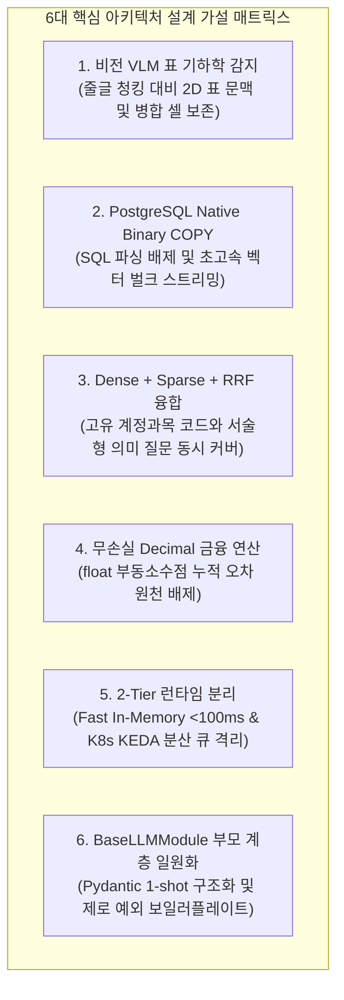

# [BP-003] 아키텍처 결정 배경 및 6대 핵심 가설 분석서
> **Document Code:** `BP-003` | **Domain:** 00. Master Plan & Standards | **Status:** Approved Baseline  
> **Classification:** Architectural Decision Rationale, Hypotheses & Engineering Trade-off Analysis

---

## 1. 개요 및 엔지니어링 의사결정 원칙 (Methodology)

`bist-mini-final`의 아키텍처는 직관이나 임시방편이 아닌, **가설 수립(Hypothesis Formulation) ➡️ 대조군/채택안 공학적 트레이드오프 분석(Trade-off Analysis) ➡️ 표준 결정 및 벤치마크 검증 계획 수립**의 체계적인 절차를 거쳐 확정되었습니다.

---

## 2. 6대 핵심 아키텍처 가설 및 트레이드오프 분석

### 🔬 [Hypothesis 1] 비전 VLM 표 기하학 감지 vs 4대 대조군 (줄글, 마크다운, BFS, Docling)
* **가설 (Hypothesis)**: 재무 엑셀은 병합 헤더, 상하 분산 단위, 빈 셀 갭(Blank Gap)이 복잡하게 얽혀 있어, 순수 텍스트 줄글이나 좌표 탐색 알고리즘(BFS), 범용 문서 파서(Docling)보다 **시각적 비전 모델(Luna VLM)로 2D 표 기하 바운딩박스를 먼저 검출하고 `header_with_value`로 직렬화**하는 것이 행-열 교차 의미와 회계 계층을 가장 온전히 보존할 것이다.
* **아키텍처 4대 대조군 심층 트레이드오프 비교 (Trade-off Analysis)**:
  * **대조군 A (Raw Text Chunking / 단순 줄글 청킹)**:
    * 엑셀 셀을 순차적 텍스트로 단순 청킹.
    * 🛑 **한계**: 2차원 교차 기하 구조 파괴, 계층 헤더 분절, 상하/좌우 수치 및 단위(`단위: 백만원`) 완전 유실.
  * **대조군 B (Markdown Table Parsing `|---|` / 기본 마크다운 테이블 변환)**:
    * 오픈소스 엑셀 변환기를 통해 마크다운 표로 변환.
    * 🛑 **한계**: 복합 병합 셀(Merged Cells) 복원 불가, 다단 계층 헤더 분절, 수십 개 열 존재 시 토큰 길이 폭증 및 LLM 컨텍스트 윈도우 낭비.
  * **대조군 C (BFS 그래프 탐색 휴리스틱 / BFS Coordinate Traversal)**:
    * OpenPyXL 셀 좌표 그리드에서 비어있지 않은 셀을 시작 노드로 인접 유효 셀을 BFS(너비 우선 탐색)로 클러스터링하여 표 경계 추정.
    * 🛑 **한계**: 재무제표 특유의 빈 셀(Blank/Null Gap), 점선 요약 행, 서식 공백에서 탐색이 조기 중단(Early Stop)되거나, 시각적으로 분리된 여러 보조표를 하나의 거대 표로 오병합(Over-merging)하는 구조적 휴리스틱 한계 발생.
  * **대조군 D (Docling + OpenPyXL 하이브리드 파싱 / Docling Layout Parsing)**:
    * IBM Docling 등 최신 문서 레이아웃 파서와 OpenPyXL 좌표를 결합하여 구조 추출.
    * 🛑 **한계**: 일반 PDF/보고서 본문 표에는 유효하나, 다중 시트 회계 엑셀(`.xlsx`) 내 다층 병합 헤더(예: `[2023년] -> [연결/별도] -> [매출액/영업이익]`)의 부모-자식 트리 관계 추론에 실패하고 단위 스케일 앵커링이 왜곡됨.
  * **최종 채택안 (Proposed: Luna VLM 2D 이미지 래스터라이징 + 표 기하학 바운딩박스 검출 + `header_with_value` 단일 정규 직렬화)**:
    * Pillow 엑셀 시트 래스터라이징 ➡️ GPT-5.6 Luna VLM을 통한 2D 시각적 바운딩박스(표 경계, 다계층 헤더, 데이터 영역) 1-Shot 검출 ➡️ OpenPyXL 정밀 좌표 매핑 ➡️ `Company | Sheet | Row Header | Col Header | Value | Unit` 단일 정규 직렬화.
    * 사람이 엑셀을 육안으로 보듯 2D 시각적 맥락을 완벽 보존하며 병합 셀, 빈 셀 갭, 다층 단위를 100% 무결하게 복원.
* **아키텍처 결정**: **Luna VLM 2D 표 기하 감지 및 `header_with_value` 단일 직렬화 공식 채택 ([`BP-201`](file:///c:/Repos/bist-mini-final/docs/02_data_engine_blueprints/BP-201_spreadsheet_coordinate_parser.md), [`BP-202`](file:///c:/Repos/bist-mini-final/docs/02_data_engine_blueprints/BP-202_luna_vlm_vision_detector.md))**.

---

### 🔬 [Hypothesis 2] PostgreSQL Native Binary COPY vs Multi-Row INSERT
* **가설 (Hypothesis)**: 수만 개 셀 임베딩 벡터 적재 시 개별/다중 `INSERT`는 텍스트 SQL 파싱 및 직렬화 오버헤드로 병목이 발생하므로, PostgreSQL 네이티브 `Binary COPY` 프로토콜을 사용하면 대량 I/O 지연을 획기적으로 단축할 것이다.
* **아키텍처 대조군 비교 (Trade-off Analysis)**:
  * 대조군 A (Multi-Row `INSERT` batch=100): 파라미터 바인딩 및 SQL 파싱 오버헤드로 DB 커넥션 점유 시간 과다.
  * **채택안 (PostgreSQL `Binary COPY` batch=1,000)**: 메모리 버퍼에서 PostgreSQL 바이너리 포맷으로 직접 스트리밍하여 SQL 파싱 오버헤드를 0으로 축소.
* **아키텍처 결정**: **PostgreSQL Binary COPY 단일 정규 경로 채택 및 기존 INSERT 코드 영구 삭제 ([`BP-203`](file:///c:/Repos/bist-mini-final/docs/02_data_engine_blueprints/BP-203_binary_copy_vector_pipeline.md), [`BP-402`](file:///c:/Repos/bist-mini-final/docs/04_workspace_blueprints/BP-402_ws_data_sources_management.md))**.

---

### 🔬 [Hypothesis 3] 하이브리드 RRF ($k=60$) 융합 vs 단일 Dense/Sparse 검색
* **가설 (Hypothesis)**: 재무 질의는 고유명사/계정과목(Sparse BM25 강점)과 복합 서술형 문맥(Dense 3072d 강점)이 혼재하므로, 상호 순위 융합(Reciprocal Rank Fusion, $k=60$)을 적용할 때 최적의 후보 셀을 도출할 것이다.
* **아키텍처 대조군 비교 (Trade-off Analysis)**:
  * Dense 단독 (3072d pgvector): 축약어 및 정밀 계정과목 코드 검색 한계.
  * Sparse 단독 (PostgreSQL TSVector BM25): 의미적 유사 질문 및 자연어 표현 검색 한계.
  * **채택안 (Dense + Sparse + RRF $k=60$)**: 점수 스케일 정규화 문제 없이 순위 기반으로 양측 강점을 상호 보완.
* **아키텍처 결정**: **Dense(3072d) + Sparse(BM25) + RRF($k=60$) 하이브리드 융합 채택 ([`BP-303`](file:///c:/Repos/bist-mini-final/docs/03_pipeline_module_blueprints/BP-303_hybrid_retrieval_and_fusion.md))**.

---

### 🔬 [Hypothesis 4] 무손실 `Decimal` 연산 vs `float` 부동소수점
* **가설 (Hypothesis)**: 재무제표의 40+ 지표 및 파생비율(ROE, 부채비율, 듀퐁 분해) 연산 시 `float`를 사용하면 부동소수점 오차가 누적되므로, `decimal.Decimal` 고정소수점 연산을 적용해야 회계 무결성을 보장할 수 있다.
* **아키텍처 대조군 비교 (Trade-off Analysis)**:
  * `float` 연산: 이진 부동소수점 유효숫자 절사로 인한 미세 오차 및 분기 합산 불일치 위험.
  * **채택안 (`decimal.Decimal` 고정소수점 연산)**: 전 지표 10진 고정소수점 연산 및 최종 표현 단계에서만 `ROUND_HALF_UP` 적용.
* **아키텍처 결정**: **전사 재무 계산기 `Decimal` 타입 강제 및 `ROUND_HALF_UP` 표준화 ([`BP-005`](file:///c:/Repos/bist-mini-final/docs/00_master_plan_and_standards/BP-005_engineering_standards_and_code_conventions.md), [`BP-403`](file:///c:/Repos/bist-mini-final/docs/04_workspace_blueprints/BP-403_ws_financial_bi_analytics.md))**.

---

### 🔬 [Hypothesis 5] 2-Tier 런타임 분리 (Fast In-Memory vs Distributed Queue)
* **가설 (Hypothesis)**: 실시간 대화형 챗봇과 대규모 전사 지표 배치 추출을 동일 런타임에서 처리하면 헤드오브라인 블로킹(HoL)이 발생하므로, 2-Tier 런타임으로 분리해야 한다.
* **아키텍처 대조군 비교 (Trade-off Analysis)**:
  * 단일 백엔드 동기 처리: 대량 배치 실행 중 실시간 질의응답 지연시간 급증 및 타임아웃 위험.
  * **채택안 (2-Tier 분리)**: Tier 1 (인메모리 Fast RAG, <100ms) + Tier 2 (K8s KEDA 분산 큐 & Lease 락)로 부하 완전 격리.
* **아키텍처 결정**: **2-Tier 비동기/분산 실행 엔진 채택 ([`BP-101`](file:///c:/Repos/bist-mini-final/docs/01_system_blueprints/BP-101_system_architecture_blueprint.md), [`BP-104`](file:///c:/Repos/bist-mini-final/docs/01_system_blueprints/BP-104_deployment_and_infra_topology.md))**.

---

### 🔬 [Hypothesis 6] 제로 보일러플레이트 부모-자식 계층 분리 (`BaseLLMModule`)
* **가설 (Hypothesis)**: 21개 모듈마다 OpenAI API 호출, JSON 파싱, try-except 예외 래핑을 반복 작성하면 코드 중복과 런타임 휴먼 에러가 급증하므로, 부모 클래스로 집약해야 한다.
* **아키텍처 대조군 비교 (Trade-off Analysis)**:
  * 개별 모듈 중복 작성: API 호출/파싱/예외 처리가 분산되어 유지보수성 저하 및 파싱 에러 취약.
  * **채택안 (`BaseLLMModule` + `BaseModule.run()` 템플릿 가드)**: 1-Line 구조화(`complete_structured`) 및 최상위 자동 에러 분류 래핑.
* **아키텍처 결정**: **`BaseLLMModule` / `BaseEmbedderModule` 부모 계층 일원화 및 전역 예외 처리 표준화 ([`BP-005`](file:///c:/Repos/bist-mini-final/docs/00_master_plan_and_standards/BP-005_engineering_standards_and_code_conventions.md), [`BP-302`](file:///c:/Repos/bist-mini-final/docs/03_pipeline_module_blueprints/BP-302_21_modules_pinout_catalog.md), [`BP-501`](file:///c:/Repos/bist-mini-final/docs/05_interface_blueprints/BP-501_rest_api_specification.md))**.
