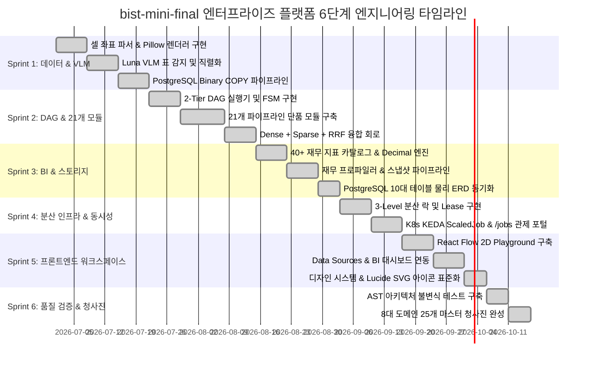

# [BP-004] 프로젝트 마일스톤 타임라인 & 역할 분배(R&R) 명세서
> **Document Code:** `BP-004` | **Domain:** 00. Master Plan & Standards | **Status:** Approved Baseline  
> **Classification:** Project WBS, Sprint Milestones & Role Distribution Matrix

---

## 1. 프로젝트 6단계 엔지니어링 마일스톤 타임라인 (Gantt Milestones)

`bist-mini-final` 플랫폼 구축은 6개 핵심 스프린트로 체계화되어 진행되었습니다:



---

## 2. 5대 전담 엔지니어링 Lead 역할 분배 매트릭스 (R&R Matrix)

| 엔지니어링 트랙 | 주관 영역 | 담당 책임 컴포넌트 및 설계 문서 |
| :--- | :--- | :--- |
| **Data & Vision Lead** | 데이터 파이프라인 / 비전 | • 엑셀 셀 좌표 파서 ([`BP-201`](file:///c:/Repos/bist-mini-final/docs/02_data_engine_blueprints/BP-201_spreadsheet_coordinate_parser.md)), Luna VLM 표 감지 ([`BP-202`](file:///c:/Repos/bist-mini-final/docs/02_data_engine_blueprints/BP-202_luna_vlm_vision_detector.md))<br>• pgvector Binary COPY 3072d 고속 주입 ([`BP-203`](file:///c:/Repos/bist-mini-final/docs/02_data_engine_blueprints/BP-203_binary_copy_vector_pipeline.md)) |
| **Pipeline & AI Lead** | 파이프라인 모듈 / 검색 | • 2-Tier DAG 실행기 ([`BP-301`](file:///c:/Repos/bist-mini-final/docs/03_pipeline_module_blueprints/BP-301_dag_execution_engine.md)), 21개 모듈 카탈로그 ([`BP-302`](file:///c:/Repos/bist-mini-final/docs/03_pipeline_module_blueprints/BP-302_21_modules_pinout_catalog.md))<br>• 하이브리드 RRF 융합 검색 및 2D 문맥 확장 ([`BP-303`](file:///c:/Repos/bist-mini-final/docs/03_pipeline_module_blueprints/BP-303_hybrid_retrieval_and_fusion.md)) |
| **Backend & Domain Lead**| 금융 BI / 분산 코어 | • 40+ 재무 수식 계산기 ([`BP-403`](file:///c:/Repos/bist-mini-final/docs/04_workspace_blueprints/BP-403_ws_financial_bi_analytics.md)), 7계층 아키텍처 ([`BP-102`](file:///c:/Repos/bist-mini-final/docs/01_system_blueprints/BP-102_backend_layered_architecture.md))<br>• 3-Level 분산 락 ([`BP-103`](file:///c:/Repos/bist-mini-final/docs/01_system_blueprints/BP-103_concurrency_and_locking_model.md)), PostgreSQL 물리 ERD ([`BP-503`](file:///c:/Repos/bist-mini-final/docs/05_interface_blueprints/BP-503_database_erd_and_ddl.md)) |
| **Frontend & UI/UX Lead**| 웹 애플리케이션 / UI | • React Flow DAG Playground ([`BP-401`](file:///c:/Repos/bist-mini-final/docs/04_workspace_blueprints/BP-401_ws_pipeline_playground.md)), BI 대시보드 ([`BP-403`](file:///c:/Repos/bist-mini-final/docs/04_workspace_blueprints/BP-403_ws_financial_bi_analytics.md))<br>• 컴포넌트 배선도 ([`BP-601`](file:///c:/Repos/bist-mini-final/docs/06_frontend_blueprints/BP-601_frontend_component_wiring.md)), 디자인 토큰 & Lucide SVG ([`BP-005`](file:///c:/Repos/bist-mini-final/docs/00_master_plan_and_standards/BP-005_engineering_standards_and_code_conventions.md)) |
| **DevOps & QA Lead** | 인프라 / 품질 검증 | • K8s KEDA ScaledJob ([`BP-104`](file:///c:/Repos/bist-mini-final/docs/01_system_blueprints/BP-104_deployment_and_infra_topology.md)), REST/SSE 인터페이스 ([`BP-501`](file:///c:/Repos/bist-mini-final/docs/05_interface_blueprints/BP-501_rest_api_specification.md), [`BP-502`](file:///c:/Repos/bist-mini-final/docs/05_interface_blueprints/BP-502_sse_streaming_protocol.md))<br>• AST 아키텍처 계약 테스트 & 벤치마크 평가 체계 ([`BP-701`](file:///c:/Repos/bist-mini-final/docs/07_validation_blueprints/BP-701_contract_testing_and_benchmarks.md)) |

---

## 3. 스프린트별 상세 산출물 WBS

```text
[Sprint 1: Data & Vision Engine]
  ├── WBS 1.1: OpenPyXL 병합 해제 및 2D 좌표 정규화 파서 완성
  ├── WBS 1.2: GPT-5.6 Luna VLM 1-shot 표 바운딩박스 감지기 구현
  └── WBS 1.3: PostgreSQL Native Binary COPY 3072d 고속 주입기 구축

[Sprint 2: Core DAG Engine & 21 Modules]
  ├── WBS 2.1: Kahn 위상정렬 기반 2-Tier DAG 실행 엔진 및 FSM 구축
  ├── WBS 2.2: 21개 원자적 파이프라인 모듈 Pinout I/O 구현
  └── WBS 2.3: Dense(3072d) + Sparse(BM25) + RRF(k=60) 융합 회로 완성

[Sprint 3: Financial BI & Snapshot Pipeline]
  ├── WBS 3.1: 40+ 전사 재무비율 무손실 Decimal 계산 엔진 구현
  ├── WBS 3.2: 재무 프로파일러 및 다년도 스냅샷 영구 저장소 구축
  └── WBS 3.3: PostgreSQL 10대 정규 테이블 물리 ERD 및 제약조건 동기화

[Sprint 4: Distributed Infrastructure & Concurrency]
  ├── WBS 4.1: 3-Level 동시성 제어 및 5초 하트비트 Lease 락 구현
  └── WBS 4.2: K8s KEDA ScaledJob 및 /jobs 실시간 터미널 관제 포털 구축

[Sprint 5: Frontend Workspaces & Design System]
  ├── WBS 5.1: React Flow 2D DAG 빌더 및 SSE 실시간 스트림 바인딩
  ├── WBS 5.2: Data Sources 시트 뷰어 및 Financial BI 대시보드 연동
  └── WBS 5.3: Lucide SVG 아이콘 표준화 및 a11y useModalDialog 구현

[Sprint 6: Quality Assurance & Blueprint Governance]
  ├── WBS 6.1: AST 아키텍처 불변식 정적 계약 테스트 체계 구축
  └── WBS 6.2: 8대 도메인 25개 마스터 청사진 동기화 및 포털 개편
```
