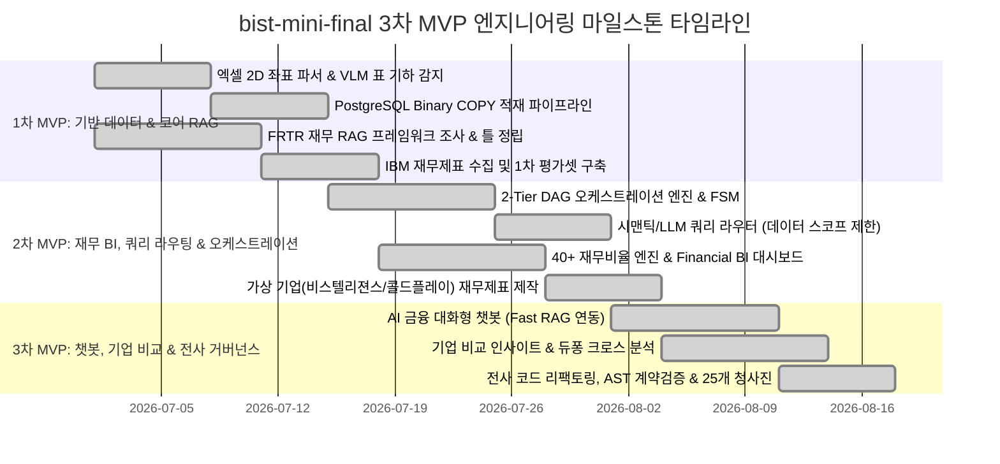

# [BP-004] 프로젝트 마일스톤 타임라인 & 역할 분배(R&R) 명세서
> **Document Code:** `BP-004` | **Domain:** 00. Master Plan & Standards | **Status:** Approved Baseline  
> **Classification:** Project WBS, 3-Phase MVP Milestones & 4-Lead Role Distribution Matrix

---

## 1. 3차 MVP 개발 마일스톤 타임라인 (3-Phase MVP Milestones)

`bist-mini-final` 플랫폼은 체계적인 **3차 MVP(Minimum Viable Product) 단계**를 거쳐 점진적으로 구축 및 고도화되었습니다:



---

## 2. 4인 전담 엔지니어링 Lead 역할 분배 매트릭스 (R&R Matrix)

| 엔지니어 (Role) | 주관 영역 및 핵심 책임 (Core Responsibilities) | 담당 구현 모듈 & 주요 산출물 | 연계 청사진 |
| :--- | :--- | :--- | :---: |
| **김지환**<br>*(Team Lead)* | • **전체 시스템 총괄 및 2-Tier DAG 오케스트레이션 엔진 구축**<br>• **PR 코드 리뷰, 브랜치 머지 및 병합 충돌 관리**<br>• **전사 코드베이스 리팩토링 및 아키텍처 불변식 유지보수**<br>• **대용량 데이터 적재 파이프라인(좌표 파서, VLM 직렬화, Binary COPY) 구축**<br>• 분산 락(Lease) 동시성 제어 및 React Flow 2D Playground 공통 설계 | • `backend/engine/workflows/` (DAG 실행기)<br>• `backend/storage/spreadsheets/` (좌표 파서)<br>• `backend/storage/pgvector_binary_copy.py`<br>• `modules/structure/cell_text_serializer.py`<br>• `backend/engine/worker/lease.py` | [`BP-101`](file:///c:/Repos/bist-mini-final/docs/01_system_blueprints/BP-101_system_architecture_blueprint.md)<br>[`BP-103`](file:///c:/Repos/bist-mini-final/docs/01_system_blueprints/BP-103_concurrency_and_locking_model.md)<br>[`BP-201`](file:///c:/Repos/bist-mini-final/docs/02_data_engine_blueprints/BP-201_spreadsheet_coordinate_parser.md)<br>[`BP-203`](file:///c:/Repos/bist-mini-final/docs/02_data_engine_blueprints/BP-203_binary_copy_vector_pipeline.md)<br>[`BP-301`](file:///c:/Repos/bist-mini-final/docs/03_pipeline_module_blueprints/BP-301_dag_execution_engine.md)<br>[`BP-401`](file:///c:/Repos/bist-mini-final/docs/04_workspace_blueprints/BP-401_ws_pipeline_playground.md) |
| **전명준**<br>*(Data & Evaluation Lead)* | • **IBM 원천 재무제표 기반 Ground-Truth 벤치마크 평가셋 생성**<br>• **가상 기업(비스텔리젼스, 콜드플레이) 모델링 및 다중 시트 재무제표(`.xlsx`) 제작**<br>• **다중 기업 크로스 비교(Company Comparison) 인사이트 분석 및 듀퐁 3단계 분해 기능 담당**<br>• 기업 간 통화/단위 정규화 및 5각 재무 건전성 랭킹 모델 구현 | • `modules/storage/company_entity_extractor.py`<br>• `modules/storage/qa_example_loader.py`<br>• `backend/features/benchmark/`<br>• `frontend/src/pages/CompanyComparisonPage.tsx`<br>• 가상 기업 재무제표 데이터셋 (`assets/`) | [`BP-001`](file:///c:/Repos/bist-mini-final/docs/00_master_plan_and_standards/BP-001_business_vision_and_executive_summary.md)<br>[`BP-405`](file:///c:/Repos/bist-mini-final/docs/04_workspace_blueprints/BP-405_ws_company_comparison.md)<br>[`BP-701`](file:///c:/Repos/bist-mini-final/docs/07_validation_blueprints/BP-701_contract_testing_and_benchmarks.md) |
| **권혁준**<br>*(RAG Framework & BI Lead)*| • **FRTR(Financial RAG/Table Retrieval) 재무 RAG 방법론 프레임워크 조사 및 틀 정립**<br>• **40+ 전사 재무 지표 및 Financial BI 대시보드(수익성/안정성/성장성/활동성) 구축**<br>• 무손실 `Decimal` 연산 기반 재무 계산기 및 5개년 건전성 히트맵 뷰모델 구현<br>• 음수 마진 적응형 Y축 스케일링(`chartViewModel.ts`) 및 원본 감사 셀 모달 결선 | • `backend/features/bi/` (BI 서비스 & 프로파일러)<br>• `modules/reader/financial_calculator.py`<br>• `frontend/src/features/bi/` (BI 대시보드)<br>• `frontend/src/features/bi/selectors/chartViewModel.ts`<br>• `frontend/src/features/bi/components/useModalDialog.ts` | [`BP-002`](file:///c:/Repos/bist-mini-final/docs/00_master_plan_and_standards/BP-002_core_use_cases_and_workflows.md)<br>[`BP-303`](file:///c:/Repos/bist-mini-final/docs/03_pipeline_module_blueprints/BP-303_hybrid_retrieval_and_fusion.md)<br>[`BP-403`](file:///c:/Repos/bist-mini-final/docs/04_workspace_blueprints/BP-403_ws_financial_bi_analytics.md) |
| **김정원**<br>*(Query Optimization & Chatbot Lead)* | • **시맨틱 쿼리 라우팅 및 LLM 쿼리 라우터를 통한 데이터 스코프(Data Scope) 제한 연구·구현**<br>• **불필요한 검색 범위 축소를 통한 토큰/비용 절감 및 RAG 정밀도 최적화**<br>• **AI 금융 대화형 챗봇(AI Financial Chatbot) 기능 담당**<br>• Fast RAG 인메모리 어댑터 결선, 실시간 대화 FSM 및 스트리밍 답변 파이프라인 구현 | • `modules/query/semantic_query_router.py`<br>• `modules/query/llm_query_router.py`<br>• `modules/query/decomposer.py`<br>• `backend/features/bi/fast_rag_adapter.py`<br>• `frontend/src/pages/ChatbotPage.tsx` | [`BP-302`](file:///c:/Repos/bist-mini-final/docs/03_pipeline_module_blueprints/BP-302_21_modules_pinout_catalog.md)<br>[`BP-404`](file:///c:/Repos/bist-mini-final/docs/04_workspace_blueprints/BP-404_ws_ai_financial_chatbot.md)<br>[`BP-502`](file:///c:/Repos/bist-mini-final/docs/05_interface_blueprints/BP-502_sse_streaming_protocol.md) |

---

## 3. 3단계 MVP별 상세 WBS 내역

```text
[1차 MVP: 기반 데이터 수집, 파싱 & 코어 RAG 적재]
  ├── WBS 1.1 (김지환): OpenPyXL 병합 해제 및 2D 직교 좌표계 정규화 파서 개발
  ├── WBS 1.2 (김지환): Luna VLM 1-Shot 표 바운딩박스 검출 및 header_with_value 직렬화기 구현
  ├── WBS 1.3 (김지환): PostgreSQL Native Binary COPY 3072d 고속 벌크 주입기 구축
  ├── WBS 1.4 (권혁준): FRTR 재무 RAG 방법론 프레임워크 조사 및 Dense+Sparse 기초 검색 틀 정립
  └── WBS 1.5 (전명준): IBM 원천 재무제표 엑셀 분석 및 1차 Ground-Truth 평가 데이터셋 구축

[2차 MVP: 2-Tier 오케스트레이션, 쿼리 스코프 라우팅 & 재무 BI 대시보드]
  ├── WBS 2.1 (김지환): Kahn 위상정렬 기반 2-Tier DAG 실행기, FSM 런타임 및 PR 머지/품질 관리
  ├── WBS 2.2 (김정원): SemanticQueryRouter & LlmQueryRouter를 통한 대상 기업/시트 데이터 스코프 제한기 개발
  ├── WBS 2.3 (권혁준): 40+ 전사 재무비율 무손실 Decimal 계산 엔진 및 Financial BI 대시보드 차트 구축
  ├── WBS 2.4 (권혁준): 회계기간/통화 프로파일러 연동 및 적응형 음수 마진 Y축 스케일링(chartViewModel) 구현
  └── WBS 2.5 (전명준): 가상 기업(비스텔리젼스, 콜드플레이) 모델링 및 복합 다중 시트 재무제표(.xlsx) 제작

[3차 MVP: AI 챗봇, 다중 기업 비교 인사이트 & 전사 아키텍처 거버넌스]
  ├── WBS 3.1 (김정원): Fast RAG 인메모리 어댑터 연동 및 AI 금융 대화형 챗봇(/chatbot) 풀스택 구축
  ├── WBS 3.2 (김정원): 챗봇 대화 세션 컨텍스트 및 마크다운/LaTeX 수식 실시간 SSE 스트리밍 구현
  ├── WBS 3.3 (전명준): 다중 기업 듀퐁 3단계(순이익률 x 총자산회전율 x 재무레버리지) 크로스 비교 엔진 구현
  ├── WBS 3.4 (전명준): 동종업계 5각 재무 건전성 레이더 차트 및 벤치마크 랭킹 인사이트 뷰 구축
  └── WBS 3.5 (김지환): 전사 코드베이스 리팩토링, AST 아키텍처 계약 테스트 체계 및 8대 도메인 25개 청사진 완성
```
