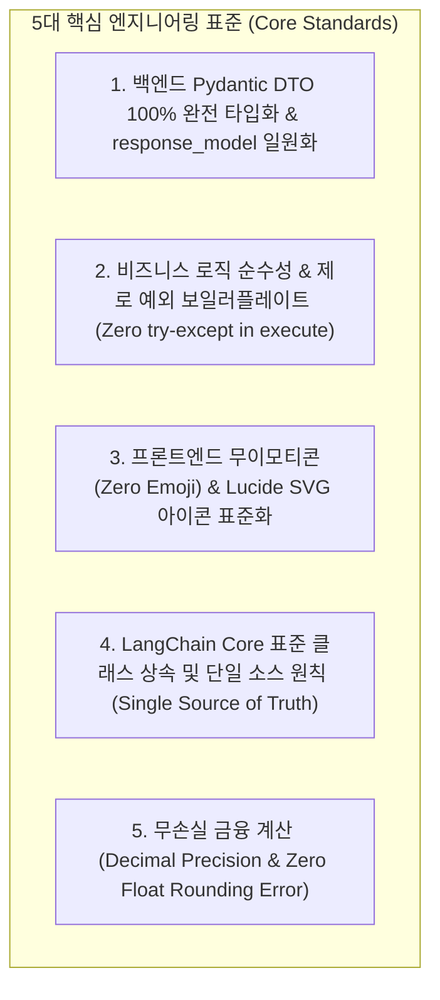
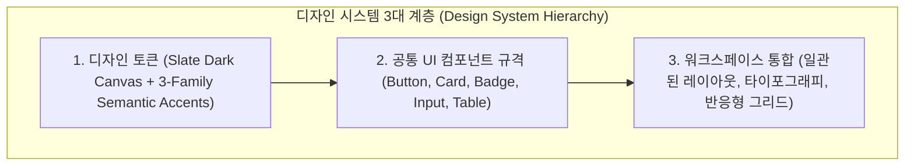

# [BP-005] 엔지니어링 코드 컨벤션 & 구현 표준 규격서
> **Document Code:** `BP-005` | **Category:** Engineering Standards & Code Conventions | **Status:** Approved Baseline  
> **Source Rules:** [`.agents/rules/code-style-guide.md`](file:///c:/Repos/bist-mini-final/.agents/rules/code-style-guide.md)

---

## 1. 개요 및 목적 (Overview & Principles)

본 문서는 `bist-mini-final` 프로젝트 전반에 걸쳐 백엔드(Python/FastAPI/LangChain), 프론트엔드(React/TypeScript/Tailwind CSS), 스토리지(PostgreSQL)의 **구현 무결성, 코드 가독성, 타입 안정성 및 일관된 UI/UX 미학을 보장하기 위한 절대적 엔지니어링 표준(Engineering Invariants)**을 규정합니다.



---

## 2. 백엔드 Pydantic DTO 완전 타입화 & JSON 직렬화 규격

### 2.1 100% Typed Pydantic DTO 및 `response_model` 필수 바인딩
* 모든 FastAPI 엔드포인트는 `dict`, `Any`, `list[dict]`와 같은 비정형 반환을 **엄격히 금지**합니다.
* 반드시 선언된 Pydantic DTO 모델을 `response_model`로 명시하고, 내부에서 `model_dump(mode="json")` 또는 DTO 인스턴스를 반환하여 프론트엔드와의 타입 불일치(HTTP 500/503)를 원천 차단합니다.

```python
# ❌ [Strictly Forbidden]: 비정형 dict 반환 및 런타임 직렬화 실패 위험
@router.get("/companies")
def get_companies():
    return {"companies": [{"id": 1, "name": "삼성전자"}]}

# ✅ [Recommended Standard]: 완전 타입화된 Pydantic DTO 및 response_model 명시
class BiCompanySummaryDTO(BaseModel):
    company_id: str = Field(..., description="기업 고유 식별자")
    display_name: str = Field(..., description="기업 표시 명칭")
    current_snapshot_id: Optional[str] = Field(None, description="최신 스냅샷 ID")
    updated_at: datetime = Field(..., description="최종 갱신 일시")

class BiCompanyListResponseDTO(BaseModel):
    companies: tuple[BiCompanySummaryDTO, ...] = Field(default_factory=tuple)

@router.get("/companies", response_model=BiCompanyListResponseDTO)
def list_companies(services: BiApiServices = Depends(get_bi_services)) -> BiCompanyListResponseDTO:
    entries = services.store.list_companies()
    return BiCompanyListResponseDTO(companies=tuple(...))
```

### 2.2 하드코딩 정적 사전 및 캐시 배제 (Zero Hardcoded Thesaurus)
* 수백 줄에 달하는 하드코딩 정적 동의어 사전, thesaurus 테이블, 과거 질의 캐시 등의 불투명한 임시 패치는 금지합니다.
* 모든 자연어 쿼리 분석 및 원자적 서브쿼리 확장은 **최신 LLM 프롬프트와 Pydantic 모델(`response_model`)**을 통해 결정론적으로 수행합니다.

---

## 3. 비즈니스 로직 순수성 및 제로 예외 보일러플레이트 (Zero Exception Boilerplate)

### 3.1 핵심 원칙
* `modules/*.execute()` 및 `backend/features/bi/*.py` 내부에는 `try-except Exception ... raise ModuleExecutionError(...)`와 같은 **중복 예외 포장 보일러플레이트를 일절 작성하지 않습니다**.
* 비즈니스 로직 코드는 오직 **순수한 수식 계산, 데이터 변환, 프롬프트 생성 로직만 기록**하여 가독성을 극대화합니다.
* 최상위 템플릿 메서드인 `BaseModule.run()`과 FastAPI 전역 핸들러(`@app.exception_handler(PipelineBaseError)`)가 모든 저수준 예외를 자동으로 표준 도메인 예외로 분류·응답합니다.

```python
# ❌ [Strictly Forbidden]: 불필요한 try-except 보일러플레이트로 인한 가독성 저하
class MyModule(BaseModule):
    def execute(self, input_data, config=None):
        try:
            val = input_data.a / input_data.b
            return {"result": val}
        except Exception as exc:
            logger.error(f"Error in MyModule: {exc}")
            raise ModuleExecutionError(f"Execution failed: {exc}")

# ✅ [Recommended Standard]: 순수 비즈니스 로직만 작성 (BaseModule.run()이 자동 보호)
class MyModule(BaseModule):
    def execute(self, input_data: MyInputDTO, config: Optional[MyConfigDTO] = None) -> Dict[str, Any]:
        val = input_data.a / input_data.b
        return {"result": val}
```

### 3.2 도메인 예외 계층 및 표준 에러 응답 Envelope
모든 API 응답 실패 시 [BP-501 Section 2]의 단일 JSON 스키마를 반환합니다:

```json
{
  "error_code": "PROVIDER_API_ERROR",
  "message": "모듈 [reader] 외부 API 호출 실패: Rate limit exceeded",
  "module_type": "reader",
  "status_code": 502,
  "details": { "provider": "openai", "retry_after_seconds": 5 },
  "timestamp": "2026-08-26T16:00:00.000Z"
}
```

---

## 4. 프론트엔드 디자인 시스템 & 컴포넌트 스타일 표준 (Frontend Design System & UI Consistency)

화면마다 제각각인 임의 스타일링(Ad-hoc Styling)을 원천 차단하고, 전체 워크스페이스(Playground, Data Sources, BI, Chatbot, Comparison)에 걸쳐 **일관된 고품격 핀테크 엔터프라이즈 터미널 톤앤매너**를 유지합니다.



---

### 4.1 UI 내 원시 유니코드 이모티콘 사용 전면 금지 (Zero Raw Emojis)
* 버튼, 뱃지, 네비게이션 탭, 헤더 등 모든 UI 컴포넌트에 `🔍`, `🚀`, `🔥`, `📊`, `📁`, `⚙️`, `⚠️`, `✅`와 같은 **원시 유니코드 이모티콘 하드코딩을 엄격히 금지**합니다.
* OS/브라우저별 렌더링 파편화를 방지하고 프로페셔널 엔터프라이즈 UI 톤앤매너를 유지합니다.

### 4.2 `lucide-react` SVG 벡터 아이콘 표준 규칙
* 모든 아이콘은 **[`lucide-react`](file:///c:/Repos/bist-mini-final/frontend/package.json#L17)** 라이브러리에서 명시적으로 import하여 사용합니다.
* 아이콘 크기는 용도에 따라 엄격히 통일합니다:
  * **버튼/인풋 내부**: `w-4 h-4` (`strokeWidth={1.5}` or `2`)
  * **섹션 헤더/네비게이션**: `w-5 h-5` (`strokeWidth={1.5}`)
  * **상태 인디케이터/뱃지**: `w-3.5 h-3.5` (`strokeWidth={2}`)

```tsx
// ❌ [Strictly Forbidden]: 원시 이모티콘 사용
<button className="btn">🔍 검색하기</button>
<span className="badge">⚠️ 오류 발생</span>

// ✅ [Recommended Standard]: lucide-react SVG 벡터 아이콘 및 테마 색상 적용
import { Search, AlertTriangle, CheckCircle2, TrendingUp } from 'lucide-react';

<button className="flex items-center gap-2 px-3 py-1.5 bg-indigo-600 hover:bg-indigo-500 text-white text-xs font-medium rounded-lg transition-colors">
  <Search className="w-4 h-4" strokeWidth={1.5} />
  <span>검색하기</span>
</button>

<div className="flex items-center gap-1.5 text-rose-400 text-xs font-medium">
  <AlertTriangle className="w-3.5 h-3.5 shrink-0" strokeWidth={2} />
  <span>오류가 발생했습니다</span>
</div>
```

---

### 4.3 다크 테마 디자인 토큰 (Tailwind CSS v4 Surface & Palette Tokens)

| 토큰 분류 | Tailwind 클래스 | 적용 대상 및 용도 |
| :--- | :--- | :--- |
| **Canvas Background** | `bg-slate-950` | 최상위 뷰포트 배경 캔버스 (Deep Void) |
| **Card / Panel Surface** | `bg-slate-900/80 backdrop-blur` | 패널, 모달, 차트 컨테이너 (Glassmorphism Dark Surface) |
| **Borders & Dividers** | `border-slate-800` / `border-slate-700/60` | 패널 경계선, 그리드 구분선, 입력창 테두리 |
| **Hover & Active Surface**| `hover:bg-slate-800/60`, `bg-slate-800` | 리스트 아이템 호버, 탭 활성 배경 |
| **AI & Inference Accent** | `text-indigo-400`, `bg-indigo-600` | LLM 추론, VLM 감지, 주요 액션 버튼 (Primary) |
| **Success & Healthy Accent**| `text-emerald-400`, `bg-emerald-500/10` | 재무 건전성 정상, 성공 완료, 스냅샷 준비 완료 |
| **Warning & Pending Accent**| `text-amber-400`, `bg-amber-500/10` | 큐 대기, 작업 실행 중, 주의 지표 |
| **Danger & Critical Accent** | `text-rose-400`, `bg-rose-500/10` | 재무 적자/경고, 잡 실패, 삭제/취소 액션 |

---

### 4.4 공통 UI 컴포넌트 표준 규격 (Standard UI Component Variants)

개별 화면에서 중복 코드를 작성하지 않고, 일관된 스타일 토큰을 적용합니다:

#### 1. 버튼 계층 구조 (Button Hierarchy)
* **Primary Button**: `px-3.5 py-1.5 bg-indigo-600 hover:bg-indigo-500 active:bg-indigo-700 text-white text-xs font-semibold rounded-lg shadow-sm transition-all flex items-center gap-2`
* **Secondary Button**: `px-3 py-1.5 bg-slate-800 hover:bg-slate-700 border border-slate-700 text-slate-200 text-xs font-medium rounded-lg transition-colors flex items-center gap-1.5`
* **Danger Button**: `px-3 py-1.5 bg-rose-600/90 hover:bg-rose-500 text-white text-xs font-semibold rounded-lg transition-colors flex items-center gap-1.5`
* **Ghost / Icon Button**: `p-1.5 text-slate-400 hover:text-white hover:bg-slate-800/80 rounded-md transition-colors`

#### 2. 카드 및 컨테이너 (Card / Surface Container)
* **Standard Glass Card**:
  ```tsx
  <div className="bg-slate-900/80 backdrop-blur border border-slate-800 rounded-xl p-4 shadow-sm hover:border-slate-700/80 transition-all">
    {/* Card Header & Content */}
  </div>
  ```

#### 3. 4-State 상태 뱃지 (Status Badge Tokens)
* **Ready / Completed**: `inline-flex items-center gap-1 px-2 py-0.5 rounded-full text-[11px] font-medium bg-emerald-500/10 text-emerald-400 border border-emerald-500/20`
* **Running / Extracting**: `inline-flex items-center gap-1 px-2 py-0.5 rounded-full text-[11px] font-medium bg-indigo-500/10 text-indigo-400 border border-indigo-500/20 animate-pulse`
* **Queued / Pending**: `inline-flex items-center gap-1 px-2 py-0.5 rounded-full text-[11px] font-medium bg-amber-500/10 text-amber-400 border border-amber-500/20`
* **Failed / Error**: `inline-flex items-center gap-1 px-2 py-0.5 rounded-full text-[11px] font-medium bg-rose-500/10 text-rose-400 border border-rose-500/20`

#### 4. 타이포그래피 계층 (Typography Ladder)
* **페이지 타이틀**: `text-lg font-bold text-white tracking-tight`
* **섹션 헤더**: `text-sm font-semibold text-slate-200`
* **본문 및 데이터**: `text-xs text-slate-300 font-normal leading-relaxed`
* **수치/좌표/메타데이터**: `text-[11px] font-medium text-slate-400 font-mono`

---

### 4.5 임의 스타일링 금지 원칙 (Zero Ad-Hoc Styling Policy)
* ❌ 화면마다 임의의 원색(`bg-red-500`, `bg-blue-400`, `text-yellow-300`)을 직류로 사용하지 않습니다.
* ❌ 컴포넌트 간 패딩(`p-4`, `p-6`)과 마진 규칙을 어긋나게 배치하지 않고 일관된 간격 토큰(`gap-2`, `gap-3`, `gap-4`)을 준수합니다.

---

## 5. LangChain Core 표준 클래스 상속 및 단일 소스 원칙

### 5.1 `modules/` 단일 소스 원칙 (Single Source of Truth)
* 모든 RAG 파이프라인 모듈은 **`modules/` 디렉토리 아래에서만 관리**하며, 중복 래퍼 생성을 금지합니다.
* 백엔드 런타임(`backend/engine/runtime/registry.py`)은 오직 `modules.*`에서 모듈을 직접 import하여 등록합니다.

### 5.2 LangChain 표준 클래스 상속 규격
* **에이전트 도구 (Tools)**:
  * 수동 JSON 딕셔너리 스키마 대신 **`langchain_core.tools.BaseTool`을 직접 상속**합니다.
  * 입력 계약은 `args_schema: Optional[Type[BaseModel]] = YourInputDTO`로 선언하고 `_run(self, ...)`을 구현합니다.
* **임베딩 인코더 (Embeddings)**:
  * `langchain_core.embeddings.Embeddings`를 직접 상속받아 `embed_documents()` 및 `embed_query()`를 구현합니다.
* **문서 객체 (Documents)**:
  * `langchain_core.documents.Document(page_content=..., metadata=...)` 표준 모델을 사용합니다.

---

## 6. 무손실 금융 수식 계산 표준 (Lossless Financial Decimal Math)

### 6.1 부동소수점(`float`) 누적 오차 금지
* 재무제표의 40+ 지표 및 파생비율(ROE, 부채비율, 영업이익률 등) 연산 시 **파이썬 내장 `float` 연산을 엄격히 금지**합니다.
* 반드시 **`decimal.Decimal`**을 사용하여 유효숫자 손실 없는 고정소수점 연산을 수행하고, 최종 단계에서만 정의된 반올림 규칙(`ROUND_HALF_UP`)을 적용합니다.

```python
# ❌ [Strictly Forbidden]: float 부동소수점 누적 오차 발생
roe = (net_income / total_equity) * 100 # 0.18500000000000003

# ✅ [Recommended Standard]: Decimal 무손실 금융 연산
from decimal import Decimal, ROUND_HALF_UP

def calculate_roe(net_income: Decimal, total_equity: Decimal) -> Decimal:
    if total_equity == Decimal("0"):
        return Decimal("0.0")
    raw_roe = (net_income / total_equity) * Decimal("100")
    return raw_roe.quantize(Decimal("0.01"), rounding=ROUND_HALF_UP)
```

---

## 7. 리팩토링 체크리스트 (Engineering Quality Checklist)

- [ ] **DTO 무결성**: 모든 엔드포인트와 모듈 입출력이 Pydantic BaseModel로 선언되었는가?
- [ ] **비즈니스 순수성**: `execute()` 내부에 불필요한 `try-except` 래핑이 없는가?
- [ ] **아이콘 무결성**: UI에 원시 유니코드 이모티콘 대신 `lucide-react` SVG 아이콘이 사용되었는가?
- [ ] **단일 소스 원칙**: 파이프라인 모듈이 `modules/` 단일 경로에서만 임포트되는가?
- [ ] **금융 정밀도**: 재무 비율 및 수식 계산에 `Decimal`이 적용되었는가?
