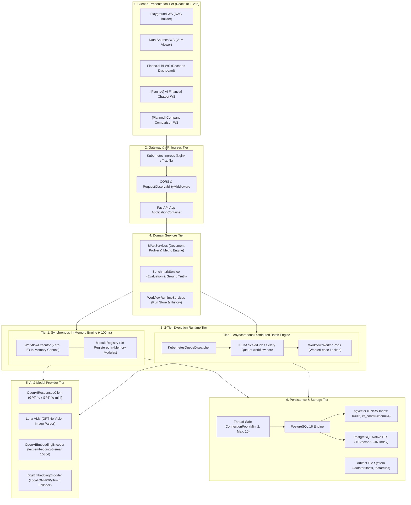
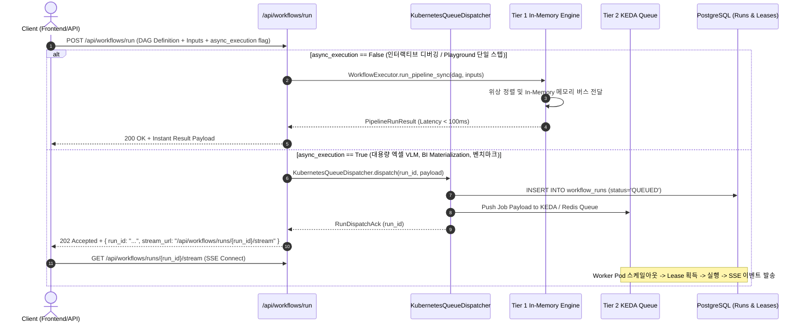
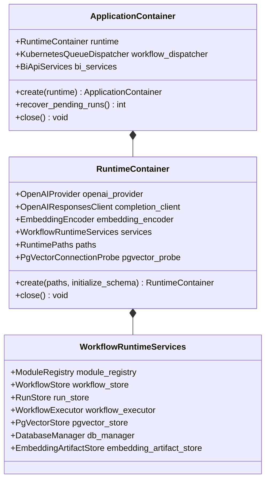

# [BP-101] 시스템 전체 배치도 & 2-Tier 런타임 토폴로지
> **Document Code:** `BP-101` | **Category:** System Architecture Blueprint | **Status:** Approved Baseline  
> **Source Files:** [`backend/bootstrap/container.py`](file:///c:/Repos/bist-mini-final/backend/bootstrap/container.py), [`backend/main.py`](file:///c:/Repos/bist-mini-final/backend/main.py), [`backend/core/settings.py`](file:///c:/Repos/bist-mini-final/backend/core/settings.py)

---

## 1. 시스템 아키텍처 토폴로지 (System Topology)

`bist-mini-final` 시스템은 비정형 스프레드시트 분석, 대규모 임베딩 색인, DAG 기반 RAG 실행, 그리고 실시간 재무 BI 대시보드를 통합 처리하기 위해 설계된 **엔터프라이즈 멀티 티어 하이브리드 아키텍처**를 가집니다.



---

## 2. 2-Tier 런타임 분기 알고리즘 (2-Tier Execution Routing)

파이프라인 실행 요청은 지연시간 요건(Latency Requirement)과 작업 부하량(Workload Mass)에 따라 동기 인메모리 런타임과 비동기 KEDA 큐 분산 워커 런타임으로 분기됩니다.



---

## 3. 부트스트랩 DI 컨테이너 구성 (Bootstrap Container Wireframing)

애플리케이션은 [`ApplicationContainer`](file:///c:/Repos/bist-mini-final/backend/bootstrap/container.py#L106-L140) 단일 진입점을 통해 모든 하위 의존성을 조립합니다.



---

## 4. 리팩토링 타깃 및 기술 부채 (Refactoring Targets & Debts)

### As-Is 분석 및 기술 부채
1. **`ApplicationContainer`의 단일 거대 조립 결합도**:
   - `create_workflow_runtime_services()` 내부에서 19개 모듈, DB 매니저, 파일 시스템 경로를 일괄 바인딩하여 단위 테스트 시 개별 모듈 격리 모킹(Mocking)이 번거로움.
2. **동기/비동기 실행 분기의 컨트롤러 계층 혼재**:
   - `workflow_routes.py`와 `benchmark_routes.py`에서 `workflow_dispatcher`와 `workflow_executor`를 직접 참조하여 if/else 분기하고 있음.

### To-Be 권장 리팩토링 설계 (Refactoring Blueprint)
1. **`ExecutionPort` 인터페이스 추상화**:
   ```python
   class ExecutionPort(ABC):
       @abstractmethod
       async def execute(self, command: RunWorkflowCommand) -> WorkflowExecutionHandle: ...
   ```
   - `DirectInMemoryExecutionAdapter`와 `KubernetesQueueExecutionAdapter`로 구현 분리.
2. **모듈 팩토리(Module Factory) 레이어 도입**:
   - 19개 모듈을 카테고리별(`QueryModulesFactory`, `RetrievalModulesFactory`, `VisionModulesFactory`)로 팩토리화하여 동적 로딩 가능하도록 분리.
