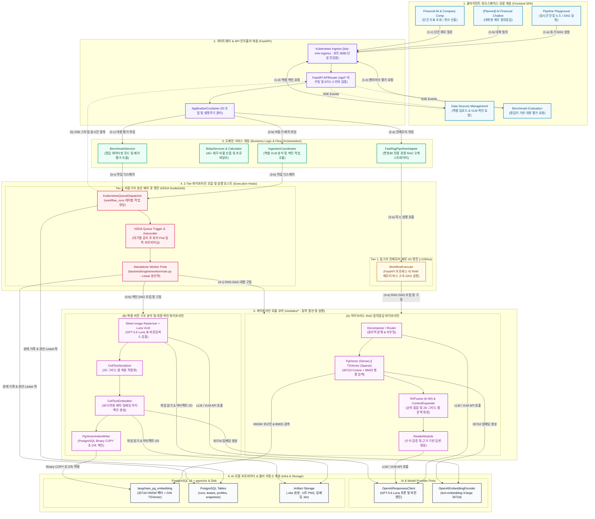
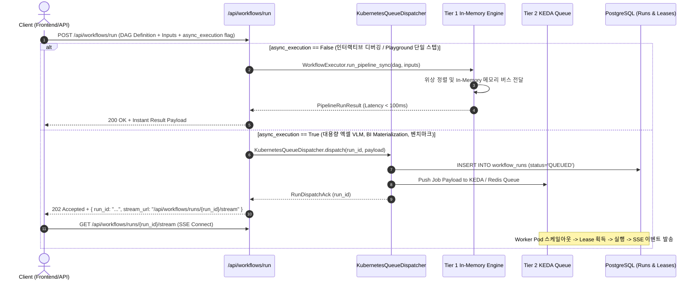
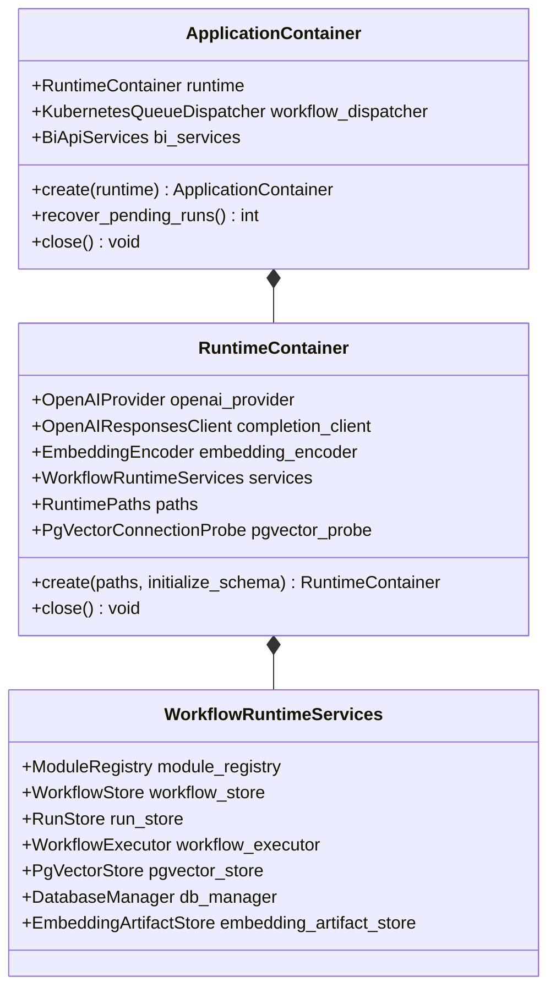

# [BP-101] 시스템 전체 배치도 & 2-Tier 런타임 토폴로지
> **Document Code:** `BP-101` | **Category:** System Architecture Blueprint | **Status:** Approved Baseline  
> **Source Files:** [`backend/bootstrap/container.py`](file:///c:/Repos/bist-mini-final/backend/bootstrap/container.py), [`backend/main.py`](file:///c:/Repos/bist-mini-final/backend/main.py), [`backend/core/settings.py`](file:///c:/Repos/bist-mini-final/backend/core/settings.py)

---

## 1. 시스템 아키텍처 토폴로지 (System Topology)

`bist-mini-final` 시스템은 비정형 스프레드시트 분석, 대규모 임베딩 색인, DAG 기반 RAG 실행, 그리고 실시간 재무 BI 대시보드를 통합 처리하기 위해 설계된 **엔터프라이즈 멀티 티어 하이브리드 아키텍처**를 가집니다.



---

## 2. 2-Tier 런타임 분기 알고리즘 (2-Tier Execution Routing)

파이프라인 실행 요청은 지연시간 요건(Latency Requirement)과 작업 부하량(Workload Mass)에 따라 동기 인메모리 런타임과 비동기 KEDA 큐 분산 워커 런타임으로 분기됩니다.



---

### 2.1 기능별 실행 엔진 매핑 분류표 (Feature vs. Execution Runtime Matrix)

| 워크스페이스 / 기능 영역 | 구체적 기능 (Feature) | 실행 방식 (Execution Tier) | 담당 핵심 컴포넌트 / 모듈 | 트리거 API / 진입점 | 평균 지연시간 (Latency) | 상태 모니터링 방식 |
| :--- | :--- | :--- | :--- | :--- | :--- | :--- |
| **Pipeline Playground** (실험실/샌드박스) | 단일 노드 인터랙티브 테스트 | **Tier 1 (동기 인메모리)** | `WorkflowExecutor.run_node_sync` | `POST /api/workflows/node/run` | `< 100ms` | HTTP 즉시 반환 |
| | 인터랙티브 DAG 전체 실험/실행 | **Tier 1 (동기 인메모리)** | `WorkflowExecutor.run_pipeline_sync` | `POST /api/workflows/run` | `100ms ~ 1.5s` | HTTP 즉시 반환 / 제로 I/O |
| **Data Sources** | 워크북 목록 & 시트 그리드 조회 | **Tier 1 (동기 인메모리)** | `WorkbookCatalog`, `OpenPyXL` | `GET /api/data-sources/files` | `< 50ms` | HTTP 즉시 반환 |
| | Luna VLM 표 감지 & pgvector 색인 | **Tier 2 (비동기 KEDA 큐)** | `LunaVlmStructureDetector`, `PgVectorBinaryCopy` | `POST /api/data-sources/ingest` | `5s ~ 40s` | KEDA Worker & SSE 진척도 |
| | DB / pgvector 연결 상태 프로브 | **Tier 1 (동기 인메모리)** | `PgVectorConnectionProbe` | `GET /api/data-sources/probe` | `< 10ms` | 3초 주기 HTTP 폴링 |
| **Financial BI** | 기업 프로파일 & 메트릭 조회 | **Tier 1 (동기 인메모리)** | `DocumentProfiler`, `ProfileRepository` | `GET /api/bi/profiles` | `< 50ms` | HTTP 즉시 반환 |
| | 단건 재무 질의응답 (Fast RAG) | **Tier 1 (동기 인메모리)** | `FastRagPipelineAdapter` | `POST /api/bi/questions/answer` | `200ms ~ 500ms` | HTTP 즉시 반환 |
| | 40+ 전사 지표 일괄 산출 (Materialize)| **Tier 2 (비동기 KEDA 큐)** | `QuestionBatchWorkerMain`, `BiCalculator` | `POST /api/bi/materialize` | `10s ~ 60s` | DB 스냅샷 & 큐 상태 |
| **AI 금융 챗봇** (예정) | 대화형 재무 RAG 질의응답 | **Tier 1 (동기 인메모리)** | `FastRagPipelineAdapter`, `ReaderModule` | `POST /api/chatbot/messages` | `300ms ~ 800ms` | SSE 토큰 스트리밍 |
| **기업 비교** (예정) | 다중 기업 듀퐁 분석 & 레이더 차트 | **Tier 1 (동기 인메모리)** | `QuestionSnapshotRepository`, `Normalizer` | `POST /api/bi/comparison` | `< 100ms` | HTTP 즉시 반환 |
| **Benchmark** | 정답지 기반 대량 정확도 평가 | **Tier 2 (비동기 KEDA 큐)** | `BenchmarkWorkerMain`, `BenchmarkService` | `POST /api/benchmarks/run` | `30s ~ 3min` | SSE 진척도 & 리포트 |

---

## 3. 부트스트랩 DI 컨테이너 구성 (Bootstrap Container Wireframing)

애플리케이션은 [`ApplicationContainer`](file:///c:/Repos/bist-mini-final/backend/bootstrap/container.py#L106-L140) 단일 진입점을 통해 모든 하위 의존성을 조립합니다.



---

## 4. 리팩토링 타깃 및 기술 부채 (Refactoring Targets & Debts)

### As-Is 분석 및 기술 부채
1. **`ApplicationContainer`의 단일 거대 조립 결합도**:
   - `create_workflow_runtime_services()` 내부에서 19개 모듈, DB 매니저, 파일 시스템 경로를 일괄 바인딩하여 단위 테스트 시 개별 모듈 격리 모킹(Mocking)이 번거로움.
2. **동기/비동기 실행 분기의 컨트롤러 계층 혼재**:
   - `workflow_routes.py`와 `benchmark_routes.py`에서 `workflow_dispatcher`와 `workflow_executor`를 직접 참조하여 if/else 분기하고 있음.

### To-Be 권장 리팩토링 설계 (Refactoring Blueprint)
1. **`ExecutionPort` 인터페이스 추상화**:
   ```python
   class ExecutionPort(ABC):
       @abstractmethod
       async def execute(self, command: RunWorkflowCommand) -> WorkflowExecutionHandle: ...
   ```
   - `DirectInMemoryExecutionAdapter`와 `KubernetesQueueExecutionAdapter`로 구현 분리.
2. **모듈 팩토리(Module Factory) 레이어 도입**:
   - 19개 모듈을 카테고리별(`QueryModulesFactory`, `RetrievalModulesFactory`, `VisionModulesFactory`)로 팩토리화하여 동적 로딩 가능하도록 분리.
