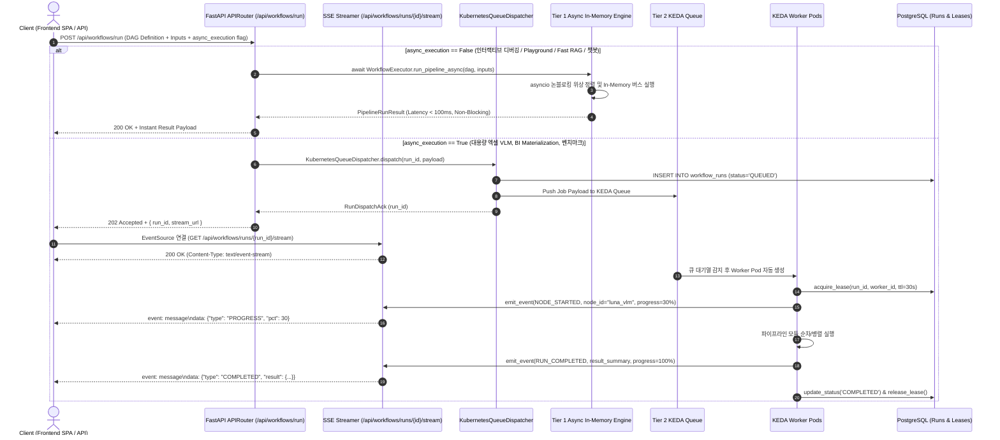
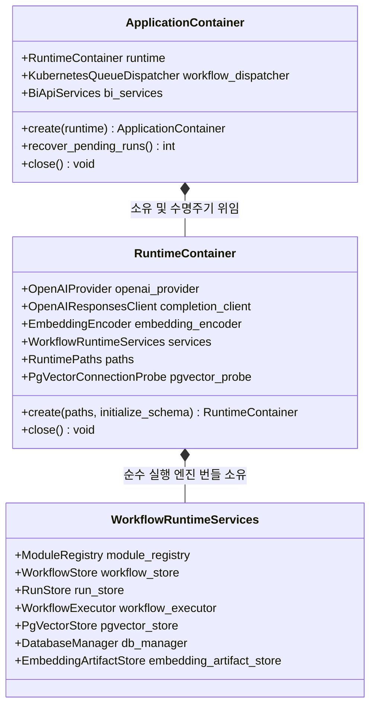

# [BP-101] 시스템 전체 배치도 & 2-Tier 런타임 토폴로지
> **Document Code:** `BP-101` | **Category:** System Architecture Blueprint | **Status:** Approved Baseline  
> **Source Files:** [`backend/bootstrap/container.py`](file:///c:/Repos/bist-mini-final/backend/bootstrap/container.py), [`backend/main.py`](file:///c:/Repos/bist-mini-final/backend/main.py), [`backend/core/settings.py`](file:///c:/Repos/bist-mini-final/backend/core/settings.py)

---

## 1. 시스템 아키텍처 토폴로지 (System Topology)

`bist-mini-final` 시스템은 비정형 스프레드시트 분석, 대규모 임베딩 색인, DAG 기반 RAG 실행, 그리고 실시간 재무 BI 대시보드를 통합 처리하기 위해 설계된 **엔터프라이즈 멀티 티어 하이브리드 아키텍처**를 가집니다.

```mermaid
graph TB
    subgraph ClientTier ["1. Client & Workspace Tier (React 18 SPA)"]
        WS_PLAY["Pipeline Playground (DAG Lab)"]
        WS_CHAT["[Planned] AI Financial Chatbot"]
        WS_BI["Financial BI & Company Comparison"]
        WS_DS["Data Sources (VLM Sheet Viewer)"]
        WS_BENCH["Benchmark Evaluation"]
    end

    subgraph GatewayTier ["2. Gateway & API Tier (Kubernetes & FastAPI)"]
        INGRESS["Kubernetes Ingress (bist-mini-ingress : 8080)"]
        ROUTER["FastAPI App (/api/*, /docs, /redoc, /jobs)"]
        CONTAINER["ApplicationContainer (DI Composition Root)"]
        INGRESS --> ROUTER --> CONTAINER
    end

    subgraph DomainTier ["3. Domain & Feature Services Tier"]
        FAST_RAG["FastRagPipelineAdapter (Chatbot/BI Orchestrator)"]
        BI_SVC["BiApiServices & DuPont Calculator"]
        INGEST_COORD["IngestionCoordinator (Excel & VLM Manager)"]
        BENCH_SVC["BenchmarkService (Evaluation Runner)"]
    end

    subgraph ModularLayer ["4. Modular Pipeline Layer (modules/* - 19 Independent Building Blocks)"]
        M_REG["ModuleRegistry (Single Source of Truth)"]
        M_DAG["Composed DAG Pipelines (Query -> Hybrid Retrieval -> VLM -> Reader)"]
        M_REG --> M_DAG
    end

    subgraph RuntimeTier ["5. 2-Tier Execution Runtime Tier"]
        subgraph T1_Box ["Tier 1: Async In-Memory Non-Blocking Engine (<100ms)"]
            T1_EXEC["WorkflowExecutor (asyncio EventLoop + In-Memory Bus)"]
        end
        subgraph T2_Box ["Tier 2: Distributed Batch Queue Engine"]
            DISPATCHER["KubernetesQueueDispatcher"]
            KEDA_QUEUE["KEDA Trigger (workflow-core Queue)"]
            WORKER_PODS["Workflow Worker Pods (WorkerLease Locked)"]
            DISPATCHER --> KEDA_QUEUE --> WORKER_PODS
        end
    end

    subgraph InfraTier ["6. AI Models & Storage Persistence Tier"]
        subgraph AI_PROV ["AI Provider Tier"]
            OAI_LLM["OpenAIResponsesClient (GPT-5.6 Luna LLM/VLM)"]
            OAI_EMB["OpenAIEmbeddingEncoder (text-embedding-3-large 3072d)"]
        end
        subgraph PERSIST ["Persistence Tier"]
            PG_VEC["PostgreSQL 16 + pgvector (3072d HNSW & TSVector GIN)"]
            PG_META["PostgreSQL Relational Tables (Runs, Leases, Profiles)"]
            DISK_FS["Spreadsheet & Embedding Artifact Storage (/data)"]
        end
    end

    ClientTier --> INGRESS
    CONTAINER --> DomainTier
    DomainTier -->|1. 비즈니스 목적별 모듈 선택 및 DAG 구성| ModularLayer
    ModularLayer -->|2. 구성된 DAG를 실행 호스트에 위임| RuntimeTier
    RuntimeTier -->|3. AI 추론 및 임베딩 호출| AI_PROV
    RuntimeTier -->|4. 데이터 적재 및 벡터 검색| PERSIST
```



---

## 2. 2-Tier 런타임 분기 알고리즘 (2-Tier Execution Routing)

파이프라인 실행 요청은 지연시간 요건(Latency Requirement)과 작업 부하량(Workload Mass)에 따라 **Tier 1 (비동기 논블로킹 인메모리 런타임)**과 **Tier 2 (KEDA 분산 배치 큐 런타임)**으로 명확히 분기됩니다.



---

### 2.1 기능별 실행 엔진 매핑 분류표 (Feature vs. Execution Runtime Matrix)

| 워크스페이스 / 기능 영역 | 구체적 기능 (Feature) | 실행 방식 (Execution Tier) | 담당 핵심 컴포넌트 / 모듈 | 트리거 API / 진입점 | 평균 지연시간 (Latency) | 통신 & 상태 모니터링 방식 |
| :--- | :--- | :--- | :--- | :--- | :--- | :--- |
| **Pipeline Playground** (실험실/샌드박스) | 단일 노드 인터랙티브 테스트 | **Tier 1 (비동기 인메모리)** | `WorkflowExecutor.run_node_async` | `POST /api/workflows/node/run` | `< 100ms` | HTTP 즉시 반환 (Non-Blocking) |
| | 인터랙티브 DAG 전체 실험/실행 | **Tier 1 (비동기 인메모리)** | `WorkflowExecutor.run_pipeline_async` | `POST /api/workflows/run` | `100ms ~ 1.5s` | HTTP 즉시 반환 / 제로 I/O |
| **AI 금융 챗봇** (예정) | 대화형 멀티턴 재무 RAG 세션 | **Tier 1 (비동기 인메모리)** | `FastRagPipelineAdapter`, `ChatbotSession` | `WS /api/chatbot/ws` | `100ms ~ 500ms` | **WebSocket 양방향 스트리밍** (토큰/중단 제어) |
| **Data Sources** | 워크북 목록 & 시트 그리드 조회 | **Tier 1 (비동기 인메모리)** | `WorkbookCatalog`, `OpenPyXL` | `GET /api/data-sources/files` | `< 50ms` | HTTP 즉시 반환 |
| | Luna VLM 표 감지 & pgvector 색인 | **Tier 2 (분산 배치 큐)** | `LunaVlmStructureDetector`, `PgVectorBinaryCopy` | `POST /api/data-sources/ingest` | `5s ~ 40s` | KEDA Worker & SSE 진척도 스트림 |
| | DB / pgvector 연결 상태 프로브 | **Tier 1 (비동기 인메모리)** | `PgVectorConnectionProbe` | `GET /api/data-sources/probe` | `< 10ms` | 페이지 진입 시 1회성 HTTP 조회 (수동 새로고침) |
| **Financial BI** | 기업 프로파일 & 메트릭 조회 | **Tier 1 (비동기 인메모리)** | `DocumentProfiler`, `ProfileRepository` | `GET /api/bi/profiles` | `< 50ms` | HTTP 즉시 반환 |
| | 단건 재무 질의응답 (Fast RAG) | **Tier 1 (비동기 인메모리)** | `FastRagPipelineAdapter` | `POST /api/bi/questions/answer` | `200ms ~ 500ms` | HTTP 즉시 반환 |
| | 40+ 전사 지표 일괄 산출 (Materialize)| **Tier 2 (분산 배치 큐)** | `QuestionBatchWorkerMain`, `BiCalculator` | `POST /api/bi/materialize` | `10s ~ 60s` | DB 스냅샷 & SSE 스트림 |
| **기업 비교** (예정) | 다중 기업 비교 차트 & 듀퐁 분해도 조회 | **Tier 1 (비동기 인메모리)** | `CompanyComparisonService`, `SnapshotStore` | `GET /api/bi/comparison/{id}` | `< 100ms` | HTTP 즉시 반환 |
| | 다중 기업 지표 일괄 산출 & 정규화 배치 | **Tier 2 (분산 배치 큐)** | `CompanyComparisonWorker`, `Normalizer` | `POST /api/bi/comparison/materialize` | `15s ~ 90s` | KEDA Worker & SSE 진척도 스트림 |
| **K8s 잡 관제 (`/jobs`)** | 워커 Pod 라이프사이클 & 콘솔 로그 | **Tier 1 (비동기 인메모리)** | `KubernetesJobWatcher` | `WS /api/jobs/ws` | `< 50ms` | **WebSocket 양방향 터미널 스트림** |
| **Benchmark** | 정답지 기반 대량 정확도 평가 | **Tier 2 (분산 배치 큐)** | `BenchmarkWorkerMain`, `BenchmarkService` | `POST /api/benchmarks/run` | `30s ~ 3min` | SSE 진척도 & 리포트 |

---

## 3. 부트스트랩 DI 컨테이너 구성 (Bootstrap DI Container Architecture)

애플리케이션은 [`ApplicationContainer`](file:///c:/Repos/bist-mini-final/backend/bootstrap/container.py#L106-L140) 단일 진입점(Composition Root)을 통해 모든 하위 의존성을 조립하고, 프로세스 수명주기 동안 핵심 자원의 **싱글톤(Singleton) 생명주기를 전담 관리**합니다.



---

### 3.1 부트스트랩(Bootstrap)과 싱글톤 관리 원칙

1. **부트스트랩(Bootstrap)의 정의**:
   - 서버 시동(FastAPI `lifespan startup`) 시점에 환경 변수 로드, DB 커넥션 풀 초기화, AI 모델 클라이언트 생성, 19개 파이프라인 모듈 등록을 **단 한 곳의 조립 루트(`backend/bootstrap/container.py`)에서 일괄 실행**하여 애플리케이션을 즉시 동작 가능한 상태로 준비시키는 초기화 과정입니다.
2. **컨테이너 기반 싱글톤(Container-Managed Singleton)**:
   - 전역 변수(`global`)나 하드코딩 싱글톤 패턴을 배제하고, `ApplicationContainer`가 DB 커넥션 풀, OpenAI 클라이언트, 19개 모듈 인스턴스를 **메모리에 단 1회만 생성하여 보관**합니다.
   - 모든 HTTP/WebSocket 요청은 이 컨테이너로부터 의존성을 주입(DI)받아 재사용함으로써 불필요한 객체 생성 비용을 0으로 억제하고 커넥션 풀 고갈을 방지합니다.

---

### 3.2 3대 DI 컨테이너 상세 명세 및 계층 배치 이유

#### 1. `ApplicationContainer` (최상위 웹 프로세스 전용 루트)
* **운영 위치**: 오직 **FastAPI 메인 웹 서버 프로세스(`backend/main.py`)**에서만 단 1개 인스턴스화됩니다.
* **소유 필드 및 컴포넌트**:
  - `runtime: RuntimeContainer`: 하위 AI 프로바이더 및 DAG 실행 엔진을 묶고 있는 공유 런타임 브리지.
  - `workflow_dispatcher: KubernetesQueueDispatcher`: 실행 요청이 대규모 비동기 작업(Tier 2)일 때 PostgreSQL 큐에 등록하고 KEDA 워커를 트리거하는 분산 큐 디스패처.
  - `bi_services: BiApiServices`: 40+ 전사 재무 지표 산출, 듀퐁 분석, 기업 프로파일 조회를 전담하는 도메인 서비스.
  - `recover_pending_runs() -> int`: 서버 비정상 재부팅 시 DB에 멈춰있던 고아(`QUEUED`/`RUNNING`) 작업을 감지하여 큐로 자동 재발송하거나 안전하게 정리.
  - `close() -> None`: 서버 셧다운(`lifespan shutdown`) 시 분산 큐 리스너를 취소하고 하위 런타임 리소스를 우아하게 해제(Graceful Shutdown).
* **계층 배치 이유**:
  - Worker Pod에는 불필요한 **"FastAPI 웹 전용 오케스트레이션, 도메인 비즈니스 서비스, 서버 기동/종료 라이프사이클 관리 책임"**을 최상위 웹 계층에 완벽히 격리하기 위함입니다.

#### 2. `RuntimeContainer` (웹 & KEDA 워커 공통 AI/인프라 브리지)
* **운영 위치**: **FastAPI 웹 서버**와 **KEDA Worker Pod(`backend/engine/worker/main.py`)** 양쪽 모두에서 생성 및 공유됩니다.
* **소유 필드 및 컴포넌트**:
  - `openai_provider: OpenAIProvider`: OpenAI API 통신을 위한 기본 HTTP 클라이언트 및 API 키 관리자.
  - `completion_client: OpenAIResponsesClient`: GPT-5.6 Luna LLM/VLM 모델을 기반으로 텍스트 및 Pydantic 구조화 생성을 1-shot/Agentic으로 호출하는 단일 클라이언트.
  - `embedding_encoder: OpenAIEmbeddingEncoder`: `text-embedding-3-large` (3072차원) 고차원 벡터 임베딩 인코더.
  - `services: WorkflowRuntimeServices`: 실제 DAG 파이프라인을 실행하는 핵심 서비스 번들.
  - `paths: RuntimePaths`: `/data/cache`, `/data/artifacts`, `/data/runs` 등 디스크 파일 시스템 절대 경로 싱글톤.
  - `pgvector_probe: PgVectorConnectionProbe`: PostgreSQL 및 3072d pgvector 확장 연결 상태를 검증하는 헬스 프로브.
  - `_owns_openai_provider: bool`: 프로세스 종료 시 OpenAI 클라이언트 연결 풀을 안전하게 닫을 소유권 플래그.
* **계층 배치 이유**:
  - 웹 프로세스와 백그라운드 워커 프로세스가 **100% 동일한 AI 모델(GPT-5.6 Luna / 3072d)과 물리 파일 경로 설정**을 갖도록 보장하여, **"웹에서는 정상인데 워커 Pod에서는 모델이나 경로가 달라 파이프라인이 깨지는 워커 드리프트(Worker Drift)" 현상을 원천 차단**합니다.

#### 3. `WorkflowRuntimeServices` (순수 DAG 실행 엔진 & 데이터 스토리지 번들)
* **운영 위치**: 웹과 워커 환경에 상관없이 **실제 19개 모듈로 구성된 DAG 파이프라인을 조립하고 실행하는 최소 단위 객체 그래프**.
* **소유 필드 및 컴포넌트**:
  - `module_registry: ModuleRegistry`: 19개 순수 RAG 파이프라인 모듈(질의분해, 하이브리드 검색, VLM 감지, 수식 리더 등)의 싱글톤 인스턴스 카탈로그.
  - `workflow_executor: WorkflowExecutor`: DAG 노드 위상 정렬(Kahn's Algorithm), 순환 의존성 검사, `asyncio.TaskGroup` 기반 비동기 병렬 실행을 총괄하는 코어 엔진.
  - `pgvector_store: PgVectorStore`: PostgreSQL 16 + pgvector (3072d HNSW 코사인 유사도 검색 및 Binary COPY 대량 색인) 전담 어댑터.
  - `db_manager: DatabaseManager`: PostgreSQL 비동기 커넥션 풀(`AsyncConnectionPool`) 및 트랜잭션 관리자.
  - `workflow_store: WorkflowStore`: 사용자가 저장한 DAG 그래프 JSON 문서의 영속 저장소.
  - `run_store: RunStore`: 개별 실행 인스턴스(`workflow_runs`)의 FSM 상태 전이(RUNNING, COMPLETED, FAILED) 및 노드별 실행 결과 트레이스 저장소.
  - `embedding_artifact_store: EmbeddingArtifactStore`: 엑셀 시트별 직렬화 텍스트 및 3072d 벡터 바이너리 아티팩트 디스크 저장소.
* **계층 배치 이유**:
  - 외부 프레임워크나 API를 전혀 모르는 **순수 불변 데이터 클래스(`@dataclass(frozen=True)`)**로 설계하여, 단위 테스트 시 이 번들만 가짜 Mock 객체로 교체하면 **DB나 K8s 없이도 19개 모듈 파이프라인 전체를 100% 완벽하게 격리 테스트(Unit Testing)**할 수 있습니다.

---

## 4. 리팩토링 타깃 및 기술 부채 (Refactoring Targets & Debts)

### As-Is 분석 및 기술 부채
1. **전 계층 동기(Sync Blocking) 부채 존재**:
   - `BaseModule.execute()` 동기 함수, `executor.py`의 `threading.RLock`, `openpyxl` 동기 엑셀 로딩으로 인해 고부하 동시 요청 시 이벤트 루프 지연 발생.
2. **`ApplicationContainer`의 단일 거대 조립 결합도**:
   - `create_workflow_runtime_services()` 내부에서 19개 모듈, DB 매니저, 파일 시스템 경로를 일괄 바인딩하여 단위 테스트 시 개별 모듈 격리 모킹(Mocking)이 번거로움.
3. **런타임 실행 분기의 컨트롤러 계층 혼재**:
   - `workflow_routes.py`와 `benchmark_routes.py`에서 `workflow_dispatcher`와 `workflow_executor`를 직접 참조하여 if/else 분기하고 있음.

### To-Be 권장 리팩토링 설계 (Refactoring Blueprint)
1. **전 계층 Full-Async 논블로킹 전환 (`async def execute_async`)**:
   - 모든 모듈과 `WorkflowExecutor`를 `asyncio.TaskGroup` 및 `AsyncOpenAI`, `AsyncConnectionPool` 기반의 순수 비동기 아키텍처로 전환하여 동시 처리 성능 극대화.
2. **`ExecutionPort` 인터페이스 추상화**:
   ```python
   class ExecutionPort(ABC):
       @abstractmethod
       async def execute(self, command: RunWorkflowCommand) -> WorkflowExecutionHandle: ...
   ```
   - `AsyncInMemoryExecutionAdapter`와 `KubernetesQueueExecutionAdapter`로 구현 분리.
3. **모듈 팩토리(Module Factory) 레이어 도입**:
   - 19개 모듈을 카테고리별(`QueryModulesFactory`, `RetrievalModulesFactory`, `VisionModulesFactory`)로 팩토리화하여 동적 로딩 가능하도록 분리.
