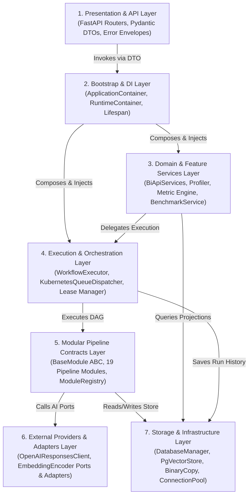
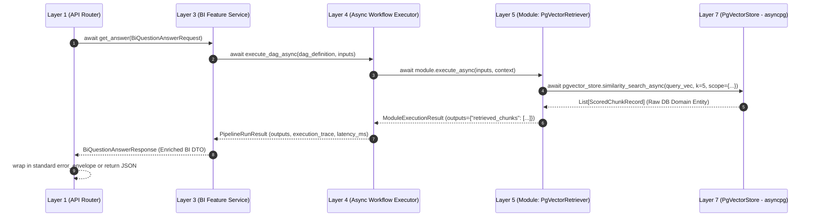

# [BP-102] 백엔드 7단계 계층 설계도 & 인터페이스 결합도
> **Document Code:** `BP-102` | **Category:** System Architecture Blueprint | **Status:** Approved Baseline  
> **Source Directories:** [`backend/api/`](file:///c:/Repos/bist-mini-final/backend/api/), [`backend/bootstrap/`](file:///c:/Repos/bist-mini-final/backend/bootstrap/), [`backend/features/`](file:///c:/Repos/bist-mini-final/backend/features/), [`backend/engine/`](file:///c:/Repos/bist-mini-final/backend/engine/), [`modules/`](file:///c:/Repos/bist-mini-final/modules/), [`backend/providers/`](file:///c:/Repos/bist-mini-final/backend/providers/), [`backend/storage/`](file:///c:/Repos/bist-mini-final/backend/storage/)

---

## 1. 백엔드 7단계 계층 구조도 (7-Layer Architectural Stack)

`bist-mini-final` 백엔드는 클린 아키텍처(Clean Architecture)와 헥사고날(Ports & Adapters) 패턴에 기반하여 다음 7개 명확한 계층으로 수직 분리되어 있습니다.

---

## 2. 계층별 상세 책임 및 파일 매핑 (Layer Responsibilities & File Matrix)

| 레이어 번호 및 계층명 | 주 책임 (Primary Responsibility) | 주요 구성 파일 및 심볼 | 의존성 방향 (Dependencies) |
| :--- | :--- | :--- | :--- |
| **Layer 1: Presentation & API** | • HTTP 라우팅, CORS 및 요청 계측 • 입력 DTO 검증 및 OpenAPI 스키마 생성 • 전역 표준 에러 엔벨로프 매핑 | • [`backend/main.py`](file:///c:/Repos/bist-mini-final/backend/main.py) • [`backend/api/router.py`](file:///c:/Repos/bist-mini-final/backend/api/router.py) • [`backend/api/workflow_routes.py`](file:///c:/Repos/bist-mini-final/backend/api/workflow_routes.py) • [`backend/api/error_mapping.py`](file:///c:/Repos/bist-mini-final/backend/api/error_mapping.py) | Layer 2, Layer 3, Layer 4 (DTO 수준) |
| **Layer 2: Bootstrap & DI** | • 전체 애플리케이션 싱글톤 그래프 조립 • 도메인(Domain)과 인프라(Infra)의 단방향 하향식 의존성 결선 • 서버 기동/종료 수명주기(Lifespan) 관리 • 미완료 분산 큐 복구(`recover_pending_runs`) | • [`backend/bootstrap/container.py`](file:///c:/Repos/bist-mini-final/backend/bootstrap/container.py) • `ApplicationContainer`, `DomainServicesContainer` • `PipelineExecutionEngine`, `InfrastructureContainer` | Layer 3 ~ Layer 7 전체 조립자 |
| **Layer 3: Domain & Features** | • 재무제표 자동 분류 및 40+ 재무비율 계산 도메인 • [예정] AI 금융 챗봇 세션 및 Fast RAG 조율 도메인 • [예정] 다중 기업 크로스 비교 및 듀퐁 분석 도메인 • 파이프라인 품질/정확도 평가 벤치마크 도메인 | • [`backend/features/bi/`](file:///c:/Repos/bist-mini-final/backend/features/bi/) (`catalog.py`, `calculator.py`, `profiler.py`) • `FastRagPipelineAdapter` ([`fast_rag_adapter.py`](file:///c:/Repos/bist-mini-final/backend/features/bi/fast_rag_adapter.py)) • [`backend/features/benchmark/service.py`](file:///c:/Repos/bist-mini-final/backend/features/benchmark/service.py) | Layer 4 (DAG 실행), Layer 7 (저장소) |
| **Layer 4: Execution & Orchestration** | • DAG 위상 정렬 및 순환 참조 방지 • 인메모리 제로 I/O 파이프라인 버스 중계 • KEDA 큐 디스패치 및 워커 Lease 토큰 락 | • [`backend/engine/workflows/executor.py`](file:///c:/Repos/bist-mini-final/backend/engine/workflows/executor.py) • [`backend/engine/workflows/dispatcher.py`](file:///c:/Repos/bist-mini-final/backend/engine/workflows/dispatcher.py) • [`backend/engine/worker/lease.py`](file:///c:/Repos/bist-mini-final/backend/engine/worker/lease.py) | Layer 5 (모듈 실행), Layer 7 (Run 저장) |
| **Layer 5: Modular Contracts** | • `BaseModule` 추상 기반 클래스 계약 준수 • 19개 단품 모듈 (파싱, VLM, 임베딩, 검색, 생성) • 모듈 레지스트리 인트로스펙션 | • [`modules/common/base_module.py`](file:///c:/Repos/bist-mini-final/modules/common/base_module.py) • [`backend/engine/runtime/registry.py`](file:///c:/Repos/bist-mini-final/backend/engine/runtime/registry.py) • [`modules/`](file:///c:/Repos/bist-mini-final/modules/) (19개 모듈) | Layer 6 (AI 클라이언트), Layer 7 (DB) |
| **Layer 6: External Providers** | • OpenAI Responses 클라이언트 (JSON 모드/비전) • 임베딩 포트 인터페이스 (`EmbeddingEncoder`) • OpenAI / BGE 임베딩 어댑터 구현체 | • [`backend/providers/openai_provider.py`](file:///c:/Repos/bist-mini-final/backend/providers/openai_provider.py) • [`backend/providers/openai_responses.py`](file:///c:/Repos/bist-mini-final/backend/providers/openai_responses.py) • [`backend/providers/embeddings/ports.py`](file:///c:/Repos/bist-mini-final/backend/providers/embeddings/ports.py) | 외부 OpenAI API, Local PyTorch 모델 |
| **Layer 7: Storage & Persistence** | • PostgreSQL DDL 초기화 및 스키마 마이그레이션 • pgvector HNSW 임베딩 저장 및 유사도 검색 • 초고속 Binary COPY 프로토콜 파이프라인 • 스레드 안전 커넥션 풀링 | • [`backend/storage/db_manager.py`](file:///c:/Repos/bist-mini-final/backend/storage/db_manager.py) • [`backend/storage/pgvector_store.py`](file:///c:/Repos/bist-mini-final/backend/storage/pgvector_store.py) • [`backend/storage/pgvector_binary_copy.py`](file:///c:/Repos/bist-mini-final/backend/storage/pgvector_binary_copy.py) • [`backend/storage/connection_pool.py`](file:///c:/Repos/bist-mini-final/backend/storage/connection_pool.py) | PostgreSQL 16 + pgvector, 디스크 I/O |

---

## 3. 계층 간 데이터 버스 및 DTO 전파 규칙 (Data Bus & DTO Wire Protocol)

---

## 4. 리팩토링 타깃 및 아키텍처 규칙 (Refactoring Invariants & Debts)

### 불변식 아키텍처 계약 (Architecture Contracts)
- **하향식 의존성 엄수**: 하위 계층(Layer 7, 6, 5)은 상위 계층(Layer 1, 2, 3)을 절대 import할 수 없습니다. (CI에서 `test_architecture_contracts.py`로 검증)
- **전면 비동기 논블로킹 불변식 (Full-Async Invariant)**: FastAPI 이벤트 루프를 블로킹하는 모든 동기 I/O 함수(`time.sleep`, 블로킹 `requests`, 동기 DB 쿼리)를 엄격히 금지합니다. 모든 계층은 `async/await` 논블로킹 계약을 준수해야 합니다.
- **CPU/디스크 I/O 스레드 격리**: `openpyxl.load_workbook` 등 비동기 미지원 고부하 파싱 로직은 반드시 `await asyncio.to_thread(...)`로 메인 루프에서 격리합니다.
- **DB 커넥션 누수 방지**: Layer 7은 항상 비동기 컨텍스트 매니저(`async with get_async_connection():`)를 통해 풀에 반환해야 합니다.

### As-Is 부채 및 To-Be 개선안
1. **전 계층 Full-Async 논블로킹 전환**:
   - As-Is: `BaseModule.execute()` 및 `WorkflowExecutor` 내부가 동기 함수와 `threading.RLock`으로 묶여 있어 고부하 시 이벤트 루프 지연 발생.
   - To-Be: `async def execute_async()` 및 `asyncio.TaskGroup` 기반 네이티브 비동기 스케줄러로 전면 전환하고, `AsyncOpenAI`와 `AsyncConnectionPool` 바인딩.
2. **`features/bi`와 `storage/db_manager` 간의 거대 결합**:
   - As-Is: `backend/features/bi/postgres_store.py`가 25KB에 달하며 직접 동기 SQL을 실행함.
   - To-Be: `BiRepositoryPort` 비동기 인터페이스를 정의하고, `SqlAlchemyBiRepository` 또는 `AsyncPsycopgBiRepository` 어댑터로 격리.
3. **모듈과 스토어의 직접 결합 완화**:
   - As-Is: `PgVectorRetrieverModule`이 `PgVectorStore` 구체 클래스를 직접 주입받음.
   - To-Be: `VectorSearchPort` 비동기 추상 인터페이스를 주입받아 Milvus, Pinecone, pgvector 등 다중 백엔드 교체 가능 구조로 리팩토링.
