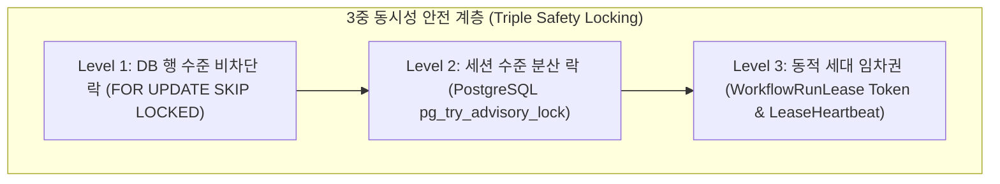
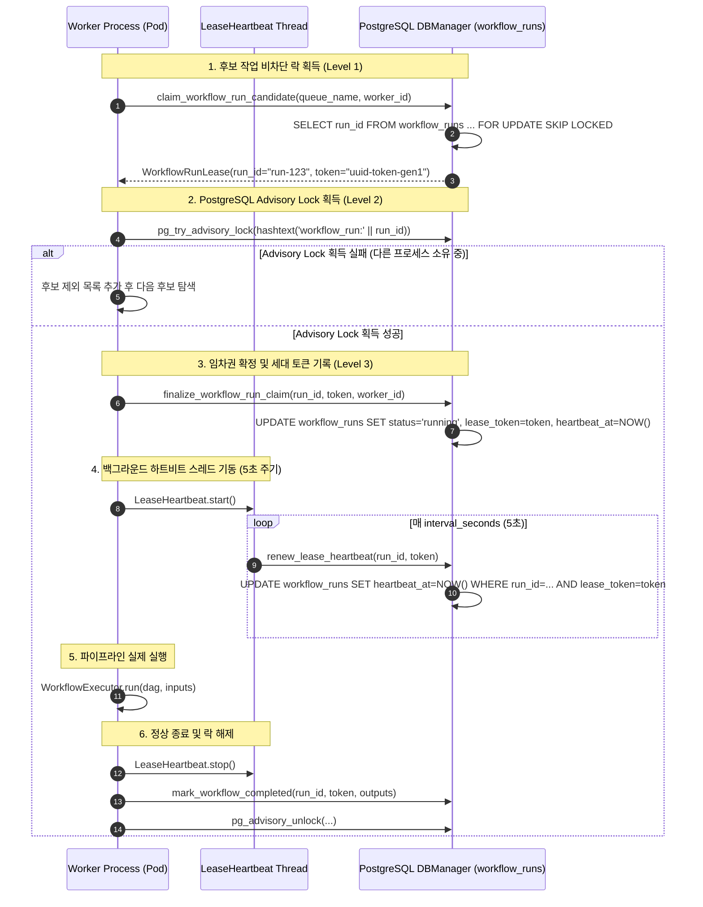
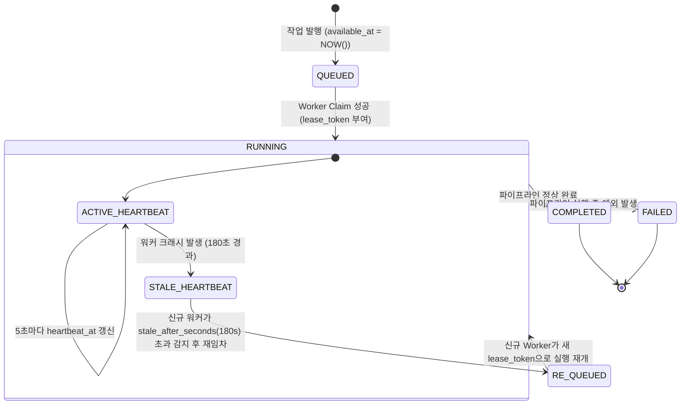

# [BP-103] 분산 락, 임차권(Lease) & 경합 회복 시퀀스
> **Document Code:** `BP-103` | **Category:** Concurrency & Distributed Systems Blueprint | **Status:** Approved Baseline  
> **Source Files:** [`backend/engine/worker/lease.py`](file:///c:/Repos/bist-mini-final/backend/engine/worker/lease.py), [`backend/engine/worker/main.py`](file:///c:/Repos/bist-mini-final/backend/engine/worker/main.py), [`backend/storage/db_manager.py`](file:///c:/Repos/bist-mini-final/backend/storage/db_manager.py)

---

## 1. 분산 동시성 제어 개요 (Concurrency Architecture)

Kubernetes 환경에서 여러 Worker Pod가 동일한 `workflow_runs` 대기열을 병렬로 소비할 때 **중복 실행(Double Execution), 레이스 컨디션(Race Condition), 그리고 워커 비정상 종료(Worker Crash)로 인한 작업 유실/고아(Orphan) 현상**을 방지하기 위해 3중 안전 분산 락킹 프로토콜을 구현합니다.



---

## 2. 작업 임차(Claim) 및 실행 라이프사이클 시퀀스 (Claim & Lease Sequence)



---

## 3. 고아 작업 자동 회복 및 스톨 감지 FSM (Stale Recovery State Machine)

워커 프로세스가 OOM(Out of Memory)이나 Node Eviction으로 즉시 종료되어 정상적인 에러 기록을 남기지 못한 경우, 다음 워커가 스톨된 작업을 감지하여 안전하게 복구합니다.



---

## 4. 핵심 데이터 구조 및 DDL 명세

### `WorkflowRunLease` 구조체
```python
@dataclass(frozen=True)
class WorkflowRunLease:
    run_id: str
    token: str  # 임차권 세대 식별자 (UUID v4)
```

### `workflow_runs` 락킹 관련 핵심 컬럼
| 컬럼명 | 타입 | 제약 조건 및 역할 |
| :--- | :--- | :--- |
| `run_id` | `VARCHAR(64)` | PK, 고유 실행 식별자 |
| `queue_name` | `VARCHAR(64)` | 인덱스 대상 (`workflow-core`, `excel-ingestion`, `bi-materialize`) |
| `worker_id` | `VARCHAR(128)` | 현재 소유 워커 Pod 식별자 (예: `worker-pod-7df89-a1b2`) |
| `lease_token` | `VARCHAR(64)` | 세대 토큰. 이전 세대 토큰의 무단 DB 업데이트 방지 (`WorkflowLeaseLost`) |
| `heartbeat_at` | `TIMESTAMPTZ` | 마지막 생존 신호 타임스탬프 (인덱스: `(queue_name, status, heartbeat_at)`) |
| `cancel_requested`| `BOOLEAN` | 강제 취소 플래그 (True일 경우 하트비트 스레드가 실행 즉각 중단) |

---

## 5. 리팩토링 타깃 및 주의사항 (Refactoring Targets)

1. **Advisory Lock Key 해시 충돌 방지**:
   - As-Is: `hashtext('workflow_run:' || run_id)`로 32비트/64비트 정수 변환. 극단적인 대규모 실행 시 해시 충돌 가능성.
   - To-Be: 64비트 BigInt 해시 함수 또는 네임스페이스 분리형 `pg_advisory_xact_lock(class_id, obj_id)` 사용 권장.
2. **PostgreSQL 커넥션 타임아웃 & 고아 세션**:
   - 하트비트 갱신 실패 시 즉각적인 프로세스 자결(Self-Termination) 회로를 추가하여 Split-Brain 현상 방지.
