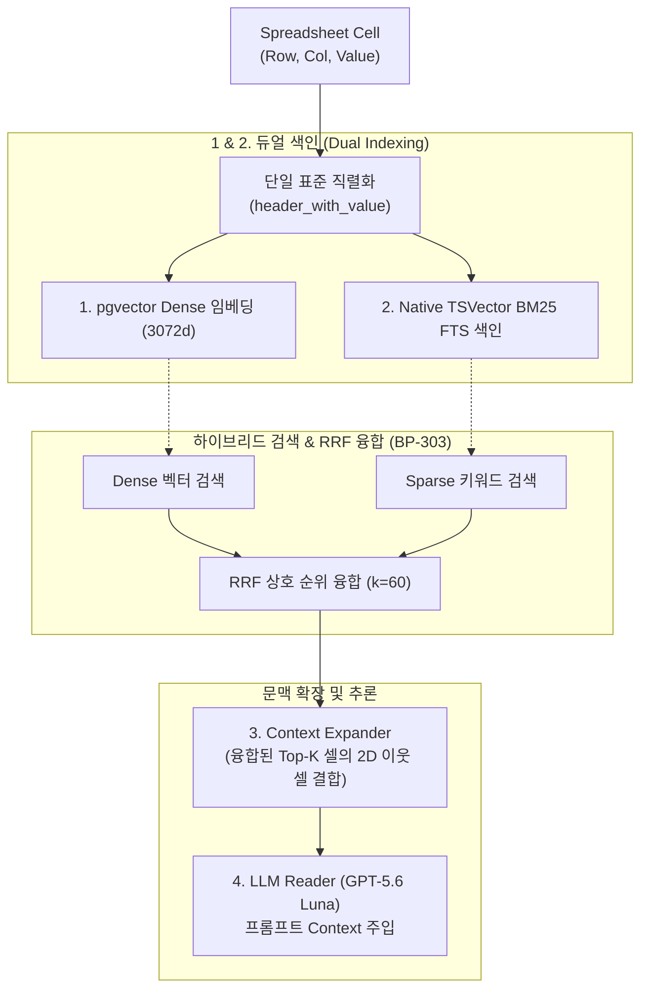

# [BP-201] 2D 그리드 셀 좌표계 파서 & 마크다운 직렬화
> **Document Code:** `BP-201` | **Category:** Data Engine Blueprint | **Status:** Approved Baseline  
> **Source Files:** [`backend/storage/spreadsheets/`](file:///c:/Repos/bist-mini-final/backend/storage/spreadsheets/), [`modules/structure/cell_text_serializer.py`](file:///c:/Repos/bist-mini-final/modules/structure/cell_text_serializer.py)

---

## 1. 2D 스프레드시트 파싱 및 좌표계 정규화 (Coordinate Parsing Engine)

기업 재무 엑셀은 **병합 셀(Merged Cells), 빈 행/열, 숨김 시트(Hidden Sheets), 다층 복합 헤더(Multi-level Headers)**를 포함하고 있어 단순 CSV 형태로는 RAG 색인이 불가능합니다. `bist-mini-final`은 2D 그리드 좌표계를 완벽히 정규화하는 파싱 파이프라인을 갖추고 있습니다.


---

## 2. 병합 셀 브로드캐스팅 및 좌표 정규화 규칙

1. **병합 셀 값 전파 (Merged Cell Broadcast)**:
   - 병합 영역 `A1:C1`에 "재무상태표 (2023)" 값이 있을 때, 실제 데이터 추출 시 `A1`, `B1`, `C1` 전체에 부모 헤더 문맥을 전파하여 검색 시 누락을 방지합니다.
2. **2D 직교 좌표계 표준화 (Zero-Hardcoding)**:
   - `Row Index`: 1-indexed 양의 정수 (예: `1`, `2`, `100`)
   - `Column Index / Letter`: 1-indexed 정수 및 영문 알파벳 좌표 (예: `1` ↔ `A`, `27` ↔ `AA`)
   - **원본 시트명 보존 (Raw Sheet Identity)**:
     - 엑셀마다 `포괄손익계산서(연결)`, `Income Statement`, `3.재무상태표`, `Sheet1` 등 임의의 명칭이 들어오므로, **불안정한 하드코딩 정적 매핑(`손익계산서->IS`)을 전면 배제**합니다.
     - 원본 시트명 문자열(`sheet_name: str`)과 시트 순환 인덱스(`sheet_index: int`)를 단일 진실 원천(SSOT)으로 그대로 보존하며, 표준 재무제표 분류가 필요할 경우 **Luna VLM / LLM 구조 분석기가 시트 내용과 헤더를 종합 분석하여 동적으로 시맨틱 태깅**합니다.

---

## 3. 단일 표준 직렬화 규격 (Canonical Structured Cell Format)

`bist-mini-final`은 입력 패턴의 파편화를 방지하고 토큰 소비를 극소화하기 위해, **인덱싱(Dense/Sparse)부터 LLM 프롬프트 문맥 주입까지 100% 일원화된 단일 표준 포맷(`header_with_value`)만을 사용**합니다.

### 3.1 직렬화 표준 EBNF 문법 (Canonical Grammar)
```text
CanonicalChunk ::= "Company: " CompanyName 
                   " | Sheet: " SheetName 
                   " | Row: " RowHierarchy 
                   " | Col: " ColumnHierarchy 
                   " | Value: " Value 
                   [" | Unit: " UnitName]
```

### 3.2 직렬화 실례
- **입력 셀 좌표**: `삼성전자_2023.xlsx` ➡️ `포괄손익계산서(연결)!C15`
- **감지된 메타데이터**:
  - `Company`: 삼성전자
  - `Sheet`: 포괄손익계산서(연결)
  - `Row Hierarchy`: `[Ⅰ. 영업수익 > 1. 매출총이익 > Ⅴ. 영업이익]`
  - `Col Hierarchy`: `[2023.12 (제 55기)]`
  - `Value`: `6,567,200`
  - `Unit`: `백만원`
- **단일 표준 직렬화 텍스트 (Single Canonical String)**:
  ```text
  Company: 삼성전자 | Sheet: 포괄손익계산서(연결) | Row: [영업수익 > 매출총이익 > 영업이익] | Col: [2023.12 (제 55기)] | Value: 6,567,200 | Unit: 백만원
  ```

---

## 4. 단일화 아키텍처의 이점 및 파이프라인 흐름 (Zero-Fragmentation Architecture)

마크다운 표(`| --- |`) 문법의 파편화된 변형을 배제하고 단일 직렬화 포맷을 고수함으로써 얻는 핵심 이점과 엔드투엔드 데이터 흐름은 다음과 같습니다:



1. **극적인 토큰 효율성 (40~50% Token Saving)**:
   - 마크다운 표 구문(`|`, `---`, 정렬 태그, 빈 셀 공백 등)에 낭비되는 불필요한 토큰을 완전히 제거하여 동일한 컨텍스트 윈도우 안에 **2배 더 많은 핵심 근거 셀**을 주입할 수 있습니다.
2. **입력 패턴 단일화 (Zero Pattern Fragmentation)**:
   - 임베딩 생성 시점, 키워드 색인 시점, RRF 융합 후 LLM에게 전달되는 시점의 텍스트 규격이 100% 동일하므로, 파서 변환 오류가 원천 배제되고 LLM의 Key-Value 파싱 정확도가 극대화됩니다.
3. **Context Expander의 이웃 셀 주입 방식**:
   - 특정 셀이 검색되었을 때, 상하위 계정과목과 시계열 비교 셀들을 각각 단일 라인으로 나열(`\n` 구분)하여 직관적이고 군더더기 없는 완벽한 추론 문맥을 형성합니다:
   ```text
   [Context Block]
   Company: 삼성전자 | Sheet: 포괄손익계산서(연결) | Row: [영업수익 > 매출액] | Col: [2022.12 (제 54기)] | Value: 302,231,360 | Unit: 백만원
   Company: 삼성전자 | Sheet: 포괄손익계산서(연결) | Row: [영업수익 > 매출액] | Col: [2023.12 (제 55기)] | Value: 258,935,494 | Unit: 백만원
   Company: 삼성전자 | Sheet: 포괄손익계산서(연결) | Row: [영업수익 > 매출총이익 > 영업이익] | Col: [2022.12 (제 54기)] | Value: 43,370,290 | Unit: 백만원
   Company: 삼성전자 | Sheet: 포괄손익계산서(연결) | Row: [영업수익 > 매출총이익 > 영업이익] | Col: [2023.12 (제 55기)] | Value: 6,567,200 | Unit: 백만원
   ```

---

## 5. 리팩토링 타깃 (Refactoring Targets)

1. **대용량 시트 메모리 최적화**:
   - As-Is: OpenPyXL 전체 메모리 로드 (`load_workbook(data_only=True)`). 100MB 이상 엑셀에서 메모리 스파이크 발생 가능.
   - To-Be: `read_only=True` 스트리밍 파서 도입 및 청크 단위 이터레이터 패턴 적용.
2. **수식(Formula) 보존 옵션**:
   - `data_only=False`와 `data_only=True`를 듀얼 로드하여 계산된 값과 원본 엑셀 수식(`=SUM(C2:C4)`)을 동시 보존하는 메타데이터 확장.
