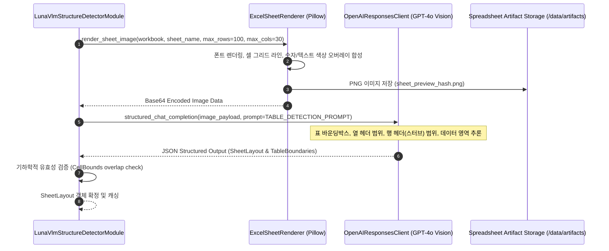
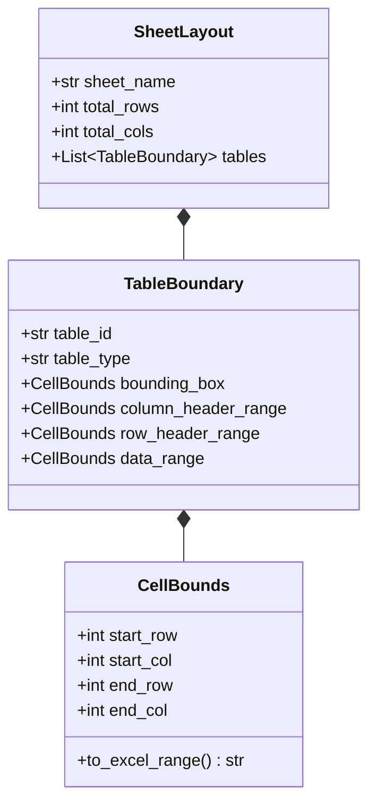

# [BP-202] Luna VLM 이미지 렌더링 & 표 바운딩박스 검출 회로
> **Document Code:** `BP-202` | **Category:** Data Engine & Vision Blueprint | **Status:** Approved Baseline  
> **Source Files:** [`modules/structure/luna_vlm_structure_detector.py`](file:///c:/Repos/bist-mini-final/modules/structure/luna_vlm_structure_detector.py), [`backend/storage/spreadsheets/sheet_renderer.py`](file:///c:/Repos/bist-mini-final/backend/storage/spreadsheets/sheet_renderer.py), [`backend/storage/spreadsheets/cell_type_overlay.py`](file:///c:/Repos/bist-mini-final/backend/storage/spreadsheets/cell_type_overlay.py)

---

## 1. Luna VLM 구조 감지 아키텍처 (Luna VLM Vision Architecture)

엑셀 파일 내의 표는 복잡한 서식, 텍스트 메모, 다중 표 병합 등으로 인해 순수 텍스트 파싱만으로는 표의 경계를 정확히 잡기 어렵습니다. `LunaVlmStructureDetectorModule`은 **시트 래스터라이징(Rasterization)과 GPT-4o Vision 추론**을 결합하여 완벽한 표 바운딩 박스를 도출합니다.

---

## 2. 시각적 오버레이 합성 파이프라인 (Cell Type Visual Overlay)

`ExcelSheetRenderer`는 GPT-4o Vision 모델의 인식 정확도를 극대화하기 위해 셀 데이터 타입별 시각적 힌트를 캔버스에 그립니다:

| 셀 데이터 타입 | 시각적 렌더링 스타일 (Rendering Style) | VLM 인식 보조 효과 |
| :--- | :--- | :--- |
| **Header Text** | 볼드체, 진한 배경색(Dark Slate), 상하 테두리 강조 | 테이블 및 열/행 헤더 영역 즉각 분별 |
| **Numeric Values**| 우측 정렬, 연한 청색 배경 오버레이 | 데이터 매트릭스(Data Region) 자동 영역화 |
| **Merged Cells** | 테두리 박스 및 중심 텍스트 앵커링 | 다층 복합 헤더 트리 계층 관계 복원 |
| **Units & Notes** | 이탤릭체, 작은 폰트(Small Grey) | 테이블 메타데이터(단위: 백만원, 삼일회계법인 등) 격리 |

---

## 3. VLM 출력 스키마 및 바운딩 박스 모델

---

## 4. 프롬프트 엔지니어링 및 예외 복구 (Prompt Guidance & Fallback)

1. **테이블 단일화 가이드라인 (`TABLE_UNIFICATION_GUIDANCE`)**:
   - 빈 행 1~2개로 구분된 인접 블록이라도 계정과목과 기간 축이 동일하면 단일 테이블로 통합 감지하도록 프롬프트 지시.
2. **VLM 타임아웃 / 오류 시 로컬 휴리스틱 폴백**:
   - API 호출 실패 또는 40초 타임아웃 발생 시, `fallback_heuristic_detector`가 작동하여 첫 번째 텍스트 행을 헤더로, 첫 번째 열을 스터브로 자동 추정하여 파이프라인 중단 방지.

---

## 5. 리팩토링 타깃 (Refactoring Targets)

1. **로컬 VLM 경량화 모델 지원 (Local VLM Support)**:
   - As-Is: OpenAI GPT-4o Vision 클라우드 API에 의존.
   - To-Be: `Qwen2-VL-7B` 또는 `PaliGemma-2` 로컬 ONNX/vLLM 추론 어댑터를 추가하여 에어갭(Air-gapped) 보안 환경 지원.
2. **동적 타일링(Dynamic Image Tiling)**:
   - 100행 이상의 거대 시트를 균등 분할 렌더링하고, 바운딩 박스 좌표를 합성하는 Multi-Tile VLM 결합 알고리즘 도입.
