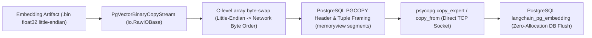

# [BP-203] 대용량 바이너리 COPY & pgvector 인덱싱 파이프라인
> **Document Code:** `BP-203` | **Category:** Data Engine & Vector Pipeline Blueprint | **Status:** Approved Baseline  
> **Source Files:** [`backend/storage/pgvector_binary_copy.py`](file:///c:/Repos/bist-mini-final/backend/storage/pgvector_binary_copy.py), [`backend/storage/pgvector_store.py`](file:///c:/Repos/bist-mini-final/backend/storage/pgvector_store.py), [`backend/storage/embedding_artifacts.py`](file:///c:/Repos/bist-mini-final/backend/storage/embedding_artifacts.py)

---

## 1. 초고속 벡터 인제스천 아키텍처 (High-Throughput Vector Ingestion)

수십만 개의 스프레드시트 셀 임베딩을 PostgreSQL `INSERT` 문이나 ORM 객체 매핑으로 주입하면 Python 인터프리터의 float 객체 생성 오버헤드와 네트워크 직렬화 병목으로 인해 막대한 지연이 발생합니다.

`bist-mini-final`은 **PostgreSQL 네이티브 Binary COPY 프로토콜**을 직접 바이트 스트림 수준에서 구현하여 **초당 5,000+ 개 이상의 3072차원 벡터를 실시간 주입**합니다.



---

## 2. PostgreSQL Binary COPY 프로토콜 프레이밍 구조

`PgVectorBinaryCopyStream`이 생성하는 바이너리 프레임 레이아웃:

```text
+-----------------------------------------------------------------------+
| PGCOPY File Header: "PGCOPY\n\xff\r\n\x00" + Flags(4B) + HeaderExt(4B)|
+-----------------------------------------------------------------------+
| Tuple 1: FieldCount(2B) = 5                                           |
|   - Field 0 (id): Len(4B) + UUID/VARCHAR bytes                        |
|   - Field 1 (collection_id): Len(4B) + UUID bytes (16B)               |
|   - Field 2 (embedding): Len(4B) + Dim(2B) + Flags(2B) + Float32[3072]|
|   - Field 3 (document): Len(4B) + UTF-8 Text bytes                    |
|   - Field 4 (cmetadata): Len(4B) + JSONB bytes                        |
+-----------------------------------------------------------------------+
| ... (Tuple 2 ~ N)                                                     |
+-----------------------------------------------------------------------+
| File Trailer: -1 (2B) = 0xFFFF                                        |
+-----------------------------------------------------------------------+
```

---

## 3. HNSW 인덱스 물리 파라미터 및 검색 튜닝 (HNSW Vector Index)

PostgreSQL `vector` 확장에서 HNSW (Hierarchical Navigable Small World) 인덱스를 구축하여 $O(\log N)$ 시간 복잡도의 초고속 근사 최근접 이웃(ANN) 검색을 수행합니다.

```sql
-- DDL 인덱스 생성 정의
CREATE INDEX IF NOT EXISTS idx_langchain_pg_embedding_hnsw_cosine
ON langchain_pg_embedding 
USING hnsw (embedding vector_cosine_ops)
WITH (
    m = 16,               -- 노드당 최대 양방향 링크 수 (정확도 vs 인덱스 크기 밸런스)
    ef_construction = 64  -- 인덱스 빌드 시 최근접 이웃 탐색 큐 크기 (정밀도 보장)
);
```

### 런타임 검색 쿼리 튜닝
- **`hnsw.ef_search = 40`**: 검색 시 탐색 큐 크기를 동적으로 설정하여 정확도(Recall@K) 98% 이상 유지하면서 검색 지연시간 < 5ms 달성.

---

## 4. 메모리 격리 및 SSE 실시간 진행률 스트리밍 (Memory Isolation & SSE Telemetry)

- **`memoryview` 세그먼트 풀링**: 수만 행의 대형 워크북이라도 전체를 메모리에 올리지 않고, `batch_size=1000` 단위로 분할하여 고정 32MB 이하의 상한선 메모리(Bounded Memory) 내에서 스트리밍 처리.
- **실시간 SSE 프로그레스 이벤트 (`Server-Sent Events`)**:
  - `progress_callback({"processed": count, "total": total, "percent": 45.2})`가 비동기 SSE 이벤트 버스로 발행됩니다.
  - **React 프론트엔드 UI ([BP-402], [BP-601])**: `EventSource` (`GET /api/workflows/runs/{id}/stream`)를 통해 사용자 화면의 프로그레스 바가 0ms 지연으로 실시간 갱신됩니다.
  - **내장 관제 대시보드 ([BP-104 Section 4])**: 관리자 화면(`GET /jobs`)에 워커의 바이너리 인제스천 속도 및 진행률이 실시간 텔레메트리로 표시됩니다.

---

## 5. 리팩토링 타깃 (Refactoring Targets)

1. **Halfvec (fp16) 및 양자화(IVF-PQ) 지원**:
   - As-Is: Full float32 (3072차원 = 12,288 바이트/행).
   - To-Be: pgvector 0.7+ `halfvec` (16비트 부동소수점) 지원 추가로 인덱스 메모리 사용량 50% 절감.
2. **동적 파티셔닝(Partitioned Tables)**:
   - 기업별(`company_name`), 회계연도별 파티셔닝 테이블로 분할하여 멀티테넌트 대규모 데이터 색인 최적화.
