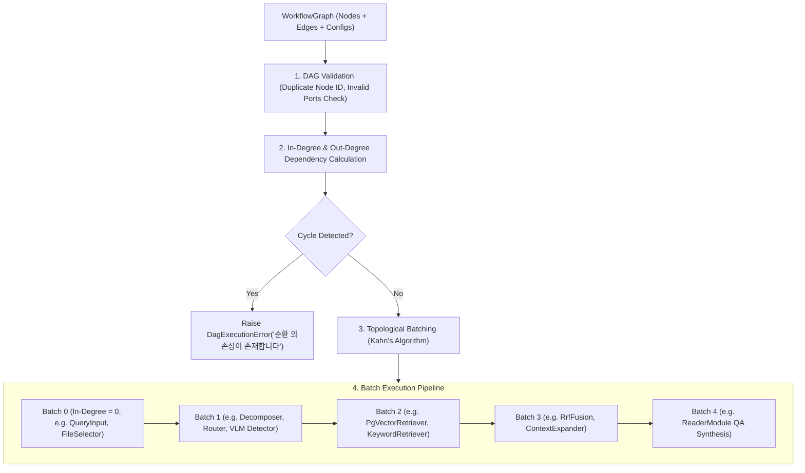
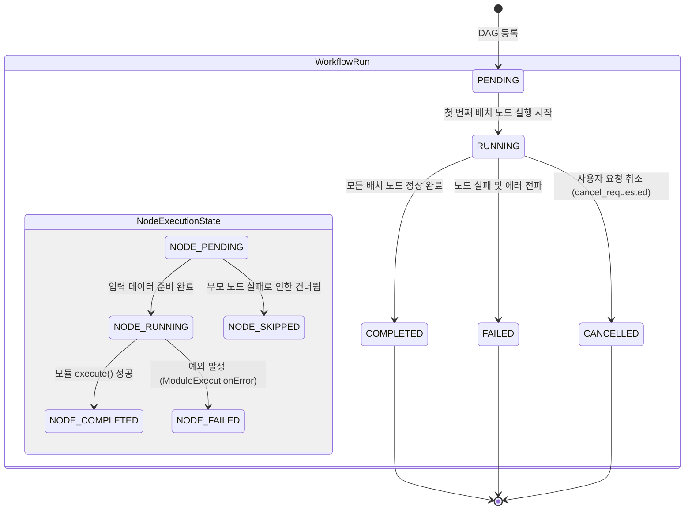

# [BP-301] DAG 토폴로지 실행기 & 상태머신(FSM)
> **Document Code:** `BP-301` | **Category:** Pipeline & Execution Blueprint | **Status:** Approved Baseline  
> **Source Files:** [`backend/engine/workflows/executor.py`](file:///c:/Repos/bist-mini-final/backend/engine/workflows/executor.py), [`backend/engine/workflows/models.py`](file:///c:/Repos/bist-mini-final/backend/engine/workflows/models.py), [`backend/engine/workflows/store.py`](file:///c:/Repos/bist-mini-final/backend/engine/workflows/store.py)

---

## 1. DAG 토폴로지 분석 및 위상 정렬 (DAG Validation & Topological Batches)

`WorkflowExecutor`는 사용자가 구성한 파이프라인 그래프의 유효성을 검증하고, 순환 의존성(Cycle) 유무를 검사한 후 **병렬 실행 가능한 노드 배치(Topological Batches)**로 분할합니다.



---

## 2. 노드 및 워크플로우 FSM 상태 전이표 (FSM State Transitions)



### 상태 전이 이벤트 및 데이터 버스 명세
| 상태 (State) | 트리거 이벤트 | 데이터 버스 동작 및 I/O |
| :--- | :--- | :--- |
| `PENDING` | API 요청 수신 | `RunStore`에 `WorkflowRun` 레코드 생성 (상태: `pending`) |
| `RUNNING` | `execute_batch()` 호출 | 소스 노드의 출력(`node_outputs`)을 타깃 노드의 입력 포트로 결선 |
| `NODE_COMPLETED`| 모듈 반환값 수신 | 결과 캐시(`ResultCache`) 저장 및 SSE 이벤트 발송 (`node_completed`) |
| `NODE_FAILED` | 모듈 예외 발생 | 스택 트레이스 압축 및 에러 엔벨로프 기록, 후속 노드 즉시 중단 |
| `CANCELLED` | `cancel_run()` 수신 | 진행 중인 스레드 중단 시그널 전파 및 리소스 해제 |

---

## 3. 노드 간 데이터 결선 및 핀 매핑 (Data Bus Wiring)

엣지(`WorkflowEdge`)는 소스 노드의 특정 출력 필드와 타깃 노드의 입력 필드를 1:1로 매핑합니다.

```json
{
  "id": "edge_query_to_decomposer",
  "source": "node_query_input",
  "source_handle": "query",
  "target": "node_decomposer",
  "target_handle": "query"
}
```

- **타입 호환성 검증**: 타깃 모듈의 입력 DTO 스키마(Pydantic)와 소스 출력의 필드 타입을 실행 전 정적 검증합니다.

---

## 4. 리팩토링 타깃 (Refactoring Targets)

1. **비동기 asyncio 전면 전환**:
   - As-Is: `WorkflowExecutor` 내부가 멀티스레딩(`RLock`, `ThreadPoolExecutor`) 기반 동기 실행 중심.
   - To-Be: `asyncio.TaskGroup` 기반의 네이티브 비동기 DAG 스케줄러로 리팩토링하여 동시 처리 성능 4배 향상.
2. **조건부 분기(Conditional Branching / Switch Node)**:
   - 라우터 모듈의 결정에 따라 특정 서브그래프만 활성화하고 다른 브랜치를 우아하게 건너뛰는 조건부 엣지(Conditional Edges) 지원.
