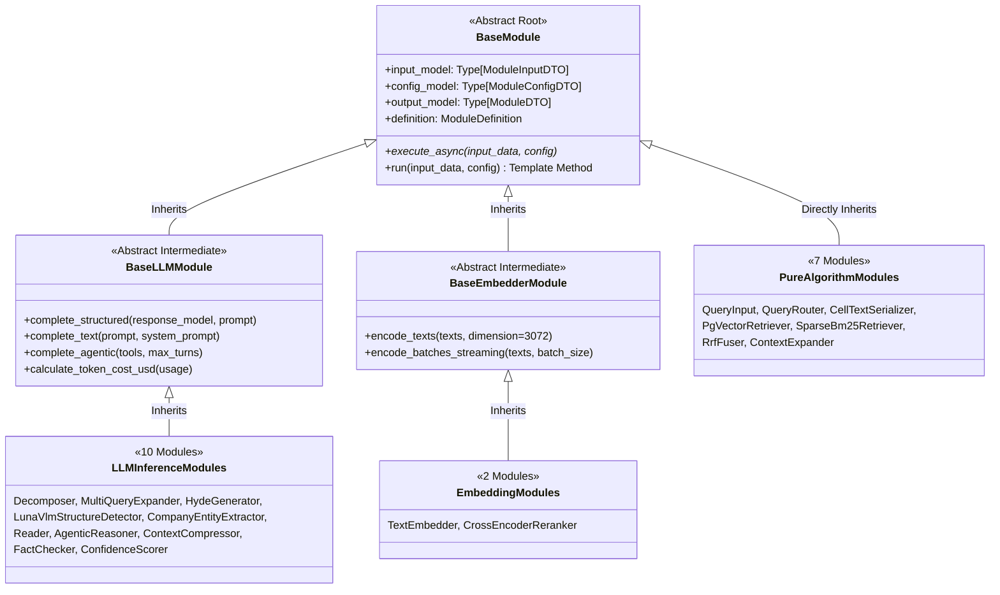

# [BP-302] 19개 모듈 입출력 핀아웃(Pinout) 카탈로그
> **Document Code:** `BP-302` | **Category:** Pipeline & Modular Contracts Blueprint | **Status:** Approved Baseline  
> **Source Directories:** [`modules/`](file:///c:/Repos/bist-mini-final/modules/), [`backend/engine/runtime/registry.py`](file:///c:/Repos/bist-mini-final/backend/engine/runtime/registry.py)

---

## 1. 3단계 클래스 상속 계층 및 종합 핀아웃 규격 (3-Tier Inheritance Architecture)

모든 모듈은 최상위 추상 클래스 [`BaseModule`](file:///c:/Repos/bist-mini-final/modules/common/base_module.py)을 정점으로 하며, LLM 및 임베딩 처리의 보일러플레이트를 단일화하기 위해 **`BaseLLMModule`과 `BaseEmbedderModule` 2대 중간 추상 계층**을 거쳐 19개 구체 모듈로 상속됩니다.

---

### 1.1 19개 파이프라인 모듈 3대 상속 분류 매트릭스

| 상속 부모 클래스 | 모듈 개수 | 소속 모듈 목록 (19개 모듈) | 부모 클래스 제공 핵심 메서드 및 역할 |
| :--- | :---: | :--- | :--- |
| **`BaseLLMModule`** | **10개** | • `query.decomposer` • `query.multi_query_expander` • `query.hyde_generator` • `structure.luna_vlm_structure_detector` • `storage.company_entity_extractor` • `generation.reader` • `generation.agentic_reasoner` • `generation.context_compressor` • `generation.fact_checker` • `generation.confidence_scorer` | • `complete_structured(...)` (1-Shot Pydantic 파싱) • `complete_agentic(...)` (LangChain BaseTool 루프) • 토큰 사용량/비용(USD)/지연시간 자동 집계 |
| **`BaseEmbedderModule`** | **2개** | • `retrieval.text_embedder` • `retrieval.cross_encoder_reranker` | • `encode_texts(...)` (배치 임베딩 & 3072d 검증) • `encode_batches_streaming(...)` (스트리밍 인코딩) |
| **`BaseModule` (직접)** | **7개** | • `query.query_input` • `query.llm_query_router` • `structure.cell_text_serializer` • `retrieval.pgvector_retriever` • `retrieval.sparse_bm25_retriever` • `retrieval.rrf_fuser` • `retrieval.context_expander` | • 비동기 논블로킹 알고리즘/I/O 실행 (`execute_async`) • Pydantic DTO 자동 검증 & 중앙화 예외 가드 |

---

## 2. 모듈별 상세 핀아웃 명세 (Detailed Module Specifications)

### [Group A: 질의 처리 및 라우팅 모듈 (Query & Routing)]

#### 1. `QueryInputModule` (`query.query_input`)
- **역할**: 사용자 자연어 질의 접수 및 기본 파라미터(대상 기업, 기간) 패키징.
- **Input Pins**: `query: str` (필수), `company_name: Optional[str]`, `target_year: Optional[str]`
- **Output Pins**: `query: str`, `company_name: str`, `target_year: str`, `timestamp: str`
- **Config Pins**: `normalize_whitespace: bool = True`

#### 2. `DecomposerModule` (`query.decomposer`)
- **역할**: 복합 재무 질의를 원자적 하위 질의(Sub-queries)로 분해 (예: "삼성전자 2023년 영업이익률은?" -> "2023년 매출액", "2023년 영업이익").
- **Input Pins**: `query: str`
- **Output Pins**: `sub_queries: List[str]`, `reasoning: str`
- **Config Pins**: `model: str = "gpt-5.6-luna"`, `max_sub_queries: int = 4`

#### 3. `LlmQueryRouterModule` (`query.llm_query_router`)
- **역할**: 질의 유형에 따라 직접 검색(Search), BI 수식 계산(Calculation), 메타데이터 조회(Metadata) 경로로 라우팅.
- **Input Pins**: `query: str`, `sub_queries: Optional[List[str]]`
- **Output Pins**: `route_type: Literal["vector_search", "bi_formula", "direct_sql"]`, `confidence: float`
- **Config Pins**: `temperature: float = 0.0`

#### 4. `SemanticQueryMatcherModule` (`query.semantic_query_matcher`)
- **역할**: 기존 질의 캐시 및 사전 계산된 정답지 임베딩과 유사도를 비교하여 Fast-Path 제공.
- **Input Pins**: `query: str`, `query_embedding: List[float]`
- **Output Pins**: `is_matched: bool`, `matched_answer: Optional[str]`, `similarity_score: float`
- **Config Pins**: `threshold: float = 0.95`

---

### [Group B: 임베딩 및 색인 모듈 (Embedding & Indexing)]

#### 5. `EmbedderModule` (`embedding.query_embedder`)
- **역할**: 텍스트 질의를 3072차원 부동소수점 벡터로 변환.
- **Input Pins**: `query: str`
- **Output Pins**: `query_embedding: List[float]`, `dimension: int`
- **Config Pins**: `model: str = "text-embedding-3-large"`

#### 6. `CellTextEmbedderModule` (`embedding.cell_text_embedder`)
- **역할**: 직렬화된 엑셀 셀 청크 리스트를 일괄 배치 임베딩하여 아티팩트 버퍼 생성.
- **Input Pins**: `items: List[StructuredCellItem]`
- **Output Pins**: `embedding_artifact_path: str`, `total_embeddings: int`
- **Config Pins**: `batch_size: int = 512`

#### 7. `PgVectorIndexWriterModule` (`storage.pgvector_index_writer`)
- **역할**: 바이너리 COPY 프로토콜을 통해 임베딩 아티팩트를 pgvector 테이블에 고속 인덱싱.
- **Input Pins**: `embedding_artifact_path: str`, `collection_name: str`
- **Output Pins**: `indexed_count: int`, `collection_uuid: str`, `elapsed_ms: float`
- **Config Pins**: `batch_size: int = 1000`

---

### [Group C: 검색 및 융합 모듈 (Retrieval & Fusion)]

#### 8. `PgVectorDataScopeModule` (`storage.pgvector_data_scope`)
- **역할**: 검색 질의 대상 기업, 시트 코드, 회계연도에 맞추어 pgvector 메타데이터 필터 조건을 생성.
- **Input Pins**: `company_name: Optional[str]`, `sheet_code: Optional[str]`, `year: Optional[str]`
- **Output Pins**: `filter_criteria: Dict[str, Any]`

#### 9. `PgVectorRetrieverModule` (`retrieval.pgvector_retriever`)
- **역할**: 3072차원 HNSW 코사인 유사도 기반 Dense 벡터 검색.
- **Input Pins**: `query_embedding: List[float]`, `filter_criteria: Optional[Dict]`, `top_k: int = 10`
- **Output Pins**: `dense_results: List[RetrievedChunk]`
- **Config Pins**: `top_k: int = 10`, `similarity_threshold: float = 0.5`

#### 10. `PostgresNativeKeywordRetrieverModule` (`retrieval.postgres_native_keyword_retriever`)
- **역할**: PostgreSQL 네이티브 `to_tsquery` 및 GIN 인덱스를 활용한 Sparse BM25 키워드 검색.
- **Input Pins**: `query: str`, `filter_criteria: Optional[Dict]`, `top_k: int = 10`
- **Output Pins**: `sparse_results: List[RetrievedChunk]`
- **Config Pins**: `top_k: int = 10`, `language: str = "simple"`

#### 11. `RrfFusionModule` (`retrieval.rrf_fusion`)
- **역할**: Dense 검색 결과와 Sparse 검색 결과를 Reciprocal Rank Fusion ($k=60$) 공식으로 결합 랭킹.
- **Input Pins**: `dense_results: List[RetrievedChunk]`, `sparse_results: List[RetrievedChunk]`
- **Output Pins**: `fused_results: List[RetrievedChunk]`
- **Config Pins**: `rrf_k: int = 60`, `top_n: int = 10`

#### 12. `PgContextExpanderModule` (`retrieval.context_expander`)
- **역할**: 검색된 단일 셀을 2D 엑셀 그리드 상에서 인접 행/열 및 테이블 전체 마크다운 블록으로 확장.
- **Input Pins**: `fused_results: List[RetrievedChunk]`, `expansion_mode: str = "row_block"`
- **Output Pins**: `expanded_contexts: List[ExpandedContextBlock]`
- **Config Pins**: `window_size: int = 3`, `include_table_headers: bool = True`

---

### [Group D: 추론 및 생성 모듈 (Generation & Reader)]

#### 13. `ReaderModule` (`reader.reader`)
- **역할**: 확장된 재무 표 컨텍스트와 자연어 질의를 결합하여 수식 검증 및 근거 기반 최종 답변 생성.
- **Input Pins**: `query: str`, `contexts: List[ExpandedContextBlock]`
- **Output Pins**: `answer: str`, `reasoning_steps: List[str]`, `cited_cells: List[str]`, `formula_used: Optional[str]`
- **Config Pins**: `model: str = "gpt-5.6-luna"`, `temperature: float = 0.1`

---

### [Group E: 엑셀 전처리 및 비전 모듈 (Spreadsheet & Vision)]

#### 14. `ProcessedFileSelectorModule` (`storage.processed_file_selector`)
- **역할**: 처리 대상 디렉터리 내 유효 엑셀 워크북 목록 발견 및 해시 무결성 검사.
- **Input Pins**: `directory_path: Optional[str]`, `file_pattern: str = "*.xlsx"`
- **Output Pins**: `workbook_list: List[WorkbookMetadata]`

#### 15. `LunaVlmStructureDetectorModule` (`structure.luna_vlm_structure_detector`)
- **역할**: 시트 이미지 렌더링 및 GPT-5.6 Luna 기반 표 바운딩 박스 검출.
- **Input Pins**: `file_name: str`, `workbook_hash: str`, `sheet_names: List[str]`
- **Output Pins**: `tables: List[TableBoundary]`, `sheet_layouts: Dict[str, Any]`
- **Config Pins**: `model: str = "gpt-5.6-luna"`, `max_rows: int = 100`, `max_cols: int = 30`

#### 16. `CellTextSerializerModule` (`structure.cell_text_serializer`)
- **역할**: 감지된 표 기하학과 2D 그리드 셀 값을 결합하여 대칭적 검색 청크 텍스트 생성.
- **Input Pins**: `file_name: str`, `workbook_hash: str`, `tables: List[TableBoundary]`
- **Output Pins**: `items: List[StructuredCellItem]`, `total_cells: int`
- **Config Pins**: `mode: str = "header_with_value"`

#### 17. `CompanyEntityExtractorModule` (`storage.company_entity_extractor`)
- **역할**: 파일명, 시트 제목, 첫 페이지 텍스트로부터 기업명(종목명), 티커, 회계연도 엔티티 추출.
- **Input Pins**: `file_name: str`, `workbook_hash: str`
- **Output Pins**: `company_name: str`, `ticker: Optional[str]`, `fiscal_year: str`

#### 18. `SheetMetadataPersistenceModule` (`storage.sheet_metadata_persistence`)
- **역할**: 파싱된 시트 레이아웃, 셀 수, 테이블 경계 메타데이터를 PostgreSQL `sheets` 테이블에 영속화.
- **Input Pins**: `file_id: str`, `sheet_layouts: Dict[str, Any]`
- **Output Pins**: `persisted_sheet_ids: List[str]`

#### 19. `QaExampleLoaderModule` (`storage.qa_example_loader`)
- **역할**: 벤치마크 평가용 Ground-Truth Q&A 데이터셋 로드.
- **Input Pins**: `dataset_path: str`
- **Output Pins**: `qa_examples: List[QaExample]`

---

## 3. 리팩토링 타깃 (Refactoring Targets)

1. **Pydantic v2 제네릭 포트 규격화**:
   - As-Is: 각 모듈의 input/output이 개별 클래스로 분산 정의됨.
   - To-Be: `BaseModule[TInput, TOutput, TConfig]` 제네릭 타입 파라미터 적용으로 타입 체커(`pyright`) 정적 분석 완벽 지원.
2. **동적 플러그인 로더(Dynamic Plugin Loader)**:
   - 신규 모듈을 `modules/` 디렉터리에 추가할 때 `registry.py`를 수동 수정하지 않고 데코레이터(`@register_module`) 기반으로 자동 스캔 및 로드되도록 개편.
