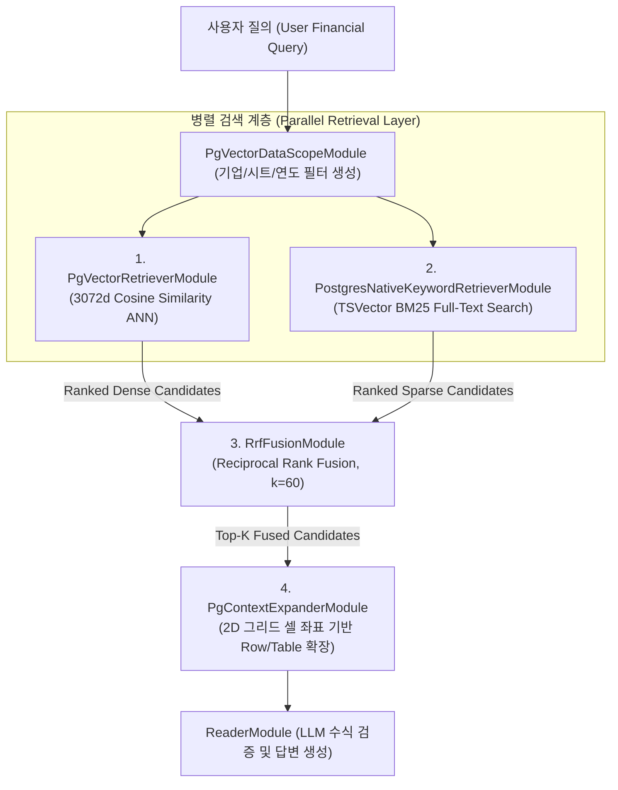
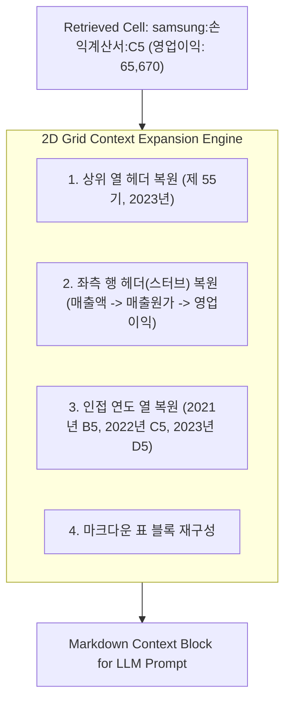

# [BP-303] Dense + Sparse + RRF 융합 & 셀 확장 회로
> **Document Code:** `BP-303` | **Category:** Retrieval & Fusion Blueprint | **Status:** Approved Baseline  
> **Source Files:** [`modules/retrieval/pgvector_retriever.py`](file:///c:/Repos/bist-mini-final/modules/retrieval/pgvector_retriever.py), [`modules/retrieval/postgres_native_keyword_retriever.py`](file:///c:/Repos/bist-mini-final/modules/retrieval/postgres_native_keyword_retriever.py), [`modules/retrieval/rrf_fusion.py`](file:///c:/Repos/bist-mini-final/modules/retrieval/rrf_fusion.py), [`modules/retrieval/context_expander.py`](file:///c:/Repos/bist-mini-final/modules/retrieval/context_expander.py)

---

## 1. 하이브리드 검색 및 융합 파이프라인 구조 (Hybrid Retrieval Flow)

재무 엑셀 데이터는 "영업이익", "당기순손익"과 같은 **정확한 용어 일치(Exact Term Match)**와 "작년 장사해서 번 돈", "회사 부채 규모"와 같은 **자연어 의미론적 질의(Semantic Query)**를 동시에 처리해야 합니다.

`bist-mini-final`은 pgvector Dense 벡터 검색과 PostgreSQL TSVector BM25 키워드 검색을 병렬 수행한 후 **RRF (Reciprocal Rank Fusion)**로 순위를 융합하고, 검색된 셀을 2D 테이블 문맥으로 확장합니다.



---

## 2. RRF (Reciprocal Rank Fusion) 수학적 공식

$$
\text{RRF Score}(d) = \sum_{m \in \{\text{Dense}, \text{BM25}\}} \frac{1}{k + r_m(d)}
$$

- $d$: 평가 대상 엑셀 셀 청크 (Candidate Cell Chunk)
- $m$: 검색 모델 채널 (Dense pgvector 또는 Sparse PostgreSQL FTS)
- $r_m(d)$: 해당 검색 모델 $m$ 내에서의 순위 (1-indexed Rank)
- $k$: 랭킹 스무딩 상수 (**기본값: $60$**)

### RRF 결합 효과 예시
- **사례 1 (Dense 1위, Sparse 5위)**: $\frac{1}{60 + 1} + \frac{1}{60 + 5} = 0.01639 + 0.01538 = 0.03177$ -> **최상위 승격**
- **사례 2 (Dense 단독 1위, Sparse 미검색)**: $\frac{1}{60 + 1} + 0 = 0.01639$
- **사례 3 (양쪽 모두 1위)**: $\frac{1}{60+1} + \frac{1}{60+1} = 0.03278$ -> **절대적 1위 확정**

---

## 3. 기하학적 2D 셀 컨텍스트 확장 회로 (`PgContextExpanderModule`)

단일 셀($C5$) 하나만으로는 해당 수치가 매출액인지 감가상각비인지, 직전 연도 대비 증감률이 얼마인지 LLM이 파악할 수 없습니다. 따라서 검색된 좌표를 기준으로 2D 영역을 복원합니다.



### 생성된 확장 마크다운 블록 예시
```markdown
### [손익계산서] 표 1: 포괄손익계산서 (단위: 백만원)
| 계정과목 | 2021 (제 53기) | 2022 (제 54기) | 2023 (제 55기) |
| :--- | :--- | :--- | :--- |
| I. 매출액 | 279,604,799 | 302,231,360 | 258,935,494 |
| II. 매출원가 | 166,411,192 | 190,041,129 | 180,388,542 |
| **III. 영업이익** | **51,633,856** | **43,376,630** | **6,566,976** |
```

---

## 4. 리팩토링 타깃 (Refactoring Targets)

1. **Cross-Encoder Re-ranker 도입**:
   - RRF 융합 후 상위 30개 후보에 대해 `bge-reranker-large` 또는 `Cohere Re-rank` 로컬 모델을 추가하여 의미론적 적합도 재검증.
2. **동적 윈도우 크기(Adaptive Window Sizing)**:
   - 고정된 $\pm 3$행 확장이 아닌, Luna VLM이 감지한 `data_range` 경계 내에서만 스마트하게 확장하여 토큰 낭비 방지.
