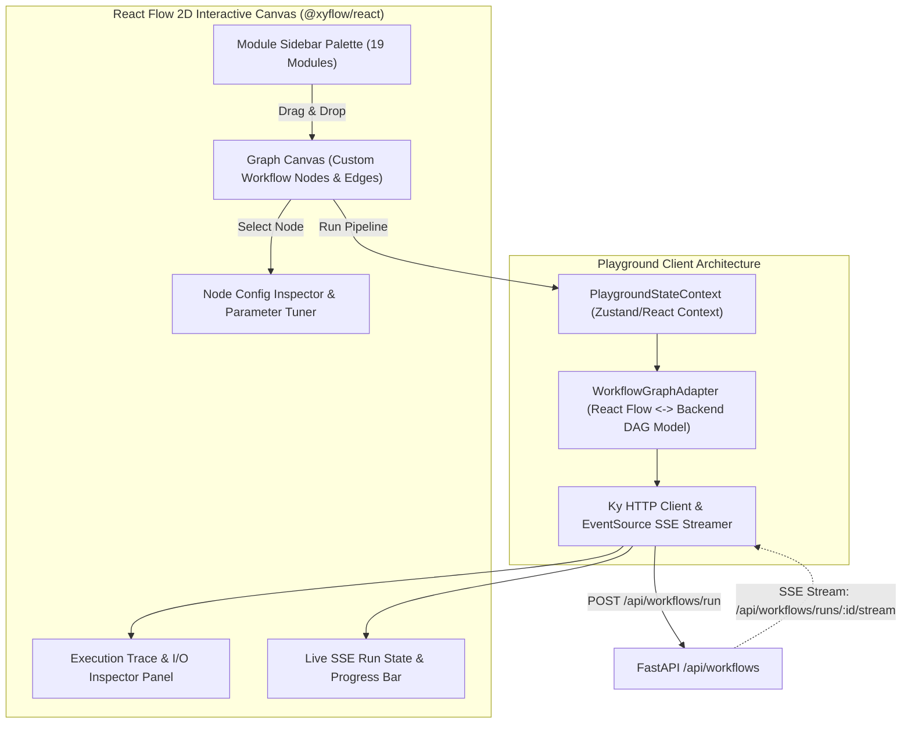
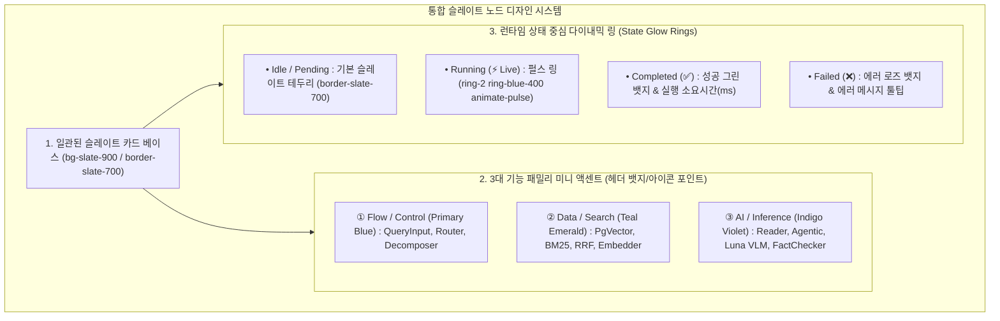

# [BP-401] [구현됨] Pipeline Playground 워크스페이스
> **Document Code:** `BP-401` | **Category:** Workspace Blueprint | **Status:** Implemented & Operational  
> **Source Directories:** [`frontend/src/features/playground/`](file:///c:/Repos/bist-mini-final/frontend/src/features/playground/), [`frontend/src/pages/PlaygroundPage.tsx`](file:///c:/Repos/bist-mini-final/frontend/src/pages/PlaygroundPage.tsx), [`backend/api/workflow_routes.py`](file:///c:/Repos/bist-mini-final/backend/api/workflow_routes.py)

---

## 1. 워크스페이스 개요 및 UI 결선도 (Workspace Overview)

**Pipeline Playground**는 개발자 및 연구자가 19개의 파이프라인 모듈을 시각적 2D 노드 그래프(React Flow) 상에서 자유롭게 배치하고 핀을 결선하여, 대기열(Queue) 지연 없이 **오직 Tier 1 비동기 논블로킹 인메모리 제로 I/O 엔진(`WorkflowExecutor`)을 통해 즉각적인 피드백을 얻는 고속 실험실(Interactive Laboratory / Sandbox)** 워크스페이스입니다.

---

## 2. React Flow 커스텀 노드 디자인 시스템 (Unified Slate & 3-Family Design System)

기존 6가지 무지개색으로 인한 시각적 피로도와 디자인 불일치(Visual Fragmentation)를 해소하기 위해, **통합 뉴트럴 슬레이트 베이스(Unified Slate Base) + 3대 기능 패밀리 미니멀 액센트 + 상태 중심 다이내믹 링(Dynamic State Glow)** 체계로 통일합니다.

---

### 2.1 3대 기능 패밀리 및 핀아웃 매트릭스

모든 노드는 동일한 프리미엄 슬레이트 카드로 렌더링되며, 상단 헤더의 **정제된 미니 뱃지 색상**으로만 역할을 깔끔하게 구분합니다:

| 기능 패밀리 | 액센트 톤 (Accent) | 소속 모듈 (19개 모듈군) | 핸들 구성 (Handles) |
| :--- | :--- | :--- | :--- |
| **① Flow & Control** (입력 & 흐름 제어) | `Primary Blue` (`#3B82F6`) | • `QueryInput` • `LlmQueryRouter` • `Decomposer` • `MultiQueryExpander` | • Target: 0~1개 (Query) • Source: 1~3개 (Branch Edges) |
| **② Data & Search** (데이터 인덱싱 & 검색) | `Teal Emerald` (`#10B981`) | • `TextEmbedder` • `CellTextSerializer` • `PgVectorRetriever` • `SparseBm25Retriever` • `RrfFuser` • `ContextExpander` | • Target: 1~2개 (Vector / Chunks) • Source: 1개 (Fused Context) |
| **③ AI & Inference** (VLM 및 LLM 추론) | `Indigo Violet` (`#6366F1`) | • `LunaVlmStructureDetector` • `CompanyEntityExtractor` • `ReaderModule` • `AgenticReasoner` • `ContextCompressor` • `FactChecker` • `ConfidenceScorer` | • Target: 1~2개 (Query + Context) • Source: 1개 (Structured Output) |

---

## 3. 실시간 실행 스트림 및 상태 동기화 프로토콜

1. 사용자가 **"파이프라인 실행"** 버튼을 클릭하면 `WorkflowGraphAdapter`가 React Flow 노드/엣지 객체를 백엔드 `WorkflowGraph` JSON으로 변환하여 전송합니다.
2. 백엔드로부터 `run_id`를 수신하면 `EventSource`를 열어 `/api/workflows/runs/{run_id}/stream`에 연결합니다.
3. 수신되는 이벤트(`node_started`, `node_completed`, `node_failed`)에 따라 해당 노드의 테두리에 실시간 로딩 스피너 및 성공/실패 뱃지가 표시됩니다.
4. 노드를 클릭하면 해당 노드의 입력 데이터, 출력 데이터, 실행 소요 시간(ms), 토큰 사용량이 `TracePanel`에 즉시 렌더링됩니다.

---

## 4. 리팩토링 타깃 (Refactoring Targets)

1. **`playground.css` 모듈화**:
   - As-Is: `playground.css` 파일이 80KB에 달하는 단일 거대 CSS 파일로 존재.
   - To-Be: 컴포넌트별 CSS Modules 또는 Tailwind CSS v4 유틸리티 클래스로 분할 리팩토링.
2. **템플릿 프리셋 갤러리**:
   - "기본 하이브리드 RAG", "VLM 엑셀 인덱싱 파이프라인", "재무 비율 직접 계산" 등 사전 정의된 원클릭 DAG 프리셋 로더 추가.
3. **노드 설정 인스펙터 & 파라미터 튜너 패널 활성화 (`NodeConfigInspector`)**:
   - **As-Is**: 노드 클릭 시 실행 트레이스 패널(`TracePanel`)만 연동되고, 모듈의 런타임 설정 파라미터(`ModuleConfigDTO`, 예: `model`, `top_k`, `temperature`)를 직접 수정할 수 있는 `NodeConfigInspector` 사이드 패널이 열리지 않음.
   - **To-Be**: 노드 선택 시 백엔드 `GET /api/modules/{module_type}/schema`로부터 Pydantic Config JSON Schema를 동적으로 조회하여 폼 컨트롤러를 자동 렌더링하고 실시간 파라미터 오버라이드 및 노드 상태에 즉시 반영.
