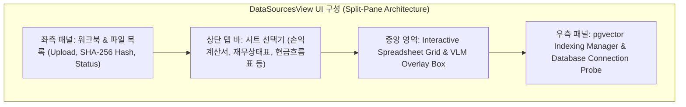
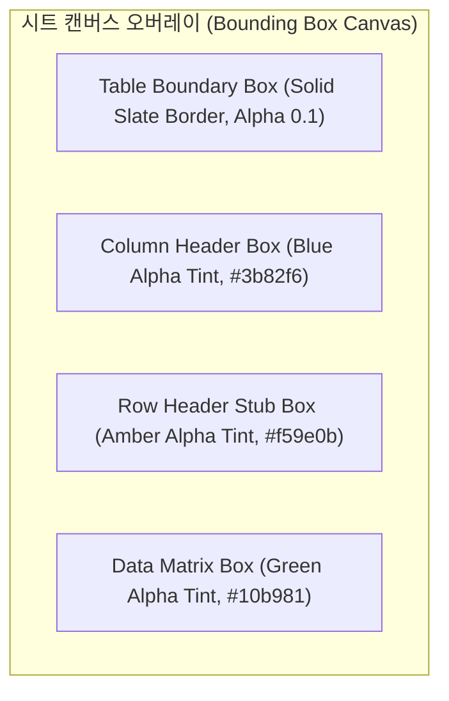

# [BP-402] [구현됨] Data Sources Management 워크스페이스
> **Document Code:** `BP-402` | **Category:** Workspace Blueprint | **Status:** Implemented & Operational  
> **Source Directories:** [`frontend/src/features/data-sources/`](file:///c:/Repos/bist-mini-final/frontend/src/features/data-sources/), [`frontend/src/pages/DataSourcesPage.tsx`](file:///c:/Repos/bist-mini-final/frontend/src/pages/DataSourcesPage.tsx), [`backend/api/data_source_routes.py`](file:///c:/Repos/bist-mini-final/backend/api/data_source_routes.py)

---

## 1. 워크스페이스 개요 및 UI 구성 (Workspace Overview)

**Data Sources Management**는 엑셀 파일 업로드, 시트별 가시성 확인, Luna VLM 구조 감지 결과(바운딩 박스) 시각적 검증, 2D 셀 데이터 그리드 뷰어, 그리고 pgvector 인덱스 생성 및 상태 프로브를 수행하는 종합 데이터 엔지니어링 워크스페이스입니다.

---

## 2. Luna VLM 시각적 바운딩 박스 오버레이 (VLM Overlay Rendering)

감지된 표 기하학(`TableBoundary`)을 원본 스프레드시트 캔버스 위에 CSS 하이라이트 박스로 렌더링합니다:

- **상호작용 기능**: 사용자가 특정 테이블 경계 박스를 클릭하면 해당 테이블의 메타데이터(행 수, 열 수, 헤더 트리 계층)가 인스펙터에 표시되며, 오인식된 영역을 수동으로 보정할 수 있습니다.

---

## 3. 원클릭 인덱싱 및 pgvector 헬스 프로브 파이프라인

1. 사용자가 워크북 선택 후 **"pgvector 색인 생성"** 버튼 클릭.
2. 백엔드 `POST /api/data-sources/ingest` 호출 -> Luna VLM 감지 -> 직렬화 -> 임베딩 -> Binary COPY 일괄 실행.
3. **Database Connection Probe**: 우측 상단 인디케이터가 PostgreSQL 및 pgvector 확장의 정상 가동 여부(`SELECT 1`, `vector_cosine_ops` 인덱스 상태)를 3초 주기로 폴링하여 표시.

---

## 4. 리팩토링 타깃 (Refactoring Targets)

1. **가상 스크롤(Virtual Scrolling) 그리드**:
   - As-Is: 1,000행 이상의 거대 시트 렌더링 시 DOM 노드 과다로 프레임 드롭 발생.
   - To-Be: `@tanstack/react-virtual`을 도입하여 뷰포트 내 가시 셀만 렌더링하는 가상화 그리드 적용.
2. **수동 바운딩 박스 드래그 편집기**:
   - VLM이 감지하지 못한 특수 레이아웃을 사용자가 마우스 드래그로 직접 영역 지정(Draw Bounding Box)할 수 있는 UI 툴킷 추가.
