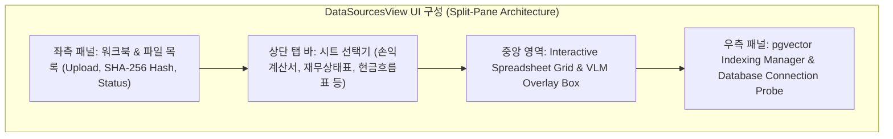
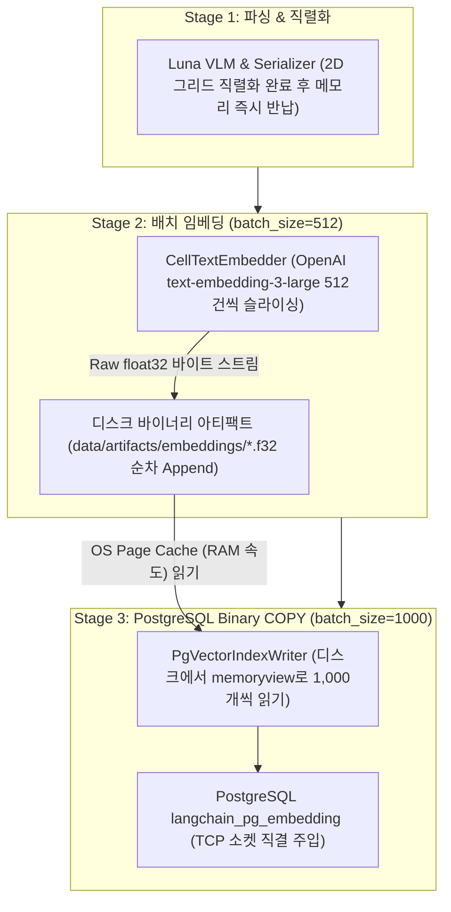
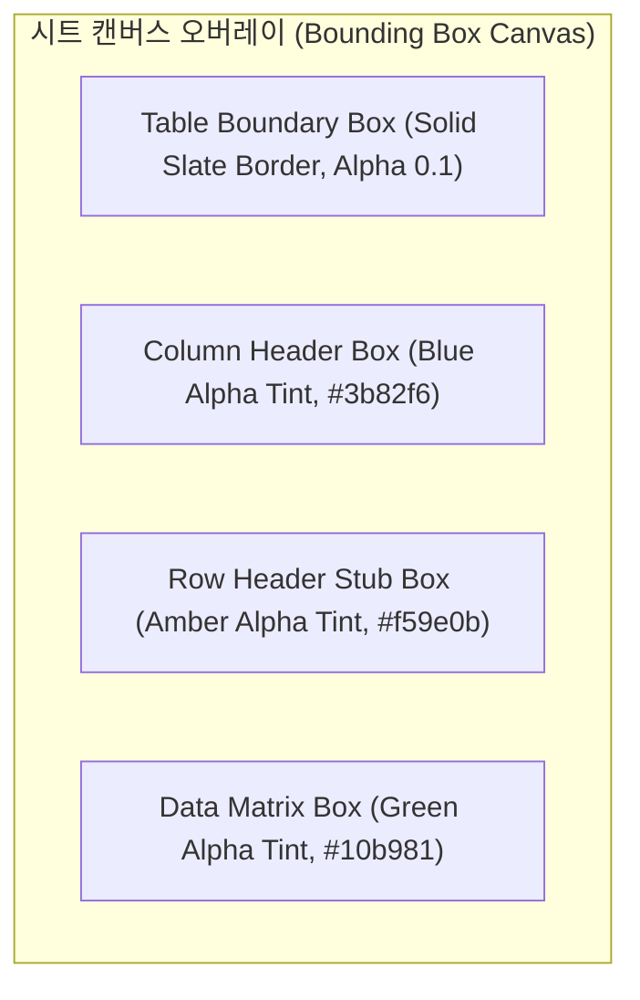
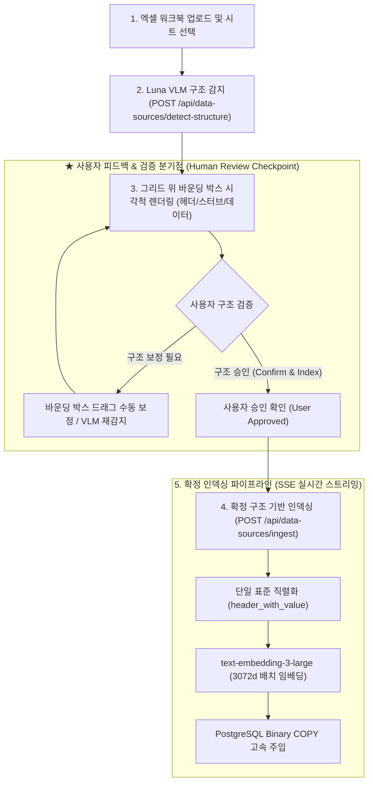

# [BP-402] [구현됨] Data Sources Management 워크스페이스
> **Document Code:** `BP-402` | **Category:** Workspace Blueprint | **Status:** Implemented & Operational  
> **Source Directories:** [`frontend/src/features/data-sources/`](file:///c:/Repos/bist-mini-final/frontend/src/features/data-sources/), [`frontend/src/pages/DataSourcesPage.tsx`](file:///c:/Repos/bist-mini-final/frontend/src/pages/DataSourcesPage.tsx), [`backend/api/data_source_routes.py`](file:///c:/Repos/bist-mini-final/backend/api/data_source_routes.py)

---

## 1. 워크스페이스 개요 및 UI 구성 (Workspace Overview)

**Data Sources Management**는 엑셀 파일 업로드, 시트별 가시성 확인, Luna VLM 구조 감지 결과(바운딩 박스) 시각적 검증, 2D 셀 데이터 그리드 뷰어, 그리고 pgvector 인덱스 생성 및 상태 프로브를 수행하는 종합 데이터 엔지니어링 워크스페이스입니다.

---

### 1.1 원자적 파이프라인 모듈과 백엔드 인프라의 결합 구조 (Module Composition)

`Data Sources Management`는 독립적인 **Layer 5 원자적 모듈 4종과 Layer 7 백엔드 스토리지 커넥션을 유기적으로 조합**하여 엔드투엔드 엑셀 인제스천 파이프라인을 완성합니다:

| 계층 | 구성 요소 / 파일 경로 | 역할 및 협력 방식 |
| :--- | :--- | :--- |
| **Layer 5 (원자적 모듈군)** | `structure.luna_vlm_structure_detector` ([`luna_vlm_structure_detector.py`](file:///c:/Repos/bist-mini-final/modules/structure/luna_vlm_structure_detector.py)) | • 엑셀 시트 이미지를 래스터라이징하여 GPT-5.6 Luna VLM으로 전송 • 표 경계(`TableBoundary`), 열 헤더, 행 스터브, 데이터 매트릭스 기하학 감지 |
| | `structure.cell_text_serializer` ([`cell_text_serializer.py`](file:///c:/Repos/bist-mini-final/modules/structure/cell_text_serializer.py)) | • 감지된 2D 좌표계를 단일 표준 규격(`header_with_value`) 텍스트 라인으로 직렬화 |
| | `retrieval.text_embedder` ([`text_embedder.py`](file:///c:/Repos/bist-mini-final/modules/retrieval/text_embedder.py)) | • 직렬화된 셀 텍스트를 `text-embedding-3-large`를 통해 **3072차원 고밀도 벡터**로 배치 임베딩 |
| | `storage.pgvector_index_writer` ([`BP-302 Module 7`](file:///c:/Repos/bist-mini-final/docs/03_pipeline_module_blueprints/BP-302_19_modules_pinout_catalog.md#7-pgvectorindexwritermodule-storagepgvector_index_writer)) | • **[Layer 5 모듈화]** 임베딩 벡터와 메타데이터를 Layer 7 Binary COPY 엔진을 통해 PostgreSQL `langchain_pg_embedding` 테이블로 초고속 벌크 주입 |
| **Layer 7 (스토리지 인프라)** | `backend/storage/db_manager.py` `backend/storage/connection_pool.py` | • PostgreSQL 커넥션 풀링 및 HNSW 인덱스 상태 헬스 프로브(`GET /api/data-sources/probe`) |

---

### 1.2 Bounded-Memory 바이너리 스트리밍 & I/O 무병목 아키텍처 (Zero I/O Bottleneck Mechanics)

수십만 셀 규모의 대형 재무 엑셀을 인덱싱할 때 시스템 메모리 폭발(OOM)과 I/O 병목을 원천 방지하기 위해 **단계별 순차 활성화(Stage-by-Stage) + Raw Float32 바이너리 아티팩트 + OS 페이지 캐시(Page Cache) 가속** 메커니즘을 적용합니다:

#### 4대 고성능·안전성 핵심 원리
1. **OS 페이지 캐시(Page Cache) 가속 (RAM 속도 동작)**:
   - 디스크 아티팩트(`.f32`)는 순차 쓰기/읽기(Sequential I/O)로 기록되므로, 운영체제(OS) 커널의 Page Cache(RAM)에서 즉시 처리됩니다.
   - 10,000개 벡터(약 120MB) 처리 시 **디스크 바이너리 I/O 시간은 단 24ms(0.024초)**로 전체 파이프라인 시간(수 초)의 1% 미만이며 병목이 전혀 발생하지 않습니다.
2. **바이너리 제로 직렬화 (Zero-Serialization Overhead)**:
   - JSON 텍스트 대신 Raw `float32` 바이너리(3072d 1개 벡터 = 정확히 12KB)를 사용하므로, 문자열 포매팅 및 float 변환에 따른 CPU 연산 오버헤드가 0초입니다.
3. **메모리 상한선 격리 (Bounded-Memory $\le$ 32MB)**:
   - 모든 모듈이 동시에 켜져 메모리를 중첩 점유하지 않고, 앞 단계 완료 시 메모리를 즉시 반납(GC)하여 서버 메모리 사용량을 32MB 이하로 완벽히 격리합니다.
4. **장애 복구성 및 제로 비용 재시도 (Fault Tolerance & Zero-Cost Retry)**:
   - DB 적재 중 네트워크 장애가 발생하더라도 이미 생성된 디스크 아티팩트(`artifact_id`)가 온전히 보존되므로, 비싼 외부 임베딩 API를 재결제하지 않고 **DB 적재만 즉시 0원 비용으로 재개(`Cache Hit`)**합니다.

---

## 2. Luna VLM 시각적 바운딩 박스 오버레이 (VLM Overlay Rendering)

감지된 표 기하학(`TableBoundary`)을 원본 스프레드시트 캔버스 위에 CSS 하이라이트 박스로 렌더링합니다:

- **상호작용 기능**: 사용자가 특정 테이블 경계 박스를 클릭하면 해당 테이블의 메타데이터(행 수, 열 수, 헤더 트리 계층)가 인스펙터에 표시되며, 오인식된 영역을 수동으로 보정할 수 있습니다.

---

## 3. 2단계 인제스천 & 사용자 피드백 분기점 (Two-Stage Ingestion & Review Checkpoint)

VLM의 잘못된 구조 인식이 벡터 스토어로 전파되는 것을 원천 차단하기 위해, 일괄 자동 실행 대신 **VLM 감지 후 사용자의 시각적 검증 및 승인을 거쳐 인덱싱을 진행하는 휴먼인더루프(Human-in-the-Loop) 분기점**을 적용합니다.

---

### 3.1 단계별 실행 및 피드백 프로토콜

1. **Stage 1 (VLM 구조 감지 및 프리뷰)**:
   - 사용자가 워크북 시트를 선택하면 `POST /api/data-sources/detect-structure`를 호출하여 Luna VLM이 표 경계(`TableBoundary`), 열 헤더, 행 스터브를 감지하고 캔버스에 색상별 오버레이 박스를 렌더링합니다.
2. **중간 검증 분기점 (Human-in-the-Loop Review & Approval)**:
   - 사용자는 캔버스에서 감지된 헤더 계층 구조와 데이터 셀 영역을 시각적으로 확인합니다.
   - 오인식된 영역이 있을 경우 사용자가 직접 영역을 마우스로 보정할 수 있으며, 구조가 정확할 때만 **"구조 확정 및 색인 시작"** 버튼을 클릭합니다.
3. **Stage 2 (확정 구조 기반 벡터 인덱싱)**:
   - 사용자가 승인한 확정 좌표계를 바탕으로 `POST /api/data-sources/ingest`를 호출하여 직렬화 ➡️ 3072d 임베딩 ➡️ PostgreSQL Binary COPY 주입을 실행하며, SSE(`event: progress`)를 통해 진행률을 실시간 수신합니다.
4. **Database Connection Probe**:
   - 우측 상단 인디케이터가 페이지 진입(Mount) 시 `GET /api/data-sources/probe`를 단 1회 호출하여 PostgreSQL 및 pgvector 정상 가동 여부를 확인 및 표시합니다 (주기적 폴링 없음, 필요 시 새로고침 버튼으로 1회 수동 재조회).

---

## 4. 리팩토링 타깃 (Refactoring Targets)

1. **레거시 multi-row INSERT 코드 완전 삭제 (Zero Legacy Code Policy)**:
   - As-Is: `PgVectorIndexWriterModule` 및 `pgvector_store.py` 내부에 과거 청크 단위 multi-row `INSERT INTO ... VALUES (...)` 로직 잔존.
   - To-Be: 이전의 모든 `INSERT` SQL 포매팅 및 일반 적재 코드를 100% 완전 삭제하고, 오직 **Binary COPY 단일 스트리밍 경로(Single Canonical Path)**로만 일원화하여 유지보수 부채 및 레거시 버그 발생 원천 차단.
2. **가상 스크롤(Virtual Scrolling) 그리드**:
   - As-Is: 1,000행 이상의 거대 시트 렌더링 시 DOM 노드 과다로 프레임 드롭 발생.
   - To-Be: `@tanstack/react-virtual`을 도입하여 뷰포트 내 가시 셀만 렌더링하는 가상화 그리드 적용.
3. **수동 바운딩 박스 드래그 편집기**:
   - VLM이 감지하지 못한 특수 레이아웃을 사용자가 마우스 드래그로 직접 영역 지정(Draw Bounding Box)할 수 있는 UI 툴킷 추가.
