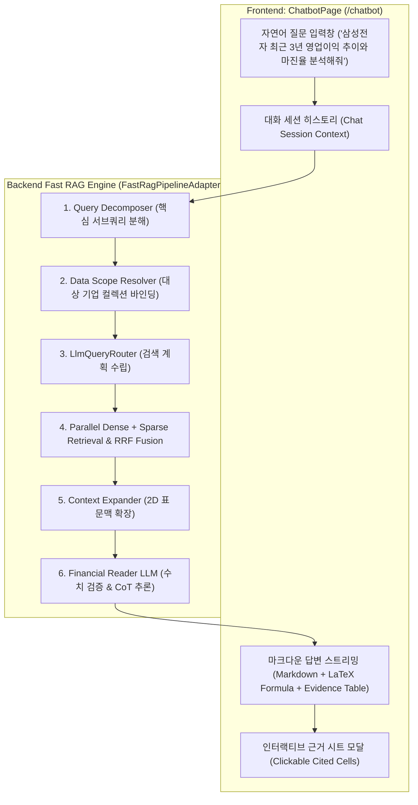
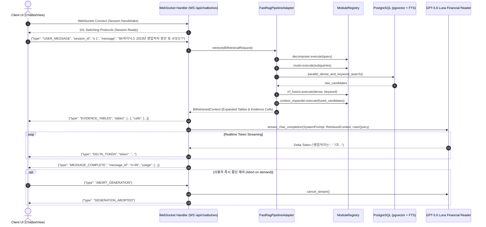

# [BP-404] [확장/예정] AI Financial Chatbot 상세 청사진
> **Document Code:** `BP-404` | **Category:** Planned Workspace Blueprint | **Status:** Architecture Blueprint (Target Phase)  
> **Source Files & Adapters:** [`backend/features/bi/fast_rag_adapter.py`](file:///c:/Repos/bist-mini-final/backend/features/bi/fast_rag_adapter.py), [`frontend/src/pages/ChatbotPage.tsx`](file:///c:/Repos/bist-mini-final/frontend/src/pages/ChatbotPage.tsx), [`modules/reader/reader.py`](file:///c:/Repos/bist-mini-final/modules/reader/reader.py)

---

## 1. AI 금융 챗봇 목표 아키텍처 (Target Chatbot Architecture)

**AI Financial Chatbot**은 사용자가 일상적인 자연어로 기업 재무 질의를 입력하면, 백엔드의 [`FastRagPipelineAdapter`](file:///c:/Repos/bist-mini-final/backend/features/bi/fast_rag_adapter.py)를 통해 고속 하이브리드 검색과 표 문맥 확장을 실시간 수행하고, **정확한 수식 및 근거 셀(Evidence Grid)이 첨부된 신뢰성 높은 답변을 스트리밍하는 대화형 워크스페이스**입니다.



---

## 2. Fast RAG 어댑터 호출 시퀀스 (Fast RAG Sequence Trace)

[`FastRagPipelineAdapter`](file:///c:/Repos/bist-mini-final/backend/features/bi/fast_rag_adapter.py)는 무거운 DAG 인프라 오버헤드 없이 인메모리 포트 바인딩을 통해 단 300ms 이내에 하이브리드 검색 및 확장을 완료합니다:



---

## 3. 챗봇 응답 페이로드 스키마 (Target Response Schema)

```typescript
export interface ChatbotMessageResponse {
  message_id: string;
  session_id: string;
  role: 'assistant';
  content: string; // 마크다운 본문 (수식 포함: $OperatingMargin = \frac{OP}{Rev} \times 100$)
  reasoning_chain?: string[]; // Chain-of-Thought 단계
  evidence_tables: {
    sheet_name: string;
    markdown_table: string;
    cited_cells: Array<{
      cell_id: string;
      coordinate: string;
      row_header: string;
      column_header: string;
      value: string | number;
    }>;
  }[];
  confidence_score: number;
}
```

---

## 4. 프론트엔드 UI 컴포넌트 설계 와이어프레임

```text
+-----------------------------------------------------------------------------------+
| 🤖 AI Financial Chatbot Workspace                                    [기업 필터: SK하이닉스 v] |
+------------------------------------+----------------------------------------------+
| [대화 내역 (Chat History)]         | [근거 데이터 인스펙터 (Evidence Inspector)]  |
|                                    |                                              |
| User: 2023년 영업이익률은 얼마인가요?| 📊 [손익계산서] 발췌 영역 (단위: 백만원)     |
|                                    | | 계정과목 | 2022년 | 2023년 |              |
| Bot: SK하이닉스의 2023년 영업손실은 | | 매출액   | 44.6조 | 32.7조 |              |
| -7조 7,303억 원이며, 영업이익률은  | | 영업손익 | +6.8조 | [-7.73조]* (IS!C12)          |
| **-23.59%**로 적자 전환했습니다.   |                                              |
|                                    | 📐 계산 수식:                                |
| 📌 계산 근거:                      | $$ \frac{-7,730,300}{32,764,800} \times 100 |
| 영업이익률 = 영업이익 / 매출액 * 100| = -23.593\% $$                               |
| (근거: 손익계산서 IS!C12, IS!C5)    |                                              |
+------------------------------------+----------------------------------------------+
| [메시지를 입력하세요...                                             ] [전송 (Enter)]|
+-----------------------------------------------------------------------------------+
```

---

## 5. 리팩토링 및 신규 구현 가이드 (Implementation Checklist)

1. **백엔드 API 엔드포인트 신설**:
   - `backend/api/chatbot_routes.py` 생성 -> `POST /api/chatbot/sessions`, `POST /api/chatbot/messages` (SSE 스트리밍).
2. **프론트엔드 워크스페이스 구현**:
   - [`frontend/src/pages/ChatbotPage.tsx`](file:///c:/Repos/bist-mini-final/frontend/src/pages/ChatbotPage.tsx)를 `PlannedFeaturePage`에서 실시간 채팅 뷰(`ChatbotView.tsx`)로 교체.
   - `react-markdown` 및 `remark-math` / `rehype-katex`를 연동하여 수식 완벽 렌더링.
