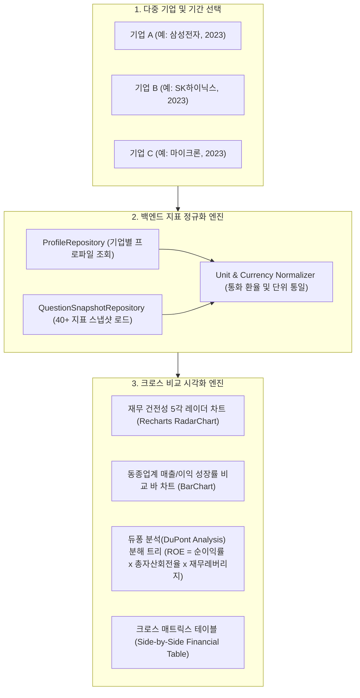

# [BP-405] [확장/예정] Company Comparison 대시보드 청사진
> **Document Code:** `BP-405` | **Category:** Planned Workspace Blueprint | **Status:** Architecture Blueprint (Target Phase)  
> **Source Files:** [`modules/storage/company_entity_extractor.py`](file:///c:/Repos/bist-mini-final/modules/storage/company_entity_extractor.py), [`backend/features/bi/profile_repository.py`](file:///c:/Repos/bist-mini-final/backend/features/bi/profile_repository.py), [`frontend/src/pages/CompanyComparisonPage.tsx`](file:///c:/Repos/bist-mini-final/frontend/src/pages/CompanyComparisonPage.tsx)

---

## 1. 기업 비교 대시보드 목표 아키텍처 (Cross-Company Comparison Architecture)

**Company Comparison Dashboard**는 2개 이상의 복수 기업(예: 삼성전자 vs SK하이닉스, IBM vs Bistelligence)을 선택하여 **수익성, 안정성, 성장성, 활동성 지표를 동일 회계 기준/통화 단위로 정규화하여 크로스 비교하고 레이더 차트 및 벤치마크 랭킹을 시각화**하는 분석 워크스페이스입니다.



---

## 2. 듀퐁 분석(DuPont Analysis) 분해 모델 및 수식

기업 간 ROE(자기자본이익률) 격차의 근본 원인을 분석하기 위해 3단계 듀퐁 분해 공식을 적용합니다:

$$
\text{ROE} = \underbrace{\left(\frac{\text{당기순이익}}{\text{매출액}}\right)}_{\text{순이익률 (Profit Margin)}} \times \underbrace{\left(\frac{\text{매출액}}{\text{총자산}}\right)}_{\text{총자산회전율 (Asset Turnover)}} \times \underbrace{\left(\frac{\text{총자산}}{\text{자기자본}}\right)}_{\text{재무레버리지 (Financial Leverage)}}
$$

| 비교 기업 | ROE | ① 순이익률 | ② 총자산회전율 | ③ 재무레버리지 | 주도 요인 진단 (Driver Diagnosis) |
| :--- | :--- | :--- | :--- | :--- | :--- |
| **기업 A** | **18.5%** | 12.0% (고마진) | 0.85회 | 1.81배 | 고부가가치 제품 중심 수익성 주도형 |
| **기업 B** | **11.2%** | 4.2% (저마진) | 1.60회 (고효율) | 1.66배 | 대량 박리다매 자산회전율 주도형 |

---

## 3. 비교 API 2-Tier 엔드포인트 명세 (Target API Specification)

기업 비교 기능은 빠른 대시보드 로딩을 위한 **Tier 1 스냅샷 조회**와 대량 정규화/환율 변환을 위한 **Tier 2 분산 배치 큐**로 분리 운영됩니다:

### ① `GET /api/bi/comparison/{comparison_id}` (Tier 1: 비동기 인메모리 스냅샷 조회, <100ms)
- **Response Payload**:
  ```json
  {
    "comparison_id": "cmp_2023_semi_kr",
    "target_currency": "KRW",
    "benchmark_summary": {
      "leader_by_margin": "samsung_electronics",
      "leader_by_growth": "sk_hynix"
    },
    "comparison_matrix": [
      {
        "metric_id": "operating_margin",
        "metric_label_ko": "영업이익률",
        "companies": {
          "samsung_electronics": {"2022": 14.35, "2023": 2.54},
          "sk_hynix": {"2022": 15.26, "2023": -23.59}
        }
      }
    ]
  }
  ```

### ② `POST /api/bi/comparison/materialize` (Tier 2: 분산 배치 큐 정규화/합성, 15s~90s)
- **Request Body**:
  ```json
  {
    "company_ids": ["samsung_electronics", "sk_hynix"],
    "fiscal_years": ["2022", "2023"],
    "target_currency": "KRW",
    "metrics": ["operating_margin", "roe", "debt_ratio", "current_ratio", "revenue_growth"]
  }
  ```
- **Response**: `202 Accepted` (`{"run_id": "run-cmp-902", "sse_stream": "/api/workflows/runs/run-cmp-902/stream"}`)

---

## 4. 프론트엔드 UI 와이어프레임 설계

```text
+---------------------------------------------------------------------------------------+
| ⚖️ 기업 비교 대시보드 (Company Comparison Dashboard)                                    |
| [기업 선택: [삼성전자 x] [SK하이닉스 x] [+ 기업 추가]]  [회계연도: 2023 v]  [단위: 억원 v]  |
+-------------------------------------------+-------------------------------------------+
| 📊 재무 건전성 레이더 비교 (Radar Chart)  | 📈 성장률 & 수익성 크로스 바 차트         |
|             [수익성 (ROE)]                | 삼성:  [■■■ 2.54%] 영업이익률             |
|                   /\                      | 하이닉스:[■■■■■■■■■ -23.59%] 영업이익률    |
|   [안정성]       /  \      [활동성]       |                                           |
| (부채비율)     /____\   (총자산회전율)   | 삼성:  [■■■■■■ -14.3%] 매출성장률        |
|        [삼성: 파랑] [하이닉스: 주황]      | 하이닉스:[■■■■■■■■■■ -26.6%] 매출성장률  |
+-------------------------------------------+-------------------------------------------+
| 📋 상세 재무비율 비교 매트릭스 (Side-by-Side Comparison Matrix)                       |
| 계정과목 / 지표명         | 삼성전자 (2023)       | SK하이닉스 (2023)     | 격차 (Delta)  |
| 매출액                   | 258조 9,355억 원      | 32조 7,648억 원       | +226조 1,707억|
| 영업이익                 | 6조 5,670억 원        | -7조 7,303억 원       | +14조 2,973억 |
| 부채비율                 | 34.2%                 | 87.5%                 | -53.3%p       |
| ROE (자기자본이익률)     | 4.1%                  | -15.8%                | +19.9%p       |
+---------------------------------------------------------------------------------------+
```

---

## 5. 리팩토링 및 신규 구현 가이드 (Implementation Checklist)

1. **`ProfileRepository` 다중 기업 질의 최적화**:
   - `backend/features/bi/profile_repository.py`에 `get_multi_company_profiles(company_ids)` 배치 쿼리 추가.
2. **프론트엔드 워크스페이스 구현**:
   - [`frontend/src/pages/CompanyComparisonPage.tsx`](file:///c:/Repos/bist-mini-final/frontend/src/pages/CompanyComparisonPage.tsx)를 `PlannedFeaturePage`에서 실시간 비교 뷰(`CompanyComparisonView.tsx`)로 교체.
   - Recharts `RadarChart`, `PolarGrid`, `PolarAngleAxis`를 활용한 다중 레이더 차트 결선.
