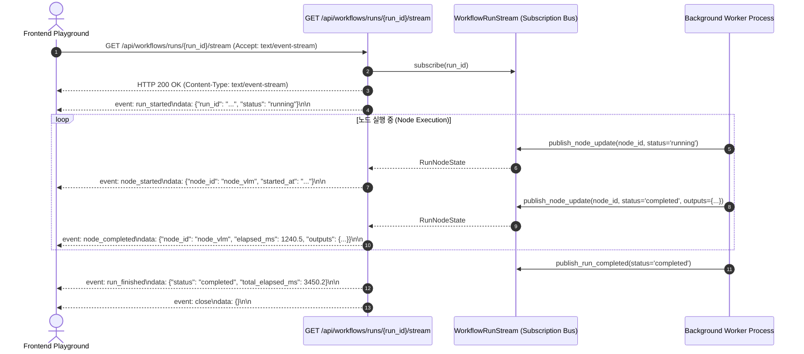

# [BP-502] SSE 실시간 파이프라인 스트리밍 규격서
> **Document Code:** `BP-502` | **Category:** Interface & Streaming Protocol Blueprint | **Status:** Approved Baseline  
> **Source Files:** [`backend/api/workflow_routes.py`](file:///c:/Repos/bist-mini-final/backend/api/workflow_routes.py), [`backend/engine/workflows/store.py`](file:///c:/Repos/bist-mini-final/backend/engine/workflows/store.py), [`frontend/src/features/playground/`](file:///c:/Repos/bist-mini-final/frontend/src/features/playground/)

---

## 1. SSE 실시간 스트리밍 아키텍처 (SSE Streaming Architecture)

장시간 소요되는 엑셀 VLM 분석, 대규모 임베딩 색인, DAG 파이프라인 실행 시 브라우저가 주기적으로 폴링(Polling)하는 비효율을 제거하기 위해 **단방향 Server-Sent Events (SSE) 이벤트 버스**를 통해 노드 상태 전이와 진척도를 실시간 브로드캐스팅합니다.



---

## 2. SSE 이벤트 프레임 상세 규격서 (Event Frame Specifications)

### 1. `event: run_started`
- **발행 시점**: 스트림 연결 직후 초기 실행 상태 보고.
- **Payload Schema**:
  ```json
  {
    "run_id": "run-a1b2c3d4",
    "workflow_id": "wf-financial-hybrid-rag",
    "status": "running",
    "batches_count": 5,
    "nodes_count": 8
  }
  ```

### 2. `event: node_started`
- **발행 시점**: DAG 특정 배치 내의 노드가 입력을 수신하고 연산을 시작할 때.
- **Payload Schema**:
  ```json
  {
    "run_id": "run-a1b2c3d4",
    "node_id": "node_decomposer",
    "module_type": "query.decomposer",
    "status": "running",
    "started_at": "2026-08-26T01:30:00.123Z"
  }
  ```

### 3. `event: node_completed`
- **발행 시점**: 모듈 실행이 성공적으로 완료되고 출력이 확정되었을 때.
- **Payload Schema**:
  ```json
  {
    "run_id": "run-a1b2c3d4",
    "node_id": "node_decomposer",
    "status": "completed",
    "elapsed_ms": 342.8,
    "outputs": {
      "sub_queries": ["삼성전자 2023년 매출액", "삼성전자 2023년 영업이익"]
    }
  }
  ```

### 4. `event: node_failed`
- **발행 시점**: 모듈 실행 중 예외 또는 타임아웃 발생 시.
- **Payload Schema**:
  ```json
  {
    "run_id": "run-a1b2c3d4",
    "node_id": "node_vlm_detector",
    "status": "failed",
    "error": {
      "code": "VLM_TIMEOUT",
      "message": "OpenAI Vision API 응답 시간 초과 (40s)"
    }
  }
  ```

### 5. `event: run_finished`
- **발행 시점**: 모든 배치가 종료되거나 에러로 인해 조기 중단되었을 때.
- **Payload Schema**:
  ```json
  {
    "run_id": "run-a1b2c3d4",
    "status": "completed",
    "total_elapsed_ms": 2850.4,
    "completed_nodes": 8,
    "failed_nodes": 0
  }
  ```

---

## 3. 네트워크 재연결 및 하트비트 정책 (Keep-Alive & Reconnection)

- **하트비트 (Keep-Alive Ping)**: 아무 이벤트가 발생하지 않더라도 TCP 프록시(Nginx, Cloudflare, Ingress)에 의한 타임아웃(60s) 방지를 위해 **15초마다 `: ping\n\n` 코멘트 프레임**을 자동 발송합니다.
- **클라이언트 자동 재연결**: `EventSource` 연결이 끊어질 경우 브라우저는 3초 후 지수 백오프(Exponential Backoff)로 재연결을 시도합니다.

---

## 4. 리팩토링 타깃 (Refactoring Targets)

1. **Redis Pub/Sub 브로커 기반 SSE 분산 중계**:
   - As-Is: 단일 서버 인메모리 `asyncio.Queue` 기반 `run_stream`.
   - To-Be: 다중 백엔드 Pod 환경에서 Redis Pub/Sub 채널을 바인딩하여 워커 Pod와 API Pod가 달라도 완벽한 실시간 이벤트 라우팅 지원.
