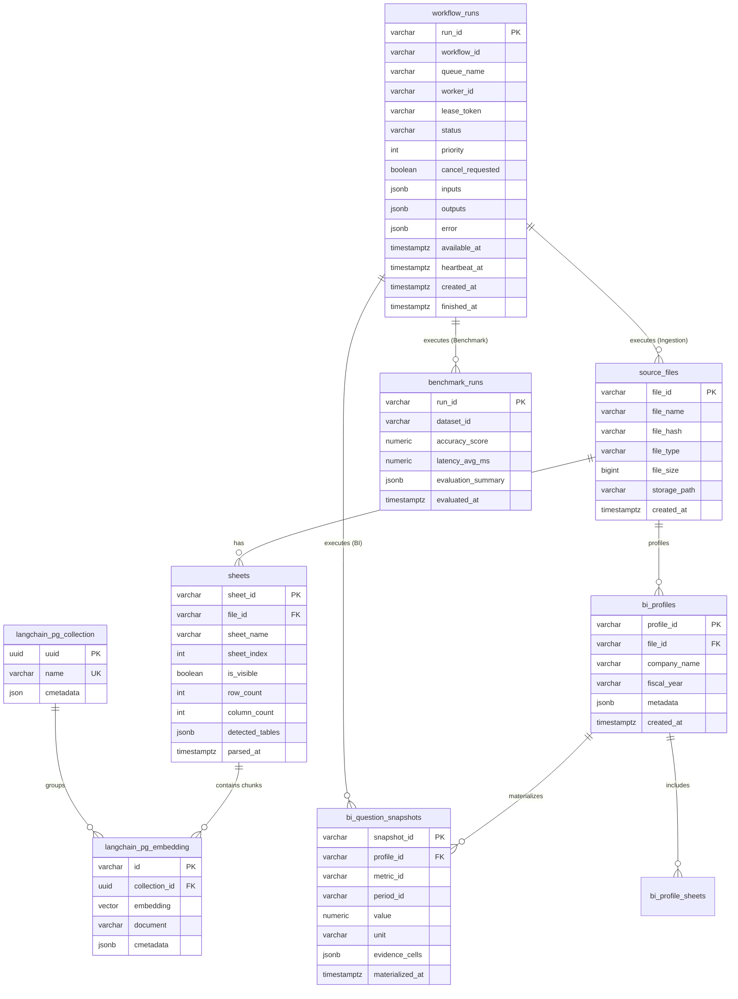

# [BP-503] PostgreSQL + pgvector 물리 DDL & ERD
> **Document Code:** `BP-503` | **Category:** Interface & Physical Schema Blueprint | **Status:** Approved Baseline  
> **Source Files:** [`backend/storage/db_manager.py`](file:///c:/Repos/bist-mini-final/backend/storage/db_manager.py), [`backend/features/bi/database_schema.py`](file:///c:/Repos/bist-mini-final/backend/features/bi/database_schema.py), [`backend/features/benchmark/database_schema.py`](file:///c:/Repos/bist-mini-final/backend/features/benchmark/database_schema.py)

---

## 1. 물리 데이터베이스 ERD (Physical Entity-Relationship Diagram)



---

### 1.1 `workflow_runs` 범용 워크플로우 실행 원장 매트릭스 (Universal Workflow Ledger)

`workflow_runs` 테이블은 특정 비즈니스(BI)에 국한되지 않고, **시스템 내의 모든 비동기 DAG 실행, 인제스천 파이프라인, 벤치마크 평가 및 샌드박스 실험 이력을 총괄하는 단일 중앙 원장(Single Central Ledger)**입니다:

| 워크플로우 유형 | `workflow_id` 식별자 | `queue_name` | 주요 실행 내용 및 입출력 (`inputs` / `outputs`) | 연계 워크스페이스 |
| :--- | :--- | :--- | :--- | :--- |
| **Playground DAG 실험** | `wf-interactive-playground` | `workflow-core` | • 21개 모듈 임의 2D 결선 그래프 비동기 실행<br>• `inputs`: 사용자 질의, 노드별 파라미터<br>• `outputs`: 각 노드별 중간 산출물 맵 | **Pipeline Playground**<br>([`BP-401`](file:///c:/Repos/bist-mini-final/docs/04_workspace_blueprints/BP-401_ws_pipeline_playground.md)) |
| **엑셀 인제스천 파이프라인** | `wf-excel-ingestion` | `workflow-ingest` | • Luna VLM 표 감지, 직렬화, 3072d 임베딩, Binary COPY<br>• `inputs`: `file_id`, `sheet_names`<br>• `outputs`: `persisted_vectors_count`, `artifact_id` | **Data Sources**<br>([`BP-402`](file:///c:/Repos/bist-mini-final/docs/04_workspace_blueprints/BP-402_ws_data_sources_management.md)) |
| **재무 BI 자동 분석** | `wf-financial-bi-analytics` | `workflow-bi` | • 프로파일링(기간/단위 탐색) ➡️ 40+ 지표 질의 ➡️ 수식 계산<br>• `inputs`: `company_name`, `workbook_hash`<br>• `outputs`: 기간별 40개 파생비율 및 스냅샷 ID | **Financial BI**<br>([`BP-403`](file:///c:/Repos/bist-mini-final/docs/04_workspace_blueprints/BP-403_ws_financial_bi_analytics.md)) |
| **정확도 벤치마크 평가** | `wf-accuracy-benchmark` | `workflow-benchmark` | • Ground-Truth Q&A 데이터셋 대량 배치 평가<br>• `inputs`: `dataset_path`, `target_pipeline_config`<br>• `outputs`: Recall@K, Exact Match율, 평균 레이턴시 | **Benchmark Workspace** |
| **AI 챗봇 추론 세션** | `wf-ai-chatbot-session` | `workflow-fast` | • 사용자 멀티턴 금융 질의에 대한 Fast RAG 및 에이전틱 리즈너 실행<br>• `inputs`: `session_id`, `user_prompt`<br>• `outputs`: 생성 답변, 인용 셀 목록 | **AI Chatbot Workspace** |

---

## 2. 물리 DDL 스크립트 명세 (Core DDL Definitions)

```sql
-- 1. pgvector 확장 활성화
CREATE EXTENSION IF NOT EXISTS vector;

-- 2. 원천 파일 테이블
CREATE TABLE IF NOT EXISTS source_files (
    file_id VARCHAR(64) PRIMARY KEY,
    file_name VARCHAR(255) NOT NULL,
    file_hash VARCHAR(64) NOT NULL,
    file_type VARCHAR(32) NOT NULL,
    file_size BIGINT NOT NULL,
    storage_path VARCHAR(512) NOT NULL,
    created_at TIMESTAMPTZ DEFAULT NOW()
);

-- 3. 스프레드시트 메타데이터 테이블
CREATE TABLE IF NOT EXISTS sheets (
    sheet_id VARCHAR(128) PRIMARY KEY,
    file_id VARCHAR(64) REFERENCES source_files(file_id) ON DELETE CASCADE,
    sheet_name VARCHAR(128) NOT NULL,
    sheet_index INT NOT NULL,
    is_visible BOOLEAN DEFAULT TRUE,
    row_count INT NOT NULL DEFAULT 0,
    column_count INT NOT NULL DEFAULT 0,
    detected_tables JSONB DEFAULT '[]',
    parsed_at TIMESTAMPTZ DEFAULT NOW()
);

-- 4. 벡터 컬렉션 테이블
CREATE TABLE IF NOT EXISTS langchain_pg_collection (
    uuid UUID PRIMARY KEY DEFAULT gen_random_uuid(),
    name VARCHAR NOT NULL UNIQUE,
    cmetadata JSON
);

-- 5. pgvector 임베딩 및 청크 테이블
CREATE TABLE IF NOT EXISTS langchain_pg_embedding (
    id VARCHAR PRIMARY KEY,
    collection_id UUID REFERENCES langchain_pg_collection(uuid) ON DELETE CASCADE,
    embedding VECTOR(3072),
    document VARCHAR NOT NULL,
    cmetadata JSONB NOT NULL DEFAULT '{}'
);

-- 6. HNSW 벡터 인덱스 및 TSVector 전문검색 인덱스
CREATE INDEX IF NOT EXISTS idx_embedding_hnsw 
ON langchain_pg_embedding 
USING hnsw (embedding vector_cosine_ops) 
WITH (m = 16, ef_construction = 64);

CREATE INDEX IF NOT EXISTS idx_embedding_metadata_gin 
ON langchain_pg_embedding 
USING gin (cmetadata);

-- 7. 분산 워커 큐 & 실행 이력 테이블
CREATE TABLE IF NOT EXISTS workflow_runs (
    run_id VARCHAR(64) PRIMARY KEY,
    workflow_id VARCHAR(128) NOT NULL,
    queue_name VARCHAR(64) NOT NULL DEFAULT 'workflow-core',
    worker_id VARCHAR(128),
    lease_token VARCHAR(64),
    status VARCHAR(32) NOT NULL DEFAULT 'queued',
    priority INT NOT NULL DEFAULT 0,
    cancel_requested BOOLEAN NOT NULL DEFAULT FALSE,
    inputs JSONB DEFAULT '{}',
    outputs JSONB DEFAULT '{}',
    error JSONB,
    available_at TIMESTAMPTZ DEFAULT NOW(),
    heartbeat_at TIMESTAMPTZ,
    created_at TIMESTAMPTZ DEFAULT NOW(),
    finished_at TIMESTAMPTZ
);

CREATE INDEX IF NOT EXISTS idx_workflow_runs_queue_poll 
ON workflow_runs (queue_name, status, available_at, priority DESC);
```

---

## 3. 리팩토링 타깃 (Refactoring Targets)

1. **Alembic 데이터베이스 마이그레이션 도구 도입**:
   - As-Is: `db_manager.py` 내부의 거대 raw SQL DDL 문자열(`DDL_INIT`)을 서버 시작 시 실행.
   - To-Be: Alembic 마이그레이션 스크립트로 버전 관리 및 롤백 지원.
2. **소프트 삭제(Soft Delete) 및 감사 로그(Audit Log)**:
   - `is_deleted`, `deleted_at` 컬럼 추가 및 데이터 변경 이력 테이블(`audit_logs`) 구축.
