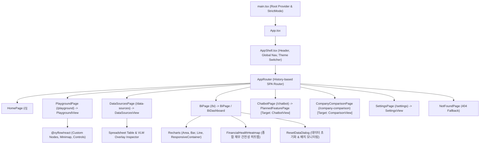

# [BP-601] React 18 프론트엔드 결선도 & 상태 아키텍처
> **Document Code:** `BP-601` | **Category:** Frontend Blueprint | **Status:** Approved Baseline  
> **Source Directories:** [`frontend/src/app/`](file:///c:/Repos/bist-mini-final/frontend/src/app/), [`frontend/src/pages/`](file:///c:/Repos/bist-mini-final/frontend/src/pages/), [`frontend/src/features/`](file:///c:/Repos/bist-mini-final/frontend/src/features/), [`frontend/src/shared/`](file:///c:/Repos/bist-mini-final/frontend/src/shared/)

---

## 1. 프론트엔드 컴포넌트 계층 트리 (Component Hierarchy Tree)

프론트엔드는 **React 18 + TypeScript + Vite + Tailwind CSS v4** 스택 기반의 고성능 SPA(Single Page Application) 구조로 구축되어 있습니다.

---

## 2. 라우팅 및 탭 상태 배선표 (Route Wiring Matrix)

| URL Path | 라우트 이름 | 렌더링 컴포넌트 | 워크스페이스 상태 |
| :--- | :--- | :--- | :--- |
| `/` | `Home` | [`HomePage`](file:///c:/Repos/bist-mini-final/frontend/src/pages/HomePage.tsx) | 메인 랜딩 & 워크스페이스 런처 허브 |
| `/playground` | `Pipeline Playground` | [`PlaygroundPage`](file:///c:/Repos/bist-mini-final/frontend/src/pages/PlaygroundPage.tsx) | **[운영중]** React Flow 2D DAG 빌더 & 실행 |
| `/data-sources` | `Data Sources` | [`DataSourcesPage`](file:///c:/Repos/bist-mini-final/frontend/src/pages/DataSourcesPage.tsx) | **[운영중]** 스프레드시트 뷰어 & pgvector 관리 |
| `/bi` | `Financial BI` | [`BiPage`](file:///c:/Repos/bist-mini-final/frontend/src/pages/BiPage.tsx) | **[운영중]** 재무제표 프로파일러 & 40+ 지표 차트 |
| `/chatbot` | `AI Financial Chatbot` | [`ChatbotPage`](file:///c:/Repos/bist-mini-final/frontend/src/pages/ChatbotPage.tsx) | **[설계완료 / 확장예정]** Fast RAG 대화형 질의응답 (WebSocket) |
| `/company-comparison`| `Company Comparison` | [`CompanyComparisonPage`](file:///c:/Repos/bist-mini-final/frontend/src/pages/CompanyComparisonPage.tsx)| **[설계완료 / 확장예정]** 다중 기업 크로스 분석 (Tier 1/2 분리) |
| `/jobs` | `K8s Job & Worker Portal` | 백엔드 내장 관제 HTML 대시보드 (`GET /jobs`) | **[백엔드 서빙]** K8s 잡 상태 & 실시간 로그 터미널 관제 |
| `/settings` | `Settings` | [`SettingsPage`](file:///c:/Repos/bist-mini-final/frontend/src/pages/SettingsPage.tsx) | 환경 변수 및 DB/큐 튜닝 인디케이터 |

---

## 3. 전역 상태 및 데이터 페칭 계층 (State & Data Fetching)

- **HTTP 통신 라이브러리**: [`ky`](file:///c:/Repos/bist-mini-final/frontend/package.json#L16)를 사용하여 기본 타임아웃, 인터셉터(X-Request-ID 주입), JSON 자동 파싱 처리.
- **실시간 스트리밍**: 브라우저 네이티브 `EventSource` API를 래핑한 커스텀 훅(`useWorkflowStream`)으로 SSE 연결 수명주기 관리.
- **런타임 스키마 검증**: 백엔드 API 응답을 `zod` 스키마로 런타임 검증하여 타입 불일치 사전 차단.

---

## 4. 리팩토링 타깃 (Refactoring Targets)

1. **상태 관리 통합 (Zustand 도입)**:
   - As-Is: React `useState`, `useContext`, `useReducer`가 컴포넌트 트리에 분산되어 있음.
   - To-Be: `Zustand` 글로벌 스토어로 워크플로우 상태, BI 선택 기업, 챗봇 세션 상태를 중앙 집중화.
2. **React Router v6 / TanStack Router 표준 마이그레이션**:
   - As-Is: 커스텀 `router.tsx` 구현체.
   - To-Be: TanStack Router 또는 React Router v6 도입으로 중첩 라우트 및 로더(Loader) 패턴 표준화.
