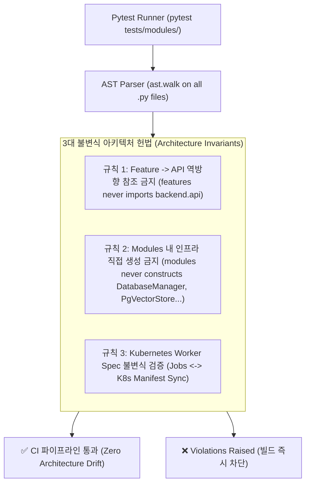
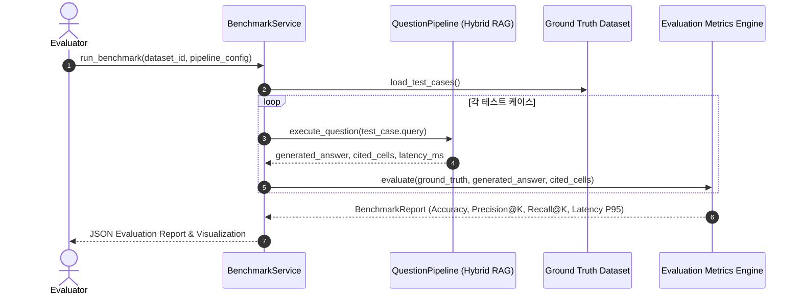

# [BP-701] 아키텍처 불변식 계약 테스트 & 벤치마크
> **Document Code:** `BP-701` | **Category:** Validation & Benchmark Blueprint | **Status:** Approved Baseline  
> **Source Files:** [`tests/modules/test_architecture_contracts.py`](file:///c:/Repos/bist-mini-final/tests/modules/test_architecture_contracts.py), [`backend/features/benchmark/service.py`](file:///c:/Repos/bist-mini-final/backend/features/benchmark/service.py), [`tests/`](file:///c:/Repos/bist-mini-final/tests/)

---

## 1. 아키텍처 불변식 계약 테스트 (Executable Architecture Contracts)

리팩토링 시 개발자의 실수로 계층 간 의존성 규칙이 깨지거나, 하위 모듈이 상위 API/인프라 클래스를 직접 인스턴스화하는 안티패턴을 원천 차단하기 위해 **Python AST(Abstract Syntax Tree) 기반 정적 계약 검증 테스트**를 실행합니다.



---

## 2. AST 계약 검증 테스트 구현 원리 (`test_architecture_contracts.py`)

### 1. `features` -> `api` 역방향 의존성 차단
```python
def test_features_never_import_http_api_layer() -> None:
    violations: list[str] = []
    for path in _python_files("backend/features"):
        tree = ast.parse(path.read_text(encoding="utf-8"), filename=str(path))
        for node in ast.walk(tree):
            if isinstance(node, ast.ImportFrom) and (node.module or "").startswith("backend.api"):
                violations.append(str(path.relative_to(PROJECT_ROOT)))
    assert not violations, f"feature -> API layer inversion: {sorted(set(violations))}"
```

### 2. `modules`의 DI 의존성 주입 준수 (인프라 직접 생성 금지)
- 모듈 내부에서 `DatabaseManager()`, `PgVectorStore()`, `OpenAIProvider()`를 직접 `__init__`에서 생성하는 행위를 금지하고, 반드시 레지스트리나 팩토리로부터 주입받도록 강제합니다.

---

## 3. 정량적 벤치마크 평가 파이프라인 (`BenchmarkService`)

실제 재무 Q&A 정답지(Ground-Truth QA Dataset)를 기반으로 RAG 파이프라인의 검색 정확도와 답변 일치도를 정량 측정합니다:



### 4대 벤치마크 평가 메트릭 (Evaluation Metrics)
1. **Exact Match (EM)**: 수치 및 단위가 완벽히 일치하는 비율 (목표: > 95%)
2. **Cell Recall@5**: 실제 정답 셀이 상위 5개 검색 후보에 포함된 비율 (목표: > 98%)
3. **P95 Latency**: 전체 파이프라인 처리 시간의 95백분위수 (목표: < 500ms for Fast RAG)
4. **Hallucination Rate**: 잘못된 수식을 사용하거나 허위 숫자를 인용한 비율 (목표: 0.0%)

---

## 4. 리팩토링 및 CI 회귀 방지 가이드 (Refactoring Safety Workflow)

```bash
# 1. 아키텍처 계약 검증 (레이어 침범 여부 즉시 검사)
uv run pytest tests/modules/test_architecture_contracts.py

# 2. 전체 모듈 단위 및 통합 테스트 실행
uv run pytest tests/

# 3. 린팅 및 정적 타입 무결성 검사
uv run ruff check .
uv run pyright
```

---

## 5. 리팩토링 타깃 (Refactoring Targets)

1. **신규 기능 및 모듈 추가 시 단위 테스트 동반 확장 (Test Suite Co-Evolution)**:
   - **원칙**: 향후 신규 파이프라인 모듈(예: `DocumentProfilerModule`, `FinancialCalculatorModule`)이나 신규 비즈니스 기능(AI 챗봇 세션, 다중 기업 비교, 반정밀도 양자화 등) 추가 시, 반드시 **모듈별 독립 단위 테스트(`tests/modules/test_*.py`)와 입출력 Pydantic 핀아웃 계약 검증 테스트를 의무적으로 동반 추가**합니다.
   - **AST 아키텍처 규칙 확장**: 신규 레이어나 컴포넌트가 추가될 때마다 `test_architecture_contracts.py`에 불변식(Layer Inversion 차단 규칙)을 즉시 갱신하여 아키텍처 드리프트를 0%로 유지합니다.
   - **벤치마크 데이터셋 동기화**: 신규 도메인 수식 및 시나리오에 대한 Ground-Truth 정답 Q&A 데이터셋을 확충하여 릴리즈 전 회귀(Regression) 여부를 정량 검증합니다.
2. **비동기 E2E 통합 테스트 자동화 (Full-Cycle Test Harness)**:
   - As-Is: 개별 모듈 및 도메인 단위 테스트 위주.
   - To-Be: FastAPI HTTP 호출 ➡️ 분산 워커 큐 디스패치 ➡️ PostgreSQL pgvector Binary COPY ➡️ SSE 스트리밍 수신까지 이어지는 엔드투엔드 비동기 통합 테스트 스위트 구축.
3. **GitHub Actions CI/CD 검증 파이프라인 연동**:
   - 모든 PR 및 커밋 푸시 시 `AST 검증` + `단위 테스트` + `Pyright 타입 검사` + `Ruff 린트`를 병렬 자동 실행하여 머지 전 무결성을 자동 보장.

