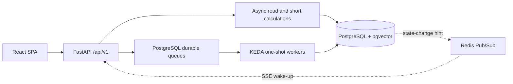

# 현재 구현 기준선

> **기준일:** 2026-08-29
> **역할:** 코드·마이그레이션·OpenAPI에서 확인한 현재 상태의 요약. 세부 규격은 `blueprints/`, 개발 이력은 `final_report/04_implementation_and_mvp_evolution/`을 따른다.

## 1. 사용자 워크스페이스

| 경로 | 제품 경계 | 주요 백엔드 경계 |
| :--- | :--- | :--- |
| `/playground` | 19개 등록 모듈로 워크플로 구성·실행 | `/api/v1/workflows`, `/api/v1/runs`, `/api/v1/modules` |
| `/data-sources` | 파일·인덱스·인제스천 작업 관리 | `/api/v1/data-sources` |
| `/dashboard` | 기업별 21개 재무 지표 BI 스냅샷 | `/api/v1/bi` |
| `/chatbot` | 세션형 금융 RAG 질의 | `/api/v1/chat` |
| `/company-comparison` | BI 스냅샷 기반 기업 순위·선택 비교 | `/api/v1/company-comparisons` |
| `/jobs` | KEDA Job·Pod·Lease 읽기 전용 관제 | `/api/v1/jobs` |
| `/settings` | 로컬 실행 환경과 DB 연결 설정 | `/api/v1/data-sources/db-*` |

`/bi`는 `/dashboard`의 프런트 호환 alias입니다. `/company-comparison-v2`와 과거 비교 API(`/bi/comparisons`, `/company-comparisons/league`, `/company-comparisons/analyze`)는 제거되었습니다.

## 2. 런타임과 도메인 경계

- PostgreSQL이 실행 상태와 도메인 데이터의 source of truth입니다.
- Redis는 다중 API Pod의 SSE 갱신 신호이며, 장애 시 PostgreSQL polling으로 대체합니다.
- 장시간 워크플로·인제스천·BI materialization/question·benchmark 작업은 durable queue와 KEDA worker에서 실행합니다.
- 기업 비교 refresh는 외부 LLM이 없는 짧은 결정론적 집계이므로 FastAPI async 요청 안에서 실행합니다.

## 3. 등록 모듈과 제품 서비스

`backend/engine/runtime/registry.py`가 등록하는 DAG 모듈은 19개입니다.

| 그룹 | 등록 module type |
| :--- | :--- |
| Query | `query_input`, `decomposer`, `llm_query_router`, `semantic_query_matcher`, `embedder` |
| Retrieval | `pgvector_data_scope`, `pgvector_retriever`, `postgres_native_keyword_retriever`, `rrf_fusion`, `pg_context_expander` |
| Ingestion | `cell_text_embedder`, `pgvector_index_writer`, `processed_file_selector`, `luna_vlm_structure_detector`, `cell_text_serializer`, `company_entity_extractor`, `sheet_metadata_persistence`, `qa_example_loader` |
| Generation | `reader` |

BI, 챗봇, 벤치마크, 기업 비교는 이 19개 모듈의 수에 포함하지 않는 제품 도메인 서비스입니다. BI `MetricId`와 `METRIC_CATALOG`의 현재 계약은 원천·파생을 합쳐 21개 지표입니다.

## 4. Company Comparison 현재 계약

- 정식 프런트 경로는 `/company-comparison` 하나입니다.
- `GET /api/v1/company-comparisons/snapshot`은 현재 발행본을 읽습니다.
- `POST /api/v1/company-comparisons/snapshot/refresh`는 현재 BI head들을 검증하고 새 버전을 발행합니다.
- 비교 정책은 `financial-league-v3`, 예측 정책은 `historical-cagr-hold-v1`입니다.
- 실제 관측값은 같은 FY·통화·배율과 원본 셀 근거가 있어야 합니다. 누락값을 보간하거나 가상 기업으로 대체하지 않습니다.
- RAG 검색 서브쿼리의 `Cell Value: ?`는 Dense 유사도 검색까지 유지하는 와일드카드이고, Reader 입력은 실제 값이 있는 표준 셀만으로 재구성합니다.
- 완전한 기업이 2개 미만이면 `409`, 일부 기업만 불완전하면 `partial`과 `exclusions`를 반환합니다.
- 향후 3개년은 명시적 가정으로만 제공하며 성장성 35%·수익성 35%·안정성 30% 점수에는 사용하지 않습니다.
- 공통화 범위는 `VersionedSnapshotRepository`의 불변 버전 저장과 current head 전환입니다. BI 계산 정책과 비교 점수 정책은 합치지 않습니다.

## 5. 영속화와 배포 기준선

- Alembic head: `20260829_0005`
- 애플리케이션 테이블: 22개(`alembic_version` 제외)
- Excel ingestion은 `ingestion_shards`를 사용해 embedding batch를 최대 4개 Job, vector COPY를 최대 2개 Job으로 fan-out하고 barrier 이후 HNSW/publish를 한 번 수행합니다.
- 기업 비교 저장소: `domain_snapshots`, `domain_snapshot_heads`
- 현재 head는 복합 외래키로 동일 `domain`·`scope_key`의 스냅샷만 참조합니다.
- 프로덕션 배포는 `deploy/helm/bist/`와 Docker 이미지, 로컬 K8s 검증은 `deploy/kubernetes/local.sh`를 기준으로 합니다.

## 6. 명시적 범위 제외

- 로컬·온디바이스 VLM 런타임은 구현하지 않습니다. 현재 비전 모듈은 외부 OpenAI Responses 기반 포트만 사용합니다.
- Cross-Encoder reranker는 구현하지 않습니다. 검색 기준선은 Dense + PostgreSQL keyword + RRF + 2D context expansion입니다.
- 비교 화면의 가상 기업, 임의 부채율, 누락 연도 역산 및 장애 시 synthetic fallback은 운영 계약이 아닙니다.

## 7. 검증 기준선

- 백엔드: `175 passed, 2 skipped`
- 프런트엔드: `115 passed`
- Ruff, Pyright, TypeScript typecheck, Vite production build 통과
- 로컬 PostgreSQL에서 Alembic head 적용, ingestion shard lease smoke, 실제 k3d vector COPY child Job 2건·barrier·HNSW·atomic publish 확인

수치는 기능 변경 시 [`SEC-502`](file:///c:/Repos/bist-mini-final/docs/final_report/05_validation_and_conclusion/SEC-502_contract_testing_results.md)와 함께 갱신합니다.
