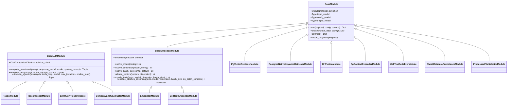
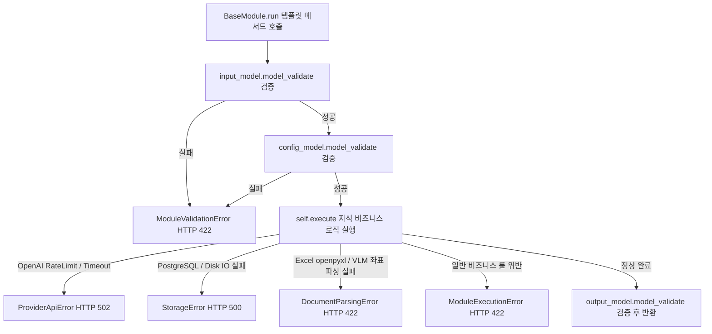

# RAG Pipeline Parent-Child Module Hierarchy & Responsibility Separation Architecture

> **문서 버전**: 1.0.0  
> **최종 수정일**: 2026-08-22  
> **대상 시스템**: `bist-mini-final` RAG Pipeline Engine & Modules  
> **관련 규칙**: [.agents/rules/code-style-guide.md](file:///Users/pileuszu/Repos/bist-mini-final/.agents/rules/code-style-guide.md), [docs/CODING_STANDARDS.md](file:///Users/pileuszu/Repos/bist-mini-final/docs/CODING_STANDARDS.md)

---

## 1. 개요 및 설계 철학 (Architecture Overview)

본 보고서는 `bist-mini-final` 모듈러 RAG 파이프라인의 **부모 기반 클래스(`BaseModule`, `BaseLLMModule`, `BaseEmbedderModule`)**와 **자식 구현 모듈(`ReaderModule`, `DecomposerModule` 등 12개 모듈)** 간의 계층적 책임 분리(Separation of Concerns) 아키텍처를 정의합니다.

### 1.1 계층 분리의 핵심 목표
1. **단일 책임 원칙 (SRP) 및 중복 제거 (DRY)**:
   - LLM 토큰 집계, OpenAI API 비용 산출, 멀티턴 도구 호출 루프(Tool Calling Loop), 벡터 차원 검증, 스트리밍 메모리 관리 등 **모든 자식이 공통으로 사용하는 런타임 인프라 로직을 부모 클래스에 100% 캡슐화**합니다.
2. **자식 모듈의 경량화 (Lean Child Module)**:
   - 자식 모듈은 오직 **자신만의 고유한 Pydantic DTO 선언, 프롬프트 템플릿, 도메인 Tool 정의 및 부모 메서드 1줄 호출**만 수행하도록 극도로 단순화합니다.
3. **전역 예외 처리 일원화 (Centralized Global Error Guard)**:
   - 자식의 `execute()` 내부에서 발생하는 모든 저수준 예외는 최상위 부모 템플릿 메서드 `BaseModule.run()`이 단일 진실 공급원(Single Source of Truth)으로 자동 포착·분류하여 `StorageError`, `DocumentParsingError`, `ProviderApiError`, `ModuleValidationError`, `ModuleExecutionError`로 표준 래핑합니다.

---

## 2. 모듈 계층 구조도 (Class Hierarchy Diagram)



---

## 3. 계층별 상세 책임 정의 (Responsibility Matrix)

| 계층 (Level) | 클래스명 | 파일 위치 | 부모가 전담 관리하는 공통 책임 | 자식 모듈이 담당하는 고유 책임 |
| :--- | :--- | :--- | :--- | :--- |
| **Level 0 (Root)** | `BaseModule` | [modules/common/base_module.py](file:///Users/pileuszu/Repos/bist-mini-final/modules/common/base_module.py) | • 템플릿 메서드 패턴 생명주기 관리 (`run`)<br>• Pydantic 입출력 및 설정 스키마 자동 검증<br>• OpenAPI JSON Schema 계약 자동 생성 (`contract`)<br>• 파이프라인 진행률 스트리밍 보고 (`report_progress`)<br>• 저수준 예외 자동 감지 및 도메인 에러 표준화 | • 고유 DTO 및 `ModuleDefinition` 메타데이터 바인딩<br>• 비즈니스 로직 실행 (`execute`) |
| **Level 1 (LLM)** | `BaseLLMModule` | [modules/common/base_llm.py](file:///Users/pileuszu/Repos/bist-mini-final/modules/common/base_llm.py) | • `ChatCompletionClient` 의존성 주입 및 재사용<br>• `complete_structured`: JSON Object 강제 및 Pydantic 파싱<br>• `complete_text`: 1-shot 텍스트 완성<br>• `complete_agentic`: LangChain `BaseTool` 멀티턴 툴 호출 루프, 자동 `invoke()`, 피드백 메시지 주입<br>• 턴 누적 prompt / completion / cached / reasoning 토큰 일괄 집계<br>• OpenAI 실시간 토큰 단가 기반 USD 비용 자동 산출 | • 모듈별 프롬프트 템플릿 및 프리셋 정의<br>• 모듈 고유 LangChain `BaseTool` 선언<br>• 부모 메서드 1줄 호출로 최종 응답 조합 |
| **Level 1 (Embedding)** | `BaseEmbedderModule` | [modules/common/base_embedder.py](file:///Users/pileuszu/Repos/bist-mini-final/modules/common/base_embedder.py) | • `EmbeddingEncoder` 팩토리 연동 및 인스턴스 캐싱<br>• `resolve_model`, `resolve_dimension`, `resolve_batch_size` 메타데이터 자동 해석<br>• `validate_vectors`: 0차원 및 차원 불일치 엄격 차단<br>• `encode_batches_streaming`: O(batch_size) 피크 메모리 가드 스트리밍 및 배치 완료 콜백<br>• `encode_texts`: 1 RTT 배치 고속 임베딩<br>• 임베딩 토큰 소모량 및 USD/KRW 비용 자동 집계 | • 원본 텍스트 DTO 추출 (`texts = [...]`)<br>• 임베딩 벡터 아티팩트 저장소 연동 |
| **Level 2 (Leaf)** | 자식 모듈 14종 | `modules/*/` | • 없음 (부모 클래스 기능 상속 활용) | • 모듈 고유 비즈니스 도메인 연산만 수행 |

---

## 4. 자식 모듈별 1-Line 위임 패턴 상세 분석

### 4.1 Agentic Reader 모듈 ([modules/reader/reader.py](file:///Users/pileuszu/Repos/bist-mini-final/modules/reader/reader.py))
* **이전 문제점**: 자식 모듈 내부에 100줄이 넘는 `for _ in range(max_iterations):` 툴 루프, 토큰 수동 누적, 비용 계산 코드가 혼재되어 있었음.
* **개선 후**: 자식은 LangChain `BaseTool` 2개만 선언하고 부모의 `self.complete_agentic(...)`을 1줄 호출하여 처리.

```python
# [자식] ReaderModule.execute() 구현부 (단 1줄로 축소)
tools_map: Dict[str, BaseTool] = {
    "lookup_cell_metadata": LookupCellMetadataTool(
        store=self.pgvector_store,
        workbook_hash=workbook_hash,
        default_company=default_company,
        default_sheet=default_sheet,
    ),
    "calculate_math_expression": CalculateMathExpressionTool(),
}

answer_text, api_usage, total_cost, latency = self.complete_agentic(
    messages=messages,
    tools_map=tools_map,
    model=cfg.model,
    max_iterations=cfg.max_tool_iterations,
    enable_tools=cfg.enable_tools,
)
```

### 4.2 Query Decomposer 모듈 ([modules/query/decomposer.py](file:///Users/pileuszu/Repos/bist-mini-final/modules/query/decomposer.py))
* 자연어 질의를 원자적 셀 서브쿼리로 분해 시, 부모의 `self.complete_structured(...)` 1줄 호출로 처리.

```python
# [자식] DecomposerModule.execute()
parsed_resp, usage, cost, latency = self.complete_structured(
    messages_or_prompt=prompt,
    response_model=DecomposedSubqueriesResponse,
    model=cfg.model,
    system_prompt=sys_prompt,
)
```

### 4.3 Query Embedder 모듈 ([modules/embedding/query_embedder.py](file:///Users/pileuszu/Repos/bist-mini-final/modules/embedding/query_embedder.py))
* 서브쿼리 리스트를 3072차원 dense 벡터로 변환 시, 부모의 `self.encode_texts(...)` 1줄 호출로 처리.

```python
# [자식] EmbedderModule.execute()
vectors = self.encode_texts(
    unique_subqueries,
    model_name=model_name,
    expected_dimension=expected_dimension,
    batch_size=batch_size,
    report_progress=False,
)
```

### 4.4 Cell Text Document Embedder ([modules/embedding/cell_text_embedder.py](file:///Users/pileuszu/Repos/bist-mini-final/modules/embedding/cell_text_embedder.py))
* 수만 개의 엑셀 셀 문서를 임베딩할 때, 부모의 `self.encode_batches_streaming(...)`을 통해 O(batch_size) 스트리밍 배치 실행.

```python
# [자식] CellTextEmbedderModule.execute()
for _, _, batch_vectors in self.encode_batches_streaming(
    texts=texts,
    model_name=model_name,
    expected_dimension=expected_dimension,
    batch_size=batch_size,
    on_batch_complete=_handle_batch_complete,
    report_progress=True,
):
    vectors.extend(batch_vectors)
```

---

## 5. 전역 예외 처리 계층 구조 (Global Exception Handling Architecture)

개별 모듈의 `execute()` 내부에서 불필요한 `try-except Exception ... raise ModuleExecutionError(...)`를 작성하지 않습니다. 최상위 `BaseModule.run()`이 모든 예외를 자동으로 감지하고 분류합니다.



### 5.1 FastAPI 전역 핸들러 표준 매핑
FastAPI 웹 계층(`backend/main.py`)은 `PipelineBaseError`를 수신하여 아래의 정형화된 JSON 계약으로 클라이언트에 투명하게 응답합니다:

```json
{
  "error_code": "PROVIDER_API_ERROR",
  "message": "모듈 [reader] 외부 API 호출 실패: Rate limit reached for model gpt-5.6-turbo",
  "module_type": "reader",
  "details": {
    "provider": "openai",
    "model": "gpt-5.6-turbo"
  }
}
```

---

## 6. 결론 및 향후 모듈 개발 지침 (Guidelines for Future Modules)

새로운 파이프라인 모듈을 작성할 때는 아래의 **3대 규칙**을 반드시 준수합니다:

1. **LLM을 사용하는 모듈**은 반드시 `BaseLLMModule`을 상속하고, `self.complete_structured(...)`, `self.complete_text(...)`, `self.complete_agentic(...)` 중 하나만을 호출합니다.
2. **임베딩을 사용하는 모듈**은 반드시 `BaseEmbedderModule`을 상속하고, `self.encode_texts(...)` 또는 `self.encode_batches_streaming(...)`을 사용합니다.
3. **`execute()` 내부에 인프라 레벨의 `try-except`를 중복 작성하지 않습니다.** (에이전틱 툴 내부에서 LLM 자율 재시도를 위한 피드백 메시지 생성 목적 외에는 금지)
