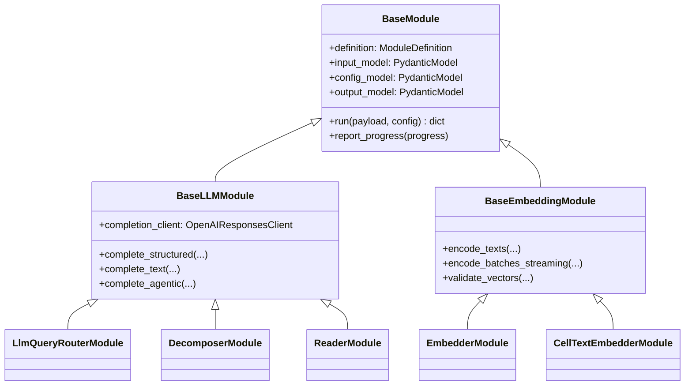
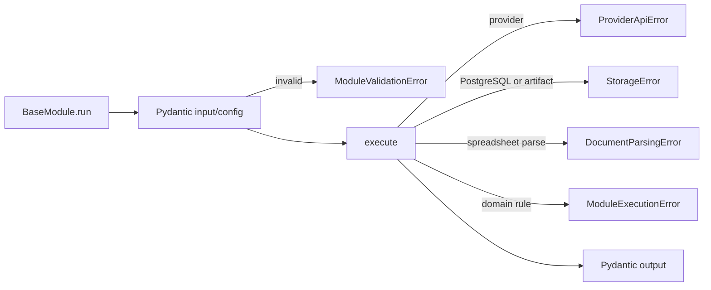

# 현재 모듈 런타임 아키텍처

> 문서 버전: 2.0.0
> 기준일: 2026-08-23

이 문서는 현재 registry에 등록된 19개 모듈의 공통 실행 계약을 정의한다. 과거 모듈 이름, DTO alias, 그래프 변환 규칙은 다루지 않는다.

## 계층

## 책임 경계

| 계층 | 책임 |
| --- | --- |
| `BaseModule` | Pydantic 입력·설정·출력 검증, 예외 분류, progress callback, branch outcome |
| `BaseLLMModule` | Responses API structured output·text·function calling, usage 합산, 비용 계측 |
| `BaseEmbeddingModule` | encoder 재사용, 배치 실행, 차원 검증, 토큰·비용 계측 |
| 개별 모듈 | DTO, 프롬프트, 도메인 연산과 저장소 호출 |
| `WorkflowExecutor` | DAG 입력 조립, cache, 노드 상태·비용, 완료 조건 |
| Kubernetes worker | PostgreSQL claim/lease, task policy, timeout/retry, heartbeat |

## OpenAI 호출 계약

모든 LLM과 VLM 호출은 `backend/providers/openai_responses.py`의 단일 keep-alive 클라이언트를 사용한다.

- endpoint: `POST /v1/responses`
- structured output: `text.format.type=json_schema`, `strict=true`
- tool: top-level strict function tool
- continuation: `previous_response_id` + `function_call_output.call_id`
- privacy: `store=false`
- 기본 reasoning: `none`
- usage: prompt/completion/cached/reasoning token을 공통 형식으로 정규화

`ReaderModule`은 도구 실행 결과를 전체 대화 재전송 없이 Responses continuation으로 전달한다. `DecomposerModule`, `LlmQueryRouterModule`, Luna VLM detector도 같은 클라이언트와 connection pool을 공유한다.

## 임베딩 계약

문서 수집 시 `CellTextEmbedderModule`은 선택한 모델로 batch embedding을 만들고 content-addressed artifact를 저장한다. `PgVectorIndexWriterModule`이 artifact를 PostgreSQL에 기록하고 collection metadata에 model과 dimension을 함께 저장한다.

질의 시 `PgVectorDataScopeModule`은 embedding row를 스캔하지 않고 collection·company·sheet·model·dimension catalog만 읽는다. `LlmQueryRouterModule`이 각 decomposed subquery에 concrete collection을 대응시키며 사용자가 collection을 선택하는 입력은 없다. `EmbedderModule`은 retrieval plan을 model/dimension별로 묶어 동일 텍스트를 한 번만 임베딩하고 collection lineage를 보존한다. 1536차원과 3072차원 collection이 함께 선택되어도 각각 정확한 모델 계약으로 호출한다.

## I/O 원칙

- API 요청은 작업을 실행하지 않고 PostgreSQL 큐에 저장한 뒤 `202`를 반환한다.
- worker는 노드 progress와 terminal state를 노드 단위로 저장한다.
- 대형 노드 출력은 gzip artifact로 외부화하고 DB에는 hash reference만 저장한다.
- embedding은 단일 API batch 또는 bounded streaming batch를 사용한다.
- dense 검색은 collection-local binary-quantized HNSW 후보를 구한 뒤 exact cosine으로 재정렬한다.
- dense 검색 실패 시 다른 라이브러리 경로로 재호출하지 않고 즉시 명시적 오류로 종료한다.
- keyword 검색은 PostgreSQL GIN FTS를 사용하며 metadata scope가 0건일 때만 같은 쿼리의 scope 제약을 제거한다.

## 오류 계약

FastAPI는 이 오류를 구조화된 HTTP 응답으로 투영하고, Kubernetes worker는 동일 오류를 node failure와 run summary에 영속화한다. 공급자·DB 오류를 빈 결과로 바꾸지 않는다.

## 새 모듈 규칙

1. `ModuleDefinition`, Pydantic input/config/output을 하나씩 정의한다.
2. 외부 실행이 필요한 모듈은 직렬화 가능한 `ModuleTaskPolicy`를 정의한다.
3. LLM/VLM은 `OpenAIResponsesClient`, embedding은 `BaseEmbeddingModule`을 재사용한다.
4. 대형 배열·바이너리는 HTTP 또는 run summary에 넣지 않는다.
5. canonical Job에 추가하기 전에 registry contract, DAG compile, Kubernetes worker 테스트를 통과한다.
