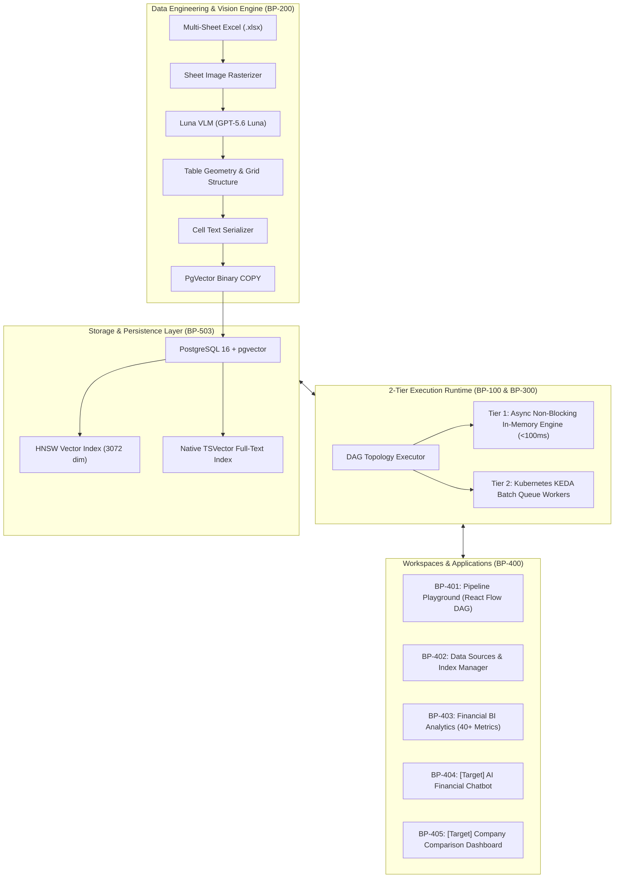
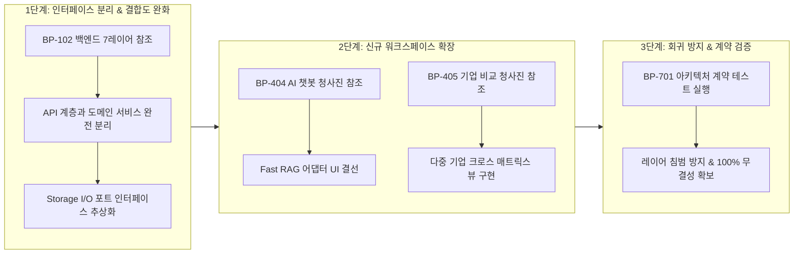

# [BP-000] 시스템 마스터 청사진 포털 & 리팩토링 가이드맵
> **Project:** bist-mini-final (RAG Pipeline & Financial BI Visualizer)  
> **Document Code:** `BP-000` | **Version:** `1.0.0` | **Classification:** Master Architecture Blueprint & Refactoring Baseline

---

## 1. 프로젝트 개요 (Executive Summary)

`bist-mini-final`은 복잡하고 비정형적인 기업 재무 엑셀(Multi-Sheet Spreadsheets) 데이터를 **시각적 비전 모델(Luna VLM)**과 **하이브리드 RAG(Dense + Sparse + RRF)** 파이프라인으로 구조화하고, **실시간 2-Tier DAG 실행 엔진** 및 **자동화된 재무 BI 분석**을 제공하는 엔터프라이즈급 AI 플랫폼입니다.

본 문서 포털은 시스템의 모든 컴포넌트, 물리 스키마, 알고리즘 결선도, 계층 간 의존성을 공학 설계 청사진 형태로 명세하며, **향후 진행될 대규모 아키텍처 리팩토링 및 탭 확장(AI 챗봇, 기업 비교)의 절대적 기준선(Refactoring Baseline)**으로 기능합니다.

---

## 2. 청사진 네비게이션 맵 (Master Blueprint Matrix)

본 설계서는 7대 도메인, 총 20개의 정밀 엔지니어링 규격서로 구성되어 있습니다.

| 영역 | 문서 코드 | 문서명 및 핵심 내용 | 주요 대상 코드 / 리팩토링 타깃 |
| :--- | :--- | :--- | :--- |
| **01. 코어 아키텍처** | [BP-101](file:///c:/Repos/bist-mini-final/docs/01_system_blueprints/BP-101_system_architecture_blueprint.md) | **시스템 전체 배치도 & 2-Tier 런타임 토폴로지** 전체 아키텍처, 런타임 분기, DI 컨테이너 | [`backend/bootstrap/container.py`](file:///c:/Repos/bist-mini-final/backend/bootstrap/container.py), [`backend/main.py`](file:///c:/Repos/bist-mini-final/backend/main.py) |
| | [BP-102](file:///c:/Repos/bist-mini-final/docs/01_system_blueprints/BP-102_backend_layered_architecture.md) | **백엔드 7단계 계층 설계도 & 인터페이스 결합도** Presentation ~ Storage 레이어 격리 및 DIP 규칙 | [`backend/api/`](file:///c:/Repos/bist-mini-final/backend/api/), [`backend/features/`](file:///c:/Repos/bist-mini-final/backend/features/), [`backend/storage/`](file:///c:/Repos/bist-mini-final/backend/storage/) |
| | [BP-103](file:///c:/Repos/bist-mini-final/docs/01_system_blueprints/BP-103_concurrency_and_locking_model.md) | **분산 락, 임차권(Lease) & 경합 회복 시퀀스** Worker Lease 토큰 및 고아 작업 회복 FSM | [`backend/engine/worker/lease.py`](file:///c:/Repos/bist-mini-final/backend/engine/worker/lease.py), [`backend/storage/db_manager.py`](file:///c:/Repos/bist-mini-final/backend/storage/db_manager.py) |
| | [BP-104](file:///c:/Repos/bist-mini-final/docs/01_system_blueprints/BP-104_deployment_and_infra_topology.md) | **K8s, KEDA ScaledJob & 인프라 토폴로지** k3d 클러스터, Ingress, Pod Spec, 배포 스크립트 | [`deploy/kubernetes/`](file:///c:/Repos/bist-mini-final/deploy/kubernetes/), [`deploy/kubernetes/local.sh`](file:///c:/Repos/bist-mini-final/deploy/kubernetes/local.sh) |
| **02. 데이터 엔지니어링** | [BP-201](file:///c:/Repos/bist-mini-final/docs/02_data_engine_blueprints/BP-201_spreadsheet_coordinate_parser.md) | **2D 그리드 셀 좌표계 파서 & 마크다운 직렬화** OpenPyXL 병합 해제, 좌표계 정규화, 계층 직렬화 | [`backend/storage/spreadsheets/`](file:///c:/Repos/bist-mini-final/backend/storage/spreadsheets/), [`modules/structure/cell_text_serializer.py`](file:///c:/Repos/bist-mini-final/modules/structure/cell_text_serializer.py) |
| | [BP-202](file:///c:/Repos/bist-mini-final/docs/02_data_engine_blueprints/BP-202_luna_vlm_vision_detector.md) | **Luna VLM 이미지 렌더링 & 표 바운딩박스 검출** Pillow 이미지 렌더링, GPT-5.6 Luna 구조 추론 | [`modules/structure/luna_vlm_structure_detector.py`](file:///c:/Repos/bist-mini-final/modules/structure/luna_vlm_structure_detector.py) |
| | [BP-203](file:///c:/Repos/bist-mini-final/docs/02_data_engine_blueprints/BP-203_binary_copy_vector_pipeline.md) | **대용량 바이너리 COPY & pgvector 인덱싱** 초당 5,000+ 벡터 주입 고속 파이프라인 및 HNSW | [`backend/storage/pgvector_binary_copy.py`](file:///c:/Repos/bist-mini-final/backend/storage/pgvector_binary_copy.py), [`backend/storage/pgvector_store.py`](file:///c:/Repos/bist-mini-final/backend/storage/pgvector_store.py) |
| **03. 파이프라인 모듈** | [BP-301](file:///c:/Repos/bist-mini-final/docs/03_pipeline_module_blueprints/BP-301_dag_execution_engine.md) | **DAG 토폴로지 실행기 & 상태머신(FSM)** 위상 정렬, 노드 상태 전이, 에러 바운더리 격리 | [`backend/engine/workflows/executor.py`](file:///c:/Repos/bist-mini-final/backend/engine/workflows/executor.py), [`backend/engine/workflows/store.py`](file:///c:/Repos/bist-mini-final/backend/engine/workflows/store.py) |
| | [BP-302](file:///c:/Repos/bist-mini-final/docs/03_pipeline_module_blueprints/BP-302_19_modules_pinout_catalog.md) | **21개 모듈 입출력 핀아웃(Pinout) 카탈로그** 21개 단품 모듈별 Input/Output/Config 핀 규격서 | [`modules/`](file:///c:/Repos/bist-mini-final/modules/), [`backend/engine/runtime/registry.py`](file:///c:/Repos/bist-mini-final/backend/engine/runtime/registry.py) |
| | [BP-303](file:///c:/Repos/bist-mini-final/docs/03_pipeline_module_blueprints/BP-303_hybrid_retrieval_and_fusion.md) | **Dense + Sparse + RRF 융합 & 셀 확장 회로** pgvector + BM25 tsvector + RRF($k=60$) + 2D Context | [`modules/retrieval/`](file:///c:/Repos/bist-mini-final/modules/retrieval/) |
| **04. 워크스페이스** | [BP-401](file:///c:/Repos/bist-mini-final/docs/04_workspace_blueprints/BP-401_ws_pipeline_playground.md) | **[구현됨] Pipeline Playground 워크스페이스** React Flow 캔버스, 노드 커넥터, SSE 스트림 바인딩 | [`frontend/src/features/playground/`](file:///c:/Repos/bist-mini-final/frontend/src/features/playground/) |
| | [BP-402](file:///c:/Repos/bist-mini-final/docs/04_workspace_blueprints/BP-402_ws_data_sources_management.md) | **[구현됨] Data Sources Management 워크스페이스** 시트 뷰어, VLM 바운딩박스 오버레이, 색인 관리기 | [`frontend/src/features/data-sources/`](file:///c:/Repos/bist-mini-final/frontend/src/features/data-sources/) |
| | [BP-403](file:///c:/Repos/bist-mini-final/docs/04_workspace_blueprints/BP-403_ws_financial_bi_analytics.md) | **[구현됨] Financial BI Analytics 워크스페이스** 재무제표 프로파일러, 40+ 지표 공식, 스냅샷 | [`backend/features/bi/`](file:///c:/Repos/bist-mini-final/backend/features/bi/), [`frontend/src/features/bi/`](file:///c:/Repos/bist-mini-final/frontend/src/features/bi/) |
| | [BP-404](file:///c:/Repos/bist-mini-final/docs/04_workspace_blueprints/BP-404_ws_ai_financial_chatbot.md) | **[확장/예정] AI Financial Chatbot 상세 청사진** Fast RAG 어댑터 연동, 근거 표 바인딩, 대화 FSM | [`backend/features/bi/fast_rag_adapter.py`](file:///c:/Repos/bist-mini-final/backend/features/bi/fast_rag_adapter.py), [`frontend/src/pages/ChatbotPage.tsx`](file:///c:/Repos/bist-mini-final/frontend/src/pages/ChatbotPage.tsx) |
| | [BP-405](file:///c:/Repos/bist-mini-final/docs/04_workspace_blueprints/BP-405_ws_company_comparison.md) | **[확장/예정] Company Comparison 대시보드 청사진** 다중 기업 엔티티 추출, 지표 크로스 비교 매트릭스 | [`modules/storage/company_entity_extractor.py`](file:///c:/Repos/bist-mini-final/modules/storage/company_entity_extractor.py), [`frontend/src/pages/CompanyComparisonPage.tsx`](file:///c:/Repos/bist-mini-final/frontend/src/pages/CompanyComparisonPage.tsx) |
| **05. 인터페이스** | [BP-501](file:///c:/Repos/bist-mini-final/docs/05_interface_blueprints/BP-501_rest_api_specification.md) | **REST API 엔드포인트 & DTO 규격서** FastAPI 라우트별 Input/Output 스키마 & 에러 규격 | [`backend/api/`](file:///c:/Repos/bist-mini-final/backend/api/), [`backend/api/error_mapping.py`](file:///c:/Repos/bist-mini-final/backend/api/error_mapping.py) |
| | [BP-502](file:///c:/Repos/bist-mini-final/docs/05_interface_blueprints/BP-502_sse_streaming_protocol.md) | **SSE 실시간 파이프라인 스트리밍 규격서** Server-Sent Events 프레임, 하트비트, 라이브 업데이트 | [`backend/api/workflow_routes.py`](file:///c:/Repos/bist-mini-final/backend/api/workflow_routes.py), [`frontend/src/features/playground/`](file:///c:/Repos/bist-mini-final/frontend/src/features/playground/) |
| | [BP-503](file:///c:/Repos/bist-mini-final/docs/05_interface_blueprints/BP-503_database_erd_and_ddl.md) | **PostgreSQL + pgvector 물리 DDL & ERD** 10개 테이블 물리 스키마, 제약조건, 외래키, 인덱스 | [`backend/storage/db_manager.py`](file:///c:/Repos/bist-mini-final/backend/storage/db_manager.py), [`backend/features/bi/database_schema.py`](file:///c:/Repos/bist-mini-final/backend/features/bi/database_schema.py) |
| **06. 프론트엔드** | [BP-601](file:///c:/Repos/bist-mini-final/docs/06_frontend_blueprints/BP-601_frontend_component_wiring.md) | **React 18 프론트엔드 결선도 & 상태 아키텍처** Vite + React 18 + Tailwind v4, Ky 클라이언트, 라우팅 | [`frontend/src/`](file:///c:/Repos/bist-mini-final/frontend/src/) |
| **07. 품질 및 검증** | [BP-701](file:///c:/Repos/bist-mini-final/docs/07_validation_blueprints/BP-701_contract_testing_and_benchmarks.md) | **아키텍처 불변식 계약 테스트 & 벤치마크** Pytest 계약 검증, 정확도/재현율 평가 체계 | [`tests/`](file:///c:/Repos/bist-mini-final/tests/), [`backend/features/benchmark/`](file:///c:/Repos/bist-mini-final/backend/features/benchmark/) |

---

## 3. 리팩토링 마스터 가이드 (How to Use This Blueprint for Refactoring)

본 설계서는 다음 세 단계의 리팩토링 및 고도화 워크플로우를 완벽히 지원하도록 설계되었습니다:

1. **코드 변경 전 필수 확인**: 수정하려는 모듈의 해당 번호 청사진(`BP-XXX`)을 열어 **"I/O Pinout 규격"** 및 **"계층 간 의존성 방향"**을 확인합니다.
2. **리팩토링 포인트 섹션 참조**: 각 문서의 `Refactoring Targets & Debts` 항목에 명시된 기술 부채와 개선 권장안을 확인합니다.
3. **불변식 검증**: 리팩토링 후 `pytest tests/modules/test_architecture_contracts.py`를 실행하여 레이어 의존성 위반이 없는지 즉시 검증합니다.
