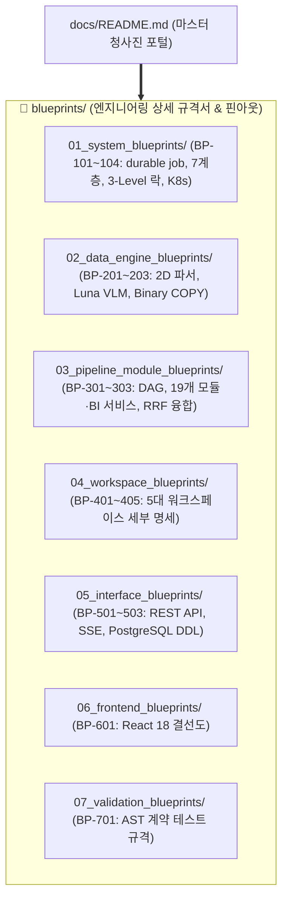

# 🏛️ bist-mini-final 엔지니어링 청사진 포털 (Engineering Blueprints Gateway)
> **Project Version:** `0.1.0` | **Public API Version:** `2.4.0` | **Build Target:** Financial RAG, BI & Comparison Platform
> **Master Portals:** [📐 엔지니어링 청사진 규격서 (Blueprints)](file:///c:/Repos/bist-mini-final/docs/blueprints/) | [📋 현재 구현 기준선 (Current Implementation Baseline)](file:///c:/Repos/bist-mini-final/docs/CURRENT_IMPLEMENTATION_BASELINE.md)

---

## 🧭 엔지니어링 문서 체계 및 청사진 구조

`bist-mini-final`의 기술 문서는 시스템의 실제 아키텍처, 19개 파이프라인 모듈 핀아웃, 5대 워크스페이스, 데이터베이스 DDL 및 프론트엔드 배선도를 개발 및 운영 시 실시간으로 참조할 수 있도록 **[엔지니어링 청사진 규격서 (Blueprints)]** 체계로 관리됩니다:

> **문서 해석 기준:** [`CURRENT_IMPLEMENTATION_BASELINE.md`](file:///c:/Repos/bist-mini-final/docs/CURRENT_IMPLEMENTATION_BASELINE.md)가 현재 구현의 요약 기준입니다. `blueprints/`는 실행 계약과 설계 결정을 명세합니다. 현재 기준은 19개 등록 파이프라인 모듈, 21개 BI 지표, 독립 Company Comparison 스냅샷 도메인, PostgreSQL 영속 상태, Redis 상태 변경 신호, KEDA 작업 런타임과 Excel embedding/COPY child shard 실행입니다. 로컬 VLM과 Cross-Encoder reranker는 범위에서 제외합니다.

---

# 📐 엔지니어링 청사진 규격서 색인 (Blueprints Catalog)

| 도메인 | 청사진 번호 & 문서명 | 핵심 기술 스펙 및 내용 |
| :--- | :--- | :--- |
| **01. System** | [`BP-101`](file:///c:/Repos/bist-mini-final/docs/blueprints/01_system_blueprints/BP-101_system_architecture_blueprint.md) | durable job 토폴로지, PostgreSQL 영속 상태, Redis 신호 및 KEDA 런타임 |
| | [`BP-102`](file:///c:/Repos/bist-mini-final/docs/blueprints/01_system_blueprints/BP-102_backend_layered_architecture.md) | 7계층 클린 아키텍처 & 의존성 역전 원칙(DIP) |
| | [`BP-103`](file:///c:/Repos/bist-mini-final/docs/blueprints/01_system_blueprints/BP-103_concurrency_and_locking_model.md) | 3-Level 분산 락, 하트비트 Lease & 장애 복구 런북 |
| | [`BP-104`](file:///c:/Repos/bist-mini-final/docs/blueprints/01_system_blueprints/BP-104_deployment_and_infra_topology.md) | Helm·Kubernetes KEDA ScaledJob, TriggerAuthentication 및 `/api/v1/jobs` |
| **02. Data Engine** | [`BP-201`](file:///c:/Repos/bist-mini-final/docs/blueprints/02_data_engine_blueprints/BP-201_spreadsheet_coordinate_parser.md) | OpenPyXL 병합 해제 및 2D 직교 좌표계 정규화 |
| | [`BP-202`](file:///c:/Repos/bist-mini-final/docs/blueprints/02_data_engine_blueprints/BP-202_luna_vlm_vision_detector.md) | 외부 OpenAI vision 기반 시트 구조 감지; 로컬 VLM 제외 |
| | [`BP-203`](file:///c:/Repos/bist-mini-final/docs/blueprints/02_data_engine_blueprints/BP-203_binary_copy_vector_pipeline.md) | PostgreSQL Native `Binary COPY` 3072d 고속 벌크 주입 |
| **03. Pipeline** | [`BP-301`](file:///c:/Repos/bist-mini-final/docs/blueprints/03_pipeline_module_blueprints/BP-301_dag_execution_engine.md) | Kahn 위상정렬 DAG, durable queue 실행 및 FSM |
| | [`BP-302`](file:///c:/Repos/bist-mini-final/docs/blueprints/03_pipeline_module_blueprints/BP-302_module_pinout_catalog.md) | `ModuleRegistry` 기준 19개 원자적 파이프라인 모듈 계약 |
| | [`BP-303`](file:///c:/Repos/bist-mini-final/docs/blueprints/03_pipeline_module_blueprints/BP-303_hybrid_retrieval_and_fusion.md) | Dense(3072d) + Sparse(BM25) + RRF($k=60$) 융합 검색 |
| **04. Workspaces** | [`BP-401`](file:///c:/Repos/bist-mini-final/docs/blueprints/04_workspace_blueprints/BP-401_ws_pipeline_playground.md) | 모듈 카탈로그, DAG 실행 및 SSE 상태 스트림 |
| | [`BP-402`](file:///c:/Repos/bist-mini-final/docs/blueprints/04_workspace_blueprints/BP-402_ws_data_sources_management.md) | 스프레드시트 미리보기 및 영속 ingestion job 관리 |
| | [`BP-403`](file:///c:/Repos/bist-mini-final/docs/blueprints/04_workspace_blueprints/BP-403_ws_financial_bi_analytics.md) | 21개 근거 기반 BI 지표와 재무 분석 화면 |
| | [`BP-404`](file:///c:/Repos/bist-mini-final/docs/blueprints/04_workspace_blueprints/BP-404_ws_ai_financial_chatbot.md) | RAG 실행 작업, 상태 조회 및 대화형 챗봇 |
| | [`BP-405`](file:///c:/Repos/bist-mini-final/docs/blueprints/04_workspace_blueprints/BP-405_ws_company_comparison.md) | 검증된 BI 원천 기반 버전형 기업 비교 스냅샷과 재무 순위·선택 비교 |
| **05. Interface** | [`BP-501`](file:///c:/Repos/bist-mini-final/docs/blueprints/05_interface_blueprints/BP-501_rest_api_specification.md) | FastAPI REST API 엔드포인트 & 표준 에러 엔벨로프 |
| | [`BP-502`](file:///c:/Repos/bist-mini-final/docs/blueprints/05_interface_blueprints/BP-502_sse_streaming_protocol.md) | Server-Sent Events(SSE) 실시간 스트리밍 프로토콜 |
| | [`BP-503`](file:///c:/Repos/bist-mini-final/docs/blueprints/05_interface_blueprints/BP-503_database_erd_and_ddl.md) | Alembic 관리 PostgreSQL·pgvector·버전형 도메인 스냅샷 ERD & DDL |
| **06. Frontend** | [`BP-601`](file:///c:/Repos/bist-mini-final/docs/blueprints/06_frontend_blueprints/BP-601_frontend_component_wiring.md) | React 18 SPA 컴포넌트 배선도 & a11y 표준 모달 |
| **07. Validation** | [`BP-701`](file:///c:/Repos/bist-mini-final/docs/blueprints/07_validation_blueprints/BP-701_contract_testing_and_benchmarks.md) | AST 아키텍처 계약 검증 & 정량 벤치마크 하네스 |
