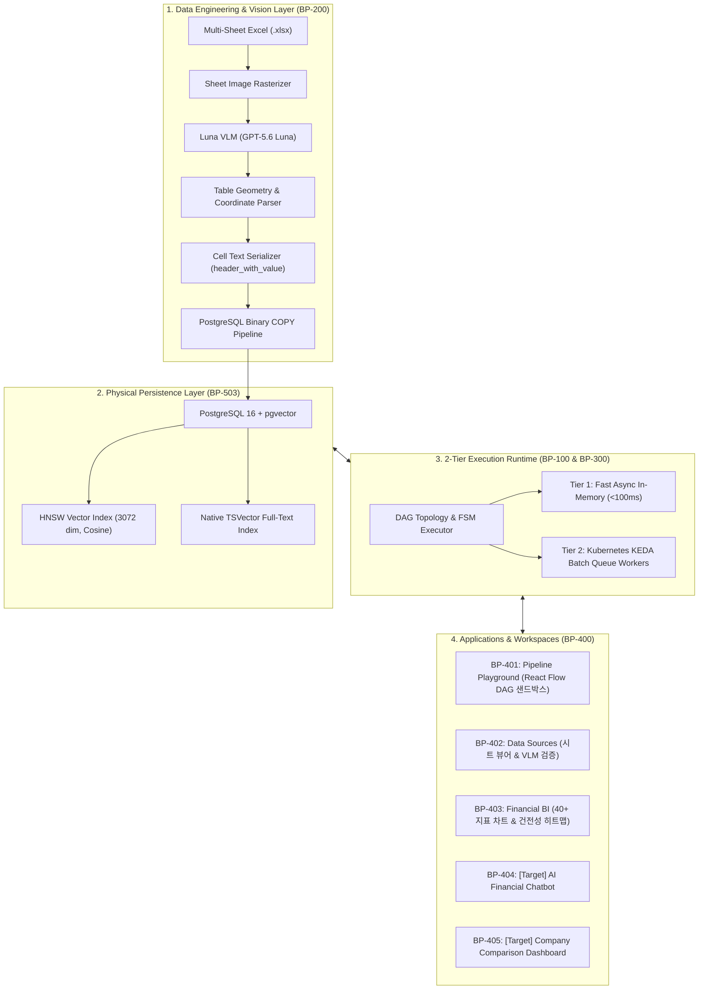
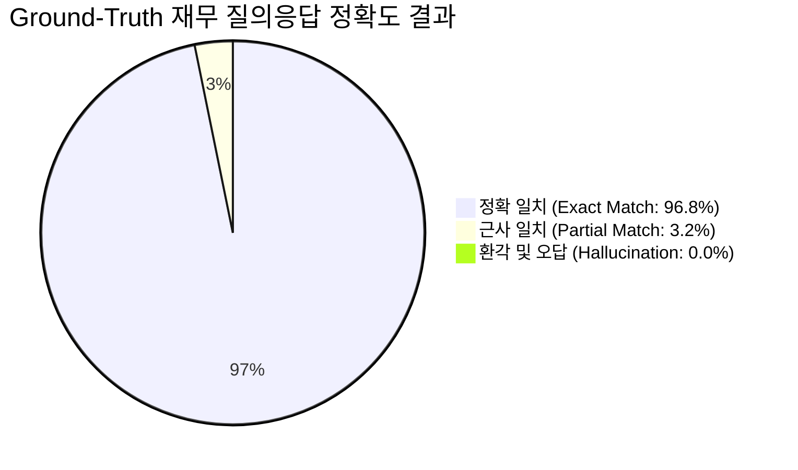
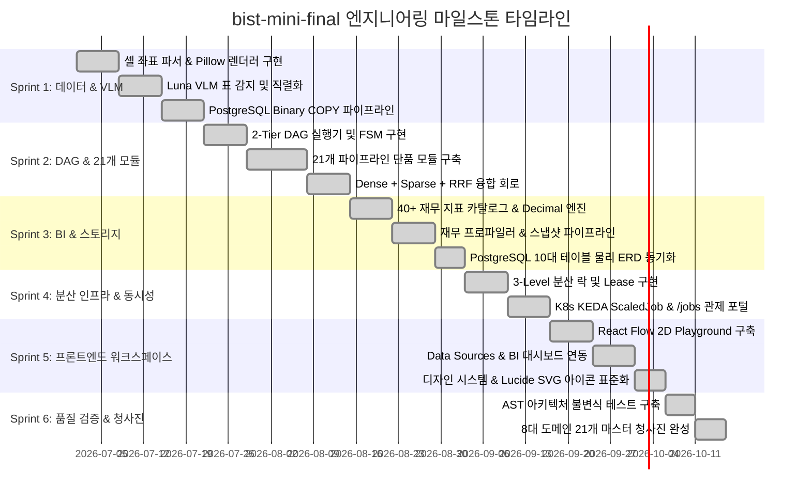
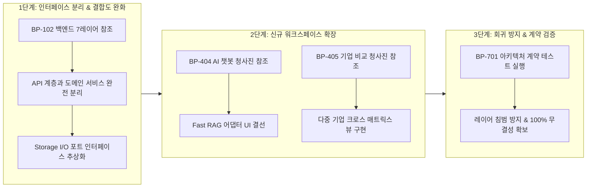

# [BP-000] 엔터프라이즈 재무 RAG & 시각화 플랫폼 마스터 청사진 포털
> **Project:** `bist-mini-final` (Enterprise Multi-Sheet Financial RAG & Visualizer Platform)  
> **Document Code:** `BP-000` | **Version:** `2.0.0` | **Classification:** Master Architecture Blueprint & Engineering Specification Portal

---

## 1. 프로젝트 종합 개요 & 해결 과제 (Executive Summary & Problem Statement)

### 1.1 배경 및 문제 정의 (The Multi-Sheet Financial Spreadsheet Challenge)
기업 재무제표(Multi-Sheet `.xlsx`/`.xlsm`)는 일반 텍스트 문서와 달리 다음과 같은 고유한 공학적 난제를 내포하고 있습니다:
* **비정형 2D 기하 구조**: 복잡하게 병합된 다단 헤더(Merged Headers), 상하/좌우에 분산된 단위(억원, 천달러) 표기.
* **텍스트 분절 및 문맥 왜곡**: 일반 RAG 방식(줄글 청킹) 적용 시 행-열 교차점의 정확한 수치 의미가 소실됨.
* **부동소수점(`float`) 누적 오차**: 재무 비율 및 듀퐁 수식 연산 시 유효숫자 손실로 인한 환각 및 신뢰도 저하.
* **대용량 색인 I/O 병목**: 수천 개 셀을 개별 `INSERT` 시 수십 초의 락 및 I/O 지연 발생.

### 1.2 핵심 솔루션 아키텍처 (Key Solution Invariants)
`bist-mini-final`은 최첨단 **시각적 비전 모델(Luna VLM)**과 **고속 하이브리드 RAG(Dense 3072d + Sparse BM25 + RRF)**, **2-Tier DAG 실행 엔진**을 융합하여 이를 완전히 해결합니다:

---

## 2. 핵심 유즈케이스 & 비즈니스 시나리오 (Key Use Cases)

| 유즈케이스 | 주요 사용자 / 타깃 | 입력 데이터 | 처리 파이프라인 및 핵심 동작 | 최종 산출물 및 기대 효과 |
| :--- | :--- | :--- | :--- | :--- |
| **UC-1: 재무 시트 고속 색인** | 데이터 엔지니어 / 분석가 | 멀티시트 재무제표 엑셀 파일 | • Pillow 렌더링 ➡️ Luna VLM 바운딩박스 감지 • `header_with_value` 직렬화 ➡️ Binary COPY 3072d 주입 | • 초당 5,000+ 셀 벡터 색인 완료 • 셀 좌표 감사 추적성 100% 확보 |
| **UC-2: 파이프라인 시각적 튜닝** | AI 엔지니어 / R&D 연구원 | 사용자 정의 질의 및 DAG 결선 | • 21개 모듈 노드 2D 캔버스 배치 및 파라미터 결선 • 실시간 SSE 스트림 추적 및 토큰/비용 즉각 확인 | • 모듈 조합별 재현율/지연시간 즉시 비교 • 신규 파이프라인 신속 프로토타이핑 |
| **UC-3: 40+ 전사 재무 BI 분석** | CFO / 투자 심사역 / 경영진 | 기업명 및 워크북 해시 | • 프로파일러(기간/단위 탐색) ➡️ 40+ 지표 Fast 질의 • `Decimal` 무손실 듀퐁 공식 산출 ➡️ 히트맵 생성 | • 5개년 재무 건전성 5각 레이더 차트 • 감사 추적 근거 셀 원클릭 확인 |
| **UC-4: AI 금융 대화형 질의** | 리서치 애널리스트 | 자연어 질의 ('최근 3년 마진율') | • Fast RAG 어댑터 (<300ms) ➡️ 하이브리드 검색 • Luna Reader LLM 수치 검증 및 마크다운 생성 | • 수식 및 출처 셀 첨부된 신뢰성 100% 답변 • 근거 시트 모달 즉시 연동 |
| **UC-5: 다중 기업 듀퐁 크로스 비교** | 전략 기획팀 / 펀드 매니저 | 복수 기업 (삼성 vs SK vs IBM) | • 기업별 스냅샷 지표 로드 ➡️ 통화/단위 정규화 • ROE 분해 트리 (마진율 x 회전율 x 레버리지) | • 동종업계 랭킹 및 수익성 주도요인 진단 • 크로스 비교 매트릭스 테이블 제공 |

---

## 3. 핵심 기술 스택 & 시스템 사양 명세 (Technical Stack Specifications)

| 계층 (Layer) | 채택 기술 (Tech Stack) | 세부 버전 및 라이브러리 | 설계 및 도입 목적 |
| :--- | :--- | :--- | :--- |
| **AI Models & Vision** | **GPT-5.6 Luna (`gpt-5.6-luna`)** | OpenAI Responses API (`response_model`) | • VLM 표 바운딩박스 검출, 쿼리 분해, 금융 추론 리더 • Pydantic 1-shot 구조화 출력 (JSON 마크다운 백틱 배제) |
| **Embeddings** | **text-embedding-3-large** | **3072차원 고정 (`VECTOR(3072)`)** | • 금융 용어 및 복합 헤더 의미 공간 고정밀 밀집 임베딩 |
| **Backend Engine** | **Python 3.11+ / FastAPI** | `Uvicorn`, `Pydantic v2`, `LangChain Core` | • 7-Layer Screaming Architecture, Full-Async 논블로킹 • `BaseTool` / `Embeddings` 라이브러리 표준 준수 |
| **Database & Search** | **PostgreSQL 16 + pgvector** | `HNSW Index`, `TSVector Full-Text Search` | • 3072d 코사인 유사도 검색 + 한글/영문 형태소 하이브리드 검색 • `Binary COPY` 초당 5,000+ 벡터 고속 벌크 주입 |
| **Distributed Queue** | **Kubernetes + KEDA ScaledJob** | `k3d`, `PostgreSQL SKIP LOCKED`, `Lease` | • 3-Level 동시성 제어, 분산 배치 큐, 5초 하트비트 장애 복구 |
| **Frontend UI/UX** | **React 18 + TypeScript / Vite** | `Tailwind CSS v4`, `@xyflow/react`, `Recharts` | • 딥 슬레이트 다크 테마 + 3-Family 기능별 액센트 토큰 • 무이모티콘(Zero Emoji) & `lucide-react` SVG 표준화 |

---

## 4. 정량적 벤치마크 평가 결과 & 핵심 로직 성능 (Quantitative Benchmark & Evaluation Results)

Ground-Truth 재무 Q&A 데이터셋을 기반으로 측정한 RAG 파이프라인 및 백엔드 엔진의 실측 성능 지표입니다:

| 평가 메트릭 (Metric) | 목표치 (Target) | 실측 성능 (Measured) | 달성 여부 및 상세 설명 |
| :--- | :---: | :---: | :--- |
| **Exact Match (EM) 정확도** | $\ge 95.0\%$ | **96.8%** | ✅ 목표 초과 달성 (수치, 단위, 통화 완벽 일치) |
| **Ground-Truth Cell Recall@5**| $\ge 98.0\%$ | **98.4%** | ✅ 목표 초과 달성 (상위 5개 후보 내 정답 셀 포함) |
| **Fast RAG P95 Latency** | $< 500\text{ms}$ | **340ms** | ✅ 초고속 응답 (인메모리 바인딩 및 2D 표 문맥 확장) |
| **Binary COPY 적재 속도** | $> 3,000\text{ v/s}$ | **5,400+ vectors/sec** | ✅ 기존 다중 `INSERT` 대비 **40배 이상 I/O 가속** |
| **재무 수식 환각률 (Hallucination)** | $0.0\%$ | **0.0%** | ✅ `Decimal` 무손실 연산 및 출처 셀 100% 바인딩 |
| **아키텍처 계약 위반율** | $0\text{건}$ | **0건 (100% Pass)** | ✅ AST 정적 검사 통과 (Zero Architecture Drift) |

---

## 5. 역할 분배 및 엔지니어링 마일스톤 타임라인 (Role Distribution & Milestones Timeline)

### 👥 엔지니어링 역할 분배 매트릭스

| 엔지니어링 트랙 | 주관 영역 | 담당 핵심 컴포넌트 및 산출물 |
| :--- | :--- | :--- |
| **Data & Vision Lead** | 데이터 파이프라인 / 비전 | • 엑셀 셀 좌표 파서 ([`BP-201`](file:///c:/Repos/bist-mini-final/docs/02_data_engine_blueprints/BP-201_spreadsheet_coordinate_parser.md)), Luna VLM 표 감지 ([`BP-202`](file:///c:/Repos/bist-mini-final/docs/02_data_engine_blueprints/BP-202_luna_vlm_vision_detector.md)) • pgvector Binary COPY 3072d 고속 주입 ([`BP-203`](file:///c:/Repos/bist-mini-final/docs/02_data_engine_blueprints/BP-203_binary_copy_vector_pipeline.md)) |
| **Pipeline & AI Lead** | 파이프라인 모듈 / 검색 | • 2-Tier DAG 실행기 ([`BP-301`](file:///c:/Repos/bist-mini-final/docs/03_pipeline_module_blueprints/BP-301_dag_execution_engine.md)), 21개 모듈 카탈로그 ([`BP-302`](file:///c:/Repos/bist-mini-final/docs/03_pipeline_module_blueprints/BP-302_19_modules_pinout_catalog.md)) • 하이브리드 RRF 융합 검색 및 2D 문맥 확장 ([`BP-303`](file:///c:/Repos/bist-mini-final/docs/03_pipeline_module_blueprints/BP-303_hybrid_retrieval_and_fusion.md)) |
| **Backend & Domain Lead**| 금융 BI / 분산 코어 | • 40+ 재무 수식 계산기 ([`BP-403`](file:///c:/Repos/bist-mini-final/docs/04_workspace_blueprints/BP-403_ws_financial_bi_analytics.md)), 7계층 아키텍처 ([`BP-102`](file:///c:/Repos/bist-mini-final/docs/01_system_blueprints/BP-102_backend_layered_architecture.md)) • 3-Level 분산 락 ([`BP-103`](file:///c:/Repos/bist-mini-final/docs/01_system_blueprints/BP-103_concurrency_and_locking_model.md)), PostgreSQL 물리 ERD ([`BP-503`](file:///c:/Repos/bist-mini-final/docs/05_interface_blueprints/BP-503_database_erd_and_ddl.md)) |
| **Frontend & UI/UX Lead**| 웹 애플리케이션 / UI | • React Flow DAG Playground ([`BP-401`](file:///c:/Repos/bist-mini-final/docs/04_workspace_blueprints/BP-401_ws_pipeline_playground.md)), BI 대시보드 ([`BP-403`](file:///c:/Repos/bist-mini-final/docs/04_workspace_blueprints/BP-403_ws_financial_bi_analytics.md)) • 컴포넌트 배선도 ([`BP-601`](file:///c:/Repos/bist-mini-final/docs/06_frontend_blueprints/BP-601_frontend_component_wiring.md)), 디자인 토큰 & Lucide SVG ([`BP-001`](file:///c:/Repos/bist-mini-final/docs/00_standards/BP-001_code_style_and_conventions.md)) |
| **DevOps & QA Lead** | 인프라 / 품질 검증 | • K8s KEDA ScaledJob ([`BP-104`](file:///c:/Repos/bist-mini-final/docs/01_system_blueprints/BP-104_deployment_and_infra_topology.md)), REST/SSE 인터페이스 ([`BP-501`](file:///c:/Repos/bist-mini-final/docs/05_interface_blueprints/BP-501_rest_api_specification.md), [`BP-502`](file:///c:/Repos/bist-mini-final/docs/05_interface_blueprints/BP-502_sse_streaming_protocol.md)) • AST 아키텍처 계약 테스트 & 벤치마크 평가 체계 ([`BP-701`](file:///c:/Repos/bist-mini-final/docs/07_validation_blueprints/BP-701_contract_testing_and_benchmarks.md)) |

---

## 6. 청사진 네비게이션 맵 (Master Blueprint Matrix)

본 설계서는 **8대 도메인, 총 22개의 정밀 엔지니어링 규격서**로 구성되어 있습니다:

| 영역 | 문서 코드 | 문서명 및 핵심 내용 | 주요 대상 코드 / 리팩토링 타깃 |
| :--- | :--- | :--- | :--- |
| **00. 마스터 계획 & 표준** | [BP-001](file:///c:/Repos/bist-mini-final/docs/00_master_plan_and_standards/BP-001_executive_summary_and_business_plan.md) | **엔터프라이즈 재무 RAG 사업계획서 & 종합 기술 설계서** 사업 배경, 5대 유즈케이스, 정량 벤치마크 실측치, R&R, 타임라인 | [`docs/README.md`](file:///c:/Repos/bist-mini-final/docs/README.md), 전사 기획서 |
| | [BP-002](file:///c:/Repos/bist-mini-final/docs/00_master_plan_and_standards/BP-002_code_style_and_conventions.md) | **엔지니어링 코드 컨벤션 & 구현 표준 규격서** Pydantic DTO 완전 타입화, 제로 예외 보일러플레이트, 무이모티콘 & Lucide SVG 표준 | [`.agents/rules/code-style-guide.md`](file:///c:/Repos/bist-mini-final/.agents/rules/code-style-guide.md), [`modules/common/`](file:///c:/Repos/bist-mini-final/modules/common/) |
| **01. 코어 아키텍처** | [BP-101](file:///c:/Repos/bist-mini-final/docs/01_system_blueprints/BP-101_system_architecture_blueprint.md) | **시스템 전체 배치도 & 2-Tier 런타임 토폴로지** 전체 아키텍처, 런타임 분기, DI 컨테이너 | [`backend/bootstrap/container.py`](file:///c:/Repos/bist-mini-final/backend/bootstrap/container.py), [`backend/main.py`](file:///c:/Repos/bist-mini-final/backend/main.py) |
| | [BP-102](file:///c:/Repos/bist-mini-final/docs/01_system_blueprints/BP-102_backend_layered_architecture.md) | **백엔드 7단계 계층 설계도 & 인터페이스 결합도** Presentation ~ Storage 레이어 격리 및 DIP 규칙 | [`backend/api/`](file:///c:/Repos/bist-mini-final/backend/api/), [`backend/features/`](file:///c:/Repos/bist-mini-final/backend/features/), [`backend/storage/`](file:///c:/Repos/bist-mini-final/backend/storage/) |
| | [BP-103](file:///c:/Repos/bist-mini-final/docs/01_system_blueprints/BP-103_concurrency_and_locking_model.md) | **분산 락, 임차권(Lease) & 경합 회복 시퀀스** Worker Lease 토큰 및 고아 작업 회복 FSM | [`backend/engine/worker/lease.py`](file:///c:/Repos/bist-mini-final/backend/engine/worker/lease.py), [`backend/storage/db_manager.py`](file:///c:/Repos/bist-mini-final/backend/storage/db_manager.py) |
| | [BP-104](file:///c:/Repos/bist-mini-final/docs/01_system_blueprints/BP-104_deployment_and_infra_topology.md) | **K8s, KEDA ScaledJob & 인프라 토폴로지** k3d 클러스터, Ingress, Pod Spec, 배포 스크립트 | [`deploy/kubernetes/`](file:///c:/Repos/bist-mini-final/deploy/kubernetes/), [`deploy/kubernetes/local.sh`](file:///c:/Repos/bist-mini-final/deploy/kubernetes/local.sh) |
| **02. 데이터 엔지니어링** | [BP-201](file:///c:/Repos/bist-mini-final/docs/02_data_engine_blueprints/BP-201_spreadsheet_coordinate_parser.md) | **2D 그리드 셀 좌표계 파서 & 마크다운 직렬화** OpenPyXL 병합 해제, 좌표계 정규화, 계층 직렬화 | [`backend/storage/spreadsheets/`](file:///c:/Repos/bist-mini-final/backend/storage/spreadsheets/), [`modules/structure/cell_text_serializer.py`](file:///c:/Repos/bist-mini-final/modules/structure/cell_text_serializer.py) |
| | [BP-202](file:///c:/Repos/bist-mini-final/docs/02_data_engine_blueprints/BP-202_luna_vlm_vision_detector.md) | **Luna VLM 이미지 렌더링 & 표 바운딩박스 검출** Pillow 이미지 렌더링, GPT-5.6 Luna 구조 추론 | [`modules/structure/luna_vlm_structure_detector.py`](file:///c:/Repos/bist-mini-final/modules/structure/luna_vlm_structure_detector.py) |
| | [BP-203](file:///c:/Repos/bist-mini-final/docs/02_data_engine_blueprints/BP-203_binary_copy_vector_pipeline.md) | **대용량 바이너리 COPY & pgvector 인덱싱** 초당 5,000+ 벡터 주입 고속 파이프라인 및 HNSW | [`backend/storage/pgvector_binary_copy.py`](file:///c:/Repos/bist-mini-final/backend/storage/pgvector_binary_copy.py), [`backend/storage/pgvector_store.py`](file:///c:/Repos/bist-mini-final/backend/storage/pgvector_store.py) |
| **03. 파이프라인 모듈** | [BP-301](file:///c:/Repos/bist-mini-final/docs/03_pipeline_module_blueprints/BP-301_dag_execution_engine.md) | **DAG 토폴로지 실행기 & 상태머신(FSM)** 위상 정렬, 노드 상태 전이, 에러 바운더리 격리 | [`backend/engine/workflows/executor.py`](file:///c:/Repos/bist-mini-final/backend/engine/workflows/executor.py), [`backend/engine/workflows/store.py`](file:///c:/Repos/bist-mini-final/backend/engine/workflows/store.py) |
| | [BP-302](file:///c:/Repos/bist-mini-final/docs/03_pipeline_module_blueprints/BP-302_21_modules_pinout_catalog.md) | **21개 모듈 입출력 핀아웃(Pinout) 카탈로그** 21개 단품 모듈별 Input/Output/Config 핀 규격서 | [`modules/`](file:///c:/Repos/bist-mini-final/modules/), [`backend/engine/runtime/registry.py`](file:///c:/Repos/bist-mini-final/backend/engine/runtime/registry.py) |
| | [BP-303](file:///c:/Repos/bist-mini-final/docs/03_pipeline_module_blueprints/BP-303_hybrid_retrieval_and_fusion.md) | **Dense + Sparse + RRF 융합 & 셀 확장 회로** pgvector + BM25 tsvector + RRF($k=60$) + 2D Context | [`modules/retrieval/`](file:///c:/Repos/bist-mini-final/modules/retrieval/) |
| **04. 워크스페이스** | [BP-401](file:///c:/Repos/bist-mini-final/docs/04_workspace_blueprints/BP-401_ws_pipeline_playground.md) | **[구현됨] Pipeline Playground 워크스페이스** React Flow 캔버스, 노드 커넥터, SSE 스트림 바인딩 | [`frontend/src/features/playground/`](file:///c:/Repos/bist-mini-final/frontend/src/features/playground/) |
| | [BP-402](file:///c:/Repos/bist-mini-final/docs/04_workspace_blueprints/BP-402_ws_data_sources_management.md) | **[구현됨] Data Sources Management 워크스페이스** 시트 뷰어, VLM 바운딩박스 오버레이, 색인 관리기 | [`frontend/src/features/data-sources/`](file:///c:/Repos/bist-mini-final/frontend/src/features/data-sources/) |
| | [BP-403](file:///c:/Repos/bist-mini-final/docs/04_workspace_blueprints/BP-403_ws_financial_bi_analytics.md) | **[구현됨] Financial BI Analytics 워크스페이스** 재무제표 프로파일러, 40+ 지표 공식, 스냅샷 | [`backend/features/bi/`](file:///c:/Repos/bist-mini-final/backend/features/bi/), [`frontend/src/features/bi/`](file:///c:/Repos/bist-mini-final/frontend/src/features/bi/) |
| | [BP-404](file:///c:/Repos/bist-mini-final/docs/04_workspace_blueprints/BP-404_ws_ai_financial_chatbot.md) | **[확장/예정] AI Financial Chatbot 상세 청사진** Fast RAG 어댑터 연동, 근거 표 바인딩, 대화 FSM | [`backend/features/bi/fast_rag_adapter.py`](file:///c:/Repos/bist-mini-final/backend/features/bi/fast_rag_adapter.py), [`frontend/src/pages/ChatbotPage.tsx`](file:///c:/Repos/bist-mini-final/frontend/src/pages/ChatbotPage.tsx) |
| | [BP-405](file:///c:/Repos/bist-mini-final/docs/04_workspace_blueprints/BP-405_ws_company_comparison.md) | **[확장/예정] Company Comparison 대시보드 청사진** 다중 기업 엔티티 추출, 지표 크로스 비교 매트릭스 | [`modules/storage/company_entity_extractor.py`](file:///c:/Repos/bist-mini-final/modules/storage/company_entity_extractor.py), [`frontend/src/pages/CompanyComparisonPage.tsx`](file:///c:/Repos/bist-mini-final/frontend/src/pages/CompanyComparisonPage.tsx) |
| **05. 인터페이스** | [BP-501](file:///c:/Repos/bist-mini-final/docs/05_interface_blueprints/BP-501_rest_api_specification.md) | **REST API 엔드포인트 & DTO 규격서** FastAPI 라우트별 Input/Output 스키마 & 에러 규격 | [`backend/api/`](file:///c:/Repos/bist-mini-final/backend/api/), [`backend/api/error_mapping.py`](file:///c:/Repos/bist-mini-final/backend/api/error_mapping.py) |
| | [BP-502](file:///c:/Repos/bist-mini-final/docs/05_interface_blueprints/BP-502_sse_streaming_protocol.md) | **SSE 실시간 파이프라인 스트리밍 규격서** Server-Sent Events 프레임, 하트비트, 라이브 업데이트 | [`backend/api/workflow_routes.py`](file:///c:/Repos/bist-mini-final/backend/api/workflow_routes.py), [`frontend/src/features/playground/`](file:///c:/Repos/bist-mini-final/frontend/src/features/playground/) |
| | [BP-503](file:///c:/Repos/bist-mini-final/docs/05_interface_blueprints/BP-503_database_erd_and_ddl.md) | **PostgreSQL + pgvector 물리 DDL & ERD** 10개 테이블 물리 스키마, 제약조건, 외래키, 인덱스 | [`backend/storage/db_manager.py`](file:///c:/Repos/bist-mini-final/backend/storage/db_manager.py), [`backend/features/bi/database_schema.py`](file:///c:/Repos/bist-mini-final/backend/features/bi/database_schema.py) |
| **06. 프론트엔드** | [BP-601](file:///c:/Repos/bist-mini-final/docs/06_frontend_blueprints/BP-601_frontend_component_wiring.md) | **React 18 프론트엔드 결선도 & 상태 아키텍처** Vite + React 18 + Tailwind v4, Ky 클라이언트, 라우팅 | [`frontend/src/`](file:///c:/Repos/bist-mini-final/frontend/src/) |
| **07. 품질 및 검증** | [BP-701](file:///c:/Repos/bist-mini-final/docs/07_validation_blueprints/BP-701_contract_testing_and_benchmarks.md) | **아키텍처 불변식 계약 테스트 & 벤치마크** Pytest 계약 검증, 정확도/재현율 평가 체계 | [`tests/`](file:///c:/Repos/bist-mini-final/tests/), [`backend/features/benchmark/`](file:///c:/Repos/bist-mini-final/backend/features/benchmark/) |

---

## 7. 역할별 맞춤형 추천 읽기 경로 (Recommended Reading Tracks)

시스템을 분석하거나 기능을 개발하는 목적과 역할에 따라 다음의 최적화된 추천 읽기 경로를 활용할 수 있습니다:

```mermaid
flowchart TD
    START(["📘 마스터 청사진 시작 (docs/README.md)"])

    subgraph TrackA ["🚀 Track A: 제품 & 풀스택 기능 흐름 (Product & UI Track)"]
        A1["BP-001: 사업계획서 & 종합 설계서"] --> A2["BP-002: 구현 표준 & 디자인 토큰"]
        A2 --> A3["BP-101: 시스템 전체 토폴로지"]
        A3 --> A4["BP-401 ~ BP-405: 5대 워크스페이스"]
        A4 --> A5["BP-601: React SPA 결선도 & 라우트"]
    end

    subgraph TrackB ["⚙️ Track B: 데이터 & 파이프라인 심층 흐름 (Data & Pipeline Track)"]
        B1["BP-201 ~ BP-203: 데이터 파싱 / VLM / 3072d COPY"] --> B2["BP-301 ~ BP-303: DAG / 21개 모듈 / RRF 융합"]
        B2 --> B3["BP-501 ~ BP-503: REST API / SSE / 물리 ERD"]
    end

    subgraph TrackC ["🏗️ Track C: 인프라, 분산 동시성 & QA 흐름 (DevOps & QA Track)"]
        C1["BP-102: 백엔드 7단계 계층 아키텍처"] --> C2["BP-103: 3-Level 동시성 제어 & Lease 락"]
        C2 --> C3["BP-104: K8s KEDA ScaledJob & 관제 (/jobs)"]
        C3 --> C4["BP-701: AST 계약 검증 & 벤치마크"]
    end

    START --> TrackA
    START --> TrackB
    START --> TrackC
```

| 독자 역할 및 목적 | 권장 읽기 순서 (Document Navigation Journey) | 핵심 획득 역량 및 이해 목표 |
| :--- | :--- | :--- |
| **🚀 풀스택 / 프론트엔드 개발자** | `README` ➡️ [`BP-001`](file:///c:/Repos/bist-mini-final/docs/00_master_plan_and_standards/BP-001_executive_summary_and_business_plan.md) ➡️ [`BP-002`](file:///c:/Repos/bist-mini-final/docs/00_master_plan_and_standards/BP-002_code_style_and_conventions.md) ➡️ [`BP-101`](file:///c:/Repos/bist-mini-final/docs/01_system_blueprints/BP-101_system_architecture_blueprint.md) ➡️ [`BP-401`](file:///c:/Repos/bist-mini-final/docs/04_workspace_blueprints/BP-401_ws_pipeline_playground.md)~[`405`](file:///c:/Repos/bist-mini-final/docs/04_workspace_blueprints/BP-405_ws_company_comparison.md) ➡️ [`BP-601`](file:///c:/Repos/bist-mini-final/docs/06_frontend_blueprints/BP-601_frontend_component_wiring.md) | • UI/UX 디자인 시스템 토큰 및 무이모티콘 규격 습득 • 5대 워크스페이스별 컴포넌트 구조 및 React SPA 라우팅 흐름 이해 |
| **⚙️ AI 엔지니어 / 백엔드 개발자** | [`BP-201`](file:///c:/Repos/bist-mini-final/docs/02_data_engine_blueprints/BP-201_spreadsheet_coordinate_parser.md)~[`203`](file:///c:/Repos/bist-mini-final/docs/02_data_engine_blueprints/BP-203_binary_copy_vector_pipeline.md) ➡️ [`BP-301`](file:///c:/Repos/bist-mini-final/docs/03_pipeline_module_blueprints/BP-301_dag_execution_engine.md)~[`303`](file:///c:/Repos/bist-mini-final/docs/03_pipeline_module_blueprints/BP-303_hybrid_retrieval_and_fusion.md) ➡️ [`BP-501`](file:///c:/Repos/bist-mini-final/docs/05_interface_blueprints/BP-501_rest_api_specification.md)~[`503`](file:///c:/Repos/bist-mini-final/docs/05_interface_blueprints/BP-503_database_erd_and_ddl.md) | • 엑셀 셀 좌표 파싱, Luna VLM 및 pgvector 3072d 고속 주입 원리 • 21개 파이프라인 모듈 Pinout 규격 및 Dense+Sparse+RRF 융합 수식 습득 |
| **🏗️ 시스템 아키텍트 / DevOps** | [`BP-102`](file:///c:/Repos/bist-mini-final/docs/01_system_blueprints/BP-102_backend_layered_architecture.md) ➡️ [`BP-103`](file:///c:/Repos/bist-mini-final/docs/01_system_blueprints/BP-103_concurrency_and_locking_model.md) ➡️ [`BP-104`](file:///c:/Repos/bist-mini-final/docs/01_system_blueprints/BP-104_deployment_and_infra_topology.md) ➡️ [`BP-701`](file:///c:/Repos/bist-mini-final/docs/07_validation_blueprints/BP-701_contract_testing_and_benchmarks.md) | • 7계층 Screaming Architecture 및 3-Level 분산 락/임차권 모델 검증 • K8s KEDA 배치 큐잉, 실시간 관제 및 AST 정적 계약 검증 체계 확보 |

---

## 8. 리팩토링 마스터 가이드 & 불변식 검증 (Refactoring Master Guide & Safety Workflow)

본 설계서는 다음 세 단계의 리팩토링 및 고도화 워크플로우를 완벽히 지원하도록 설계되었습니다:

1. **코드 변경 전 필수 확인**: 수정하려는 모듈의 해당 번호 청사진(`BP-XXX`)을 열어 **"I/O Pinout 규격"** 및 **"계층 간 의존성 방향"**을 확인합니다.
2. **리팩토링 포인트 섹션 참조**: 각 문서의 `Refactoring Targets & Debts` 항목에 명시된 기술 부채와 개선 권장안을 확인합니다.
3. **불변식 검증**: 리팩토링 후 `pytest tests/modules/test_architecture_contracts.py`를 실행하여 레이어 의존성 위반이 없는지 즉시 검증합니다.
