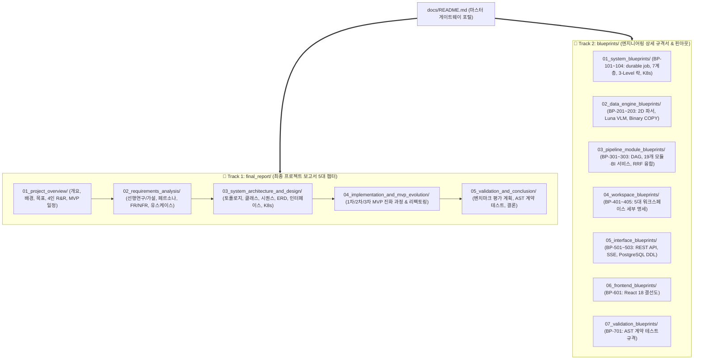

# 🏛️ bist-mini-final 시스템 마스터 아키텍처 포털 (System Master Gateway)
> **Project Version:** `0.1.0` | **Public API Version:** `2.4.0` | **Build Target:** Financial RAG, BI & Comparison Platform
> **Master Portals:** [📘 최종 프로젝트 보고서 (Final Report)](file:///c:/Repos/bist-mini-final/docs/final_report/) | [📐 엔지니어링 청사진 규격서 (Blueprints)](file:///c:/Repos/bist-mini-final/docs/blueprints/)

---

## 🧭 프로젝트 문서 체계 2대 트랙 구조 (Dual-Track Architecture)

`bist-mini-final`의 기술 문서는 **"비즈니스 서사 및 소프트웨어 공학 설계를 완결성 있게 설명하는 [최종 프로젝트 보고서]"**와 **"개발 및 리팩토링 시 실시간으로 참조하는 [엔지니어링 청사진 규격서]"**의 2대 트랙으로 체계적으로 분리되어 있습니다:

> **문서 해석 기준:** [`CURRENT_IMPLEMENTATION_BASELINE.md`](file:///c:/Repos/bist-mini-final/docs/CURRENT_IMPLEMENTATION_BASELINE.md)가 현재 구현의 요약 기준입니다. `blueprints/`는 실행 계약과 설계 결정, `final_report/`는 요구사항·설계·MVP 진화 이력을 설명합니다. 현재 기준은 19개 등록 파이프라인 모듈, 21개 BI 지표, 독립 Company Comparison 스냅샷 도메인, PostgreSQL 영속 상태, Redis 상태 변경 신호, KEDA 작업 런타임과 Excel embedding/COPY child shard 실행입니다. 로컬 VLM과 Cross-Encoder reranker는 범위에서 제외합니다.

---

# 📘 [Track 1] 최종 프로젝트 보고서 5대 챕터 색인 (Final Report Catalog)

### 제1장. 프로젝트 개요 (Chapter 1. Project Overview)
* [`SEC-101`](file:///c:/Repos/bist-mini-final/docs/final_report/01_project_overview/SEC-101_background_and_necessity.md): 주제 배경 및 필요성 (기업 재무 데이터 분석의 4대 한계 & 솔루션 필요성)
* [`SEC-102`](file:///c:/Repos/bist-mini-final/docs/final_report/01_project_overview/SEC-102_project_goals_and_vision.md): 프로젝트 목표 및 핵심 가치 (5대 핵심 가치 & 정량적 벤치마크 목표 KPI)
* [`SEC-103`](file:///c:/Repos/bist-mini-final/docs/final_report/01_project_overview/SEC-103_team_roles_and_matrix.md): 팀 구성 및 4인 역할 분담 (김지환, 전명준, 권혁준, 김정원 3단계 MVP 완결 R&R)
* [`SEC-104`](file:///c:/Repos/bist-mini-final/docs/final_report/01_project_overview/SEC-104_mvp_schedule_and_wbs.md): 3단계 MVP 개발 절차 및 총괄 수행 일정 (Gantt 마일스톤 & 상세 WBS)

### 제2장. 프로젝트 요구 분석 (Chapter 2. Requirements Analysis)
* [`SEC-201`](file:///c:/Repos/bist-mini-final/docs/final_report/02_requirements_analysis/SEC-201_prior_research_and_hypotheses.md): 선행 연구 조사 및 7대 아키텍처 가설 분석 (표 감지 대조군, Pixel RAG vs 셀 RAG 등)
* [`SEC-202`](file:///c:/Repos/bist-mini-final/docs/final_report/02_requirements_analysis/SEC-202_stakeholders_and_personas.md): 이해관계자 및 5대 페르소나 정의 (M&A, 펀드매니저, 전략기획실, 데이터/RAG 엔지니어)
* [`SEC-203`](file:///c:/Repos/bist-mini-final/docs/final_report/02_requirements_analysis/SEC-203_functional_and_nonfunctional_requirements.md): 기능적(FR) 및 비기능적(NFR) 요구사항 명세서 (IEEE 830 표준)
* [`SEC-204`](file:///c:/Repos/bist-mini-final/docs/final_report/02_requirements_analysis/SEC-204_use_case_modeling_and_traceability.md): 유스케이스 모델링 (UC-1~UC-6) 및 구현 추적성 매트릭스

### 제3장. 시스템 아키텍처 및 상세 설계 (Chapter 3. System Architecture & Design)
* [`SEC-301`](file:///c:/Repos/bist-mini-final/docs/final_report/03_system_architecture_and_design/SEC-301_system_topology_and_runtime.md): 시스템 전체 토폴로지 및 durable job 런타임 조감도 (PostgreSQL·Redis·KEDA)
* [`SEC-302`](file:///c:/Repos/bist-mini-final/docs/final_report/03_system_architecture_and_design/SEC-302_class_diagrams_and_contracts.md): 클래스 다이어그램 & 19개 파이프라인 모듈 입출력 계약
* [`SEC-303`](file:///c:/Repos/bist-mini-final/docs/final_report/03_system_architecture_and_design/SEC-303_sequence_diagrams.md): 동적 시퀀스 다이어그램 & 분산 동시성 런북 (REST/SSE 작업 상태와 3-Level 분산 락)
* [`SEC-304`](file:///c:/Repos/bist-mini-final/docs/final_report/03_system_architecture_and_design/SEC-304_database_erd_and_vector_schema.md): 데이터베이스 물리 설계 이력 및 PostgreSQL + pgvector ERD
* [`SEC-305`](file:///c:/Repos/bist-mini-final/docs/final_report/03_system_architecture_and_design/SEC-305_interface_specification.md): 인터페이스 설계 (FastAPI REST API 엔드포인트 & SSE 스트리밍 규격)
* [`SEC-306`](file:///c:/Repos/bist-mini-final/docs/final_report/03_system_architecture_and_design/SEC-306_infrastructure_and_deployment.md): 인프라 토폴로지 및 배포 환경 (Kubernetes KEDA ScaledJob & Docker)
* [`SEC-307`](file:///c:/Repos/bist-mini-final/docs/final_report/03_system_architecture_and_design/SEC-307_engineering_standards_and_tokens.md): 엔지니어링 표준 헌법 및 프론트엔드 디자인 토큰 (무손실 Decimal & Lucide SVG)

### 제4장. 시스템 구현 및 3단계 MVP 진화 과정 (Chapter 4. Implementation & MVP Evolution)
* [`SEC-401`](file:///c:/Repos/bist-mini-final/docs/final_report/04_implementation_and_mvp_evolution/SEC-401_mvp1_data_and_vision_pipeline.md): [1차 MVP 및 현재화] 엑셀 2D 파싱, 외부 vision 구조 감지 & Binary COPY 적재
* [`SEC-402`](file:///c:/Repos/bist-mini-final/docs/final_report/04_implementation_and_mvp_evolution/SEC-402_mvp2_orchestration_and_bi.md): [2차 MVP 이력] 초기 DAG 오케스트레이션, 쿼리 라우팅 & Financial BI 대시보드 구축
* [`SEC-403`](file:///c:/Repos/bist-mini-final/docs/final_report/04_implementation_and_mvp_evolution/SEC-403_mvp3_chatbot_and_comparison.md): [3차 MVP 및 현재화] AI 금융 챗봇, 버전형 기업 비교 스냅샷 & UI/a11y 고도화
* [`SEC-404`](file:///c:/Repos/bist-mini-final/docs/final_report/04_implementation_and_mvp_evolution/SEC-404_refactoring_and_code_governance.md): 전사 코드베이스 리팩토링 및 아키텍처 거버넌스

### 제5장. 품질 검증 및 결론 (Chapter 5. Validation & Conclusion)
* [`SEC-501`](file:///c:/Repos/bist-mini-final/docs/final_report/05_validation_and_conclusion/SEC-501_benchmark_evaluation_plan.md): 정량적 벤치마크 평가 하네스 및 목표 KPI 검증 계획
* [`SEC-502`](file:///c:/Repos/bist-mini-final/docs/final_report/05_validation_and_conclusion/SEC-502_contract_testing_results.md): AST 아키텍처 불변식 정적 계약 테스트 결과 (`test_architecture_contracts.py`)
* [`SEC-503`](file:///c:/Repos/bist-mini-final/docs/final_report/05_validation_and_conclusion/SEC-503_conclusion_and_roadmap.md): 결론, 기대효과 및 향후 발전 로드맵

---

# 📐 [Track 2] 엔지니어링 청사진 규격서 색인 (Blueprints Catalog)

| 도메인 | 청사진 번호 & 문서명 | 핵심 기술 스펙 및 내용 |
| :--- | :--- | :--- |
| **01. System** | [`BP-101`](file:///c:/Repos/bist-mini-final/docs/blueprints/01_system_blueprints/BP-101_system_architecture_blueprint.md) | durable job 토폴로지, PostgreSQL 영속 상태, Redis 신호 및 KEDA 런타임 |
| | [`BP-102`](file:///c:/Repos/bist-mini-final/docs/blueprints/01_system_blueprints/BP-102_backend_layered_architecture.md) | 7계층 클린 아키텍처 & 의존성 역전 원칙(DIP) |
| | [`BP-103`](file:///c:/Repos/bist-mini-final/docs/blueprints/01_system_blueprints/BP-103_concurrency_and_locking_model.md) | 3-Level 분산 락, 하트비트 Lease & 장애 복구 런북 |
| | [`BP-104`](file:///c:/Repos/bist-mini-final/docs/blueprints/01_system_blueprints/BP-104_deployment_and_infra_topology.md) | Helm·Kubernetes KEDA ScaledJob, TriggerAuthentication 및 `/api/v1/jobs` |
| **02. Data Engine** | [`BP-201`](file:///c:/Repos/bist-mini-final/docs/blueprints/02_data_engine_blueprints/BP-201_spreadsheet_coordinate_parser.md) | OpenPyXL 병합 해제 및 2D 직교 좌표계 정규화 |
| | [`BP-202`](file:///c:/Repos/bist-mini-final/docs/blueprints/02_data_engine_blueprints/BP-202_luna_vlm_vision_detector.md) | 외부 OpenAI vision 기반 시트 구조 감지; 로컬 VLM 제외 |
| | [`BP-203`](file:///c:/Repos/bist-mini-final/docs/blueprints/02_data_engine_blueprints/BP-203_binary_copy_vector_pipeline.md) | PostgreSQL Native `Binary COPY` 3072d 고속 벌크 주입 |
| **03. Pipeline** | [`BP-301`](file:///c:/Repos/bist-mini-final/docs/blueprints/03_pipeline_module_blueprints/BP-301_dag_execution_engine.md) | Kahn 위상정렬 DAG, durable queue 실행 및 FSM |
| | [`BP-302`](file:///c:/Repos/bist-mini-final/docs/blueprints/03_pipeline_module_blueprints/BP-302_module_pinout_catalog.md) | `ModuleRegistry` 기준 19개 원자적 파이프라인 모듈 계약 |
| | [`BP-303`](file:///c:/Repos/bist-mini-final/docs/blueprints/03_pipeline_module_blueprints/BP-303_hybrid_retrieval_and_fusion.md) | Dense(3072d) + Sparse(BM25) + RRF($k=60$) 융합 검색 |
| **04. Workspaces** | [`BP-401`](file:///c:/Repos/bist-mini-final/docs/blueprints/04_workspace_blueprints/BP-401_ws_pipeline_playground.md) | 모듈 카탈로그, DAG 실행 및 SSE 상태 스트림 |
| | [`BP-402`](file:///c:/Repos/bist-mini-final/docs/blueprints/04_workspace_blueprints/BP-402_ws_data_sources_management.md) | 스프레드시트 미리보기 및 영속 ingestion job 관리 |
| | [`BP-403`](file:///c:/Repos/bist-mini-final/docs/blueprints/04_workspace_blueprints/BP-403_ws_financial_bi_analytics.md) | 21개 근거 기반 BI 지표와 재무 분석 화면 |
| | [`BP-404`](file:///c:/Repos/bist-mini-final/docs/blueprints/04_workspace_blueprints/BP-404_ws_ai_financial_chatbot.md) | RAG 실행 작업, 상태 조회 및 대화형 챗봇 |
| | [`BP-405`](file:///c:/Repos/bist-mini-final/docs/blueprints/04_workspace_blueprints/BP-405_ws_company_comparison.md) | 검증된 BI 원천 기반 버전형 기업 비교 스냅샷과 재무 순위·선택 비교 |
| **05. Interface** | [`BP-501`](file:///c:/Repos/bist-mini-final/docs/blueprints/05_interface_blueprints/BP-501_rest_api_specification.md) | FastAPI REST API 엔드포인트 & 표준 에러 엔벨로프 |
| | [`BP-502`](file:///c:/Repos/bist-mini-final/docs/blueprints/05_interface_blueprints/BP-502_sse_streaming_protocol.md) | Server-Sent Events(SSE) 실시간 스트리밍 프로토콜 |
| | [`BP-503`](file:///c:/Repos/bist-mini-final/docs/blueprints/05_interface_blueprints/BP-503_database_erd_and_ddl.md) | Alembic 관리 PostgreSQL·pgvector·버전형 도메인 스냅샷 ERD & DDL |
| **06. Frontend** | [`BP-601`](file:///c:/Repos/bist-mini-final/docs/blueprints/06_frontend_blueprints/BP-601_frontend_component_wiring.md) | React 18 SPA 컴포넌트 배선도 & a11y 표준 모달 |
| **07. Validation** | [`BP-701`](file:///c:/Repos/bist-mini-final/docs/blueprints/07_validation_blueprints/BP-701_contract_testing_and_benchmarks.md) | AST 아키텍처 계약 검증 & 정량 벤치마크 하네스 |
