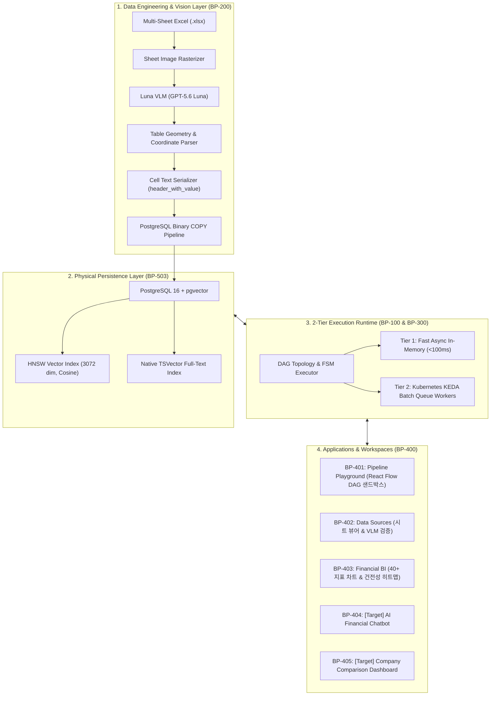
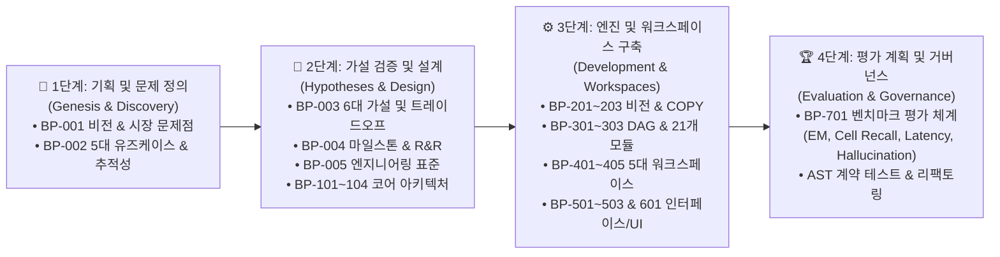
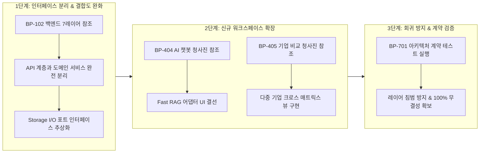

# [BP-000] 엔터프라이즈 재무 RAG & 시각화 플랫폼 마스터 청사진 포털
> **Project:** `bist-mini-final` (Enterprise Multi-Sheet Financial RAG & Visualizer Platform)  
> **Document Code:** `BP-000` | **Version:** `3.1.0` | **Classification:** Master Blueprint Portal & Engineering Lifecycle Story

---

## 1. 프로젝트 총괄 개요 (Executive Summary)

`bist-mini-final`은 복잡한 2D 다중 시트 기업 재무제표(`.xlsx`, `.xlsm`) 데이터를 **시각적 비전 모델(Luna VLM)**과 **고속 하이브리드 RAG(Dense 3072d + Sparse BM25 + RRF)**, **2-Tier DAG 실행 엔진** 및 **무손실 고정소수점(`Decimal`) 40+ 전사 재무 지표 엔진**을 융합하여 완벽하게 처리하는 엔터프라이즈급 AI 플랫폼입니다.

본 마스터 포털은 시스템 기획부터 비전 파이프라인, 코어 DAG, 21개 모듈, 5대 워크스페이스, REST/SSE/DB 인터페이스, 프론트엔드 및 계약 검증까지 **총 8대 도메인 25개 정밀 엔지니어링 청사진 규격서의 단일 진실 공급원(Single Source of Truth)**으로 기능합니다.

---

## 2. 4단계 엔지니어링 라이프사이클 스토리 (The 4-Stage Engineering Narrative)

본 시스템은 **문제 발견 ➡️ 가설 수립 및 설계 ➡️ 모듈/앱 개발 ➡️ 벤치마크 평가 계획 및 거버넌스**의 4단계 엔드투엔드 라이프사이클을 거쳐 체계화되었습니다:

| 개발 단계 | 핵심 질문 및 해결 과제 | 주요 수록 문서 | 핵심 산출물 및 증명 내용 |
| :--- | :--- | :--- | :--- |
| **Stage 1: 기획 & 문제 정의** | • 왜 기존 LLM/RAG가 재무 엑셀에서 실패하는가? • 비즈니스 사용자가 원하는 핵심 기능은 무엇인가? | [`BP-001`](file:///c:/Repos/bist-mini-final/docs/00_master_plan_and_standards/BP-001_business_vision_and_executive_summary.md) [`BP-002`](file:///c:/Repos/bist-mini-final/docs/00_master_plan_and_standards/BP-002_core_use_cases_and_workflows.md) | • 2D 기하 구조 소실 및 부동소수점 오차 원인 분석 • 5대 유즈케이스(UC-1~UC-5) 및 6차원 추적성 매트릭스 수립 |
| **Stage 2: 가설 검증 & 설계** | • 어떤 기술적 가설과 공학적 원리로 아키텍처를 결정했는가? • 인프라와 표준 헌법은 어떻게 구성되는가? | [`BP-003`](file:///c:/Repos/bist-mini-final/docs/00_master_plan_and_standards/BP-003_architecture_decision_and_hypotheses.md) [`BP-004`](file:///c:/Repos/bist-mini-final/docs/00_master_plan_and_standards/BP-004_project_timeline_and_role_distribution.md) [`BP-005`](file:///c:/Repos/bist-mini-final/docs/00_master_plan_and_standards/BP-005_engineering_standards_and_code_conventions.md) [`BP-101`](file:///c:/Repos/bist-mini-final/docs/01_system_blueprints/BP-101_system_architecture_blueprint.md)~[`104`](file:///c:/Repos/bist-mini-final/docs/01_system_blueprints/BP-104_deployment_and_infra_topology.md) | • 비전 VLM, Binary COPY, RRF 융합 등 6대 가설 트레이드오프 분석 • Pydantic DTO 100% 타입화 헌법 및 2-Tier 런타임/3-Level 락 설계 |
| **Stage 3: 엔진 개발 & 구축** | • 파이프라인 21개 모듈과 5대 워크스페이스는 어떻게 구현되었는가? • 백엔드/프론트엔드/DB는 어떻게 연결되는가? | [`BP-201`](file:///c:/Repos/bist-mini-final/docs/02_data_engine_blueprints/BP-201_spreadsheet_coordinate_parser.md)~[`203`](file:///c:/Repos/bist-mini-final/docs/02_data_engine_blueprints/BP-203_binary_copy_vector_pipeline.md) [`BP-301`](file:///c:/Repos/bist-mini-final/docs/03_pipeline_module_blueprints/BP-301_dag_execution_engine.md)~[`303`](file:///c:/Repos/bist-mini-final/docs/03_pipeline_module_blueprints/BP-303_hybrid_retrieval_and_fusion.md) [`BP-401`](file:///c:/Repos/bist-mini-final/docs/04_workspace_blueprints/BP-401_ws_pipeline_playground.md)~[`405`](file:///c:/Repos/bist-mini-final/docs/04_workspace_blueprints/BP-405_ws_company_comparison.md) [`BP-501`](file:///c:/Repos/bist-mini-final/docs/05_interface_blueprints/BP-501_rest_api_specification.md)~[`601`](file:///c:/Repos/bist-mini-final/docs/06_frontend_blueprints/BP-601_frontend_component_wiring.md) | • OpenPyXL 파서, Luna VLM 바운딩박스, pgvector Binary COPY 파이프라인 • 21개 모듈 핀아웃, React Flow DAG 빌더, 40+ 재무 BI 대시보드 |
| **Stage 4: 평가 계획 & 거버넌스** | • 구축된 시스템의 성능과 정확도는 어떤 지표로 측정하는가? • 향후 리팩토링 시 아키텍처 침범을 어떻게 방지하는가? | [`BP-701`](file:///c:/Repos/bist-mini-final/docs/07_validation_blueprints/BP-701_contract_testing_and_benchmarks.md) [`README`](file:///c:/Repos/bist-mini-final/docs/README.md#5-리팩토링-및-불변식-검증-가이드-refactoring-safety-workflow) | • Ground-Truth 데이터셋 기반 **EM, Recall, Latency, Hallucination** 평가 기준 수립 • AST 아키텍처 불변식 정적 계약 테스트 및 회귀 방지 체계 |

---

## 3. 8대 도메인 25개 마스터 청사진 매트릭스 (Master Blueprint Matrix)

| 영역 (Domain) | 문서 코드 | 문서명 및 핵심 설계 내용 | 주요 대상 코드 / 리팩토링 타깃 |
| :--- | :--- | :--- | :--- |
| **00. 마스터 계획 & 표준** | [BP-001](file:///c:/Repos/bist-mini-final/docs/00_master_plan_and_standards/BP-001_business_vision_and_executive_summary.md) | **사업 비전 & 총괄 개요서** 산업 문제점, 5대 핵심 가치, 벤치마크 평가 계획, ROI 분석 | 전사 기획서, IR 덱 |
| | [BP-002](file:///c:/Repos/bist-mini-final/docs/00_master_plan_and_standards/BP-002_core_use_cases_and_workflows.md) | **핵심 비즈니스 유즈케이스 & 워크플로우 명세서** 5대 워크스페이스(UC-1~UC-5) 페르소나 및 입력/출력 흐름 | `frontend/src/features/`, E2E 시나리오 |
| | [BP-003](file:///c:/Repos/bist-mini-final/docs/00_master_plan_and_standards/BP-003_architecture_decision_and_hypotheses.md) | **아키텍처 결정 배경 & 6대 가설 분석서** 대조군 vs 채택안 엔지니어링 트레이드오프 분석 | 아키텍처 결정 레코드 (ADR) |
| | [BP-004](file:///c:/Repos/bist-mini-final/docs/00_master_plan_and_standards/BP-004_project_timeline_and_role_distribution.md) | **프로젝트 마일스톤 타임라인 & 역할 분배 (R&R)** 스프린트 1~6 Gantt 마일스톤, 5대 Lead 엔지니어링 책임 | 프로젝트 관리 및 스프린트 WBS |
| | [BP-005](file:///c:/Repos/bist-mini-final/docs/00_master_plan_and_standards/BP-005_engineering_standards_and_code_conventions.md) | **엔지니어링 코드 컨벤션 & 구현 표준 규격서** Pydantic DTO 100% 타입화, 제로 보일러플레이트, Lucide SVG 표준 | [`.agents/rules/code-style-guide.md`](file:///c:/Repos/bist-mini-final/.agents/rules/code-style-guide.md), [`modules/common/`](file:///c:/Repos/bist-mini-final/modules/common/) |
| **01. 코어 아키텍처** | [BP-101](file:///c:/Repos/bist-mini-final/docs/01_system_blueprints/BP-101_system_architecture_blueprint.md) | **시스템 전체 배치도 & 2-Tier 런타임 토폴로지** Tier 1 Fast In-Memory + Tier 2 K8s KEDA 분산 배치 큐 | [`backend/bootstrap/container.py`](file:///c:/Repos/bist-mini-final/backend/bootstrap/container.py), [`backend/main.py`](file:///c:/Repos/bist-mini-final/backend/main.py) |
| | [BP-102](file:///c:/Repos/bist-mini-final/docs/01_system_blueprints/BP-102_backend_layered_architecture.md) | **백엔드 7단계 계층 설계도 & 인터페이스 결합도** Presentation ~ Storage 레이어 격리 및 DIP 규칙 | [`backend/api/`](file:///c:/Repos/bist-mini-final/backend/api/), [`backend/features/`](file:///c:/Repos/bist-mini-final/backend/features/), [`backend/storage/`](file:///c:/Repos/bist-mini-final/backend/storage/) |
| | [BP-103](file:///c:/Repos/bist-mini-final/docs/01_system_blueprints/BP-103_concurrency_and_locking_model.md) | **분산 락, 임차권(Lease) & 경합 회복 시퀀스** Worker Lease 토큰 및 고아 작업 회복 FSM, 운영 런북 | [`backend/engine/worker/lease.py`](file:///c:/Repos/bist-mini-final/backend/engine/worker/lease.py), [`backend/storage/db_manager.py`](file:///c:/Repos/bist-mini-final/backend/storage/db_manager.py) |
| | [BP-104](file:///c:/Repos/bist-mini-final/docs/01_system_blueprints/BP-104_deployment_and_infra_topology.md) | **K8s, KEDA ScaledJob & 인프라 토폴로지** k3d 클러스터, Ingress, Pod Spec, 배포 스크립트 | [`deploy/kubernetes/`](file:///c:/Repos/bist-mini-final/deploy/kubernetes/), [`deploy/kubernetes/local.sh`](file:///c:/Repos/bist-mini-final/deploy/kubernetes/local.sh) |
| **02. 데이터 엔지니어링** | [BP-201](file:///c:/Repos/bist-mini-final/docs/02_data_engine_blueprints/BP-201_spreadsheet_coordinate_parser.md) | **2D 그리드 셀 좌표계 파서 & 마크다운 직렬화** OpenPyXL 병합 해제, 좌표계 정규화, 계층 직렬화 | [`backend/storage/spreadsheets/`](file:///c:/Repos/bist-mini-final/backend/storage/spreadsheets/), [`modules/structure/cell_text_serializer.py`](file:///c:/Repos/bist-mini-final/modules/structure/cell_text_serializer.py) |
| | [BP-202](file:///c:/Repos/bist-mini-final/docs/02_data_engine_blueprints/BP-202_luna_vlm_vision_detector.md) | **Luna VLM 이미지 렌더링 & 표 바운딩박스 검출** Pillow 이미지 렌더링, GPT-5.6 Luna 구조 추론 | [`modules/structure/luna_vlm_structure_detector.py`](file:///c:/Repos/bist-mini-final/modules/structure/luna_vlm_structure_detector.py) |
| | [BP-203](file:///c:/Repos/bist-mini-final/docs/02_data_engine_blueprints/BP-203_binary_copy_vector_pipeline.md) | **대용량 바이너리 COPY & pgvector 인덱싱** PostgreSQL Native Binary 스트리밍 및 HNSW | [`backend/storage/pgvector_binary_copy.py`](file:///c:/Repos/bist-mini-final/backend/storage/pgvector_binary_copy.py), [`backend/storage/pgvector_store.py`](file:///c:/Repos/bist-mini-final/backend/storage/pgvector_store.py) |
| **03. 파이프라인 모듈** | [BP-301](file:///c:/Repos/bist-mini-final/docs/03_pipeline_module_blueprints/BP-301_dag_execution_engine.md) | **DAG 토폴로지 실행기 & 상태머신(FSM)** 위상 정렬, 노드 상태 전이, 에러 바운더리 격리 | [`backend/engine/workflows/executor.py`](file:///c:/Repos/bist-mini-final/backend/engine/workflows/executor.py), [`backend/engine/workflows/store.py`](file:///c:/Repos/bist-mini-final/backend/engine/workflows/store.py) |
| | [BP-302](file:///c:/Repos/bist-mini-final/docs/03_pipeline_module_blueprints/BP-302_21_modules_pinout_catalog.md) | **21개 모듈 입출력 핀아웃(Pinout) 카탈로그** 21개 단품 모듈별 Input/Output/Config 핀 규격서 | [`modules/`](file:///c:/Repos/bist-mini-final/modules/), [`backend/engine/runtime/registry.py`](file:///c:/Repos/bist-mini-final/backend/engine/runtime/registry.py) |
| | [BP-303](file:///c:/Repos/bist-mini-final/docs/03_pipeline_module_blueprints/BP-303_hybrid_retrieval_and_fusion.md) | **Dense + Sparse + RRF 융합 & 셀 확장 회로** pgvector 3072d + BM25 tsvector + RRF($k=60$) | [`modules/retrieval/`](file:///c:/Repos/bist-mini-final/modules/retrieval/) |
| **04. 워크스페이스** | [BP-401](file:///c:/Repos/bist-mini-final/docs/04_workspace_blueprints/BP-401_ws_pipeline_playground.md) | **[구현됨] Pipeline Playground 워크스페이스** React Flow 캔버스, 노드 커넥터, SSE 스트림 바인딩 | [`frontend/src/features/playground/`](file:///c:/Repos/bist-mini-final/frontend/src/features/playground/) |
| | [BP-402](file:///c:/Repos/bist-mini-final/docs/04_workspace_blueprints/BP-402_ws_data_sources_management.md) | **[구현됨] Data Sources Management 워크스페이스** 시트 뷰어, VLM 바운딩박스 오버레이, 색인 관리기 | [`frontend/src/features/data-sources/`](file:///c:/Repos/bist-mini-final/frontend/src/features/data-sources/) |
| | [BP-403](file:///c:/Repos/bist-mini-final/docs/04_workspace_blueprints/BP-403_ws_financial_bi_analytics.md) | **[구현됨] Financial BI Analytics 워크스페이스** 재무제표 프로파일러, 40+ 지표 공식, 스냅샷 | [`backend/features/bi/`](file:///c:/Repos/bist-mini-final/backend/features/bi/), [`frontend/src/features/bi/`](file:///c:/Repos/bist-mini-final/frontend/src/features/bi/) |
| | [BP-404](file:///c:/Repos/bist-mini-final/docs/04_workspace_blueprints/BP-404_ws_ai_financial_chatbot.md) | **[확장/예정] AI Financial Chatbot 상세 청사진** Fast RAG 어댑터 연동, 근거 표 바인딩, 대화 FSM | [`backend/features/bi/fast_rag_adapter.py`](file:///c:/Repos/bist-mini-final/backend/features/bi/fast_rag_adapter.py), [`frontend/src/pages/ChatbotPage.tsx`](file:///c:/Repos/bist-mini-final/frontend/src/pages/ChatbotPage.tsx) |
| | [BP-405](file:///c:/Repos/bist-mini-final/docs/04_workspace_blueprints/BP-405_ws_company_comparison.md) | **[확장/예정] Company Comparison 대시보드 청사진** 다중 기업 엔티티 추출, 지표 크로스 비교 매트릭스 | [`modules/storage/company_entity_extractor.py`](file:///c:/Repos/bist-mini-final/modules/storage/company_entity_extractor.py), [`frontend/src/pages/CompanyComparisonPage.tsx`](file:///c:/Repos/bist-mini-final/frontend/src/pages/CompanyComparisonPage.tsx) |
| **05. 인터페이스** | [BP-501](file:///c:/Repos/bist-mini-final/docs/05_interface_blueprints/BP-501_rest_api_specification.md) | **REST API 엔드포인트 & DTO 규격서** FastAPI 라우트별 Input/Output 스키마 & 에러 규격 | [`backend/api/`](file:///c:/Repos/bist-mini-final/backend/api/), [`backend/api/error_mapping.py`](file:///c:/Repos/bist-mini-final/backend/api/error_mapping.py) |
| | [BP-502](file:///c:/Repos/bist-mini-final/docs/05_interface_blueprints/BP-502_sse_streaming_protocol.md) | **SSE 실시간 파이프라인 스트리밍 규격서** Server-Sent Events 프레임, 하트비트, 라이브 업데이트 | [`backend/api/workflow_routes.py`](file:///c:/Repos/bist-mini-final/backend/api/workflow_routes.py), [`frontend/src/features/playground/`](file:///c:/Repos/bist-mini-final/frontend/src/features/playground/) |
| | [BP-503](file:///c:/Repos/bist-mini-final/docs/05_interface_blueprints/BP-503_database_erd_and_ddl.md) | **PostgreSQL + pgvector 물리 DDL & ERD** 10개 테이블 물리 스키마, 제약조건, 외래키, 인덱스 | [`backend/storage/db_manager.py`](file:///c:/Repos/bist-mini-final/backend/storage/db_manager.py), [`backend/features/bi/database_schema.py`](file:///c:/Repos/bist-mini-final/backend/features/bi/database_schema.py) |
| **06. 프론트엔드** | [BP-601](file:///c:/Repos/bist-mini-final/docs/06_frontend_blueprints/BP-601_frontend_component_wiring.md) | **React 18 프론트엔드 결선도 & 상태 아키텍처** Vite + React 18 + Tailwind v4, Ky 클라이언트, 라우팅 | [`frontend/src/`](file:///c:/Repos/bist-mini-final/frontend/src/) |
| **07. 품질 및 검증** | [BP-701](file:///c:/Repos/bist-mini-final/docs/07_validation_blueprints/BP-701_contract_testing_and_benchmarks.md) | **아키텍처 불변식 계약 테스트 & 벤치마크** Pytest 계약 검증, 정확도/재현율 평가 체계 | [`tests/`](file:///c:/Repos/bist-mini-final/tests/), [`backend/features/benchmark/`](file:///c:/Repos/bist-mini-final/backend/features/benchmark/) |

---

## 4. 역할별 맞춤형 추천 읽기 경로 (Recommended Reading Tracks)

```mermaid
flowchart TD
    START(["📘 마스터 청사진 시작 (docs/README.md)"])

    subgraph TrackA ["🚀 Track A: 제품 & 비즈니스 기획 흐름 (Product & Business Track)"]
        A1["BP-001: 사업 비전 & 총괄 개요"] --> A2["BP-002: 비즈니스 유즈케이스"]
        A2 --> A3["BP-401 ~ BP-405: 5대 워크스페이스"]
        A3 --> A4["BP-601: React SPA 결선도 & 라우트"]
    end

    subgraph TrackB ["⚙️ Track B: 데이터 & 파이프라인 심층 흐름 (Data & Pipeline Track)"]
        B1["BP-003: 가설 분석 & 트레이드오프"] --> B2["BP-201 ~ BP-203: 데이터 파싱 / VLM / COPY"]
        B2 --> B3["BP-301 ~ BP-303: DAG / 21개 모듈 / RRF 융합"]
        B3 --> B4["BP-501 ~ BP-503: REST API / SSE / 물리 ERD"]
    end

    subgraph TrackC ["🏗️ Track C: 인프라, 동시성, 표준 & QA 흐름 (DevOps & Standards Track)"]
        C1["BP-004: 마일스톤 타임라인 & R&R"] --> C2["BP-005: 엔지니어링 표준 컨벤션"]
        C2 --> C3["BP-101 ~ BP-104: 2-Tier 토폴로지 / 락 / K8s"]
        C3 --> C4["BP-701: AST 계약 검증 & 벤치마크"]
    end

    START --> TrackA
    START --> TrackB
    START --> TrackC
```

| 독자 역할 및 목적 | 권장 읽기 순서 (Document Navigation Journey) | 핵심 획득 역량 및 이해 목표 |
| :--- | :--- | :--- |
| **🚀 제품 기획자 / 풀스택 개발자** | [`BP-001`](file:///c:/Repos/bist-mini-final/docs/00_master_plan_and_standards/BP-001_business_vision_and_executive_summary.md) ➡️ [`BP-002`](file:///c:/Repos/bist-mini-final/docs/00_master_plan_and_standards/BP-002_core_use_cases_and_workflows.md) ➡️ [`BP-401`](file:///c:/Repos/bist-mini-final/docs/04_workspace_blueprints/BP-401_ws_pipeline_playground.md)~[`405`](file:///c:/Repos/bist-mini-final/docs/04_workspace_blueprints/BP-405_ws_company_comparison.md) ➡️ [`BP-601`](file:///c:/Repos/bist-mini-final/docs/06_frontend_blueprints/BP-601_frontend_component_wiring.md) | • 비즈니스 가치, 5대 워크스페이스 유즈케이스 및 프론트엔드 라우팅 흐름 이해 |
| **⚙️ AI / 데이터 엔지니어** | [`BP-003`](file:///c:/Repos/bist-mini-final/docs/00_master_plan_and_standards/BP-003_architecture_decision_and_hypotheses.md) ➡️ [`BP-201`](file:///c:/Repos/bist-mini-final/docs/02_data_engine_blueprints/BP-201_spreadsheet_coordinate_parser.md)~[`203`](file:///c:/Repos/bist-mini-final/docs/02_data_engine_blueprints/BP-203_binary_copy_vector_pipeline.md) ➡️ [`BP-301`](file:///c:/Repos/bist-mini-final/docs/03_pipeline_module_blueprints/BP-301_dag_execution_engine.md)~[`303`](file:///c:/Repos/bist-mini-final/docs/03_pipeline_module_blueprints/BP-303_hybrid_retrieval_and_fusion.md) ➡️ [`BP-501`](file:///c:/Repos/bist-mini-final/docs/05_interface_blueprints/BP-501_rest_api_specification.md)~[`503`](file:///c:/Repos/bist-mini-final/docs/05_interface_blueprints/BP-503_database_erd_and_ddl.md) | • 가설 분석, 엑셀 VLM 파싱, 21개 모듈 Pinout 및 하이브리드 RRF 수식 습득 |
| **🏗️ 시스템 아키텍트 / DevOps** | [`BP-004`](file:///c:/Repos/bist-mini-final/docs/00_master_plan_and_standards/BP-004_project_timeline_and_role_distribution.md) ➡️ [`BP-005`](file:///c:/Repos/bist-mini-final/docs/00_master_plan_and_standards/BP-005_engineering_standards_and_code_conventions.md) ➡️ [`BP-101`](file:///c:/Repos/bist-mini-final/docs/01_system_blueprints/BP-101_system_architecture_blueprint.md)~[`104`](file:///c:/Repos/bist-mini-final/docs/01_system_blueprints/BP-104_deployment_and_infra_topology.md) ➡️ [`BP-701`](file:///c:/Repos/bist-mini-final/docs/07_validation_blueprints/BP-701_contract_testing_and_benchmarks.md) | • 엔지니어링 표준 헌법, 3-Level 분산 락, K8s KEDA 큐잉 및 AST 정적 계약 검증 체계 확보 |

---

## 5. 리팩토링 및 불변식 검증 가이드 (Refactoring Safety Workflow)

1. **사전 규격 확인**: 수정할 모듈의 번호 청사진(`BP-XXX`)을 열어 **"I/O Pinout 규격"** 및 **"계층 간 의존성 방향"**을 확인합니다.
2. **리팩토링 포인트 참조**: 각 문서의 `Refactoring Targets & Debts` 항목에 명시된 기술 부채와 개선 권장안을 확인합니다.
3. **불변식 자동 검증**: 작업 후 `pytest tests/modules/test_architecture_contracts.py`를 실행하여 레이어 의존성 위반이 없는지 즉시 검증합니다.