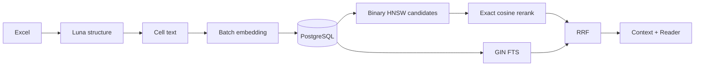

# ADR-001: PostgreSQL 하이브리드 검색과 bounded ingestion

- 상태: Accepted
- 기준일: 2026-08-23
- 영역: Excel ingestion, pgvector, dense/keyword retrieval

## 배경

재무 워크북은 의미 기반 검색과 계정명·기간·좌표 기반 검색을 모두 요구한다. 문서와 벡터를 Python 메모리에 전부 유지하거나 dense와 keyword 저장소를 분리하면 메모리 사용량, 네트워크 I/O, 동기화 실패 지점이 증가한다.

## 결정

PostgreSQL의 `langchain_pg_embedding`을 단일 저장소로 사용한다.

- `embedding`: collection-local binary-quantized HNSW 후보 검색과 exact cosine 재정렬
- `document`: `to_tsvector('simple', document)` GIN FTS
- `cmetadata`: workbook, company, sheet, cell lineage와 필터 index
- ingestion: bounded embedding batch와 content-addressed artifact
- fusion: dense와 keyword 순위를 RRF로 결합



## Dense index

Collection마다 dimension을 metadata에 저장하고 같은 collection과 dimension만 포함하는 partial HNSW index를 만든다.

```sql
CREATE INDEX CONCURRENTLY IF NOT EXISTS "idx_lc_hnsw_bq_c_<uuid>_<dimension>"
ON langchain_pg_embedding
USING hnsw (
  (binary_quantize(embedding)::bit(<dimension>)) bit_hamming_ops
)
WHERE collection_id = '<uuid>'::uuid
  AND vector_dims(embedding) = <dimension>;
```

검색은 Hamming distance로 최대 1,000개 후보를 제한한 뒤 원본 vector cosine distance로 top-k를 재정렬한다. collection UUID와 dimension은 SQL predicate에 고정해 PostgreSQL planner가 partial index를 선택할 수 있게 한다.

Query embedder는 collection loader의 `index_output`을 필수로 받아 동일 model과 dimension을 사용한다. 별도의 query-side 기본 model은 두지 않는다.

## Keyword index

```sql
CREATE INDEX CONCURRENTLY IF NOT EXISTS idx_langchain_pg_embedding_document_fts
ON langchain_pg_embedding
USING gin (to_tsvector('simple', document));
```

구조화 subquery에서는 `Row Header`, `Column Header`, 실제 `Cell Value`만 lexical term으로 사용한다. Company와 Sheet는 metadata predicate로 적용한다. scope 결과가 0건이면 동일 collection과 lexical term을 유지한 채 metadata predicate만 제거해 recall을 보존한다.

## Ingestion과 I/O

1. selector와 structure detector가 workbook lineage를 확정한다.
2. serializer가 셀 단위 대칭 문자열을 만든다.
3. embedder가 `batch_size` 단위로 인코딩해 artifact에 순차 기록한다.
4. writer가 문서, vector, metadata를 PostgreSQL에 적재한다.
5. HNSW와 GIN index가 같은 row 집합을 참조한다.

대형 vector 배열은 API 응답이나 workflow summary에 포함하지 않는다. worker의 progress/terminal update도 노드 단위로 저장한다.

## 실패 정책

검색 오류를 빈 검색 결과로 바꾸지 않는다. Dense direct SQL이 실패하면 다른 ORM/라이브러리 검색을 다시 호출하지 않고 `PgVectorStoreError`를 반환한다. Keyword의 scope 완화는 오류 대체 경로가 아니라 동일 쿼리의 명시적 recall 정책이다.

## 결과

- PostgreSQL 한 곳에서 dense, FTS, metadata lineage를 관리한다.
- embedding model/dimension mismatch를 DAG 계약에서 차단한다.
- 검색 hot path의 추가 connection과 중복 쿼리를 제거한다.
- 대용량 ingestion의 peak Python 메모리를 batch 크기로 제한한다.
- collection마다 index가 추가되므로 삭제 시 해당 HNSW index도 함께 제거해야 한다.
