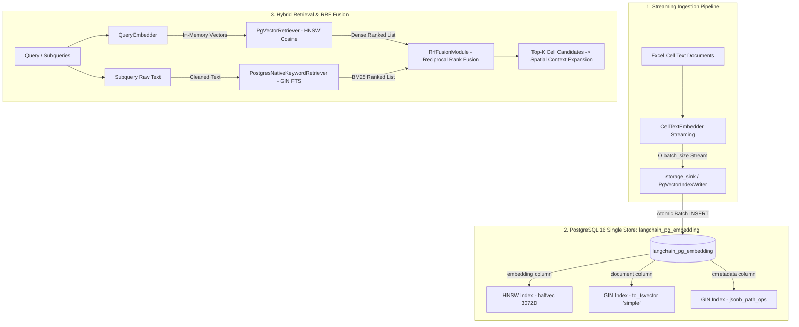

# ADR-001: Hybrid Indexing (Dense HNSW + Sparse GIN FTS) and Streaming Ingestion Strategy

* **Status**: Accepted
* **Date**: 2026-08-21
* **Deciders**: AI Engineering Team
* **Technical Domain**: Data Ingestion, Vector Database, Hybrid Retrieval, PostgreSQL pgvector

---

## 1. Context & Problem Statement

엑셀 스프레드시트 기반의 재무 및 정형 데이터 RAG(Retrieval-Augmented Generation) 시스템에서는 다음과 같은 상충되는 요구사항이 존재합니다:

1. **대용량 워크북 수집(Ingestion) 시의 메모리 폭증 위험**:
   - 수만 개의 셀(Cell Text Document)을 포함하는 대형 엑셀 파일 수집 시, 전체 임베딩 벡터를 Python 힙 메모리에 한꺼번에 누적하면 $O(N)$ 메모리 점유로 인해 OOM(Out-Of-Memory)이 발생할 수 있습니다.
2. **다양한 검색 질의 유형의 공존**:
   - **의미론적 질의 (Semantic)**: 유의어, 한영 용어 혼용, 자연어 의도 파악 (예: `"매출액 추이"`, `"영업익 변화"`, `"총 유동자산"`)
   - **어휘적/고유값 질의 (Lexical / Exact Match)**: 특정 계정과목명, 고유 명사, 셀 좌표, 표 번호, 숫자/코드 (예: `"P50"`, `"감가상각비"`, `"Sheet1!B10"`, `"2024.12"`)
3. **인덱스 간 데이터 일관성 및 운영 복잡도**:
   - Dense 벡터와 Sparse(BM25) 키워드 색인 저장소가 분리될 경우, 인덱스 동기화 지연(Sync Lag), 트랜잭션 불일치(Split-Brain), 인프라 비용 증가 문제가 발생합니다.

---

## 2. Decision Drivers (결정 고려 요인)

* **메모리 바운딩 (Bounded RAM)**: 대용량 워크북 색인 중에도 피크 메모리가 항상 $O(\text{batch\_size})$로 제한되어야 함.
* **데이터 원자성 및 일관성 (ACID & Zero Sync Lag)**: 단일 배치 쓰기 작업으로 Dense 및 Sparse 색인이 동시에 갱신되어야 함.
* **단일 메타데이터 필터링 (Unified Pre-filtering)**: `workbook_hash`, `sheet_name`, `company_name` 등의 필터가 Dense 및 Keyword 검색 양쪽에 동일하게 푸시다운되어야 함.
* **인프라 단순성 및 밀리초 레이턴시**: 외부 분산 검색 클러스터(Elasticsearch, Milvus 등) 없이도 고속 하이브리드 검색 및 RRF 결합이 가능해야 함.

---

## 3. Considered Options (고려된 대안들)

### Option 1: 이원화 저장소 (External Vector DB + External Keyword Engine)
- Dense는 Milvus / Qdrant / Pinecone, Keyword는 Elasticsearch / OpenSearch로 분리 운영.
- **단점**: 별도 JVM/분산 클러스터 운영 비용, 배치 적재 시 두 저장소 간 네트워크 이중화 및 롤백/동기화 불일치 위험.

### Option 2: 단일 저장소 듀얼 인덱싱 (PostgreSQL 16 + pgvector HNSW + GIN FTS) [선택]
- PostgreSQL 16의 단일 테이블(`langchain_pg_embedding`)에 원본 텍스트, 메타데이터, 고차원 벡터를 저장하고, **HNSW 인덱스**와 **GIN FTS 인덱스**를 동시 구축.
- **장점**: 단일 `INSERT`로 원자적 갱신, 동일 트랜잭션 보장, 메타데이터 필터 푸시다운 일원화, 인프라 비용 최소화.

### Option 3: 순수 인메모리 검색 (In-Memory Python Similarity)
- DB 없이 메모리 상에서 Numpy/Faiss 및 BM25 라이브러리로 직접 연산.
- **단점**: 영속성 부재, 워크북 크기 증가 시 서버 메모리 고갈, 다중 사용자 동시 쿼리 확장성 한계.

---

## 4. Decision Outcome (최종 결정)

**Option 2: PostgreSQL 16 단일 저장소 하이브리드 인덱싱(HNSW + GIN) 및 스트리밍 배치 수집 파이프라인**을 표준 아키텍처로 채택합니다.

---

## 5. Detailed Architecture & Implementation

### A. 인덱싱 아키텍처 다이어그램



---

### B. 인덱스 상세 스펙 (Database Index Specifications)

1. **Dense Vector Index (HNSW)**
   ```sql
   CREATE INDEX CONCURRENTLY IF NOT EXISTS idx_langchain_pg_embedding_hnsw_halfvec_3072
   ON langchain_pg_embedding
   USING hnsw ((embedding::halfvec(3072)) halfvec_cosine_ops)
   WHERE vector_dims(embedding) = 3072;
   ```
   - **역할**: 고차원 의미론적 유사도, 유의어, 약어 및 질문 의도 매칭

2. **Sparse / Keyword Index (GIN Full-Text Search)**
   ```sql
   CREATE INDEX CONCURRENTLY IF NOT EXISTS idx_langchain_pg_embedding_document_fts
   ON langchain_pg_embedding
   USING gin (to_tsvector('simple', document));
   ```
   - **역할**: 계정과목명, 고유 명칭, 셀 좌표(`A1`, `P50`), 숫자/기호 정확 일치

3. **Metadata & Coordinate Indexes**
   ```sql
   CREATE INDEX IF NOT EXISTS idx_langchain_pg_embedding_cmetadata
   ON langchain_pg_embedding
   USING gin (cmetadata jsonb_path_ops);

   CREATE INDEX CONCURRENTLY IF NOT EXISTS idx_langchain_pg_embedding_cell_id
   ON langchain_pg_embedding ((cmetadata->>'cell_id'));

   CREATE INDEX CONCURRENTLY IF NOT EXISTS idx_langchain_pg_embedding_workbook_hash
   ON langchain_pg_embedding ((cmetadata->>'workbook_hash'));
   ```
   - **역할**: 사전 필터링(Pre-filtering) 및 좌표 기반 직접 탐색(Direct Spatial Refinement) 고속화

---

### C. 모듈별 책임 및 스트리밍 파이프라인 계약

1. **`BaseEmbeddingModule` (`modules/common/embedder.py`)**:
   - `encode_batches_streaming(texts, batch_size, on_batch_complete)`:
     - 배치 슬라이싱, 인코더 실행, 토큰/비용 누적, 차원 유효성 검증 전담
     - 배치 완료 시 `on_batch_complete` 콜백을 트리거하고 제너레이터로 스트리밍
2. **`CellTextEmbedderModule` (`modules/embedding/cell_text_embedder.py`)**:
   - `storage_sink` 콜백을 주입받아 배치 완료 즉시 DB 적재를 호출하여 메모리 점유율을 $O(\text{batch\_size})$로 제한
3. **`QueryEmbedderModule` (`modules/embedding/query_embedder.py`)**:
   - 추론 단계의 소량 서브쿼리를 인메모리로 인코딩하여 즉시 `{subquery: vector}` 딕셔너리로 검색 모듈에 전달
4. **`RrfFusionModule` (`modules/retrieval/rrf_fusion.py`)**:
   - Dense 및 Keyword 검색 후보 순위를 결합하여 최적 후보 산출:
     $$RRF\_Score(d) = \sum_{m \in \{Dense, BM25\}} \frac{1}{k + rank_m(d)}$$

---

## 6. Consequences & Trade-offs (영향 및 트레이드오프)

### 긍정적 영향 (Pros)
* **메모리 안정성**: 수만 행의 엑셀 데이터 수집 중에도 Python 힙 메모리가 안정적으로 유지됨.
* **데이터 정합성**: Dense 벡터와 Full-Text 인덱스가 단일 트랜잭션 내에서 원자적으로 생성되어 동기화 불일치 0%.
* **검색 품질 향상**: 의미론적 유의어 검색(Dense)과 정확한 재무 계정명/좌표 매칭(BM25)의 장점이 RRF를 통해 완벽히 상호 보완됨.
* **운영 간소화**: 단일 PostgreSQL 인스턴스로 벡터 DB와 전문 검색엔진을 통합 운영하여 인프라 비용 및 장애 포인트 감소.

### 고려 사항 및 완화책 (Mitigations)
* **대량 쓰기 시 인덱스 오버헤드**: 대규모 인덱싱 중에는 `CREATE INDEX CONCURRENTLY` 및 배치 `COPY`/`executemany`를 사용하여 쓰기 지연을 최소화함.
* **pgvector 버전 의존성**: PostgreSQL 16 및 `pgvector` 0.7+ (HNSW halfvec 지원) 버전을 기본 런타임으로 표준화함.
