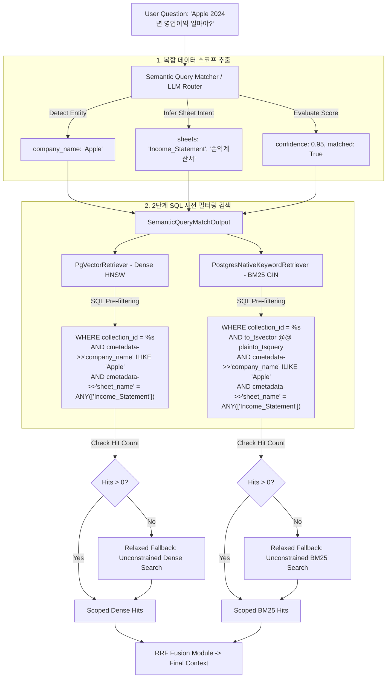

# ADR-002: Semantic Query Data Scope Routing & SQL Metadata Pre-filtering (Company & Sheet Scoping)

* **Status**: Accepted
* **Date**: 2026-08-21
* **Deciders**: AI Engineering Team
* **Technical Domain**: Query Understanding, Semantic Routing, Multi-Tenant Isolation, Database Metadata Pre-filtering

---

## 1. Context & Problem Statement (배경 및 문제 정의)

다수의 기업 엑셀 워크북(다중 테넌트/다중 파일)을 수집하여 단일 PostgreSQL pgvector 데이터베이스에 색인할 때 다음과 같은 구조적 문제가 발생합니다:

1. **동일한 시트명의 범용성 (Sheet Name Collision)**:
   - 대부분의 기업 재무제표 및 비즈니스 워크북은 동일한 시트명(`Income_Statement`, `Balance_Sheet`, `Key_Stats`, `Ratios`, `Sheet1` 등)을 공유합니다.
   - 시트명(`sheet_name`)만으로 데이터 스코프를 제한할 경우, A 기업 질의에 B 기업의 동일 시트 데이터가 검색되는 **기업 간 데이터 오염(Cross-Company Noise)**이 발생합니다.
2. **전역 비제약 검색(`Sheet: ?`)의 한계**:
   - 시트 및 기업 범위를 지정하지 않고 전역 검색을 수행하면, 검색 후보 Top-K 공간이 타 기업 및 무관한 시트의 유사 셀들로 낭비되어 실제 정답 셀의 순위가 밀려나는 현상이 발생합니다.
3. **과도한 필터링으로 인한 검색 실패(Zero Recall) 위험**:
   - 질문에서 추론된 기업명이나 시트명이 실제 DB 메타데이터와 미세하게 다를 경우, 엄격한 SQL 필터링이 0건의 결과를 반환하여 전체 답변 생성이 실패할 위험이 존재합니다.

---

## 2. Decision Drivers (결정 고려 요인)

* **다중 기업 격리성 (Multi-Tenant & Multi-Workbook Isolation)**: 질문에 언급된 기업명(`company_name`)과 시트 목록(`sheet_names`)의 복합 튜플로 검색 대상을 유니크하게 한정.
* **SQL 사전 필터링 푸시다운 (Pre-filtering Pushdown)**: 벡터 거리 연산 및 FTS 전문검색 이전에 DB 인덱스 레벨에서 대상 행을 축소하여 **정확도(Precision) 극대화 및 검색 레이턴시 단축**.
* **안전한 제로 리콜 방지 (Automatic Relaxed Fallback)**: 사전 필터링 검색 결과가 0건일 경우, 자동으로 필터를 완화하여 전역 검색을 수행함으로써 **재현율(Recall) 100% 보장**.
* **질의 텍스트와 문서 텍스트의 의미론적 정렬**: 스코프 확정 시 서브쿼리의 `Sheet: ?`를 실제 대상 시트명으로 구체화하여 임베딩 코사인 유사도 향상.

---

## 3. Considered Options (고려된 대안들)

### Option 1: 전역 비제약 검색 후 사후 필터링 (Post-filtering)
- DB에서는 전체 검색을 수행하고 Python 메모리 상에서 기업명/시트명을 사후 필터링.
- **단점**: Top-K 버퍼가 타 기업 데이터로 채워져 실제 정답 셀이 Top-K 내에 진입하지 못하는 심각한 재현율 저하 발생.

### Option 2: 시트명 단일 필터링 (Sheet-Only Pre-filtering)
- `cmetadata->>'sheet_name'`만으로 필터링.
- **단점**: 다수의 기업 워크북이 동일한 `Income_Statement` 시트를 가지므로 타 기업 데이터 누수 및 혼선 방지 불가.

### Option 3: 복합 데이터 스코프 라우팅 & SQL 사전 필터링 + 자동 릴랙스 폴백 [선택]
- 라우터가 `(company_name, sheets)` 복합 스코프를 추론.
- DB 레벨에서 `company_name ILIKE ... AND sheet_name = ANY(...)`를 동시 적용.
- 검색 결과 부재 시 자동 전역 검색으로 폴백.

---

## 4. Decision Outcome (최종 결정)

**Option 3: `(company_name, sheet_names)` 복합 데이터 스코프 라우팅 및 2단계 SQL 사전 필터링(Pre-filtering + Relaxed Fallback)** 아키텍처를 표준으로 채택합니다.

---

## 5. Detailed Architecture & Implementation

### A. 데이터 스코프 라우팅 및 검색 흐름 다이어그램



---

### B. 데이터베이스 스키마 및 인덱스 최적화

1. **기업명 B-Tree 인덱스 구축**
   ```sql
   CREATE INDEX CONCURRENTLY IF NOT EXISTS idx_langchain_pg_embedding_company_name
   ON langchain_pg_embedding ((cmetadata->>'company_name'));
   ```
2. **시트명 및 메타데이터 GIN 인덱스**
   ```sql
   CREATE INDEX IF NOT EXISTS idx_langchain_pg_embedding_cmetadata
   ON langchain_pg_embedding USING gin (cmetadata jsonb_path_ops);
   ```

---

### C. 계층별 구현 사양 (Implementation Specifications)

#### 1. 시맨틱 라우터 계층 ([modules/query/semantic_query_matcher.py](../../modules/query/semantic_query_matcher.py))
- `SemanticQueryMatchOutput` DTO 스펙:
  ```python
  class SemanticQueryMatchOutput(ModuleDTO):
      matched: bool
      target: Optional[str]
      confidence: float
      sheets: List[str]
      company_name: Optional[str] = Field(default=None, description="질문에서 추출된 대상 기업명")
      reason: str
      matches: List[SemanticMatchItemDTO]
      subqueries: List[str]
  ```
- LLM 라우터 프롬프트 가이드에 기업명(`company_name`) 및 대상 시트(`sheets`) 동시 감지 규칙 적용.

#### 2. PostgreSQL 저장소 계층 ([backend/storage/pgvector_store.py](../../backend/storage/pgvector_store.py))
- `similarity_search_by_vector_with_score(..., sheet_names=None, company_name=None)`:
  - 동적 SQL `WHERE` 절 조합:
    ```sql
    WHERE collection_id = %s
      AND (%s IS NULL OR cmetadata->>'company_name' ILIKE %s OR cmetadata->>'company_name' = %s)
      AND (%s IS NULL OR cmetadata->>'sheet_name' = ANY(%s))
    ```

#### 3. 하이브리드 검색기 계층
- **Dense Retriever ([modules/retrieval/pgvector_retriever.py](../../modules/retrieval/pgvector_retriever.py))**:
  - `semantic_match`로부터 `(scoped_company, allowed_sheets)`를 추출하여 pgvector 쿼리에 전달.
  - 필터링 결과가 비어있을 경우 자동 릴랙스 전역 검색 수행.
- **BM25 / FTS Retriever ([modules/retrieval/postgres_native_keyword_retriever.py](../../modules/retrieval/postgres_native_keyword_retriever.py))**:
  - 동일한 `(company_name, sheet_name)` SQL 조건을 전문검색 쿼리에 바인딩하고 결과 0건 시 릴랙스 전역 검색 폴백.

---

## 6. Consequences & Benefits (기대 효과 및 이점)

1. **다중 기업 워크북 환경에서 노이즈 100% 격리**:
   - 서로 다른 기업이 동일한 `Income_Statement` 시트명을 가지더라도, 기업명 필터를 통해 대상 기업의 셀만 정확하게 추출.
2. **검색 품질 및 순위 정확도 극대화**:
   - 무관한 시트(예: 자산 질의 시 손익계산서 시트 등)가 사전에 배제되어, Top-K 후보 버퍼가 질문과 직접 관련된 핵심 셀들로만 집중 구성됨.
3. **견고한 장애 방지 (Fail-Safe & High Recall)**:
   - 오분류나 지나치게 협소한 필터링으로 인해 0건이 반환되더라도 즉각적인 2단계 릴랙스 폴백으로 응답 중단 위험을 원천 방지.
