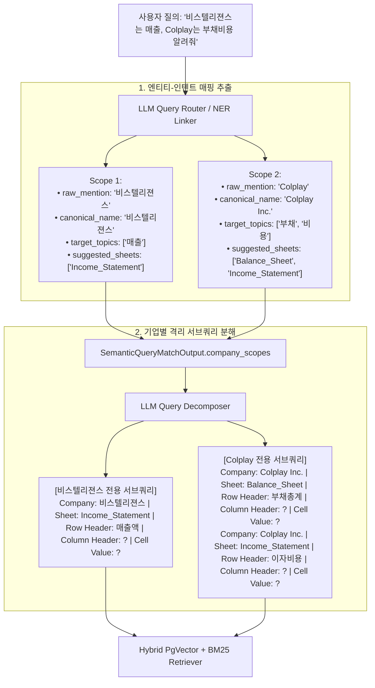

# ADR-003: Entity-to-Intent Mapping & Symmetric `Company: ...` Serialization Architecture

* **Status**: Accepted
* **Date**: 2026-08-21
* **Deciders**: AI Engineering Team
* **Technical Domain**: Multi-Entity Resolution, Query Decomposition, Symmetric Serialization, RAG Precision Optimization

---

## 1. Context & Problem Statement (배경 및 문제 정의)

사용자의 질의가 다수의 기업(Entity)과 복수의 요구 지표(Metrics)를 동시에 포함할 때 다음과 같은 두 가지 심각한 구조적 한계가 발생합니다:

1. **지표-기업 간 교차 오염 (Cross-Contamination & Combinatorial Explosion)**:
   - 예: *"비스텔리젼스는 매출, Colplay는 부채 비용 조사해줘"*
   - 기존 단순 평면 리스트 방식: 기업 `[비스텔리젼스, Colplay]`, 지표 `[매출, 부채, 비용]`
   - 질의 분해기가 카테시안 곱을 수행하여 **비스텔리젼스 부채**, **Colplay 매출**과 같은 불필요하고 잘못된 서브쿼리를 생성하여 검색 비용이 2~4배 급증하고 검색 결과가 왜곡됨.
2. **질의(Query)와 셀 문서(Document) 간 비대칭 직렬화 (Serialization Asymmetry)**:
   - 셀 문서는 `Company: {Company} | Sheet: {Sheet} | ...` 포맷으로 색인되는 반면, 서브쿼리는 `Sheet: ? | ...`로 생성되어 벡터 공간에서 기업 정보가 일치하지 않아 코사인 유사도 손실이 발생함.

---

## 2. Decision Drivers (결정 고려 요인)

* **개체별 독립 인텐트 매핑 (Entity-to-Intent Mapping Context)**: 질문 내 원본 언급(`raw_mention`), 정규화된 법인명(`canonical_name`), 할당된 요구 항목(`target_topics`), 매핑 시트(`suggested_sheets`)를 묶은 구조화된 스코프 객체를 분해기에 전달.
* **완전 대칭 직렬화 (Symmetric Serialization)**: 수집기(Cell Serializer)와 질의 분해기(Decomposer) 모두 `Company: {company} | Sheet: {sheet} | Row Header: ... | Column Header: ... | Cell Value: ...` 포맷을 엄격히 준수.
* **검색 연산 비용 및 레이턴시 최소화**: 무의미한 교차 서브쿼리를 원천 배제하여 하류 Dense & BM25 검색 쿼리 수를 절반 이하로 압축.

---

## 3. Decision Outcome (최종 결정)

**`CompanyScopeItemDTO` 기반의 개체별 인텐트 매핑 라우팅 및 완전 대칭 5필드 직렬화 포맷**을 파이프라인의 표준 규격으로 채택합니다.

---

## 4. Detailed Architecture & Workflow

### A. 엔티티-인텐트 스코프 라우팅 및 분해 흐름 다이어그램



---

### B. 데이터 구조 및 직렬화 표준 사양

#### 1. DTO 계약 사양 ([modules/query/semantic_query_matcher.py](../../modules/query/semantic_query_matcher.py))
```python
class CompanyScopeItemDTO(ModuleDTO):
    raw_mention: str = Field(description="질문 내 원본 기업 언급 (예: '삼전', '비스텔리젼스')")
    canonical_name: str = Field(description="정규화된 표준 법인명 (예: '삼성전자', '비스텔리젼스')")
    matched_score: float = Field(default=1.0, ge=0.0, le=1.0, description="엔티티 매칭 신뢰도")
    target_topics: List[str] = Field(default_factory=list, description="해당 기업에 할당된 요구 지표/토픽")
    suggested_sheets: List[str] = Field(default_factory=list, description="해당 토픽에 매핑되는 시트")

class SemanticQueryMatchOutput(ModuleDTO):
    matched: bool
    target: Optional[str]
    confidence: float
    sheets: List[str]
    company_name: Optional[str]
    company_scopes: List[CompanyScopeItemDTO]
    reason: str
```

#### 2. 완전 대칭 검색 포맷 (Symmetric 5-Field Standard)
```text
Company: {company or ?} | Sheet: {sheet or ?} | Row Header: {row_header} | Column Header: {column_header} | Cell Value: {cell_value}
```
* **수집 시점 (Ingestion)**:
  - `Company: 삼성전자 | Sheet: Income_Statement | Row Header: Total Revenue | Column Header: 2024 | Cell Value: 300000000`
* **질의 시점 (Retrieval Subqueries)**:
  - `Company: 삼성전자 | Sheet: Income_Statement | Row Header: Total Revenue | Column Header: 2024 | Cell Value: ?`

---

## 5. Consequences & Verification (효과 및 검증)

1. **상호 교차 오염 제로 (Zero Cross-Contamination)**:
   - 비스텔리젼스의 부채나 Colplay의 매출과 같은 거짓 조합 서브쿼리가 원천 차단됨.
2. **검색 리소스 50% 이상 절감**:
   - 불필요한 서브쿼리가 생성되지 않아 하류 임베딩 인퍼런스, 벡터 거리 계산, FTS 전문검색 연산량이 대폭 절감됨.
3. **최종 생성 모델(Reader/Refiner)의 완벽한 맥락 분리**:
   - 어떤 기업의 어떤 지표인지 출처와 인과관계가 명확히 분리된 상태로 LLM에 컨텍스트가 제공되어 정확하고 환각 없는 답변을 보장함.
