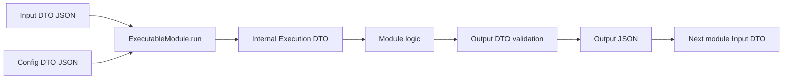
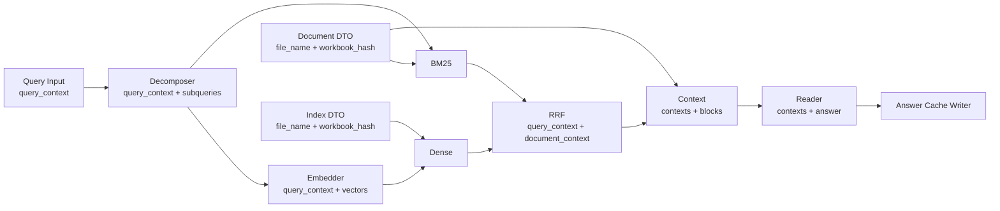

# Backend module architecture

백엔드의 최소 실행 단위는 `ExecutableModule`입니다. 프론트 워크플로, REST API, CLI가 모두 `ModuleRegistry`와 동일한 실행 경로를 사용합니다.



## DTO layers

| Layer | 책임 | 공개 여부 |
|---|---|---|
| `InputDTO` | 이번 실행에서 처리할 데이터와 데이터 정체성 | REST·CLI·워크플로 공개 계약 |
| `ConfigDTO` | 같은 입력을 어떤 정책으로 처리할지 결정하는 설정 | REST·CLI·워크플로 공개 계약 |
| `ExecutionDTO` | Input과 Config를 합친 모듈 내부 실행 뷰 | 내부 전용 |
| `OutputDTO` | 다음 모듈 또는 외부 호출자에게 전달할 결과 | 공개 계약 |
| `ExecutionRequestDTO` | `{input, config}` 독립 실행 envelope | REST·CLI 공개 계약 |

모든 DTO는 선언하지 않은 필드를 거부합니다. Input과 Config의 필드 교집합, `ConfigDTO`와 `ModuleDefinition.config_fields` 불일치, Execution DTO의 합성 오류는 모듈 등록 시 차단됩니다.

## DTO field classification

필드를 아래 순서로 분류합니다.

1. 이번 실행에서 처리할 값인가? → Input
2. 어떤 데이터인지 식별하는 값인가? → Input
3. 같은 입력을 어떻게 처리할지 정하는 정책인가? → Config
4. 모듈이 계산해 외부로 전달하는 값인가? → Output

대표 예시:

| Input | Config | Output |
|---|---|---|
| 질문, 파일명, 시트명 | 모델 ID, 프롬프트 | 답변, 검색 후보 |
| workbook hash | threshold, top-k | index ID |
| 상류 모듈 결과 | batch size, retry, timeout | 변환된 문서 DTO |

`file_name`, `sheet_name`, `question_text`, `workbook_hash`처럼 실행마다 달라지거나 데이터 자체를 식별하는 값은 Config에 두지 않습니다. Config 필드는 독립 실행이 가능하도록 기본값을 갖습니다. 설정이 없는 모듈은 `EmptyModuleConfigDTO`를 명시합니다.

## Query and document lineage

포트명이 `output` 또는 `input`이라고 해도 DTO 자체가 무엇에 관한 데이터인지 설명할 수 있어야 합니다. 질의·검색 경로는 두 공통 DTO를 전달합니다.

```python
class QueryContextDTO(ModuleDTO):
    question_id: str
    question_text: str

class DocumentContextDTO(ModuleDTO):
    file_name: str
    workbook_hash: str
```



검증 규칙:

- BM25 결과는 Query Context와 문서 DTO에서 만든 Document Context를 포함합니다.
- Dense 결과는 Query Context와 인덱스 DTO에서 만든 Document Context를 포함합니다.
- RRF는 BM25와 Dense의 Query Context 및 Document Context가 각각 동일한지 검사합니다.
- Context Expander는 검색 결과의 Document Context와 입력 문서의 파일명·해시가 일치하는지 검사합니다.
- Reader는 `context_json` 내부의 Query Context를 사용하므로 Query Input과 직접 연결하지 않습니다.
- Answer Cache Writer는 `answer_json` 내부의 Query Context를 사용하므로 Query Input과 직접 연결하지 않습니다.

이 구조는 그래프의 첫 계층에서 마지막 계층으로 원 질문을 우회 전달하는 엣지를 없애고, 각 중간 결과가 자신의 의미와 출처를 보존하게 합니다.

## Independent execution

REST 요청은 항상 Input과 Config를 분리합니다.

```http
POST /api/modules/decomposer/execute
Content-Type: application/json
```

```json
{
  "input": {
    "query_context": {
      "question_id": "QUERY-EXAMPLE",
      "question_text": "IBM의 LTM 매출은?"
    }
  },
  "config": {
    "model": "gpt-5.6-luna"
  }
}
```

응답은 별도 envelope 없이 모듈의 Output DTO JSON입니다.

CLI도 같은 계약을 사용합니다.

```bash
python -m backend.tools.run_module decomposer --contract
python -m backend.tools.run_module decomposer --request request.json
```

## Workflow composition

워크플로 실행기의 책임은 다음으로 제한합니다.

1. 노드, 포트, DAG, 순환을 검증합니다.
2. 상류 Output DTO의 명명된 포트를 하류 Input DTO에 조립합니다.
3. 노드 `values`와 runtime input을 Input DTO로 검증합니다.
4. 노드 `config`를 별도 Config DTO로 검증합니다.
5. Registry의 독립 실행 메서드를 호출합니다.
6. `input_payload`, `config_payload`, `output`을 분리해 실행 이력에 저장합니다.

업무 로직이나 필드별 변환을 Workflow Executor에 추가하지 않습니다. 새 기능은 독립 모듈 또는 명시적인 변환 모듈로 구현하고 프론트에서는 포트 연결만 조합합니다.

Source 노드에서 사용자가 선택한 `file_name`, `sheet_name`, `query` 등은 워크플로의 `values`에 저장합니다. 모델, 프롬프트, top-k 같은 설정은 `config`에 저장합니다.

이전 그래프의 `question_text` 포트는 로드 시 `query_context`로 마이그레이션되며, Query Input에서 Reader 또는 Cache Writer로 향하던 직접 엣지는 제거됩니다.

## Adding a module

1. `backend/modules/`에 `ExecutableModule` 구현 파일을 추가합니다.
2. 실행 데이터만 `*InputDTO`에 선언하고 `input_model`로 지정합니다.
3. 처리 정책만 `*ConfigDTO`에 선언하고 `config_model`로 지정합니다.
4. 내부 합성 타입을 `*ExecutionDTO`로 선언하고 `execution_model`로 지정합니다.
5. 외부 결과를 별도 `*OutputDTO`로 선언하고 `output_model`로 지정합니다.
6. `ModuleDefinition`에 type, label, description, ports, config fields, version을 선언합니다.
7. `backend/module_registry.py`에 인스턴스를 등록합니다.
8. API 또는 CLI로 독립 실행 JSON fixture를 검증합니다.
9. 다음 모듈에 필요한 데이터 계보가 Output DTO에 포함됐는지 확인합니다.
10. 계약 변경 시 version을 올려 기존 결과 캐시와 구분합니다.
11. 모듈 Markdown을 재생성하고 테스트합니다.

```bash
python -m backend.tools.generate_module_docs
python -m unittest discover -s tests
cd frontend && npm run build
```

전용 프론트 노드가 없어도 `GenericModuleNode`가 백엔드 계약을 읽어 포트와 Source Input을 렌더링합니다. 별도 노드는 특수한 입력 UI나 결과 미리보기가 필요한 경우에만 만듭니다.

## Automatic API documentation

FastAPI가 route, docstring, Pydantic request/response model로 OpenAPI를 생성합니다. 등록된 각 모듈은 별도 실행 endpoint를 가지므로 문서에서 정확한 `ExecutionRequestDTO → OutputDTO`를 확인할 수 있습니다.

| UI/API | 경로 | 용도 |
|---|---|---|
| ReDoc | `/redoc` | 읽기 중심 전체 API 레퍼런스 |
| Swagger UI | `/docs` | 요청을 편집하고 직접 실행 |
| OpenAPI JSON | `/openapi.json` | 코드 생성·외부 문서 도구 연동 |
| Module Markdown API | `/api/modules/{module_type}/docs` | 단일 모듈 사용 가이드 |
| Checked-in guides | `backend/modules/docs/` | 코드 리뷰와 오프라인 협업 |

ReDoc과 Swagger는 서버 재시작 시 자동 반영됩니다. 체크인 Markdown은 다음 명령으로 갱신합니다.

```bash
python -m backend.tools.generate_module_docs
```
