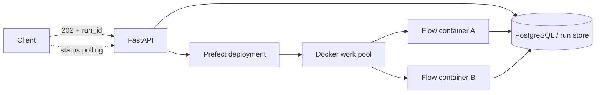

# Excel 적재 Prefect + Docker Work Pool 아키텍처

긴 Excel 분석·임베딩·VLM 작업은 HTTP 요청 수명주기와 분리한다. API는
`WorkflowRun`을 먼저 영속화하고 Prefect deployment에 `run_id`만 전달한다. Docker
Worker는 요청마다 일회성 Flow 컨테이너를 만들고, 컨테이너는 저장된 DAG와 입력을 읽어
진행률·노드 상태·결과를 PostgreSQL에 기록한 뒤 자동 삭제된다.



Prefect가 대기열, 재시도, 취소, 실행 이력과 동시성 제한을 소유하는 **유일한 배치
스케줄러**다. Docker는 Prefect Worker의 지시에 따라 컨테이너를 생성·종료하는 로컬 실행
인프라일 뿐 별도 스케줄러가 아니다.

Playground DAG와 모듈 DTO는 제품 계약으로 유지한다. Excel 적재 Flow는 저장된 DAG의
각 노드를 같은 이름의 Prefect Task로 컴파일한다. 따라서 모듈 구현, Playground 표시,
기존 상태 API는 유지하면서 Prefect UI에서 노드별 시간·재시도·실패를 관찰할 수 있다.

## 왜 로컬 기본값이 Docker Work Pool인가

- 요청이 있을 때만 Flow 컨테이너를 만들고 완료 후 `auto_remove`한다.
- Process Work Pool보다 파일 시스템·의존성·메모리 장애가 API와 분리된다.
- Docker Desktop 하나로 개발 환경을 재현할 수 있다.
- 동일 deployment의 요청을 현재 4개까지 병렬 처리하고, 초과 요청은 Prefect가 내구성 있게
  `ENQUEUE`한다.

## 단일 실행 경로

제품 API는 Excel 적재 run을 항상 `excel-ingestion/docker` deployment에 제출한다.
Docker Work Pool이 요청별 컨테이너를 만들고 요청 간 병렬성을 제공한다. 별도의 실행
백엔드 선택 환경변수나 우회 실행 CLI는 제공하지 않는다.

`prefect.yaml`의 deployment concurrency가 병렬 요청 수를 제한한다.
기본값은 4이며 초과 실행은 `ENQUEUE`된다. Flow 내부 노드는 현재 `WorkflowRun` JSONB의
원자성을 지키기 위해 순차 실행하지만 서로 다른 요청은 독립 컨테이너에서 병렬 실행한다.

## 로컬 실행

Docker Compose가 제품 pgvector와 Prefect 메타데이터 DB·Server·Docker Worker를 띄운다.

```bash
uv pip install --python .venv/bin/python -r requirements.txt
./deploy/prefect/local.sh all
```

별도 포트 포워딩은 필요 없다. Prefect UI/API는 `127.0.0.1:4200`에 바인딩된다.

```bash
PREFECT_API_URL=http://127.0.0.1:4200/api \
.venv/bin/python -m uvicorn app:app --host 127.0.0.1 --port 8765 --reload
```

`local.sh all`은 Docker BuildKit의 apt·pip·레이어 캐시를 재사용한다. 실행 요청이 없을 때
Flow 컨테이너 수는 0이고 Prefect DB·Server·Worker 세 control-plane 컨테이너만 유지된다.

## 이미지와 캐시

Flow 이미지는 기본 OpenAI VLM/embedding 경로에 맞춰 Torch·Docling을 제외한다. 로컬
BGE 모델이 필요한 경우에만 `local-models` target으로 별도 이미지를 빌드한다.
Dockerfile은 requirements를 소스보다 먼저 복사하고 BuildKit cache mount를 사용한다.
일반 개발 빌드에서는 `--no-cache`를 사용하지 않는다. 공유 캐시가 없는 CI에서는
registry cache를 사용한다. 자세한 명령은 [`jobs/README.md`](../jobs/README.md)에 있다.

## Secret과 네트워크

부트스트랩은 제품 DB URL과 OpenAI API 키를 Prefect Secret Block에 암호화해 저장하고
Work Pool 템플릿에는 Block 참조만 남긴다. `PGVECTOR_URL`이 localhost라면 Flow
컨테이너용 `bist-pgvector:5432` 주소로 변환한다. `data/`는 읽기·쓰기 bind mount로
`/app/data`에 연결되고 모든 컨테이너는 `bist-batch` 네트워크를 사용한다.

Docker Worker는 요청 컨테이너를 생성하기 위해 Docker socket을 마운트한다. 이는 로컬
개발용 신뢰 경계다. 공유 운영 호스트에서는 Worker 접근 권한을 제한하고 관리형 secret
manager를 사용한다.

## 취소·장애·복구

- Prefect Flow Run ID를 제품 `WorkflowRun.orchestration`에 저장해 중복 제출을 막는다.
- Task 재시도·timeout은 각 Playground 모듈의 `ModuleTaskPolicy`에서 선언한다.
- Prefect 취소는 Flow Run과 컨테이너에 전달되고 제품 run은 `paused`로 보존된다.
- 제품 DB advisory lock이 같은 `run_id`의 중복 실제 실행을 최종 방어한다.
- 비정상 종료는 실패 상태로 기록되며 Flow 컨테이너는 자동 삭제된다.
- API 재시작 시 queued/running ingestion run만 Prefect에 다시 제출한다.

## 코드 경계

```text
backend/
  api/                         HTTP 요청·응답 변환
  data_sources/                적재 run 생성·조회·취소 규칙
  orchestration/               DAG→Task 계획과 Prefect dispatcher
  workflows/                   공용 DAG 모델·실행기·대화형 dispatcher
  runtime/                     API/job 공용 런타임 조립
jobs/
  excel_ingestion/
    prefect_flow.py            저장된 Playground DAG를 Prefect Tasks로 실행
    Dockerfile                 별도 Flow 이미지
deploy/
  prefect/
    docker-compose.yml         Prefect DB·Server·Docker Worker
    bootstrap.py               Work Pool·Secret·deployment 등록
    local.sh                   idempotent 로컬 설치/운영 명령
prefect.yaml                   단일 Excel ingestion deployment
```

`backend/api/`는 무거운 Excel 적재 함수를 직접 호출하지 않고 저장된 `run_id`만 제출한다.
`jobs/excel_ingestion/`은 HTTP를 알지 못하며 허용된 ingestion workflow만 실행한다. 외부
컨테이너는 전체 RAG registry가 아니라 ingestion DAG에서 사용하는 모듈만 등록한다.

## 운영 확장

동시성 4는 시작값이다. 호스트 메모리, PostgreSQL 연결 수, LLM rate limit을 측정해
deployment limit과 Worker `--limit`을 함께 조정한다. 용량이 부족하면 Docker Worker가
실행되는 호스트의 자원을 확장하되, Prefect를 유일한 배치 결정권자로 유지한다.
