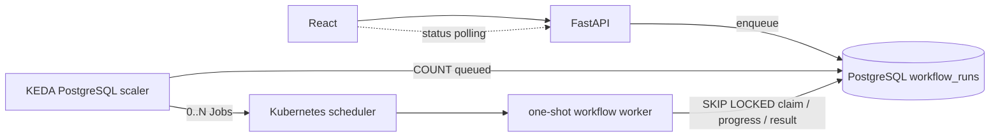

# 로컬 Kubernetes 배치 실행 아키텍처

Excel 적재처럼 수 분~수 시간 걸리는 연산은 FastAPI 프로세스에서 실행하지 않는다.
제품 `WorkflowRun`을 PostgreSQL에 먼저 저장하고, KEDA `ScaledJob`이 큐 깊이에 맞춰
일회성 Kubernetes Job을 만든다.



## 책임 경계

- PostgreSQL은 내구성 있는 작업 큐이자 제품 상태의 단일 원본이다.
- KEDA는 큐 깊이를 보고 Job 수만 결정한다.
- Kubernetes scheduler는 CPU/메모리 request가 들어갈 노드에 Pod를 배치한다.
- `jobs/workflow_worker`는 한 run만 claim하고 기존 `WorkflowExecutor`로 DAG를 실행한다.
- Playground의 일반 질문 실행은 기존 대화형 dispatcher를 유지한다.
- Excel 적재만 외부 Job 경로를 사용하므로 페이지 기능과 모듈 계약은 바뀌지 않는다.

KEDA와 Kubernetes가 각각 scaling과 placement를 담당하므로 별도 워크플로 스케줄러를
중복 도입하지 않는다.

## 큐와 claim

`workflow_runs`에는 다음 queue/lease 컬럼이 있다.

| 컬럼 | 역할 |
|---|---|
| `queue_name`, `priority`, `available_at` | 대기열과 실행 가능 순서 |
| `worker_id`, `claimed_at` | Kubernetes Job 소유권 |
| `heartbeat_at` | 살아 있는 worker lease |
| `attempt_count` | claim 횟수 |
| `cancel_requested` | API와 Pod 사이의 취소 신호 |

워커는 `FOR UPDATE SKIP LOCKED`로 한 row를 원자적으로 가져온다. 따라서 여러 Pod가
동시에 시작되어도 같은 run을 실행하지 않는다. 실행 중에는 15초마다 heartbeat를
갱신한다. Pod/노드가 비정상 종료되어 180초 동안 heartbeat가 없으면 KEDA query가 그
run을 다시 활성 항목으로 세고 새 Job이 복구한다. run 전체 수명 동안 PostgreSQL advisory
lock도 유지해 이중 실행을 한 번 더 방지한다.

## DAG, 재시도, timeout

Playground 모듈은 계속 `ModuleDefinition`과 `ModuleTaskPolicy`를 소유한다. 워커는 저장된
DAG를 `compile_task_plan()`으로 컴파일하고 위상 순서로 실행한다. 모듈별 retries,
retry delay, timeout, resource profile은 프론트 catalog와 배치 실행이 공유한다.

현재 하나의 Excel run 내부 노드는 제품 run JSON의 원자성을 위해 순차 실행한다. 서로
다른 run은 별도 Job이므로 병렬 실행된다. 질문 91개 같은 향후 기능은 질문 run을 큐 item
91개로 저장하면 같은 구조에서 최대 N개를 계속 채우는 work-conserving queue가 된다.

## 동시성 및 자원 판별

`deploy/kubernetes/capacity.py`는 Docker Desktop의 CPU/메모리를 읽는다. 기본 계산은
호스트 여유분 CPU 1개·메모리 2GiB를 남기고 Job당 CPU 1개·메모리 2GiB를 기준으로 하며
상한은 10이다. 값은 `ScaledJob.maxReplicaCount`에 적용된다.

이 값은 생성 상한일 뿐이다. 실제 placement는 manifest의 request/limit을 기준으로
Kubernetes scheduler가 결정한다. Docker 메모리를 늘린 다음 `local.sh deploy`를 다시
실행하면 새 최대치가 반영된다. 고정값이 필요하면 `KUBERNETES_MAX_JOBS`를 설정한다.

향후 질문용 경량 큐와 Excel 고메모리 큐가 필요하면 queue 이름과 resource profile이 다른
ScaledJob을 추가한다. 같은 PostgreSQL 큐 계약과 generic worker를 재사용한다.

## 진행 상태와 취소

워커는 모듈 시작·phase 변경·배치/시트/항목 진행률·완료/실패를 기존
`node_execution_logs`와 `workflow_runs`에 저장한다. 프론트는 다음을 구분해 표시한다.

1. `queued`: KEDA 큐 대기
2. `running` + `external_run_id`: Kubernetes Job 할당
3. 실행 중 모듈의 phase, percent, current item
4. `completed`, `failed`, `paused`

취소 API는 DB의 `cancel_requested`와 run 상태를 즉시 갱신한다. 외부 Pod는 progress
callback과 노드 경계에서 이를 확인하고 실행 상태를 `paused`로 보존한다. 재개 시 실패/중단
노드만 pending으로 되돌리고 동일 run을 새 queue item으로 제출한다.

## 로컬 실행 수명주기

```bash
./deploy/kubernetes/local.sh all       # 전체 idempotent 설치
./deploy/kubernetes/local.sh status    # 자원, KEDA, Job, Pod 확인
./deploy/kubernetes/local.sh logs      # 최근 worker 로그
./deploy/kubernetes/local.sh build     # worker image 재빌드/import
./deploy/kubernetes/local.sh deploy    # Secret/ScaledJob 갱신
./deploy/kubernetes/local.sh down      # cluster stop
./deploy/kubernetes/local.sh destroy   # k3d cluster 삭제
```

`data/`는 k3d node의 `/mnt/bist-data`를 거쳐 Pod `/app/data`에 mount한다. 제품 pgvector는
기존 Docker volume을 보존한다. 설치기가 DB container를 k3d Docker network에 연결하고
Service/EndpointSlice를 만들므로 Pod는 DB host port를 외부에 노출하지 않고 접근한다.

## 이미지 캐시

워커 Dockerfile은 requirements를 source보다 먼저 복사한다. BuildKit cache mount가 apt와
pip 다운로드를 재사용하고 Docker layer cache가 설치된 wheel을 보존한다. 일반 개발에서는
`--no-cache`를 사용하지 않는다. 기본 runtime image는 OpenAI embedding 경로만 포함해
cold start/import 크기를 줄였으며 로컬 BGE는 별도 `local-models` target이다.

## 장애 진단

```bash
kubectl describe scaledjob excel-ingestion -n bist-batch
kubectl get jobs,pods -n bist-batch
kubectl describe pod -n bist-batch <pod-name>
kubectl logs -n keda deployment/keda-operator --tail=200
./deploy/kubernetes/local.sh logs
```

ScaledJob `READY=True`, 요청이 없을 때 `ACTIVE=False`, Job/Pod 0개가 정상 idle 상태다.
