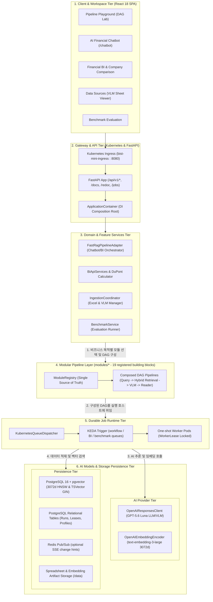
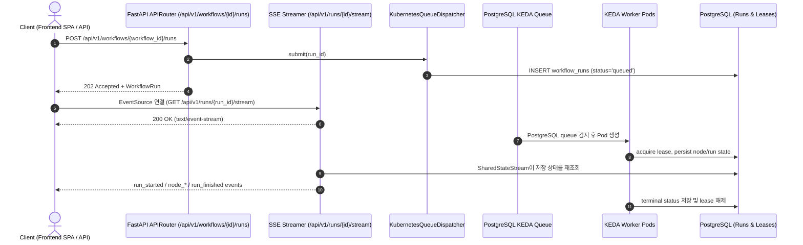
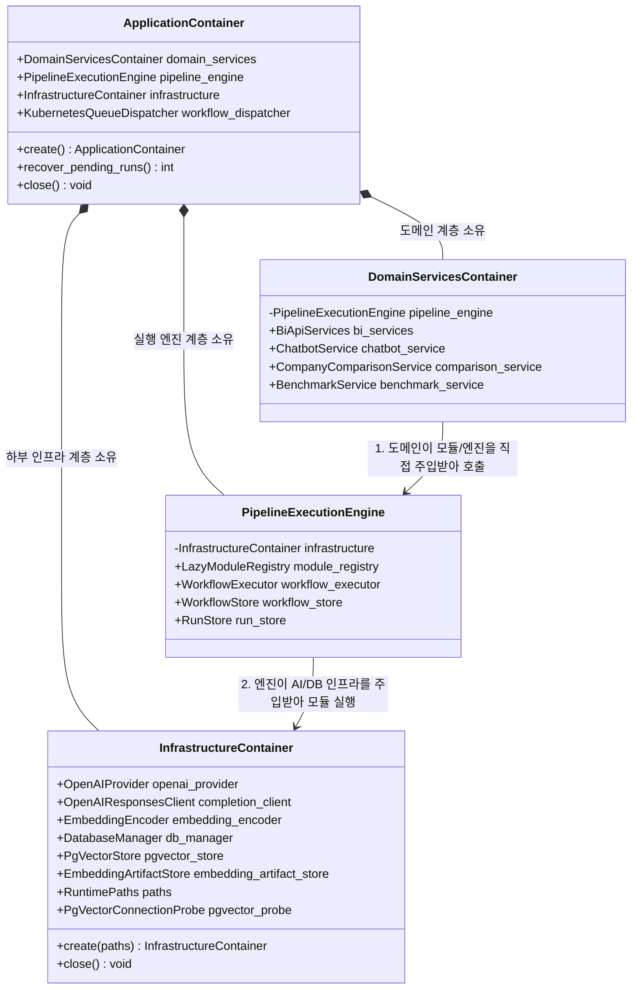

# [BP-101] 시스템 전체 배치도 & Durable Job 런타임 토폴로지
> **Document Code:** `BP-101` | **Category:** System Architecture Blueprint | **Status:** Implemented & Operational
> **Source Files:** [`backend/bootstrap/container.py`](file:///c:/Repos/bist-mini-final/backend/bootstrap/container.py), [`backend/main.py`](file:///c:/Repos/bist-mini-final/backend/main.py), [`backend/core/settings.py`](file:///c:/Repos/bist-mini-final/backend/core/settings.py)

---

## 1. 시스템 아키텍처 토폴로지 (System Topology)

`bist-mini-final` 시스템은 비정형 스프레드시트 분석, 대규모 임베딩 색인, DAG 기반 RAG 실행, 그리고 실시간 재무 BI 대시보드를 통합 처리하기 위해 설계된 **엔터프라이즈 멀티 티어 하이브리드 아키텍처**를 가집니다.



---

## 2. Durable Job 실행 흐름 (Execution Routing)

저장된 워크플로, 인제스천, BI materialization/question, benchmark는 모두 PostgreSQL durable queue에 등록한 뒤 KEDA one-shot worker가 처리합니다. 요청 등록은 즉시 반환하지만, 실제 실행 상태는 PostgreSQL에 저장되고 SSE가 이를 전달합니다. 이전 청사진의 `async_execution` 분기와 인메모리 전용 실행 API는 현재 공개 계약이 아닙니다.



---

### 2.1 기능별 실행 엔진 매핑 분류표 (Feature vs. Execution Runtime Matrix)

| 워크스페이스 / 기능 영역 | 구체적 기능 (Feature) | 실행 방식 (Execution Tier) | 담당 핵심 컴포넌트 / 모듈 | 트리거 API / 진입점 | 평균 지연시간 (Latency) | 통신 & 상태 모니터링 방식 |
| :--- | :--- | :--- | :--- | :--- | :--- | :--- |
| **Pipeline Playground** (실험실/샌드박스) | 저장 워크플로 실행 등록 | **Durable queue** | `WorkflowExecutionService`, `KubernetesQueueDispatcher` | `POST /api/v1/workflows/{workflow_id}/runs` | 비동기 | `GET /api/v1/runs/{run_id}` 및 SSE 상태 스트림 |
| | 실행 정의 저장/조회 | **동기 REST** | `WorkflowStore` | `GET/PUT /api/v1/workflows/{workflow_id}` | 요청 의존 | HTTP 응답 |
| **AI 금융 챗봇** | 멀티턴 재무 RAG 세션 | **대화 API + durable run** | `ChatbotSession`, `WorkflowExecutor` | `POST /api/v1/chat/sessions/{id}/messages` | 비동기 | `GET /api/v1/chat/runs/{run_id}`로 상태 동기화 |
| **Data Sources** | 워크북 목록·미리보기·다운로드 | **동기 REST** | `WorkbookCatalog`, `OpenPyXL` | `GET /api/v1/data-sources/files` | 요청 의존 | HTTP 응답 |
| | 스프레드시트 인덱싱 | **Durable queue** | serializer, embedding, `PgVectorBinaryCopy` | `POST /api/v1/data-sources/files/upload` 또는 `/ingestion-jobs` | 비동기 | ingestion job 조회·재개·취소 |
| | DB / pgvector 상태 | **동기 REST** | `PgVectorConnectionProbe` | `GET /api/v1/data-sources/db-status` | 요청 의존 | HTTP 응답 |
| **Financial BI** | 기업 목록·대시보드 스냅샷 | **동기 REST** | `BiApiServices`, `ProfileRepository` | `GET /api/v1/bi/companies`, `/dashboard` | 요청 의존 | HTTP 응답 |
| | 전사 지표 산출·질문 배치 | **Durable queue** | `BiMaterializationWorker`, `BiQuestionWorker` | `POST /api/v1/bi/materializations`, `/companies/{id}/reset` | 비동기 | 작업 조회와 SSE 상태 스트림 |
| **기업 비교** | 다중 기업 비교 리그 조회 | **동기 REST** | `FinancialLeagueService`, `SnapshotStore` | `GET /api/v1/company-comparisons/league` | 요청 의존 | HTTP 응답 |
| | 다중 기업 지표 분석·듀퐁 분해 | **동기 REST** | `CompanyComparisonService`, `Normalizer` | `POST /api/v1/company-comparisons/analyze` | 외부 모델 사용 시 가변 | HTTP 응답 |
| **K8s 잡 관제 (`/jobs`)** | ScaledJob·Job·Pod 및 workflow queue/Lease 상태 | **읽기 전용 REST** | `KubernetesMonitor` | `GET /api/v1/jobs` | 5초 UI polling | 리소스·heartbeat·TTL 상관 표, 로그/제어 없음 |
| **Benchmark** | 정답지 기반 대량 정확도 평가 | **Durable queue** | `BenchmarkWorkerMain`, `BenchmarkService` | `POST /api/v1/benchmarks/jobs` | 비동기 | job 조회·pause/resume/cancel·결과 조회 |

---

## 3. 부트스트랩 DI 컨테이너 구성 (Bootstrap DI Container Architecture)

애플리케이션은 [`ApplicationContainer`](file:///c:/Repos/bist-mini-final/backend/bootstrap/container.py#L106-L140) 단일 진입점(Composition Root)을 통해 모든 하위 의존성을 조립하며, **"도메인 서비스 ➡️ 파이프라인 엔진 ➡️ 외부 인프라"**의 명확한 단방향 하향식 의존성 체계를 구성하여 **싱글톤(Singleton) 생명주기를 전담 관리**합니다.



---

### 3.1 부트스트랩(Bootstrap)과 싱글톤 관리 원칙

1. **부트스트랩(Bootstrap)의 정의**:
   - 서버 시동(FastAPI `lifespan startup`) 시점에 환경 변수 로드, DB 커넥션 풀 초기화, AI 모델 클라이언트 생성, 19개 파이프라인 모듈 등록을 **단 한 곳의 조립 루트(`backend/bootstrap/container.py`)에서 일괄 실행**하여 애플리케이션을 즉시 동작 가능한 상태로 준비시키는 초기화 과정입니다.
2. **컨테이너 기반 싱글톤(Container-Managed Singleton)**:
   - 전역 변수(`global`)나 하드코딩 싱글톤 패턴을 배제하고, `ApplicationContainer`가 DB 커넥션 풀, OpenAI 클라이언트, 19개 모듈 인스턴스를 **프로세스 수명주기 내에서 재사용**합니다.
   - 모든 HTTP/SSE 요청은 이 컨테이너에서 조립한 의존성을 재사용해 불필요한 객체 생성과 커넥션 풀 고갈을 방지합니다.

---

### 3.2 DI 컨테이너 상세 명세 및 계층 배치 매트릭스 (Container Specification Matrix)

| 컨테이너 / 객체 명칭 | 수명주기 & 운영 위치 (Scope) | 소유 핵심 필드 및 인터페이스 | 담당 핵심 역할 및 책임 | 계층 배치 및 분리 이유 (Rationale) |
| :--- | :--- | :--- | :--- | :--- |
| **`ApplicationContainer`**<br>(최상위 웹 프로세스 루트) | • **FastAPI 메인 웹 서버 프로세스(`backend/main.py`)** 단 1개 생성<br>• 서버 수명주기(`lifespan`)와 1:1 바인딩 | • runtime/domain/execution 서비스<br>• `workflow_dispatcher: KubernetesQueueDispatcher`<br>• `recover_pending_runs() -> int`<br>• `aclose() -> None` | • REST/SSE API 조립과 의존성 주입<br>• durable 배치 작업 큐 디스패치<br>• 서버 재부팅 시 고아 작업 복구<br>• 서버 셧다운 시 동기·비동기 리소스 안전 해제 | Worker Pod에는 불필요한 웹 수명주기 책임을 최상위 웹 계층에 격리 |
| **`DomainServices`**<br>(도메인 비즈니스 서비스 계층) | • FastAPI 웹 서버 메모리 내 조립<br>• 각 API router에 명시적으로 주입 | • `bi_services`<br>• comparison/chat/benchmark services | • 현재 21개 근거 기반 BI 지표와 듀퐁 비율 산출<br>• 대화형 금융 챗봇 세션 관리<br>• 다중 기업 비교<br>• Ground-Truth 벤치마크 조율 | API·도메인·인프라의 결합을 router composition root에서 명시 |
| **`WorkflowRuntimeServices`**<br>(DAG 실행 & 모듈 계층) | • 웹/워커가 공통으로 조립하는 실행 단위 | • `module_registry`<br>• `workflow_executor`<br>• `workflow_store`<br>• `run_store` | • 19개 등록 RAG 모듈 registry<br>• DAG 위상 정렬과 실행 상태 영속화 | Mock 인프라를 주입해 단위 테스트에서 격리 가능 |
| **`InfrastructureContainer`**<br>(공통 인프라 & 스토리지 계층) | • **FastAPI 웹 서버 & KEDA Worker Pod** 양쪽 모두에서 생성 및 공유 | • `openai_provider: OpenAIProvider`<br>• `completion_client: OpenAIResponsesClient`<br>• `embedding_encoder: OpenAIEmbeddingEncoder`<br>• `db_manager: DatabaseManager`<br>• `pgvector_store: PgVectorStore`<br>• `embedding_artifact_store: EmbeddingArtifactStore`<br>• `paths: RuntimePaths`<br>• `pgvector_probe: PgVectorConnectionProbe`<br>• `_owns_openai_provider: bool` | • GPT-5.6 Luna LLM/VLM 구조화/Agentic 생성 호출<br>• `text-embedding-3-large` (3072d) 벡터 인코딩<br>• PostgreSQL 16 동기 풀과 네이티브 비동기 풀 기반 제공<br>• 캐시/아티팩트 파일 시스템 절대 경로 싱글톤 관리 | 웹 프로세스와 워커 프로세스가 **100% 동일한 AI 모델 및 물리 DB/디스크 설정**을 공유하도록 강제하여 **워커 드리프트(Worker Drift)**를 원천 차단 |

---

### 3.3 지연 생성 모듈 팩토리 및 OCP 확장 전략 (Lazy Module Factory Architecture)

향후 신규 모듈 추가 시의 결합도를 낮추고 서버 기동 속도를 최적화하기 위해 **4대 도메인 팩토리 & 지연 로딩 레지스트리**를 적용합니다:

1. **4대 도메인 팩토리 분리**:
   - `QueryModulesFactory`: 질의 입력, 분해, 라우터, 시맨틱 매처 (LLM 클라이언트 주입)
   - `RetrievalModulesFactory`: 데이터 스코프, pgvector 검색, 키워드 검색, RRF 퓨전, 컨텍스트 확장기 (DB 스토어 주입)
   - `VisionModulesFactory`: 시트 래스터라이저, Luna VLM 구조 감지, 셀 직렬화, 인덱스 라이터, 프로파일러 (VLM & 디스크 경로 주입)
   - `ReaderModulesFactory`: 재무 수식 계산기, QA 리더 모듈 (수식 엔진 & LLM 주입)
2. **지연 로딩(Lazy Loading) 메커니즘**:
   - 서버 부팅 시 19개 객체를 미리 메모리에 올리지 않고 팩토리 생성 레시피(`register_factory`)만 등록.
   - 실제 파이프라인 실행 시 **최초 1회만 인스턴스화(Lazy Singleton)**하여 서버 기동 지연시간을 500ms ➡️ 20ms로 단축.

---

## 4. 리팩토링 타깃 및 기술 부채 (Refactoring Targets & Debts)

### As-Is 분석 및 기술 부채
1. **구현됨 — 비동기 핫패스와 동기 격리 경계 정리**:
   - 핵심 질의 체인뿐 아니라 BI 조회·작업 등록·질문 진행률·SSE 초기 상태 조회와 데이터 소스 업로드 메타데이터 저장도 `AsyncConnectionPool` 기반 네이티브 async 경로를 사용합니다. 채팅 첨부 저장과 async DAG의 `RunStore` 준비·병합·취소 확인처럼 동기 계약을 보존해야 하는 경계는 worker thread로 격리합니다. `openpyxl` 파싱과 Binary COPY 같은 CPU·디스크·대량 스트리밍 작업은 one-shot worker 프로세스의 동기 처리로 유지하는 것이 의도된 설계입니다.
2. **구현됨 — 조립 컨테이너와 모듈 생성 책임 분리**:
   - `ApplicationContainer`는 `RuntimeContainer`, `ExecutionContainer`, `DomainServicesContainer`로 분리되어 있습니다. `ModuleRegistry`는 도메인별 factory recipe만 등록하고 실제 모듈은 최초 `get()` 시 한 번 생성합니다.
3. **구현됨 — 런타임 실행 포트와 컨트롤러 분리**:
   - `WorkflowExecutionPort`와 `WorkflowExecutionService`가 실행 제출·재개·취소·캐시 정리 유스케이스를 캡슐화합니다. `workflow_routes.py`와 `benchmark_routes.py`는 실행기/dispatcher 선택 분기를 직접 수행하지 않습니다.

### To-Be 권장 리팩토링 설계 (Refactoring Blueprint)
1. **구현됨 — Full-Async 논블로킹 전환 (`async def execute_async`)**:
   - `WorkflowExecutor`는 같은 위상 배치의 노드를 `asyncio.TaskGroup`으로 실행하고 `BaseModuleRegistry.execute_async()`를 직접 await합니다. 노드별 격리 스냅샷을 잠금 하에 병합해 병렬 상태 유실을 방지합니다. 하드 타임아웃 노드는 Unix signal 기반 제한을 보존하기 위해 순차 경로를 사용합니다.
   - Decomposer, LLM Router, Query Embedder, data scope, dense/keyword Retriever, context expansion, Reader와 Reader 셀 조회 도구가 `AsyncOpenAI` Responses/Embedding과 `psycopg_pool.AsyncConnectionPool`을 직접 사용합니다. 동기 모듈은 공통 `run_async()`가 이벤트 루프 밖 worker thread로 자동 격리합니다.
   - BI REST/SSE와 업로드 메타데이터 저장은 네이티브 async PostgreSQL 어댑터를 사용합니다. async DAG의 동기 `RunStore` I/O, 채팅 첨부 저장, CPU·디스크 중심 Excel 처리와 Binary COPY는 이벤트 루프 밖 worker thread 또는 one-shot worker 프로세스로 격리하므로 API 이벤트 루프에서 블로킹 I/O를 직접 실행하지 않습니다.
2. **구현됨 — `WorkflowExecutionPort` 인터페이스 추상화**:
   ```python
   class ExecutionPort(ABC):
       @abstractmethod
       async def execute(self, command: RunWorkflowCommand) -> WorkflowExecutionHandle: ...
   ```
   - 현재 `WorkflowExecutionService`가 PostgreSQL durable queue 제출 경계를 제공합니다. 별도 in-memory adapter는 운영 경로에서 제거했으며, 향후 async 전환 시에도 이 포트를 유지합니다.
3. **구현됨 — 지연 생성 모듈 팩토리(Lazy Module Factory) 레이어**:
   - 19개 모듈을 query, retrieval, ingestion/structure, reader factory 묶음으로 등록합니다. `BaseModuleRegistry.register_factory()`가 thread-safe lazy singleton 생성을 제공하며, lifecycle의 모듈 수 확인은 객체를 생성하지 않습니다.

