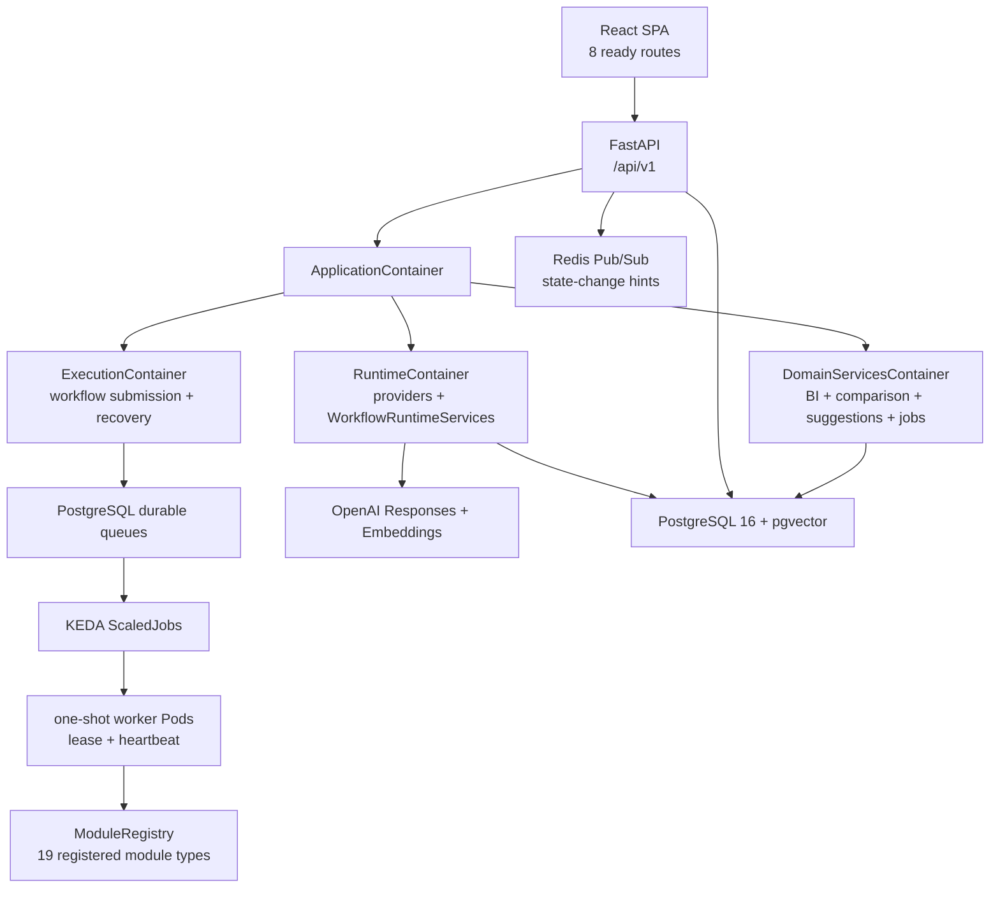
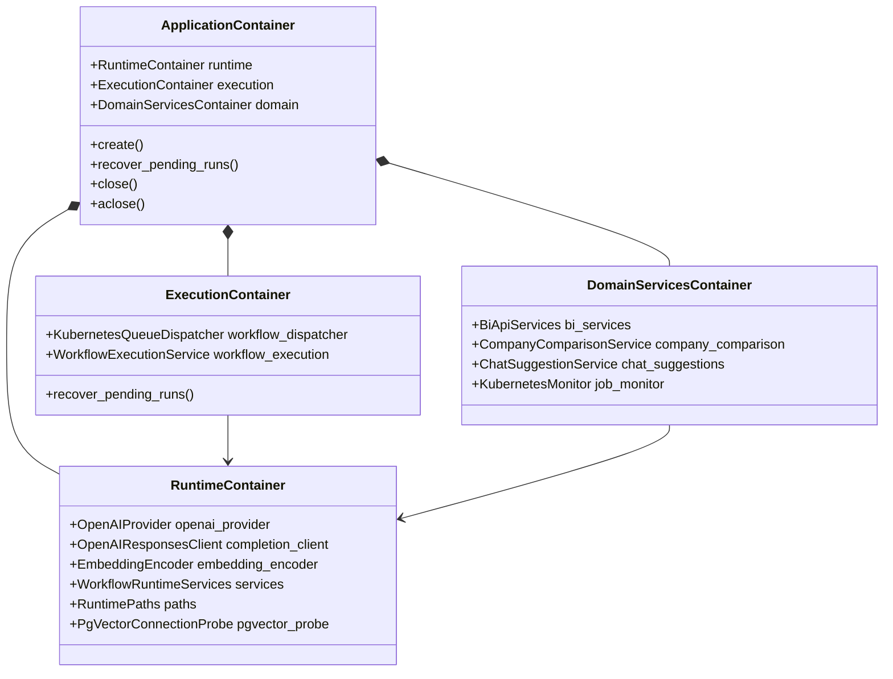

# [BP-101] 시스템 전체 배치도와 실행 토폴로지
> **Document Code:** `BP-101` | **Category:** System Architecture Blueprint | **Status:** Implemented & Operational
> **Source Files:** [`backend/bootstrap/container.py`](file:///c:/Repos/bist-mini-final/backend/bootstrap/container.py), [`backend/main.py`](file:///c:/Repos/bist-mini-final/backend/main.py), [`backend/engine/runtime/services.py`](file:///c:/Repos/bist-mini-final/backend/engine/runtime/services.py)

---

## 1. 현재 시스템 경계

이 시스템은 React SPA, FastAPI control plane, PostgreSQL/pgvector 영속 계층, Redis 상태 변경 신호, KEDA one-shot worker로 구성됩니다. 제품 워크스페이스는 Pipeline Playground, Data Sources, Financial BI, AI Financial Chatbot, Company Comparison, Jobs, Settings로 나뉩니다.

Financial BI와 Company Comparison은 별도 제품 도메인입니다. 비교 도메인은 BI 스냅샷을 검증된 원천으로 읽지만 전용 API, DTO, 점수 정책, 버전형 스냅샷 저장 수명주기를 소유합니다.

로컬 VLM과 Cross-Encoder reranker는 범위에서 제외합니다. 표 구조 감지가 필요한 현재 경로는 외부 OpenAI vision provider를 사용하고, 검색 기준선은 Dense + PostgreSQL keyword + RRF + 2D context expansion입니다.

---

## 2. 실행 모델

| 기능 | 요청 경계 | 실행/저장 방식 |
| :--- | :--- | :--- |
| 저장 워크플로 실행 | `POST /api/v1/workflows/{workflow_id}/runs` | PostgreSQL queue → KEDA worker → run/node 상태 영속화 |
| Data Sources 인제스천 | upload 또는 ingestion job API | durable workflow와 one-shot worker |
| BI materialization/question | `/api/v1/bi/*` | 전용 durable job과 SSE 진행 상태 |
| Chatbot | `/api/v1/chat/*` | 세션/메시지 영속화와 durable RAG run |
| Company Comparison 조회 | `GET /api/v1/company-comparisons/snapshot` | 현재 발행된 버전형 스냅샷 조회 |
| Company Comparison 갱신 | `POST /api/v1/company-comparisons/snapshot/refresh` | 짧은 결정론적 async 집계 후 원자적 head 전환 |
| Benchmark | `/api/v1/benchmarks/*` | durable benchmark job과 결과 행 영속화 |
| Jobs | `GET /api/v1/jobs` | Kubernetes workload와 queue/lease 읽기 전용 관제 |

Company Comparison refresh는 외부 LLM을 호출하지 않는 제한된 집계이므로 현재 요청 안에서 실행합니다. 처리량이 증가해 API 지연 예산을 넘을 때만 별도 durable materialization job으로 승격합니다.

---

## 3. 부트스트랩 객체 그래프

`ApplicationContainer`는 최상위 composition root입니다. `RuntimeContainer`는 웹과 워커가 공유하는 provider·DB·registry 설정을 만들고, `ExecutionContainer`는 control-plane 제출과 복구 책임을, `DomainServicesContainer`는 제품 서비스를 소유합니다. 호환 property는 남아 있지만 새 조립 코드는 `runtime`, `execution`, `domain`을 직접 사용합니다.

---

## 4. 상태와 장애 복구

1. PostgreSQL이 실행 상태의 단일 진실 공급원입니다.
2. Redis는 SSE가 저장 상태를 즉시 다시 읽도록 알리는 선택적 신호 계층이며 상태 원본이 아닙니다.
3. worker는 lease token, heartbeat, terminal transition으로 중복 실행을 방지합니다.
4. API 재시작은 durable run을 취소하지 않으며 startup recovery가 미완료 queue 상태를 복구합니다.
5. BI와 comparison 스냅샷은 불변 발행본과 current pointer를 분리합니다. comparison의 current pointer는 복합 외래키로 같은 domain/scope만 참조할 수 있습니다.

---

## 5. 아키텍처 불변식

- 공개 API는 `/api/v1`을 기준으로 문서화합니다.
- feature 계층은 HTTP API 계층을 역참조하지 않습니다.
- `modules/`는 DB/provider를 직접 생성하지 않고 주입받습니다.
- API 이벤트 루프에서 블로킹 DB·파일·CPU 작업을 직접 실행하지 않습니다.
- 비교 계산은 실제 BI 관측값과 원본 셀 근거만 사용하며 synthetic fallback을 만들지 않습니다.
- 현재 모듈 카탈로그는 `ModuleRegistry`에 등록된 19개 type이 단일 기준입니다.

정확한 현재 수치와 범위는 [`CURRENT_IMPLEMENTATION_BASELINE.md`](file:///c:/Repos/bist-mini-final/docs/CURRENT_IMPLEMENTATION_BASELINE.md)를 우선합니다.
