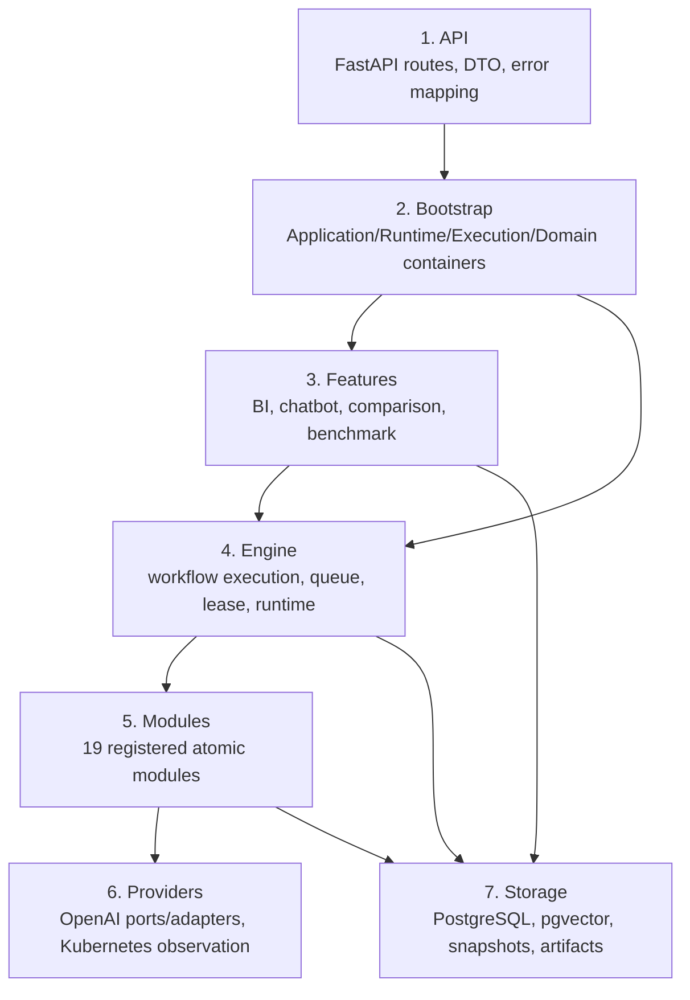

# [BP-102] 백엔드 계층 구조와 의존성 규칙
> **Document Code:** `BP-102` | **Category:** System Architecture Blueprint | **Status:** Implemented & Operational
> **Source Roots:** [`backend/api/`](file:///c:/Repos/bist-mini-final/backend/api/), [`backend/bootstrap/`](file:///c:/Repos/bist-mini-final/backend/bootstrap/), [`backend/features/`](file:///c:/Repos/bist-mini-final/backend/features/), [`backend/engine/`](file:///c:/Repos/bist-mini-final/backend/engine/), [`modules/`](file:///c:/Repos/bist-mini-final/modules/), [`backend/providers/`](file:///c:/Repos/bist-mini-final/backend/providers/), [`backend/storage/`](file:///c:/Repos/bist-mini-final/backend/storage/)

---

## 1. 계층 맵

이 그림은 책임을 설명하는 논리 계층입니다. 모든 import가 정확히 한 단계씩만 내려가야 한다는 뜻은 아니며, 핵심 규칙은 도메인과 모듈이 상위 HTTP 조립 세부사항에 의존하지 않는 것입니다.

---

## 2. 책임과 현재 심볼

| 계층 | 책임 | 대표 구현 |
| :--- | :--- | :--- |
| API | `/api/v1` route, Pydantic 검증, status code, SSE, 표준 오류 | `backend/api/*_routes.py`, feature별 `api_routes.py`, `backend/api/exception_handlers.py` |
| Bootstrap | 프로세스 수명주기와 객체 그래프 조립 | `ApplicationContainer`, `RuntimeContainer`, `ExecutionContainer`, `DomainServicesContainer` |
| Features | 제품 규칙과 유스케이스 | `BiApiServices`, chatbot services, `CompanyComparisonService`, `BenchmarkService` |
| Engine | DAG 실행, durable queue 제출, worker lease, registry | `WorkflowExecutionService`, `WorkflowExecutor`, `KubernetesQueueDispatcher`, `WorkflowRuntimeServices` |
| Modules | Pydantic pin 계약을 가진 재사용 실행 단위 | `BaseModule`, `BaseModuleRegistry`, 19개 등록 module type |
| Providers | 외부 서비스의 포트와 어댑터 | `OpenAIProvider`, `OpenAIResponsesClient`, `EmbeddingEncoder` |
| Storage | DB pool, pgvector, Binary COPY, artifacts, 버전형 스냅샷 | `DatabaseManager`, `PgVectorStore`, `PgVectorBinaryCopyStream`, `VersionedSnapshotRepository` |

Kubernetes dispatcher의 현재 구현은 [`backend/engine/orchestration/kubernetes/dispatcher.py`](file:///c:/Repos/bist-mini-final/backend/engine/orchestration/kubernetes/dispatcher.py)에 있습니다.

---

## 3. DI와 실행 경계

- `RuntimeContainer.create()`가 OpenAI clients, embedding adapter, `WorkflowRuntimeServices`, paths, pgvector probe를 구성합니다.
- `ExecutionContainer.create(runtime)`가 durable workflow dispatcher와 execution service를 구성합니다.
- `DomainServicesContainer.create(runtime)`가 BI, company comparison, chat suggestions, jobs monitor를 구성합니다.
- `ApplicationContainer.create()`는 위 세 컨테이너를 결합하며 FastAPI lifespan이 close/aclose를 소유합니다.
- worker entrypoint도 동일한 runtime service factory를 사용하여 API/worker 설정 드리프트를 줄입니다.

`WorkflowRuntimeServices`에는 DB manager, stores, module registry, workflow executor가 들어 있습니다. 예전 문서의 `PipelineExecutionEngine`과 `InfrastructureContainer`는 현재 클래스가 아닙니다.

---

## 4. 비동기·동기 규칙

1. FastAPI hot path는 native async DB/provider method를 우선합니다.
2. 동기 계약을 유지해야 하는 `RunStore` 호출, 파일 해시·이동, openpyxl 파싱 등은 worker thread로 격리합니다.
3. Binary COPY와 대량 spreadsheet 처리는 one-shot worker 프로세스에서 동기 스트리밍으로 수행합니다.
4. DAG의 동일 위상 batch는 `TaskGroup`으로 병렬 실행하되, timeout/상태 병합 계약을 지킵니다.
5. 저장 상태를 먼저 확정하고 Redis는 변경 알림에만 사용합니다.

---

## 5. 의존성 불변식과 확장 규칙

- `backend/features`에서 `backend.api` import 금지.
- `modules`에서 `DatabaseManager`, `PgVectorStore`, `OpenAIProvider` 직접 생성 금지.
- 새 module type은 도메인 factory에 recipe를 등록하고 입력·출력·config schema와 테스트를 함께 추가.
- 새 제품 도메인은 전용 route/DTO/service를 유지하고 공유 인프라는 port 수준에서만 재사용.
- BI와 Company Comparison의 계산 로직을 공통 base service로 합치지 않음. 공유 대상은 versioned snapshot 저장 수명주기뿐임.
- 공개 경로·테이블·모듈 수는 코드/OpenAPI/Alembic을 기준으로 갱신.

이 규칙은 [`tests/modules/test_architecture_contracts.py`](file:///c:/Repos/bist-mini-final/tests/modules/test_architecture_contracts.py)와 관련 회귀 테스트로 검증합니다.
