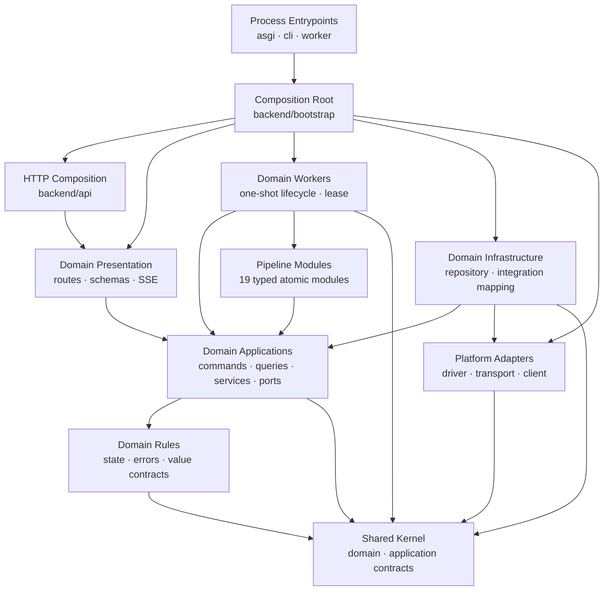

# [BP-102] 백엔드 modular monolith와 의존성 규칙
> **Document Code:** `BP-102` | **Contract State:** Target Architecture | **Capability State:** Operational | **Structure State:** Partial Migration
> **Target Ownership:** `backend/entrypoints`, `backend/bootstrap`, `backend/shared`, `backend/domains`, `backend/platform`, `backend/api`, `modules`, `jobs`
> **Current References:** [`backend/api/`](file:///c:/Repos/bist-mini-final/backend/api/), [`backend/domains/`](file:///c:/Repos/bist-mini-final/backend/domains/), [`backend/bootstrap/`](file:///c:/Repos/bist-mini-final/backend/bootstrap/), [`backend/engine/`](file:///c:/Repos/bist-mini-final/backend/engine/), [`backend/platform/`](file:///c:/Repos/bist-mini-final/backend/platform/), [`backend/shared/`](file:///c:/Repos/bist-mini-final/backend/shared/), [`modules/`](file:///c:/Repos/bist-mini-final/modules/)

---

## 1. 구조 원칙

백엔드의 목표는 기술별 수평 계층을 늘리는 구조가 아니라, 제품 도메인을 먼저 분리하고 각 도메인 안에서 `domain → application port ← infrastructure adapter` 의존성 역전을 지키는 modular monolith입니다. HTTP, worker, DB, 외부 provider는 도메인 유스케이스의 바깥에 위치해야 합니다.



화살표는 목표 compile-time 의존 방향입니다. Bootstrap은 유일한 예외로 구체 구현 전체를 알고 객체 그래프를 조립합니다.

---

## 2. 목표 디렉터리 구조

```text
backend/
├── entrypoints/                 # 실행 가능한 process adapter
│   ├── asgi.py                  # HTTP bootstrap 호출
│   ├── cli.py                   # 관리 command dispatch
│   └── worker.py                # worker bootstrap 호출
│
├── bootstrap/                   # 객체 조립과 프로세스 생명주기
│   ├── application.py
│   ├── http.py
│   └── workers.py
│
├── shared/                      # 도메인 비종속 공통 계약
│   ├── domain/
│   │   ├── errors.py
│   │   ├── identifiers.py
│   │   └── clock.py
│   └── application/
│       ├── pagination.py
│       ├── results.py
│       ├── transactions.py
│       ├── events.py
│       ├── leases.py
│       └── workers.py
│
├── domains/
│   ├── workflow/
│   │   ├── domain/
│   │   │   ├── models.py
│   │   │   ├── states.py
│   │   │   └── policies.py
│   │   ├── application/
│   │   │   ├── ports.py
│   │   │   ├── commands.py
│   │   │   ├── queries.py
│   │   │   └── services/
│   │   ├── infrastructure/
│   │   │   ├── postgres/
│   │   │   ├── filesystem/
│   │   │   └── kubernetes/
│   │   ├── presentation/
│   │   │   ├── routes.py
│   │   │   ├── schemas.py
│   │   │   └── sse.py
│   │   └── workers/
│   ├── data_sources/
│   ├── bi/
│   ├── company_comparison/
│   ├── chatbot/
│   ├── benchmark/
│   └── operations/              # 읽기 전용 queue·lease·workload 관제
│
├── platform/                    # 외부 시스템 어댑터
│   ├── postgres/                # driver, pool, transaction 구현
│   ├── pgvector/
│   ├── openai/
│   ├── kubernetes/
│   ├── redis/
│   ├── filesystem/
│   └── telemetry/
│
└── api/
    ├── router.py                # 도메인 router 결합만 수행
    ├── middleware.py
    ├── exception_handlers.py
    └── versioning.py

modules/                         # 원자적 DAG 모듈
jobs/                            # 선언형 표준 Job 정의
```

각 제품 도메인은 같은 하위 계층 이름을 사용하되 필요하지 않은 계층을 억지로 만들지 않습니다. `entrypoints`는 process 시작, `bootstrap`은 object graph 조립, `api`는 domain router 결합을 담당합니다. 도메인별 HTTP DTO와 route는 각 domain `presentation`에 둡니다. `platform`은 여러 도메인이 공유하는 외부 system client, driver, pool과 transaction 구현만 소유하고, 도메인 고유 SQL·repository·mapping은 해당 domain `infrastructure`에 둡니다. `shared`에는 transaction protocol 같은 안정적인 계약만 두며 concrete session 구현을 넣지 않습니다.

도메인 간 호출은 Python 내부 import가 아니라도 같은 경계를 지킵니다. 소비 domain의 application이 필요한 capability port를 정의하고, 제공 domain의 공개 application facade를 감싸는 integration adapter를 bootstrap이 연결합니다. BI와 Company Comparison처럼 데이터 수명주기가 다른 도메인은 공통 base service로 합치지 않고 명시적인 snapshot reader port로 연결합니다.

### 2.1 현재 구현과의 차이

현재 트리는 목표 구조로 이동 중인 과도기입니다. 정확한 파일 수와 import 수는 [`CURRENT_IMPLEMENTATION_BASELINE.md`](file:///c:/Repos/bist-mini-final/docs/CURRENT_IMPLEMENTATION_BASELINE.md)에서 관리하며, 이 문서는 변하지 않는 migration 차이의 종류만 정의합니다.

| 영역 | 현재 상태 | 목표 대비 차이 |
| :--- | :--- | :--- |
| `backend/entrypoints`, `backend/bootstrap` | ASGI·CLI·통합 worker 진입점과 `application.py`, `http.py`, `workers.py` 조립 경계 구현 | 도메인별 조립 함수가 아직 일부 legacy bootstrap/feature 구현을 감쌈 |
| `backend/shared` | state stream, embedding port, lease worker, observability context를 application 계약으로 분리 | identifiers, clock, result/pagination/transaction/event 계약은 필요한 유스케이스 이동 시 도입 필요 |
| `backend/domains` | workflow와 data sources vertical slice 완료, BI domain/application과 chatbot 일부 infrastructure 도입 | BI·comparison·chatbot·benchmark·operations의 presentation/infrastructure/workers 이전이 남음 |
| `backend/api` | workflow/data sources는 호환 shim, 나머지 도메인의 route/controller/DTO를 직접 보유 | 최종 router 결합 전용 계층보다 책임이 넓음 |
| `backend/platform` | PostgreSQL pool, pgvector, OpenAI, Redis broker, telemetry adapter를 canonical 경로로 이전 | Kubernetes/filesystem adapter와 도메인 고유 SQL의 vertical slice 이동 필요 |
| 호환 수평 패키지 | `features`, `storage`, `providers`, `engine`, `core`, `contracts`, `cli`가 남아 있음 | 도메인·platform·shared·process adapter 경계로 책임 이전이 필요 |
| 호환 진입 경로 | `backend/main.py`와 이전 provider/core/storage 경로는 re-export shim | 외부 호출 전환 후 shim 삭제 필요 |
| `modules`, `jobs` | 원자 모듈과 선언형 Job 경계를 별도 루트로 유지 | 목표와 일치 |

디렉터리 생성이나 일부 의존성 역전만을 근거로 완료 처리하지 않습니다. 호환 패키지의 책임 이전, domain presentation/infrastructure/workers 정착, 호환 import 제거가 끝나고 구조 계약 테스트가 목표 트리를 검증할 때만 `Structure State: Complete`로 전환합니다.

### 2.2 잔여 전환 순서

1. 완료: ASGI·CLI·통합 worker 진입점, bootstrap 조립 파일과 PostgreSQL/OpenAI/Redis/telemetry canonical adapter 경계를 확립합니다.
2. 완료: workflow presentation/infrastructure/workers vertical slice와 application port를 정착시키고 `engine/workflows`, `engine/orchestration`, `engine/runtime`, `api/workflow_*`를 호환 shim으로 축소합니다.
3. 완료: data sources presentation/application/infrastructure/workers를 이동하고 filesystem adapter, spreadsheet artifact, shard repository와 coordinator 소유권을 정리합니다.
4. BI, company comparison, chatbot, benchmark, operations 순서로 vertical slice를 반복합니다.
5. 실제 유스케이스가 요구하는 clock, identifier, result/pagination/transaction/event 계약만 `shared`에 추가하고 PostgreSQL 구현은 `platform/postgres`에 둡니다.
6. 도메인 route가 이동한 뒤 `backend/api`를 router 결합과 공통 HTTP 정책만 남도록 축소합니다.
7. 호환 import 사용량을 0으로 만든 패키지부터 제거하고 목표 트리를 검사하는 구조 계약 테스트를 단계적으로 강화합니다.

---

## 3. 목표 책임 경계

| 경계 | 책임 | 목표 위치 |
| :--- | :--- | :--- |
| Presentation | Pydantic 입출력, HTTP status, SSE projection, application 호출 | `backend/domains/<domain>/presentation` |
| Domain | 프레임워크와 저장소에 독립적인 entity, value object, state, policy, domain error | `backend/domains/<domain>/domain` |
| Application | command/query use case, transaction boundary, 요구 port와 결과 DTO | `backend/domains/<domain>/application` |
| Workers | one-shot process adapter, claim 실행과 application use case 호출 | `backend/domains/<domain>/workers` |
| Modules | 입력·출력·config pin 계약을 가진 재사용 원자 실행 단위 | `modules` |
| Domain Infrastructure | 도메인 repository, SQL mapping, filesystem·provider integration adapter | `backend/domains/<domain>/infrastructure` |
| Platform | 범용 PostgreSQL/pgvector/OpenAI/Kubernetes/Redis client와 transport | `backend/platform` |
| Shared | 도메인 비종속 primitive와 application protocol | `backend/shared` |
| Entrypoints | ASGI·CLI·worker process 시작과 종료 코드 | `backend/entrypoints` |
| Bootstrap | 프로세스 수명주기와 concrete object graph | `backend/bootstrap/application.py`, `http.py`, `workers.py` |
| API Composition | router 결합, middleware, exception handler, versioning | `backend/api` |

---

## 4. 저장소와 pgvector 경계

- application은 catalog, ingestion, retrieval, queue, snapshot처럼 유스케이스가 요구하는 좁은 repository `Protocol`을 각각 정의합니다. 하나의 범용 DB manager port를 만들지 않습니다.
- domain infrastructure repository는 `platform/postgres`의 connection factory와 transaction 구현을 주입받고 SQL·row mapping·optimistic/lease guard를 소유합니다. private connection에 접근하거나 pool을 직접 생성하지 않습니다.
- `platform/pgvector`는 vector codec, COPY protocol, connection과 extension capability를 제공하지만 collection publish, evidence lookup 같은 도메인 의미를 알지 않습니다.
- pipeline module은 legacy `PgVectorStore`나 SQL gateway를 import하지 않고 application capability port에만 의존합니다.
- 현재 `DatabaseManager`, `PgVectorStore`, repository mixin은 migration 중 호출을 보존하는 compatibility facade입니다. 새 기능을 추가하지 않고 좁은 adapter로 위임한 뒤 호출자가 0이 되면 삭제합니다.
- 동적 SQL 식별자는 driver의 SQL composition API를 사용하고 값은 parameter binding을 사용합니다.

---

## 5. 공통 lifecycle 상속과 관측성

상속은 구현 중복이 아니라 동일한 lifecycle과 불변식을 강제할 때만 사용합니다.

| 대상 | 허용 공통화 | 확장 지점 |
| :--- | :--- | :--- |
| 모든 DAG module | `BaseModule` template | typed input/config/output와 `run`/`run_async` |
| LLM module | `BaseLLMModule` | prompt·response schema·tool policy |
| embedding module | `BaseEmbeddingModule` | text preparation과 batch policy |
| 동일 lease one-shot worker | `LeasedWorker[Claim, Output]` | claim·execute·complete·fail |
| repository | application `Protocol` + 작은 adapter 조합 | domain별 query와 mapping; 범용 CRUD base 금지 |
| versioned snapshot | immutable publish/head primitive 조합 | BI·comparison별 payload와 validation; service 상속 금지 |

`BaseService`, 범용 domain repository, 여러 bounded context의 정책을 합친 manager class는 만들지 않습니다. 공통 추출 기준은 단지 코드 모양이 같은지가 아니라 상태 전이, 오류 의미와 transaction 경계가 동일한지입니다.

동일한 one-shot 수명주기를 가진 ingestion embedding, ingestion vector COPY, BI materialization worker는 `LeasedWorker[Claim, Output]`를 상속합니다.

1. `claim()`으로 한 작업을 확보합니다.
2. `WorkerLeaseSpec`으로 job/worker ID와 heartbeat 갱신 함수를 제공합니다.
3. base template이 heartbeat 시작·소유권 확인·실행 시간·terminal update·종료를 소유합니다.
4. subclass는 `execute`, `complete`, `fail`의 도메인별 동작만 구현합니다.

Benchmark처럼 pause/cancel FSM이 추가된 worker를 이 상속에 강제로 넣지 않습니다. 해당 worker는 공통 `LeaseHeartbeat`와 `default_worker_id` primitive를 재사용합니다.

HTTP와 worker는 `ObservabilityContext`를 통해 `request_id`, `run_id`, `job_id`, `worker_id`를 전달합니다. OpenTelemetry node span은 현재 correlation identifier를 attribute로 기록합니다.

---

## 6. DI와 비동기 규칙

- `bootstrap/application.py`가 platform resource, domain infrastructure와 application facade를 구성합니다.
- `bootstrap/http.py`가 application graph, domain router와 HTTP lifecycle을 결합합니다.
- `bootstrap/workers.py`가 job kind에 맞는 domain worker를 명시적 registry에서 조립합니다.
- `entrypoints`는 위 factory를 호출하고 process exit/cleanup만 처리합니다.
- FastAPI hot path는 native async DB/provider method를 우선합니다.
- 동기 `RunStore`, 파일 해시·이동, openpyxl 파싱은 worker thread 또는 one-shot worker로 격리합니다.
- DAG의 동일 위상 batch는 `TaskGroup`으로 병렬 실행하되 timeout/상태 병합 계약을 지킵니다.
- PostgreSQL 상태를 먼저 확정하고 Redis는 변경 알림으로만 사용합니다.
- `OpenAIResponsesClient`는 sync/async transport, 응답 파싱과 연결 종료를 소유하고 `BaseLLMModule`은 structured/text/agentic 호출의 usage·latency·tool round lifecycle을 공유합니다.

---

## 7. 실행 가능한 의존성 불변식

- `domains/*/domain`에서 application/infrastructure/presentation/platform import 금지.
- `domains/*/application`에서 platform과 concrete provider/storage/engine import 금지.
- `domains/*/infrastructure`만 application port 구현을 위해 platform adapter를 사용할 수 있음.
- `backend/features`에서 `backend.api` import 금지.
- `modules`에서 DB/provider concrete client 생성 금지.
- `modules`에서 `backend.storage.pgvector_store` import 금지.
- feature repository에서 private DB connection 접근 금지.
- 동일 수명주기의 one-shot worker는 `LeasedWorker` 상속.
- BI와 Company Comparison 계산을 공통 base service로 합치지 않음. 공유 대상은 versioned snapshot 저장 수명주기와 infrastructure primitive뿐임.
- 공개 API·DB schema·저장 데이터는 구조 리팩토링만으로 변경하지 않음.
- 함수별 cyclomatic complexity는 10 이하를 기본으로 하며 현재 legacy C901 예외는 없음.

규칙은 [`tests/modules/test_architecture_contracts.py`](file:///c:/Repos/bist-mini-final/tests/modules/test_architecture_contracts.py), Ruff와 Pyright로 검증합니다. 목표 구조의 모든 gate가 아직 활성화된 것은 아니므로 통과 중인 테스트만으로 migration 완료를 선언하지 않습니다. 최종 단계에서는 허용된 최상위 패키지, 도메인별 계층 위치, `api`의 결합 전용 책임과 호환 import 제거를 hard gate로 둡니다.

### 7.1 단계적으로 활성화할 목표 구조 게이트

- `domains/*/domain`은 같은 domain과 `shared/domain` 외 패키지를 import하지 않습니다.
- `domains/*/application`은 domain 및 application port만 의존하며 `features`, `storage`, `providers`, `engine`의 concrete 구현을 import하지 않습니다.
- `domains/*/presentation`은 application use case만 호출하고 infrastructure adapter를 직접 생성하지 않습니다.
- `backend/api`에는 도메인 고유 route/controller/schema가 남지 않습니다.
- `backend/entrypoints`는 bootstrap 외 backend package를 직접 import하지 않습니다.
- `backend/features`, `backend/storage`, `backend/providers`, `backend/engine`, `backend/core`, `backend/contracts`의 호환 import 수가 0이어야 합니다.

이 게이트는 현재 코드에 즉시 적용하면 다수의 알려진 위반으로 실패하므로, 각 migration 단계에서 해당 위반을 제거한 뒤 순차적으로 테스트를 켭니다.
