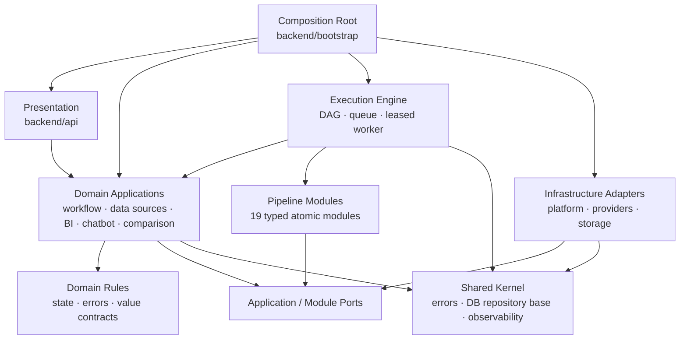

# [BP-102] 백엔드 modular monolith와 의존성 규칙
> **Document Code:** `BP-102` | **Category:** System Architecture Blueprint | **Status:** Implemented & Operational
> **Source Roots:** [`backend/api/`](file:///c:/Repos/bist-mini-final/backend/api/), [`backend/domains/`](file:///c:/Repos/bist-mini-final/backend/domains/), [`backend/bootstrap/`](file:///c:/Repos/bist-mini-final/backend/bootstrap/), [`backend/engine/`](file:///c:/Repos/bist-mini-final/backend/engine/), [`backend/platform/`](file:///c:/Repos/bist-mini-final/backend/platform/), [`backend/shared/`](file:///c:/Repos/bist-mini-final/backend/shared/), [`modules/`](file:///c:/Repos/bist-mini-final/modules/)

---

## 1. 구조 원칙

백엔드는 기술별 7계층을 수평으로 늘리는 구조가 아니라, 제품 도메인을 먼저 분리하고 각 도메인 안에서 `domain → application port → infrastructure adapter` 방향을 지키는 modular monolith입니다. HTTP, worker, DB, 외부 provider는 도메인 유스케이스의 바깥에 위치합니다.



화살표는 compile-time 의존 방향입니다. Bootstrap은 유일한 예외로 구체 구현 전체를 알고 객체 그래프를 조립합니다.

---

## 2. 표준 디렉터리 구조

```text
backend/
├── api/                         # FastAPI presentation, DTO, SSE, error mapping
├── bootstrap/                   # process lifecycle와 concrete dependency 조립
├── domains/
│   ├── workflow/
│   │   ├── domain/              # 상태 전이와 domain error
│   │   └── application/         # graph/input use case와 repository/cache port
│   ├── data_sources/application/# 파일 등록·삭제 use case와 file/catalog port
│   ├── bi/
│   │   ├── domain/              # 지표·기간·수식·snapshot 계약
│   │   └── application/         # BI API use case와 port
│   ├── chatbot/
│   │   ├── application/         # suggestion use case와 repository port
│   │   └── infrastructure/      # PostgreSQL adapter
│   ├── benchmark/application/   # benchmark API use case와 port
│   └── company_comparison/      # 비교 모델·점수·builder·application
├── engine/                      # DAG runtime, orchestration, leased worker template
├── platform/pgvector/           # catalog/ingestion/retrieval narrow adapters
├── shared/
│   ├── domain/                  # ApplicationError 공통 계층
│   └── infrastructure/          # DB base repository, correlation context
├── features/                    # 기존 모델/adapter와 non-breaking compatibility facade
├── providers/                   # OpenAI/Kubernetes 등 외부 시스템 adapter
└── storage/                     # SQL facade, focused repository mixin, artifact 구현
modules/                         # pin DTO를 가진 pipeline plugin units
```

`backend/features`와 `backend/storage`는 공개 API·DB·저장 데이터 호환성을 보존하는 infrastructure 및 계산 구현을 포함합니다. 정식 route는 `backend/api`, 유스케이스는 `backend/domains`, 새 pgvector 소비 경계는 `backend/platform/pgvector`를 기준으로 합니다. SQL facade 내부도 `backend/storage/repositories`의 source-file, workflow-run, retrieval capability로 분리되어 있습니다.

---

## 3. 책임과 현재 구현

| 경계 | 책임 | 대표 구현 |
| :--- | :--- | :--- |
| Presentation | `/api/v1`, Pydantic 입력, status code, SSE, 표준 오류 envelope | `backend/api/*_routes.py`, `workflow_controller.py`, `exception_handlers.py` |
| Domain | 프레임워크와 저장소에 독립적인 상태·오류·값 규칙 | `workflow/domain/state.py`, `workflow/domain/errors.py` |
| Application | 유스케이스 orchestration과 요구 port | `GraphValidator`, `WorkflowInputAssembler`, `DataSourceFileService`, `BiApplicationService`, `CompanyComparisonService`, `ChatConversationService`, `BenchmarkApplicationService` |
| Engine | DAG 실행, durable queue, worker lease와 retry/timeout policy | `WorkflowExecutor`, `WorkflowBatchRunner`, `WorkflowNodeRunner`, `KubernetesQueueDispatcher`, `LeasedWorker` |
| Modules | 입력·출력·config pin 계약을 가진 재사용 실행 단위 | `BaseModule`, `BaseModuleRegistry`, 19개 module type |
| Infrastructure | PostgreSQL, pgvector, OpenAI, artifact, snapshot 구현 | shared repository bases, pgvector capability repositories, provider adapters |
| Bootstrap | 프로세스 수명주기와 concrete object graph | `ApplicationContainer`, `RuntimeContainer`, `ExecutionContainer`, `DomainServicesContainer` |

---

## 4. 저장소와 pgvector 경계

- `SyncPostgresRepository`와 `AsyncPostgresRepository`가 connection/transaction 수명주기를 공개 메서드로 제공합니다. feature repository가 `DatabaseManager._raw_connection()`에 접근하지 않습니다.
- `PgVectorCatalogRepository`, `PgVectorIngestionRepository`, `PgVectorRetrievalRepository`는 서로 다른 capability를 노출합니다.
- pipeline module은 `backend.storage.pgvector_store`를 import하지 않고 module port에만 의존합니다.
- `DatabaseManager`는 `SourceFileRepositoryMixin`과 `WorkflowRunRepositoryMixin`을 조합하고, `PgVectorStore`는 `PgVectorRetrievalMixin`을 조합하는 하위 호환 facade입니다. 외부 호출 경로는 유지하되 저장 책임별 파일 경계를 갖습니다.
- 동적 SQL 식별자는 driver의 SQL composition API를 사용하고 값은 parameter binding을 사용합니다.

---

## 5. Worker 상속과 관측성

동일한 one-shot 수명주기를 가진 ingestion embedding, ingestion vector COPY, BI materialization worker는 `LeasedWorker[Claim, Output]`를 상속합니다.

1. `claim()`으로 한 작업을 확보합니다.
2. `WorkerLeaseSpec`으로 job/worker ID와 heartbeat 갱신 함수를 제공합니다.
3. base template이 heartbeat 시작·소유권 확인·실행 시간·terminal update·종료를 소유합니다.
4. subclass는 `execute`, `complete`, `fail`의 도메인별 동작만 구현합니다.

Benchmark처럼 pause/cancel FSM이 추가된 worker를 이 상속에 강제로 넣지 않습니다. 해당 worker는 공통 `LeaseHeartbeat`와 `default_worker_id` primitive를 재사용합니다.

HTTP와 worker는 `ObservabilityContext`를 통해 `request_id`, `run_id`, `job_id`, `worker_id`를 전달합니다. OpenTelemetry node span은 현재 correlation identifier를 attribute로 기록합니다.

---

## 6. DI와 비동기 규칙

- `RuntimeContainer.create()`가 OpenAI clients, embedding adapter, `WorkflowRuntimeServices`, paths, pgvector probe를 구성합니다.
- `ExecutionContainer.create(runtime)`가 durable workflow dispatcher와 execution service를 구성합니다.
- `DomainServicesContainer.create(runtime)`가 BI, company comparison, chat suggestion, jobs monitor application service를 구성합니다.
- FastAPI hot path는 native async DB/provider method를 우선합니다.
- 동기 `RunStore`, 파일 해시·이동, openpyxl 파싱은 worker thread 또는 one-shot worker로 격리합니다.
- DAG의 동일 위상 batch는 `TaskGroup`으로 병렬 실행하되 timeout/상태 병합 계약을 지킵니다.
- PostgreSQL 상태를 먼저 확정하고 Redis는 변경 알림으로만 사용합니다.

---

## 7. 실행 가능한 의존성 불변식

- `backend/domains`에서 `backend.api`, `backend.platform`, `backend.providers`, `backend.storage` import 금지.
- `backend/features`에서 `backend.api` import 금지.
- `modules`에서 DB/provider concrete client 생성 금지.
- `modules`에서 `backend.storage.pgvector_store` import 금지.
- feature repository에서 private DB connection 접근 금지.
- 동일 수명주기의 one-shot worker는 `LeasedWorker` 상속.
- BI와 Company Comparison 계산을 공통 base service로 합치지 않음. 공유 대상은 versioned snapshot 저장 수명주기와 infrastructure primitive뿐임.
- 공개 API·DB schema·저장 데이터는 구조 리팩토링만으로 변경하지 않음.

이 규칙은 [`tests/modules/test_architecture_contracts.py`](file:///c:/Repos/bist-mini-final/tests/modules/test_architecture_contracts.py)와 Ruff/Pyright로 검증합니다.
